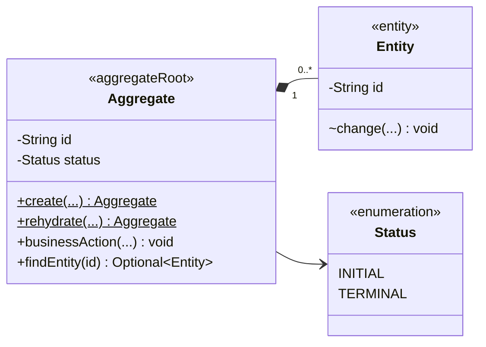
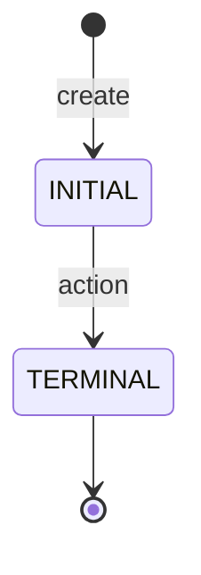

# 领域模型文档模板

复制本模板到 `docs/standards/<domain>-domain-model.md` 后按当前领域裁剪。没有状态、
版本或审计的对象要明确写“不适用”及原因，不要编造字段来填满模板。

````markdown
# <领域名称> 领域模型规范

## 适用范围与效力

说明本规范覆盖哪些对象、行为和边界。链接 `CONTEXT.md`、统一建模规范、相关 ADR
和相邻领域规范。说明本文描述目标模型，还是已经与实现一致。

## 定义与对象角色

用业务语言定义每个对象，并明确它不是什么。

- `<Aggregate>`：聚合根……
- `<Entity>`：聚合内实体……
- `<Value>`：值对象……

说明 Repository、事务和跨聚合引用边界。

## 领域类图



解释虚线引用、组合关系和可见性。不要把类图当成数据库 ER 图。

## 字段

| 字段 | 含义 | 规则 |
| --- | --- | --- |
| `id` | 稳定技术身份 | 创建时生成，重建和状态变化时保持不变 |
| `<field>` | <业务事实> | <非空、不可变、唯一性或取值规则> |

明确列出不属于本对象的字段，防止实现重新引入错误概念。

## 方法

### 创建与重建

| 方法 | 用途 | 核心规则 |
| --- | --- | --- |
| `create(...)` | 创建唯一合法初始形态 | 生成 ID，建立初始状态 |
| `rehydrate(...)` | Repository 恢复 | 不生成 ID，不触发业务转换 |

### 业务行为

| 方法 | 用途 | 核心规则 |
| --- | --- | --- |
| `<action>(...)` | <完整业务动作> | <前置状态、原子变化和失败语义> |

### 查询方法

只列具有业务语义的查询；不要为每个字段机械补 Getter。

## 状态机

没有生命周期时写明“不适用：对象随所属聚合一次性构建且不可变”。



| 当前状态 | 允许动作 | 结果 |
| --- | --- | --- |
| `INITIAL` | `<action>` | `TERMINAL` |

说明终态、非法转换和未处理异常的原子性。

## 聚合关系与业务边界

说明：

- 聚合内对象由谁创建和改变。
- 跨聚合使用哪些稳定 ID。
- 哪些规则属于领域方法、领域服务、Handler、Repository 或 Adapter。
- 原始来源、解析中间结果、定义事实和运行事实如何分离。

## 版本、审计与并发

分别说明：

- 何时产生或不产生业务 `reversion`。
- creator、updater、deleter 和时间由谁提供。
- `lockVersion` 如何保护聚合并发。
- 不适用的部分及原因。

## 领域不变量

### <Aggregate> 不变量

- `<PREFIX>-001`：……
- `<PREFIX>-002`：……

### <Entity> 不变量

- `<PREFIX>-001`：……

## 场景校验

- 正向：……
- 反向：……
- 变异：……
- 身份：……
- 版本：……
- 恢复：……
- 并发：……

## 尚待业务规则确认

- <尚未确认的策略、可选方案及其阻塞范围>

没有待确认项时写“当前没有影响本领域边界的未决业务规则”。

## 现有实现迁移差距

- `<Current.field>` 需要迁移为 `<Target.field>`。
- 当前方法或状态与目标模型的差异。
- 需要同步修改的 Domain、Handler、Repository、UC 和测试链路。

不要在本节为迁就代码降低目标领域语义。

## 相关文档

- [`CONTEXT.md`](../../CONTEXT.md)：统一语言。
- [`domain-object-modeling.md`](domain-object-modeling.md)：统一建模方法。
- <相关 ADR、领域规范和 UC>
````

完成后删除所有尖括号占位符和不适用示例。
