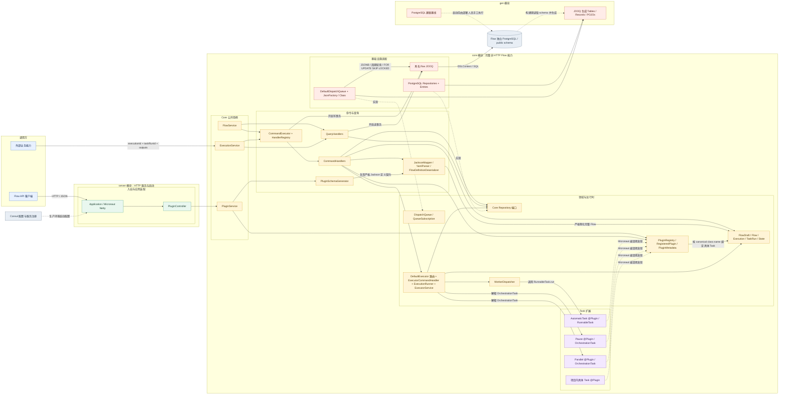
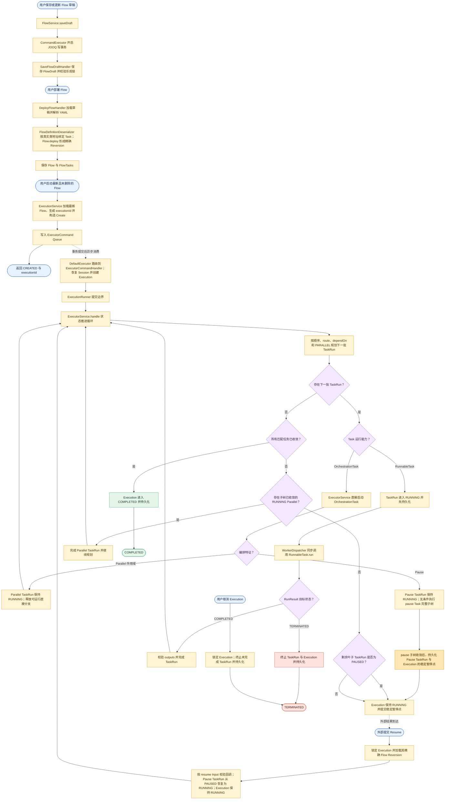

# Flow 当前代码架构与核心流程

## 文档定位

本文基于当前仓库源码描述 Flow 的代码模块、运行时依赖和核心业务流程，用于快速理解
系统，而不是替代 `docs/decisions/` 中的架构决策。目录职责以
[`project-structure.md`](project-structure.md) 为准，具体设计原因以
[`decisions/README.md`](decisions/README.md) 索引的 ADR 为准。

当前图覆盖：

- `core` 中的完整非 HTTP Flow 能力与 `server` 中的 HTTP、启动边界。
- `gen` 的开发期数据库基线如何由人工执行，以及 JOOQ 生成代码如何进入 Core。
- 从 FlowDraft 保存、Flow 部署到 Execution 执行、暂停、恢复、取消和结束的主流程。

## 当前代码架构图

图中实线表示主要运行时调用或数据访问，虚线表示 SPI 实现、构建期关系或配置关系。
`core` 是完整的非 HTTP Flow Gradle 模块，包含 Core Java 包、Executor、
Worker、扩展与 Infrastructure；`server` 是只保留 HTTP 与启动职责的薄模块，并通过
`api` 传递暴露 Core。Server 既可独立启动，也可完整嵌入 CSES，两者不是独立微服务。
Flow 基线只由部署人员对 Flow 数据库手工执行，运行时 JOOQ 只使用具名 `flow` 数据源。
开发期基线变化后需要重建该数据库，不提供旧 Schema 或旧数据的升级路径。
Core 提供类型化 Dispatch Queue Interface，并已把 Execution 启动接入使用统一
`queues` 表的 Default Adapter。该表以
`queue_type + queue_name` 隔离传输类别和逻辑 Queue；当前 Adapter 只写入并领取
`DISPATCH` 行。业务 Module 仍需为具体 Event 提供可空 `dsl()`、确定的 `Class<T>` 和
具名 Bean；Event 内部 `eventType` 仍由业务自行维护。当前 `ExecutorCommand`、
`Create`、具名 Queue Bean、只做路由的 eager `DefaultExecutor` 和统一
`ExecutorCommandHandler` 已连线；Broadcast Interface、消费游标或保留清理仍未实现。

`DefaultDispatchQueue` 直接读取 `Event.dsl()`：同步整批 Event 必须全部返回 `null`，
或全部返回同一个 `DSLContext` 实例；前者使用 Queue 自有事务，后者加入调用方事务。
Default Queue 使用项目现有 `JsonFactory` 把业务 Event 重组为排除 DSL 的 JSONB Queue
Entry，并用装配时传入的 `Class<T>` 恢复类型。异步发布始终在独立事务中提交，后台
任务只携带 Entry，不携带 Event 的 DSL。每个 Subscription 使用虚拟线程周期轮询
数据库，并在领取事务内按 `queue_type = 'DISPATCH'`、`queue_name` 通过
`FOR UPDATE SKIP LOCKED` 竞争并调用 Consumer；只有 Consumer 正常返回才删除消息，
异常会回滚领取事务并重试。未来 Broadcast 消息载荷仍写入 `queues`，所需的
广播专属投递状态单独保存，不拆分消息载荷表。

## 核心业务流程图

流程图强调当前实现中的关键事实：

1. 普通启动由 `ExecutionService` 构造 `Create` 并写入 Executor Command Queue；Service
   返回只代表受理，`ExecutorCommandHandler` 在新事务中创建并推进 Execution。可信
   pending continuation 仍在同一 JOOQ 事务保存 Execution 和 Queue Command。
2. Execution 始终绑定启动时的精确 Flow Reversion，继续、恢复和取消时不会切换到
   新版本。
3. `RunnableTask` 只由 Worker 调用；`OrchestrationTask` 只由 Executor 解释。当前 Worker
   同步执行，并遵循“持久化 TaskRun 后再调用”的顺序。
4. Pause 先执行其必填 `pause` Task 子树，子树收敛后持久化稳定暂停点；该 Pause
   TaskRun 是唯一持久化等待事实。合法 Resume 校验并恢复精确 Pause TaskRun，再由
   Executor 完成和推进，因此不依赖原 Server 进程仍然存活，也不需要额外等待聚合。
5. `ExecutorService.handle` 在内部连续收敛非 Runnable 的 OrchestrationTask；只有形成
   WorkerTask 或到达稳定状态时才返回 `ExecutionRunner` 提交边界。`DefaultExecutor`
   不参与状态推进，只做 Queue 路由。

## 主要源码依据

- [`server/src/main/java/org/cses/flow/controller/plugins/PluginController.java`](../server/src/main/java/org/cses/flow/controller/plugins/PluginController.java)
- [`core/src/main/java/org/cses/flow/core/commands/CommandExecutor.java`](../core/src/main/java/org/cses/flow/core/commands/CommandExecutor.java)
- [`core/src/main/java/org/cses/flow/core/services/executions/ExecutionService.java`](../core/src/main/java/org/cses/flow/core/services/executions/ExecutionService.java)
- [`core/src/main/java/org/cses/flow/executor/commands/ExecutorCommand.java`](../core/src/main/java/org/cses/flow/executor/commands/ExecutorCommand.java)
- [`core/src/main/java/org/cses/flow/executor/commands/Create.java`](../core/src/main/java/org/cses/flow/executor/commands/Create.java)
- [`core/src/main/java/org/cses/flow/executor/DefaultExecutor.java`](../core/src/main/java/org/cses/flow/executor/DefaultExecutor.java)
- [`core/src/main/java/org/cses/flow/executor/handlers/ExecutorCommandHandler.java`](../core/src/main/java/org/cses/flow/executor/handlers/ExecutorCommandHandler.java)
- [`core/src/main/java/org/cses/flow/executor/ExecutionRunner.java`](../core/src/main/java/org/cses/flow/executor/ExecutionRunner.java)
- [`core/src/main/java/org/cses/flow/executor/ExecutorService.java`](../core/src/main/java/org/cses/flow/executor/ExecutorService.java)
- [`core/src/main/java/org/cses/flow/worker/WorkerDispatcher.java`](../core/src/main/java/org/cses/flow/worker/WorkerDispatcher.java)
- [`core/src/main/java/org/cses/flow/infrastructure/jooq/`](../core/src/main/java/org/cses/flow/infrastructure/jooq/)
- [`core/src/main/java/org/cses/flow/infrastructure/repositories/`](../core/src/main/java/org/cses/flow/infrastructure/repositories/)
- [`core/src/main/java/org/cses/flow/infrastructure/queues/`](../core/src/main/java/org/cses/flow/infrastructure/queues/)
- [`gen/sql/flow/001_create_flow_tables.sql`](../gen/sql/flow/001_create_flow_tables.sql)
- [`gen/sql/flow/tables/`](../gen/sql/flow/tables/)
