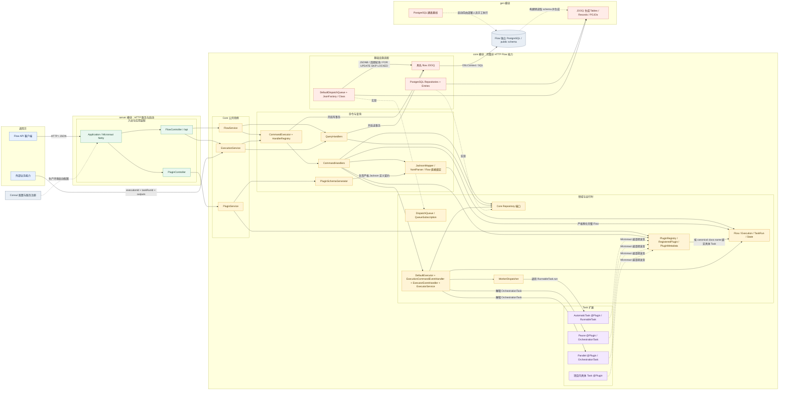
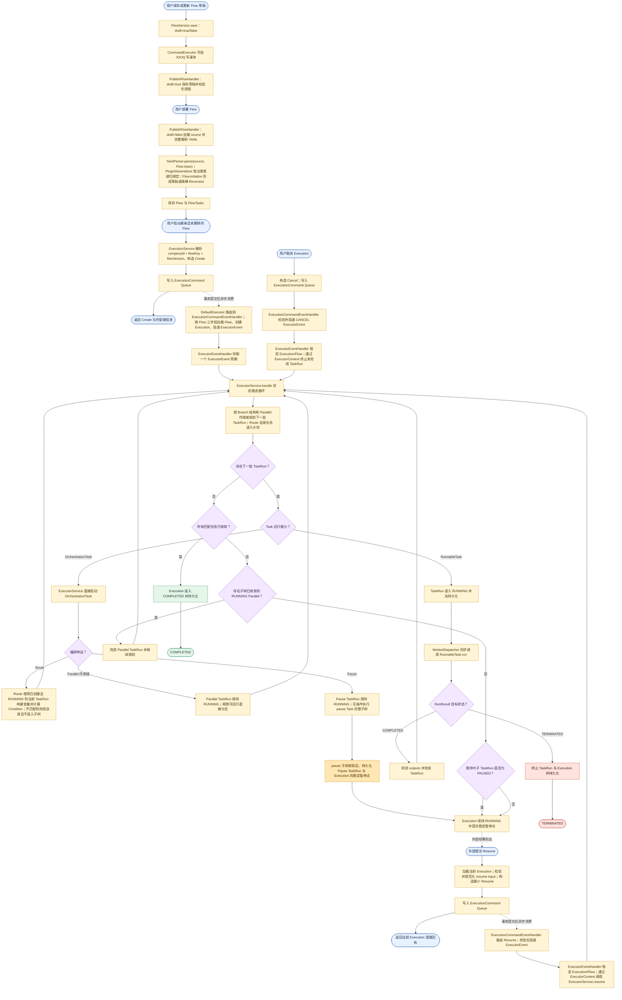

# Flow 当前代码架构与核心流程

## 文档定位

本文基于当前仓库源码描述 Flow 的代码模块、运行时依赖和核心业务流程，用于快速理解
系统，而不是替代 `docs/decisions/` 中的架构决策。目录职责以
[`project-structure.md`](project-structure.md) 为准，具体设计原因以
[`decisions/README.md`](decisions/README.md) 索引的 ADR 为准。

当前图覆盖：

- `core` 中的完整非 HTTP Flow 能力与 `server` 中的 HTTP、启动边界。
- `gen` 的开发期数据库基线如何由人工执行，以及 JOOQ 生成代码如何进入 Core。
- 从 Flow 草稿状态保存、部署到 Execution 执行、暂停、恢复、取消和结束的主流程。

## 当前代码架构图

图中实线表示主要运行时调用或数据访问，虚线表示 SPI 实现、构建期关系或配置关系。
`core` 是完整的非 HTTP Flow Gradle 模块，包含 Core Java 包、Executor、
Worker、扩展与 Infrastructure；`server` 是只保留 HTTP 与启动职责的薄模块，并通过
`api` 传递暴露 Core。Server 既可独立启动，也可完整嵌入 CSES，两者不是独立微服务。
Flow 基线只由部署人员对 Flow 数据库手工执行，运行时 JOOQ 只使用具名 `flow` 数据源。
开发期基线变化后需要重建该数据库，不提供旧 Schema 或旧数据的升级路径。
Core 提供类型化 Dispatch Queue Interface，并已把 Execution 启动接入使用统一
`queues` 表的 Default Adapter。该表以
`queue_type + queue_name` 隔离传输类别和逻辑 Queue；当前 Adapter 只写入并领取
`DISPATCH` 行。业务 Module 为具体 Event 提供 key、确定的 `Class<T>` 和具名 Bean；
Event 不携带事务状态，需要与业务写入原子提交时，调用方通过 Queue 的显式发布方法
传入事务。Event 内部 `eventType` 仍由业务自行维护。当前 `ExecutionCommand`、
`Create`、`Resume`、`Cancel`、具名 Queue Bean、只做两条 Queue 路由的 eager `DefaultExecutor`、
`ExecutionCommandEventHandler` 和内部 `ExecutorEventHandler` 已连线；Broadcast
Interface、消费游标或保留清理仍未实现。

`DefaultDispatchQueue` 的普通同步与异步发布都使用 Queue 自有事务；需要加入调用方
事务时必须调用 `emitInTransaction(...)` 显式传入 `DSLContext`。Default Queue 使用项目
现有 `JsonFactory` 把业务 Event 重组为 JSONB Queue Entry，并用装配时传入的 `Class<T>`
恢复类型，后台任务只携带 Entry。每个 Subscription 使用虚拟线程周期轮询
数据库，并在领取事务内按 `queue_type = 'DISPATCH'`、`queue_name` 通过
`FOR UPDATE SKIP LOCKED` 竞争并调用 Consumer；只有 Consumer 正常返回才删除消息，
异常会回滚领取事务并重试。未来 Broadcast 消息载荷仍写入 `queues`，所需的
广播专属投递状态单独保存，不拆分消息载荷表。

## 核心业务流程图

流程图强调当前实现中的关键事实：

1. 草稿和 Flow Reversion 都由 `Flow` 表达并保留原始 YAML `source`。
   草稿以 `companyId + key` 选择，同公司同 key 只有一个 `draft=true` 对象；保存时
   存在则修订，不存在则创建，只抽取公共字段而不物化 Task。正式业务版本由
   `companyId + key + version` 精确选择，部署完整解析 Task 并创建同类型的
   `draft=false` 快照。每个对象都有独立稳定的字符串 `id`，由 Domain 创建并由
   PostgreSQL Adapter 原样保存，不存在 `recordId`。修订 YAML 可以省略顶层 `key`，
   但如果提供必须与草稿 key 一致。
2. 普通启动由 `ExecutionService` 选择当前 Flow、规范化 inputs，并构造包含稳定
   `executionId`、`company`、`actorId`、`flowKey`、`flowVersion` 和 `inputs` 的
   `Create` 写入 Executor Command Queue；Service 返回只代表队列受理。
   `ExecutionCommandEventHandler` 在消费事务中按精确 Flow 引用加载定义，使用 Command
   中的稳定 id 创建 Execution，并原子投递 `ExecutorEvent`。Execution 不再提供
   pending 创建或继续启动入口。
3. Execution 始终绑定启动时的精确 Flow Reversion，继续、恢复和取消时不会切换到
   新版本。
4. Flow inputs 在首次启动前按精确 Reversion 规范化，持久化在
   `Execution.inputs`；`ExecutorContext` 从 Execution 读取，TaskRun 不再保存
   `flowInputs` 快照。恢复后的 Route 不需要宿主重复提交字段值。
5. Flow Reversion 的 `variables` 是流程级只读 `Map<String, Object>`，持久化在
   `flows.variables`，且不复制到 TaskRun。`RunVariables` Builder 把它投影到
   `vars`，并把 Flow 元数据、Execution inputs、按 Task 业务 key 分组的全部已完成
   outputs、当前 task/taskRun、execution、直接 parent 和最近到最远的 parents 一起
   组成规范变量树。Builder 只接收 Flow、Execution、Task 与 TaskRun 四个领域事实，
   不接收已投影 Map 或独立父 ID。Route、Loop Until、模板和 RunnableTask 共用该树及
   安全的完整 Map 路径语义。`build()` 在 Execution 分支中统一解析 execution、inputs、
   已完成 TaskRun outputs 和父链；Flow variables 仍由精确 Flow Reversion 提供，当前
   Task/TaskRun 不能在并行场景中通过“最后一次运行”猜测。Route 先创建并启动自己的
   TaskRun，再计算 Condition。
6. `RunnableTask` 只由 Worker 调用；`OrchestrationTask` 只由 Executor 解释。当前 Worker
   同步执行，并遵循“持久化 TaskRun 后再调用”的顺序。RunContext 通过 Builder 创建且
   只保存规范 variables，不保存 Session 或重复运行身份；常用身份通过
   `taskRunInfo()`、`flowInfo()` 等只读视图从变量路径派生。
7. Pause 先执行其必填 `pause` Task 子树，子树收敛后持久化稳定暂停点；该 Pause
   TaskRun 是唯一持久化等待事实。合法 Resume 在 Service 侧预校验并规范化后写入
   `ExecutionCommand` Queue，Command Handler 再次校验并投递 `ExecutorEvent`，内部
   Handler 从队列领取后通过 `ExecutorContext` 调用 `ExecutorService.resume`，因此不
   依赖原 Server 进程仍然存活，也不需要额外等待聚合。
8. `ExecutorEventHandler` 每次只处理一个可恢复周期：它创建 Context、推进非 Runnable
   的 OrchestrationTask、同步调用 Worker、持久化本轮变化，并将仍可推进的下一周期
   重新投回 Event Queue。`DefaultExecutor` 不拥有状态机，只负责两条 Queue 路由。

## 主要源码依据

- [`server/src/main/java/org/cses/flow/controller/plugins/PluginController.java`](../server/src/main/java/org/cses/flow/controller/plugins/PluginController.java)
- [`server/src/main/java/org/cses/flow/controller/flow/FlowController.java`](../server/src/main/java/org/cses/flow/controller/flow/FlowController.java)
- [`server/src/main/resources/flow/index.html`](../server/src/main/resources/flow/index.html)
- [`../core/src/main/java/org/cses/flow/core/services/commands/CommandExecutor.java`](../core/src/main/java/org/cses/flow/core/services/commands/CommandExecutor.java)
- [`core/src/main/java/org/cses/flow/core/services/executions/ExecutionService.java`](../core/src/main/java/org/cses/flow/core/services/executions/ExecutionService.java)
- [`core/src/main/java/org/cses/flow/executor/commands/ExecutionCommand.java`](../core/src/main/java/org/cses/flow/executor/commands/ExecutionCommand.java)
- [`core/src/main/java/org/cses/flow/executor/commands/Create.java`](../core/src/main/java/org/cses/flow/executor/commands/Create.java)
- [`core/src/main/java/org/cses/flow/executor/commands/Resume.java`](../core/src/main/java/org/cses/flow/executor/commands/Resume.java)
- [`core/src/main/java/org/cses/flow/executor/DefaultExecutor.java`](../core/src/main/java/org/cses/flow/executor/DefaultExecutor.java)
- [`core/src/main/java/org/cses/flow/executor/handlers/ExecutionCommandEventHandler.java`](../core/src/main/java/org/cses/flow/executor/handlers/ExecutionCommandEventHandler.java)
- [`core/src/main/java/org/cses/flow/executor/handlers/ExecutorEventHandler.java`](../core/src/main/java/org/cses/flow/executor/handlers/ExecutorEventHandler.java)
- [`core/src/main/java/org/cses/flow/executor/ExecutorEvent.java`](../core/src/main/java/org/cses/flow/executor/ExecutorEvent.java)
- [`core/src/main/java/org/cses/flow/executor/ExecutorService.java`](../core/src/main/java/org/cses/flow/executor/ExecutorService.java)
- [`core/src/main/java/org/cses/flow/core/runner/RunVariables.java`](../core/src/main/java/org/cses/flow/core/runner/RunVariables.java)
- [`core/src/main/java/org/cses/flow/core/runner/RunContext.java`](../core/src/main/java/org/cses/flow/core/runner/RunContext.java)
- [`core/src/main/java/org/cses/flow/worker/WorkerDispatcher.java`](../core/src/main/java/org/cses/flow/worker/WorkerDispatcher.java)
- [`core/src/main/java/org/cses/flow/infrastructure/jooq/`](../core/src/main/java/org/cses/flow/infrastructure/jooq/)
- [`core/src/main/java/org/cses/flow/infrastructure/repositories/`](../core/src/main/java/org/cses/flow/infrastructure/repositories/)
- [`core/src/main/java/org/cses/flow/infrastructure/queues/`](../core/src/main/java/org/cses/flow/infrastructure/queues/)
- [`gen/sql/flow/001_create_flow_tables.sql`](../gen/sql/flow/001_create_flow_tables.sql)
- [`gen/sql/flow/tables/`](../gen/sql/flow/tables/)
