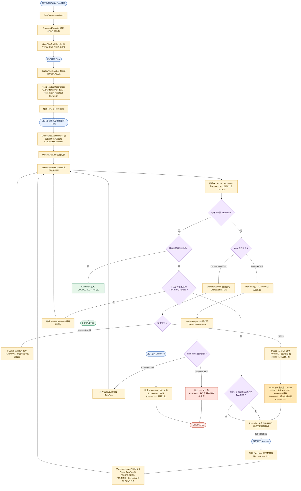

# Flow 当前代码架构与核心流程

## 文档定位

本文基于当前仓库源码描述 Flow 的代码模块、运行时依赖和核心业务流程，用于快速理解
系统，而不是替代 `docs/decisions/` 中的架构决策。目录职责以
[`project-structure.md`](project-structure.md) 为准，具体设计原因以
[`decisions/README.md`](decisions/README.md) 索引的 ADR 为准。

当前图覆盖：

- `server` 单一运行模块内部的 Core、Executor、Worker、扩展和入站边界。
- `gen` 的数据库迁移与 JOOQ 生成代码如何进入 Server 构建和运行资源。
- 从 FlowDraft 保存、Flow 部署到 Execution 执行、暂停、恢复、取消和结束的主流程。

## 当前代码架构图

```mermaid
flowchart LR
    subgraph clients ["调用方"]
        browser["Flow Studio 浏览器"]
        externalCaller["外部业务能力"]
    end

    subgraph server ["server 模块：完整 Flow Micronaut 应用"]
        subgraph inbound ["入站与应用装配"]
            micronautApp["Application / Micronaut Netty"]
            staticAssets["Flow Demo 静态资源"]
            demoController["FlowDemoController"]
            pluginController["PluginController"]
            sessionBinder["SessionArgumentBinder"]
        end

        subgraph corePackages ["Core、运行时与扩展包"]
        subgraph useCases ["Core 公开用例"]
            flowService["FlowService"]
            executionService["ExecutionService"]
            externalTaskService["ExternalTaskService"]
            pluginService["PluginService"]
        end

        subgraph application ["命令与查询"]
            commandExecutor["CommandExecutor + HandlerRegistry"]
            commandHandlers["CommandHandlers"]
            queryHandlers["QueryHandlers"]
            yamlParser["JacksonMapper / YamlParser / FlowDefinitionDeserializer"]
            pluginSchema["PluginSchemaGenerator"]
        end

        subgraph coreRuntime ["领域与运行时"]
            domains["FlowDraft / Flow / Execution / TaskRun / State"]
            repositoryPorts["Core Repository 端口"]
            executor["DefaultExecutor + ExecutorService"]
            worker["WorkerDispatcher"]
            pluginRuntime["PluginRegistry / RegisteredPlugin / PluginMetadata"]
        end

        subgraph taskExtensions ["Task 扩展"]
            autoTask["AutomaticTask @Plugin / RunnableTask"]
            pauseTask["Pause @Plugin / OrchestrationTask"]
            parallelTask["Parallel @Plugin / OrchestrationTask"]
            inProjectPlugins["项目内具体 Task @Plugin"]
        end

        subgraph infrastructure ["基础设施适配"]
            postgresRepositories["PostgreSQL Repositories + Entries"]
            jooqBoundary["具名 flow JOOQ + Flyway"]
        end
        end
    end

    subgraph gen ["gen 模块"]
        migrations["PostgreSQL 迁移 SQL"]
        generatedJooq["JOOQ 生成 Tables / Records / POJOs"]
    end

    postgres[(Flow 独立 PostgreSQL / public schema)]
    consul["Consul 配置与服务注册"]

    browser -->|"HTTP / JSON"| micronautApp
    micronautApp --> staticAssets
    micronautApp --> demoController
    micronautApp --> pluginController
    sessionBinder -->|"绑定租户与用户 Session"| demoController
    demoController --> flowService
    demoController --> executionService
    pluginController --> pluginService
    externalCaller -.->|"兼容外部恢复入口"| externalTaskService

    flowService --> commandExecutor
    executionService --> commandExecutor
    externalTaskService --> commandExecutor
    flowService --> queryHandlers
    executionService --> queryHandlers
    externalTaskService --> queryHandlers
    pluginService --> pluginRuntime
    pluginService --> pluginSchema
    commandExecutor --> commandHandlers

    commandHandlers --> domains
    commandHandlers --> repositoryPorts
    commandHandlers --> executor
    commandHandlers --> yamlParser
    commandHandlers --> pluginRuntime
    queryHandlers --> repositoryPorts
    yamlParser -->|"严格物化完整 Flow"| domains
    pluginRuntime -->|"按 canonical class name 绑定具体 Task"| domains
    pluginSchema -->|"复用严格 Jackson 定义契约"| yamlParser

    executor --> domains
    executor --> repositoryPorts
    executor -->|"解释 OrchestrationTask"| pauseTask
    executor -->|"解释 OrchestrationTask"| parallelTask
    executor --> worker
    worker -->|"调用 RunnableTask.run"| autoTask

    autoTask -.->|"Micronaut 编译期发现"| pluginRuntime
    pauseTask -.->|"Micronaut 编译期发现"| pluginRuntime
    parallelTask -.->|"Micronaut 编译期发现"| pluginRuntime
    inProjectPlugins -.->|"Micronaut 编译期发现"| pluginRuntime

    postgresRepositories -.->|"实现"| repositoryPorts
    commandExecutor -->|"开启写事务"| jooqBoundary
    queryHandlers -->|"开启读事务"| jooqBoundary
    postgresRepositories --> generatedJooq
    jooqBoundary -->|"DSLContext / SQL"| postgres
    migrations -.->|"构建时转换并打入 server 资源/JAR"| jooqBoundary
    jooqBoundary -->|"启动时创建与演进表结构"| postgres
    postgres -.->|"构建期读取 schema 并生成"| generatedJooq
    consul -.->|"生产环境启动配置"| micronautApp

    classDef caller fill:#E8F1FF,stroke:#4A78C2,color:#172B4D
    classDef inboundNode fill:#E9F7EF,stroke:#3D9970,color:#173B2A
    classDef coreNode fill:#FFF4D6,stroke:#D49B22,color:#4A3400
    classDef extensionNode fill:#F3E8FF,stroke:#8C5AC2,color:#35204D
    classDef adapterNode fill:#FFECE8,stroke:#C96952,color:#4A2118
    classDef storeNode fill:#E8EEF5,stroke:#60758A,color:#21313F

    class browser,externalCaller caller
    class micronautApp,staticAssets,demoController,pluginController,sessionBinder inboundNode
    class flowService,executionService,externalTaskService,pluginService,commandExecutor,commandHandlers,queryHandlers,yamlParser,domains,repositoryPorts,executor,worker,pluginRuntime,pluginSchema coreNode
    class autoTask,pauseTask,parallelTask,inProjectPlugins extensionNode
    class postgresRepositories,jooqBoundary,migrations,generatedJooq adapterNode
    class postgres,consul storeNode
```

图中实线表示主要运行时调用或数据访问，虚线表示 SPI 实现、构建期关系、配置关系或
兼容入口。`server` 是唯一运行和部署模块，Core、Executor、Worker、扩展与
Infrastructure 是其中的 Java 包边界，不是独立 Gradle 模块或微服务。只有具名
`flow` 数据源会收到 Flow 迁移和 JOOQ 请求。

## 核心业务流程图

流程图强调当前实现中的四个关键事实：

1. 每个写用例由 `CommandExecutor` 放入同一个 JOOQ 事务，Handler 使用同一
   `DSLContext`。
2. Execution 始终绑定启动时的精确 Flow Reversion，继续、恢复和取消时不会切换到
   新版本。
3. `RunnableTask` 只由 Worker 调用；`OrchestrationTask` 只由 Executor 解释。当前 Worker
   同步执行，并遵循“持久化 TaskRun 后再调用”的顺序。
4. Pause 先在 RUNNING 中执行其必填 `pause` Task 子树，收敛后才进入 PAUSED；
   PAUSED 状态和 ExternalTask 都会持久化。Execution 始终 RUNNING，合法 Resume
   先把 Pause TaskRun 恢复为 RUNNING，再由 Executor 完成和推进，因此不依赖原
   Server 进程仍然存活，也不需要恢复 Execution 状态。
5. `ExecutorService.handle` 在内部连续收敛非 Runnable 的 OrchestrationTask；只有形成
   WorkerTask 或到达稳定状态时才返回 `DefaultExecutor` 提交边界。

## 主要源码依据

- [`server/src/main/java/org/cses/flow/controller/demo/FlowDemoController.java`](../server/src/main/java/org/cses/flow/controller/demo/FlowDemoController.java)
- [`server/src/main/java/org/cses/flow/core/commands/CommandExecutor.java`](../server/src/main/java/org/cses/flow/core/commands/CommandExecutor.java)
- [`server/src/main/java/org/cses/flow/core/handlers/executions/CreateExecutionHandler.java`](../server/src/main/java/org/cses/flow/core/handlers/executions/CreateExecutionHandler.java)
- [`server/src/main/java/org/cses/flow/executor/DefaultExecutor.java`](../server/src/main/java/org/cses/flow/executor/DefaultExecutor.java)
- [`server/src/main/java/org/cses/flow/executor/ExecutorService.java`](../server/src/main/java/org/cses/flow/executor/ExecutorService.java)
- [`server/src/main/java/org/cses/flow/worker/WorkerDispatcher.java`](../server/src/main/java/org/cses/flow/worker/WorkerDispatcher.java)
- [`server/src/main/java/org/cses/flow/infrastructure/jooq/`](../server/src/main/java/org/cses/flow/infrastructure/jooq/)
- [`server/src/main/java/org/cses/flow/infrastructure/repositories/`](../server/src/main/java/org/cses/flow/infrastructure/repositories/)
- [`gen/sql/production-release/flow/`](../gen/sql/production-release/flow/)
