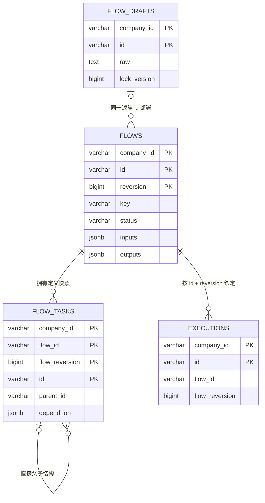

# ADR 0014：完成 Flow 来源与 Reversion 迁移

## 状态

Accepted（`Flow.close`、`CLOSED` 与 `flows.status` 已由 ADR 0018 的
`delete/deleted` 取代；来源聚合已由 ADR 0022 命名为 FlowDraft 并移除固定
`draft` 字段；TaskExtension 显式 properties 编解码由 ADR 0026 的通用 Jackson
持久化取代；来源与 Reversion 分离等其余决策继续有效）

其中 Java 时间表示条款已由
[`ADR 0015`](0015-use-long-millisecond-java-time.md) 取代。

## 背景

ADR 0008 已将唯一可编辑来源定义为 `FlowDraft`，将每次成功部署定义为一个
完整 `Flow Reversion`；ADR 0013 已要求 YAML 只在部署时解析，并要求 Flow
保护业务 key、Task 稳定身份和插件物化规则。当前实现和 PostgreSQL Schema
仍沿用过渡性的单 Flow 聚合：

- `Flow` 同时保存 Draft 和多个版本。
- `FlowDefinition` 同时表达 DRAFT、DEPLOYED 和 CLOSE。
- `flow_drafts` 保存解析后的 Task 快照而不是原始 YAML。
- `flows.version/revision`、`flow_tasks.flow_version` 和
  `executions.flow_version` 仍使用旧术语。
- Task 的 `dependOn` 仍隐藏在通用 properties 中。

同时，Flow 定义域规范把“部署成功后是否保留来源”列为待确认项。UC-01、UC-02
要求同一逻辑 Flow 在第一次部署后继续修改来源并部署下一 reversion，因此实现前
必须确定来源生命周期。

## 备选方案

### 方案一：部署后删除来源

每次继续编辑时重新创建来源。对象数量少，但无法自然表达同一来源的连续编辑，
还需要额外规则恢复原始 YAML 和稳定 id。

### 方案二：部署后保留来源

部署只读取来源并新增 Flow Reversion，不改变来源。后续编辑继续调用
`FlowDraft.revise`，关闭逻辑 Flow 时同时丢弃来源。

### 方案三：继续使用单 Flow 聚合

改动较小，但会继续让未解析来源、已校验定义、并发修订和业务版本共享同一对象，
与 ADR 0008 冲突。

## 决策

采用方案二，并完成以下模型与存储迁移：

- 部署成功后保留 `FlowDraft`，作为下一轮编辑基线。
- `FlowDraft` 使用稳定 `id`、`company`、原始 `raw`、审计字段和纯技术
  `lockVersion`；它没有业务 `reversion`、状态、description、inputs、outputs
  或 tasks。
- `Flow` 每个对象和每行记录只表达一个 `id + reversion`。它保存 ADR 0013
  已确认的业务 `key`；同一逻辑 Flow 后续部署不得修改 key。
- `Flow` 和 `FlowDraft` 的操作者使用不可变 `ActorRef`，当前快照只包含
  Session 可稳定提供的字符串 `id` 和可选 `name`。
- Flow 顶层和 Task 的 inputs、outputs 均显式持久化 `{key, type}`。
- Task `dependOn` 使用独立结构化字段；Task 不再拥有通用 properties。
- `flow_tasks.properties` 仅作为 TaskExtension 对具体子类型字段的持久化快照，
  由插件显式编码和恢复，不能直接暴露为 Task 基类字段。
- PostgreSQL 沿用项目已经生效的 `timestamptz`，Java Entry 统一转换为
  `Instant`；不退回旧 bigint 时间格式。
- 项目继续不建立数据库外键，跨表归属由带租户条件的 Repository、同一事务写入
  和聚合重建校验保证。

其中“Java Entry 统一转换为 `Instant`”是本 ADR 当时采用的约定，后续已由
ADR 0015 调整为项目自有 Java 业务类型使用 Epoch 毫秒 `long`；PostgreSQL
继续使用 `timestamptz` 的决定不变。

图中虚线关系是逻辑关系，数据库不创建外键。

## 理由

- 保留来源直接满足连续编辑和多次部署，不需要从已部署对象反向生成 YAML。
- 来源 `lockVersion` 与 Flow `reversion` 分离后，保存无效 YAML 或并发修改不会
  消耗业务版本。
- 每行 Flow 表达一个不可变定义快照，旧 reversion 不需要通过 CLOSED 表达被替代。
- key 继续作为定义业务事实存在，但所有查询和关联仍使用稳定技术 id。
- 插件属性快照留在基础设施边界，使新增 Task 类型可以扩展物化和持久化，而不向
  Task 基类重新加入无类型约束 Map。

## 后果

- 删除 `FlowDefinition`、Upgrade Draft、publish 和旧的 version/status 查询契约。
- Flow Command、Handler、Service、Repository、UC 测试和 Execution 绑定必须
  同步迁移到 source/deploy/reversion 术语。
- `flow_drafts.content` 的过渡 Task JSON 会迁移到 `raw`。JSON 是合法 YAML
  文本，但旧快照包含系统字段时必须由用户重新保存来源后才能部署；迁移不会伪造
  原始注释或格式。
- 关闭最新 Flow 时必须在同一事务中把该 Flow 改为 CLOSED，并丢弃仍存在的来源。
- 部署和关闭都锁定来源行；配合 `(company_id, id, reversion)` 唯一约束，避免
  并发部署生成重复 reversion。
