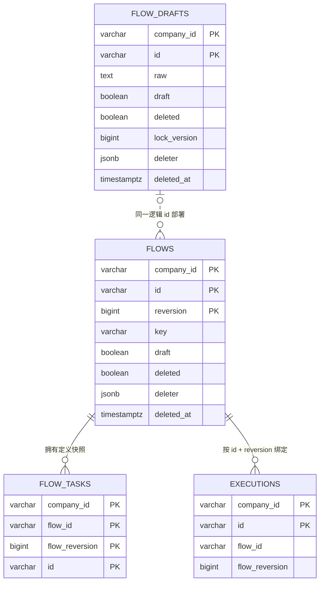

# ADR 0018：Flow 定义生命周期使用 draft 与 deleted 布尔事实

## 状态

Superseded by
[`ADR 0022`](0022-model-flow-draft-as-separate-aggregate.md)。

本 ADR 关于删除状态枚举、保留显式 `deleted` 和删除后不回退的结论继续有效；
领域与 PostgreSQL 显式保存固定 `draft` 布尔值的结论已被 ADR 0022 取代。

## 背景

ADR 0008 和 ADR 0014 已把未校验来源 `FlowDraft` 与完整部署定义 `Flow`
分成两个聚合，避免一个对象通过大量可空字段同时兼容两种有效性条件。现有目标
模型和工作区实现又为 Flow 的定义生命周期引入
`FlowDefinitionStatus.DEPLOYED/CLOSED`，用来区分未删除和已停止使用的正式
Flow。

最新确认的业务语义要求草稿与删除不再使用状态枚举表达，而是使用两个独立布尔
事实：

- `draft` 表示该定义是否为可编辑来源。
- `deleted` 表示该定义是否已被逻辑删除。

典型可用正式 Flow 使用 `draft=false, deleted=false`。该调整只改变定义生命周期
的表达，不改变工作流运行 `State`，也不取消来源与完整定义之间不同的有效性边界。

## 备选方案

### 方案一：保留 FlowDefinitionStatus

`FlowDraft` 的类型表达草稿，`FlowDefinitionStatus.DEPLOYED/CLOSED` 表达
正式 Flow 是否可用。改动较小，但草稿与删除使用两种不同机制，且继续保留已被
明确取消的定义状态枚举。

### 方案二：使用统一定义状态枚举

建立 `DRAFT/DEPLOYED/DELETED` 或更多组合状态。单字段查询直接，但草稿与删除
不是互斥维度；删除草稿和删除正式 Flow 需要新增组合状态，并会重新把不同有效性
条件压回一个状态模型。

### 方案三：保留对象边界，使用 draft/deleted 布尔事实

`FlowDraft` 与 `Flow` 继续保护各自不变量，同时显式持有 `draft/deleted`。
`draft` 创建后不可变，`deleted` 只能从 false 单向变为 true。

## 决策

采用方案三。

### 对象与字段

- `FlowDraft` 显式持有 `draft=true`；`Flow` 显式持有 `draft=false`。
- 两类对象创建时都使用 `deleted=false`。
- `draft` 在对象创建时确定，部署和删除都不能改变。
- `deleted` 只能由完整的 `delete` 业务动作从 false 改为 true，不能恢复。
- 删除后保留原 `draft`，因此四个合法组合为：

  | 对象 | `draft` | `deleted` |
  | --- | --- | --- |
  | 可编辑来源 | true | false |
  | 已删除来源 | true | true |
  | 未删除正式 Reversion | false | false |
  | 已删除正式 Reversion | false | true |

- `deleted=false` 时 `deleter/deletedAt` 必须同时为空；`deleted=true` 时必须同时
  存在。
- 删除是逻辑删除，定义、历史 Reversion 和审计事实不得物理丢失。

### 生命周期与版本

- `FlowDraft.create` 创建 `draft=true, deleted=false` 的来源。
- `Flow.deploy` 从未删除来源映射出新的
  `draft=false, deleted=false` Flow Reversion；它不修改来源的 `draft`。
- `Flow.delete` 取代 `Flow.close`；`FlowDraft.delete` 取代
  `FlowDraft.discard`。
- 删除整个逻辑 Flow 时，Handler 在同一事务中删除最新 Flow Reversion 与仍存在
  的来源。
- 删除不产生新 `reversion`。失败的部署或删除不改变任何布尔事实，也不占用版本。
- 部署新 Reversion 不修改旧 Reversion 的 `deleted`。

### 查询与运行绑定

- 当前 Flow 必须先按同一 `id` 选择最大 `reversion`，再要求
  `draft=false, deleted=false`。
- 当前最大 Reversion 已删除时，查询不能先过滤 `deleted=true` 再回退到旧
  Reversion。
- 新 Execution 只能绑定当前未删除正式 Flow。
- 已经启动的 Execution 继续按 `flowId + flowReversion` 精确加载定义；即使该
  Reversion 后来被删除，也不能影响既有运行。
- `FlowDraft` 与 `Flow` 继续使用不同 Repository 契约，不能仅凭两个布尔值
  合并成一个允许不同字段为空的领域对象。

### 状态类型

- 删除 `FlowDefinitionStatus` 及 `definitionStatus` 字段和访问方法。
- Flow 定义域不得建立 `FlowStatus`、`DRAFT/DEPLOYED/CLOSED` 兼容枚举或通用
  `status` 字段。
- Execution、TaskRun 和 Worker 使用的统一 `State` 继续遵循运行域规范，不受
  本决策影响。

### PostgreSQL 映射

图中关系均为 Repository 维护的逻辑关系，数据库不建立外键。
`flow_drafts.draft` 固定为 true，`flows.draft` 固定为 false；两表的
`deleted` 都与 `deleter/deleted_at` 受同一类 CHECK 约束保护。

本决策取代 ADR 0008 和 ADR 0014 中关于 `Flow.close`、`CLOSED` 及
`flows.status` 的结论，并取代现有目标模型中的 `FlowDefinitionStatus`；
来源与正式定义分离、部署版本、运行 State 和其他决策继续有效。

## 理由

- `draft` 与 `deleted` 是正交事实，布尔字段可以直接表达删除草稿和删除正式
  Flow，无需扩展组合状态。
- 保留两个聚合继续保证未校验 YAML 不会冒充完整可执行定义。
- `draft=false, deleted=false` 为正式可用定义提供明确且统一的判断。
- 删除事实与业务 `reversion`、运行 `State`、审计和并发版本保持独立。
- 先选最大 Reversion 再检查删除事实，可以防止删除后静默回退并启动旧定义。

## 后果

- Flow、FlowDraft、Command、Handler、Service、Repository 和查询契约需要
  从 `close/discard/status` 迁移到 `delete/draft/deleted`。
- PostgreSQL 需要用显式布尔列替代 `flows.status`，回填现有来源和正式定义，
  并重新生成 JOOQ。
- Repository 精确版本查询与当前版本查询必须采用不同的删除过滤规则：前者服务
  已有 Execution，后者拒绝启动已删除逻辑 Flow。
- 领域、Repository、Service、UC 和集成测试需要同步验证四种合法组合、删除审计、
  禁止恢复、版本不递增及删除后不回退。
- 目标字段、方法、不变量和具体实现差距由
  [`flow-definition-lifecycle.md`](../standards/flow-definition-lifecycle.md)
  统一维护。

## 实施

- `2026-07-30/002_use_flow_lifecycle_flags.sql` 可重复执行，负责回填旧
  `DEPLOYED/CLOSED` 和删除审计数据、删除 `flows.status`、增加布尔列及
  生命周期约束。
- JOOQ 已从执行全部生产迁移后的 PostgreSQL Schema 重新生成。
- 领域、Service、Repository、Execution 启动、UC-01、UC-02 和真实 PostgreSQL
  集成测试已迁移到 `draft/deleted`。
