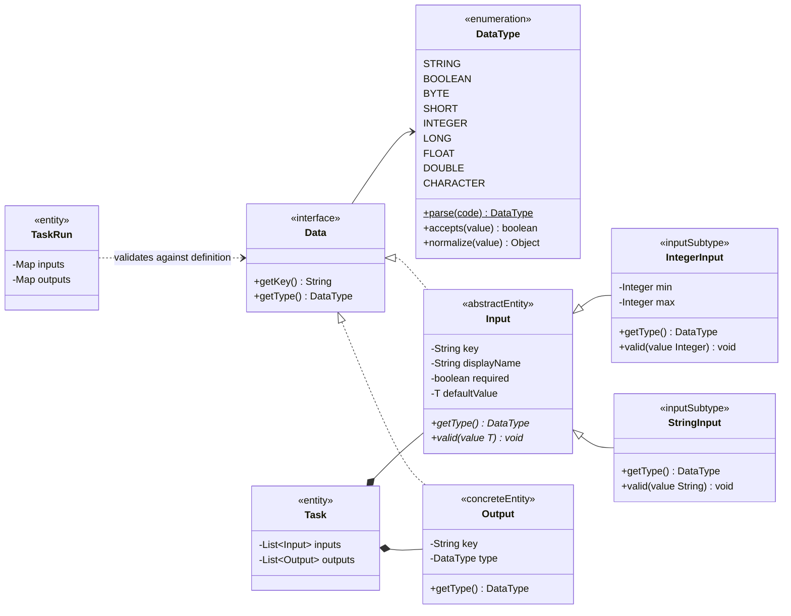

# ADR 0019：建立独立 DataType 与具体 Input 类型体系

## 状态

Accepted（2026-07-30；Input 多态物化方式于 2026-08-03 修订；运行值绑定与
typed Route 于 2026-08-13 由 ADR 0052 修订）

单字段运行值入口和默认值绑定的职责归属由
[`ADR 0088`](0088-let-input-own-field-binding.md) 修订：使用 `Input.bind` 完成整次字段绑定，
具体值规则改为受保护行为，外部不再分步调用 `valid` 或 `normalized`。
定义创建及反序列化的有效性进一步由
[`ADR 0089`](0089-validate-input-during-materialization.md) 修订：Creator 和 Builder
在返回前完成校验，不再采用无参/Setter 半成品和外部追加校验。

ADR 0090 曾允许宿主注册业务 Input；该扩展需求已撤回，ADR 0101 恢复固定九种内置类型。

## 背景

Flow 与 Task 已经使用 Data、Input 和 Output 表达输入输出定义，但当前
`Data.getType()` 只返回任意非空字符串，Input 也不能表达类型特有的表单与校验
规则。现有实现因此存在以下问题：

- Flow 部署只检查 type 非空，未知类型仍可形成正式 Reversion。
- 页面无法知道某个 Input 应展示什么控件、默认值和类型特有约束。
- 把 Input 继续做成单一具体类，会把 min/max 等不同规则堆积成大量可空字段。
- 页面把 type 当作自由文本并默认填写 `STRING`，前后端无法共享一份权威类型
  目录。

本轮只先支持 Java 包装基础类型和 String，复杂对象、集合、JSON 与自定义类型
不进入第一阶段。因此需要决定枚举是否嵌套在 Data 中，以及泛型应位于哪个对象。

## 备选方案

### 方案一：继续使用 String，并在调用方分别识别常见代码

改动最小，但 Flow、Executor、Resume、Repository 和页面会各自维护类型分支。
同一个代码容易出现不同含义，未知类型仍可能被静默解释为字符串。

### 方案二：建立可插拔 DataType Registry

每个类型由插件提供代码、校验、规范化和展示元数据。扩展能力最强，但基础类型
也需要应用装配和注册表才能解释；历史 Flow Reversion 是否可运行将额外依赖
插件安装状态。当前尚没有自定义 Data Type 的用户场景。

### 方案三：由 Flow Core 定义独立 DataType 与具体 Input 子类

基础类型由独立枚举统一表达；Input 是泛型抽象基类，具体子类固定 DataType 并
拥有自己的描述字段与校验。Data 保持非泛型，Task 插件可以使用这些定义但不能
改变类型含义。

## 决策

采用方案三。

### 基础类型

第一阶段只定义以下稳定代码：

| DataType | Java 值类型 | 具体 Input |
| --- | --- | --- |
| `STRING` | `String` | `StringInput` |
| `BOOLEAN` | `Boolean` | `BooleanInput` |
| `BYTE` | `Byte` | `ByteInput` |
| `SHORT` | `Short` | `ShortInput` |
| `INTEGER` | `Integer` | `IntegerInput` |
| `LONG` | `Long` | `LongInput` |
| `FLOAT` | `Float` | `FloatInput` |
| `DOUBLE` | `Double` | `DoubleInput` |
| `CHARACTER` | `Character` | `CharacterInput` |

稳定代码使用大写英文。定义入口使用 `trim + Locale.ROOT` 大写规范化，因此
`string` 可以解释为 `STRING`；`BOOL`、`INT`、`NUMBER` 等别名不进入新定义
协议。未知代码必须使部署失败，不能回退为 `STRING`。

第一阶段不包含 `BigDecimal`、JSON、集合、对象、日期时间、文件或自定义类。

### 对象与方法

接口如下：

```text
public interface Data {

    String getKey();

    DataType getType();
}

public enum DataType {
    STRING,
    BOOLEAN,
    BYTE,
    SHORT,
    INTEGER,
    LONG,
    FLOAT,
    DOUBLE,
    CHARACTER
}

public abstract class Input<T> implements Data {
    private final String key;
    private final String displayName;
    private final boolean required;
    private final T defaultValue;

    public abstract DataType getType();

    public abstract void valid(T value);
}

public final class IntegerInput extends Input<Integer> {
    private final Integer min;
    private final Integer max;

    public DataType getType();

    public void valid(Integer value);
}
```

`DataType` 是独立于 Data 的枚举值域，不建立 Repository。Data 保持非泛型，
`getType()` 只返回 DataType，不返回 `Class<?>`。枚举可以在内部持有包装类映射
用于基础类型判断，但 Java Class 不能成为 YAML、API 或持久化协议。

泛型只存在于 `Input<T>` 与具体 Input 子类。Input 基类保存 key、displayName、
required、defaultValue 公共描述；具体子类固定 DataType 并拥有自己的规则字段。
例如 IntegerInput 拥有 min/max，且始终返回 `DataType.INTEGER`。

`valid(T value)` 是 Input 的抽象领域方法，每个具体子类必须实现。DataType 只
表达基础值种类，不保存 min/max、长度或候选项等 Input 规则。

### 运行值规则

- defaultValue 非空时必须符合具体 Input 的包装类型并通过 `valid(...)`。
- 实际 Input 值在正式绑定后必须由对应具体 Input 调用 `valid(...)`。
- Output 实际值在写入 TaskRun 前必须至少与 Output 的 DataType 相容。
- 校验失败必须原子拒绝当前操作，不得产生部分 Flow Reversion、Execution 或
  TaskRun 变化。
- Input 的类型校验必须在逻辑 Input 到 TaskRun 输入值的映射协议确认后启用；
  不能把当前 `outputs`、`dependOnOutputs` 容器名称误当作 Task Input key。
- 提交的 outputs Map 必须非 null；已声明 Output 可以缺失，额外 key 与 null
  值被拒绝。
- 传输层 Number 按声明 DataType 安全归一化：整数类型执行整数性与范围精确
  检查，FLOAT/DOUBLE 拒绝非有限值，字符串数字不转换。
- required、defaultValue 与运行时 Input 缺失值的优先级仍等待正式 Input
  绑定协议确认。

### Route 边界

ADR 0006 最初确认的 Route 是：

```text
outputs.<field> == "<value>"
```

本 ADR 本身不扩展 Route 的比较语义。ADR 0052 已确认 Flow inputs 的运行值映射，
并允许 BOOLEAN、数值、STRING 与 CHARACTER 使用与 DataType 相容的受限比较；
outputs 字符串表达式继续有效。

页面必须从服务端返回的基础类型目录构建类型下拉框，不再允许自由输入 type。
具体 Input 的公共字段和特有字段也应来自服务端元数据，不能在前端维护一份平行
switch。

### 持久化与兼容

- Flow 和 Task 的 inputs 必须保存 type、Input 公共字段与具体子类字段；outputs
  至少保存 `{key, type}`。
- type 持久化为稳定大写代码，API 也返回同一代码。
- Repository 恢复后必须得到原具体 Input 子类，不能退化为抽象 Input、任意 Map
  或默认 StringInput。
- 启用严格解析前必须扫描已有 Flow Reversion 的所有 type 和 Input 结构；只有
  key/type 的历史 Input 由迁移确定性补 `displayName=key`、
  `required=false`。显式非法字段和未知 type 不执行猜测修正。
- 已启动 Execution 永久绑定原 Flow Reversion；迁移不能改变其定义或运行历史。

### 创建与 YAML 物化

具体 Input 不提供业务调用方主动使用的公共 `create(...)`。定义反序列化边界
读取 YAML type 后选择具体子类，并在对象进入 Flow 聚合前完成公共与特有字段
校验。

该决定对 ADR 0010 的静态 create 规则形成 Input 定义对象的局部例外。实现保留
ADR 0013：YamlParser 仍返回通用只读 Map，但每个 Input 定义片段由 PAAS JSON
以 `Input.class` 作为目标类型完成多态实例化；PostgreSQL JSONB 也通过
`JsonObjects.asObjects(Input.class)` 恢复同一子类。

Input 基类声明 `type` 判别字段及全部稳定子类型。Input 基类使用 Lombok
`@Getter`、`@Setter` 与 `@NoArgsConstructor`，并继承 PAAS JSON 的
`SerializableObject`；拥有专有字段的具体子类为这些字段生成 Getter/Setter。
每个具体子类在构造器上声明 Lombok `@Builder`，保留公共字段的 `builder()` 调用
方式。PAAS JSON 根据多态元数据选择具体子类，再通过无参构造和 Setter 恢复公共
字段与子类字段，不依赖 Micronaut Serialization 注解或额外的 `@Introspected`
配置。Lombok Builder 不参与 JSON 反序列化，只提供 Java 侧的便捷构建方式。

无参 Setter 绑定完成后，Flow 定义物化和 Repository Codec 必须立即调用 Input 的
`validateDefinition()`，统一规范化并校验公共字段、默认值和子类约束。校验失败
的空对象或半成品不能进入 Flow 或 Task 聚合。项目不再保留
`InputDefinitionMapper`、手写类型 `switch` 或另一份 type 到 Java 类的映射。
Input 的公共 Setter 仅是 Micronaut Serialization 技术绑定入口，不是业务变更
方法；Service、Handler 和其他领域对象不得调用。Input 不提供主动 `create(...)`；
JSON 技术对象只允许在上述转换边界短暂存在，不能进入聚合状态或公共领域契约。

## 领域类图



## 不变量

- `DTYPE-001`：每个基础类型只有一个稳定大写代码和一套运行值语义。
- `DTYPE-002`：未知类型、空白类型和非协议别名不能形成正式 Flow Reversion。
- `DTYPE-003`：DataType 是独立枚举，不能嵌套在 Data 中；Data 保持非泛型。
- `DTYPE-004`：泛型只存在于 Input 与具体子类，不上升到 Data 或 DataType。
- `DTYPE-005`：具体 Input 子类固定 DataType，并拥有类型特有字段与
  `valid(...)` 实现。
- `DTYPE-006`：defaultValue 非空时必须符合 T 并通过具体 Input 校验。
- `DTYPE-007`：类型校验失败不改变 Execution、TaskRun、Flow Reversion 或
  `lockVersion`。
- `DTYPE-008`：具体 Input 由定义反序列化按 type 选择，调用方不主动创建，未知
  type 不得回退为 StringInput；无参 Setter 绑定结果必须通过完整定义校验后才能进入
  聚合。

## 场景校验

- 正向：九种基础 DataType 均可选择对应 Input 子类，部署、保存和重建后保持
  同一具体类型。
- 正向：IntegerInput 的默认值与待校验值位于 min/max 区间时通过。
- 反向：未知 type、非协议别名和空白 type 使部署失败，不产生 Reversion。
- 反向：IntegerInput 的 min 大于 max、默认值越界、值类型不匹配或其他 Input
  出现 min/max 时，命令失败且运行状态不变。
- 变异：将 DataType 放回 Data、泛型上升到 Data、IntegerInput 返回 STRING、
  删除 `valid(...)` 或未知 type 回退 STRING 时，测试必须失败。
- 恢复：PostgreSQL 保存并重建后，Input 具体子类、DataType、公共字段、特有
  约束和定义顺序不变。
- 版本：同一 Data key 改变 DataType、Input 子类或约束只能通过新的 Flow
  Reversion 生效；旧 Execution 继续使用已绑定 Reversion。
- 并发：类型校验失败与并发冲突都不能留下部分 TaskRun 输出或重复推进。

## 实施状态

1. 已建立独立 DataType，并把 Data.getType() 从 String 改为 DataType。
2. 已将 Input 迁移为抽象 `Input<T>`，增加公共描述字段和九个具体 Input 子类。
3. 已保留 ADR 0013，并以 PAAS JSON 的 Input 多态元数据统一 YAML Map 与
   PostgreSQL JSONB 的具体子类选择，通过 Lombok 无参构造和 Setter 完成属性
   绑定并在边界执行完整定义校验，不再使用 `InputDefinitionMapper` 或重复的
   FIELD/METHOD `@Introspected` 配置。
4. 已迁移 Flow、Task、TaskExtension、Repository 和测试签名。
5. 已由服务端暴露 DataType 与 Input 字段元数据，Demo 据此生成表单。
6. 已在 Worker 完成和 PAUSE Resume 边界校验并归一化 Output；ADR 0052 已确认
   Flow Input 的启动规范化、Queue 传递、TaskRun 快照、恢复与 Route 映射协议。
7. 已为只有 key/type 的旧持久化 Input 增加可重复回填；更复杂或显式非法的
   历史数据仍需按真实业务人工修订。
8. 非字符串 Flow Input Route 已由 ADR 0052 修订；更复杂表达式仍需单独决策。

## 尚待确认

- 父 Output 到子 Task Input 的通用映射仍未确认；Flow 启动值与 typed Route 已由
  ADR 0052 确认。

## 后果

- Data、Input、Output 和页面共享独立 DataType，不再使用嵌套 Type 或隐式
  STRING。
- Input 基类保持公共字段稳定，具体子类可以增加自己的约束，而不污染其他类型。
- Data 不泛型化；Flow/Task 的异构输入集合使用 `Input<?>`。
- 新增基础类型需要增加 DataType 和对应 Input 子类，并验证历史 Reversion。
- 第一阶段不支持复杂类型或自定义 Data Type 插件。
- 本 ADR 明确并实现了 ADR 0010 的 Input 局部例外；ADR 0013 保持有效，Input
  子类选择由 PAAS JSON 的单一多态协议承接。
