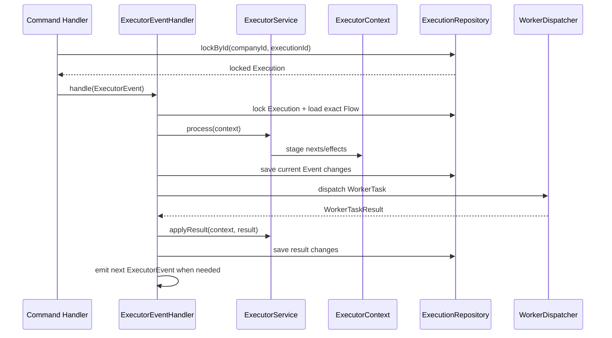

# ADR 0020：以 ExecutorContext 暂存并提交单轮调度副作用

## 状态

Accepted（nexts 两阶段应用继续有效；Task 能力分支及 ExecutorService 内部循环由
ADR 0024 和后续已确认运行模型修订；DefaultExecutor 提交职责由 ADR 0051 迁移到
Executor Event Queue）

本决策修订 ADR 0002 中“创建 Handler 先启动 Execution、`handleNext` 直接创建
TaskRun”的调用顺序，以及 ADR 0012 中由 Core `ExecutionHandler` 协调保存和
Worker 派发的职责；ADR 0006 的可运行集合语义和 ADR 0017 的统一 State 仍然
有效。

## 背景

原运行链路在 `ExecutorService.handleNext` 中同时查找下一任务、修改 Execution、
创建 TaskRun，并由 `ExecutionHandler` 通过前后聚合副本比较判断是否需要保存。
该实现把“计算计划”和“提交事实”混在一个方法中，带来以下问题：

- 调用方无法在应用前检查本轮解析出的完整 TaskRun 批次。
- `dirty` 依赖深比较推断，不能直接表达本轮是否更新了 Execution。
- 并行可运行 Task 仍按单项创建，批次边界不清晰。
- Repository 保存、Worker 投递和异常记录分散在 Core Handler 与 Executor
  之间，未来接入消息或 outbox 时没有单一替换边界。
- 原 `ExecutorContext` 混入 Session 和 DSLContext，更像事务参数容器，而不是
  一轮状态机工作的可重建单元。

需要把一次调度循环明确拆成计划、应用和副作用提交三个阶段，同时继续遵守
Execution 聚合、精确 Flow Reversion、命令事务和统一 State 的既有不变量。

## 备选方案

### 方案一：继续在 handleNext 中直接修改聚合

修改最少，但计划与事实无法分离，批次、幂等消费、变更追踪和未来消息投递仍需
依赖隐式约定。

### 方案二：把调度游标和待执行队列持久化

恢复时可以直接读取队列，但会让 Execution 重新成为位置或游标，并保存可以由
不可变 Flow Reversion 与 TaskRun 事实推导出的冗余状态，违反 ADR 0002 和
ADR 0006。

### 方案三：使用可重建的 ExecutorContext 暂存本轮副作用

每轮从确定 Flow 与 Execution 重建上下文；`handleNext` 只形成计划，
`onNexts` 原子应用计划，统一协调器再保存聚合并投递 Worker。上下文只存在于
本轮内，不成为新的持久化事实。

## 决策

采用方案三。

### ExecutorContext

`ExecutorContext` 是“一次调度循环的可变工作单元”，不是聚合、Repository
实体、事务对象或持久化游标。

核心输入固定为：

- `Execution execution`：本轮要推进的聚合。
- `Flow flow`：Execution 通过 `flowId + flowReversion` 绑定的完整、已部署
  Flow Reversion。

运行态不能持有 `FlowDraft`。后者是未解析、可修改且没有正式 reversion
的来源草稿，不能为一个已启动 Execution 提供确定运行语义。

本轮暂存字段包括：

- `nexts`：`handleNext` 解析出的下一批 CREATED TaskRun；应用时通过
  `taskId` 从精确 Flow Reversion 解析 Task 定义。
- `workerTasks`：`onNexts` 应用后等待投递的不可变 WorkerTask。
- `orchestrationCompletions`：本轮搜索发现已收敛、等待 Executor 完成的编排作用域
  TaskRun 身份。
- `states`：本轮观察到的 Execution 状态序列，首项为上下文创建时的
  `State.Type`，相邻状态去重。

`states` 只是本轮增量视图；`Execution.state.history` 仍是唯一可
持久化、权威的状态历史。Session 和 DSLContext 不进入 ExecutorContext，它们
只在提交与 Worker 调用边界作为运行参数传递。

Context 的调度字段为 `execution`、`flow`、`nexts`、`workerTasks`、
`orchestrationCompletions` 和 `states`，并显式记录本轮聚合是否更新。它不保存来源
字符串、异常副本或持久化游标；如需来源诊断应使用结构化日志。异常沿调用栈抛出
并触发事务回滚；计划、应用和 OrchestrationTask 递进顺序由
`ExecutorService.process(...)` 封装。

当前项目尚未定义延迟任务、子流程和 Loop 的正式运行协议与类型，因此本次不使用
`List<Object>` 或空壳模型预占这些字段。相应能力确认后，应以明确的不可变效果
类型加入同一个上下文，而不是把副作用重新散回 Handler。

### handle、handleNext 与 onNexts

`ExecutorService.handle(context)` 是状态推进循环入口。它反复按顺序调用
`handleNext` 与 `onNexts`，直到出现以下任一边界：

1. 当前批次包含 RunnableTask，已经形成等待提交和投递的 WorkerTask。
2. Execution 到达 WAITING 或终态。
3. 当前没有可以同步继续推进的状态变化。

`onNexts` 遇到 BranchTask 时直接在 Executor 内启动并收敛对应 TaskRun；无需
外部恢复的结构节点完成后，`handle` 立即进入下一轮 `handleNext`。PAUSE 先进入
WAITING，再由下一轮空批次使 Execution 收敛到 WAITING。BranchTask 不形成
WorkerTask，也不由外部 Command Handler 调用第二个状态推进入口；后续周期统一由
`ExecutorEvent` Queue 交给 `ExecutorEventMessageHandler`。

`ExecutorService.handleNext(context)` 只执行以下动作：

1. 根据精确 Flow Reversion、已有 TaskRun、route 与 dependOn 重建下一批可运行
   Task。
2. 为尚未落入聚合的候选创建临时 CREATED TaskRun；恢复时已有 CREATED
   TaskRun 可以直接进入同一投递批次。
3. 把批次加入 `ExecutorContext.nexts`。

它不得启动 Execution、向 `Execution.taskRuns` 添加元素、改变 State、保存
Repository 或调用 Worker。

`ExecutorService.onNexts(context)` 是对应计划的唯一应用边界：

1. 消费当前 `nexts`，随后清空该批次。
2. 首次运行时通过 `Execution.startWithTaskRuns(...)` 在完整校验后一次完成
   CREATED -> RUNNING 与第一批 TaskRun 并入；后续批次使用
   `Execution.addTaskRuns(...)`。
3. 原子校验并合并尚未附着的 TaskRun。
4. 校验每个 Task 恰好具有 RunnableTask 或 BranchTask 能力；只为 RunnableTask
   暂存 WorkerTask，BranchTask 由 Executor 直接推进。
5. 编排作用域收敛时暂存 `orchestrationCompletions`；PAUSE 等待直接由 Execution
   与 TaskRun 状态表达，不创建额外等待资源。
6. 同步 `states` 并返回 Execution 聚合是否发生变化。
7. 当空批次代表流程已经收敛或只剩外部等待时，分别应用 COMPLETED 或 WAITING。

同一批次必须先完整验证再并入；批次中任一重复身份、重复非循环 Task、非法父
TaskRun 或非 CREATED TaskRun 都不能留下部分聚合变化。

`handleNext` 与 `onNexts` 是 Executor 模块内部阶段，统一由
`ExecutorService.process(context)` 在一个 Event 周期内按顺序调用。外部命令只通过
`ExecutionCommandEventHandler` 进入 Executor；后续内部周期由
`ExecutorEventMessageHandler` 领取 Event 并推进。DefaultExecutor 的当前职责由 ADR 0059
修订为两条 Queue 路由。

### ExecutorEventHandler

`ExecutorEventMessageHandler` 是当前内部运行组件的单 Event 提交边界。外部
`ExecutionCommandEventHandler` 负责校验、物化/锁定和投递 `ExecutorEvent`；内部处理器
通过 `ExecutionRepository.lockById(...)` 按租户锁定读取已有 Execution，再加载其精确
Flow Reversion，创建纯 ExecutorContext。内部处理器负责：

1. 调用 `ExecutorService.process`，完成当前 Event 的计划、应用与 BranchTask 状态推进。
2. 根据本轮变更标记，通过 ExecutionRepository 保存完整聚合。
3. 在 Worker 调用前保存 CREATED/RUNNING TaskRun，满足 Task 自有记录的外键
   前置条件。
4. 投递本轮 WorkerTask，将 WorkerTaskResult 交回 ExecutorService 应用，再次保存结果。
5. 若 Execution 仍可推进，在同一事务投递下一条 `ExecutorEvent`，而不是在同一个
   调用栈中继续复用 Context。
6. 统一处理取消；Queue 领取的 `PROCESS`、`RESUME` 和 `CANCEL` 都在
   `ExecutorEventMessageHandler` 的独立事务中完成。启动、恢复和取消中的确定性
   RunnableTask 异常按 ADR 0051 记录为失败结果。

Core 中不再保留另一个 `ExecutionHandler` 协调器，避免两个对象共同拥有保存和
投递顺序。

### 事务、投递与恢复

当前 WorkerDispatcher 在 ExecutorEventHandler 建立的 JOOQ 事务内同步调用；
Repository 的中间 `save` 不是独立提交。Queue 消费触发的确定性 RunnableTask 异常
记录为 `FAILED`，使持久化 Command 可以正常确认而不会成为永久毒消息。

PostgreSQL Repository 的 `lockById` 使用 Execution 行的 `FOR UPDATE` 锁，
保存时继续使用行锁与 lockVersion CAS；修改已有 Execution 的一个命令仍最多
增加一次 lockVersion。ADR 0051 的消息消费者在构建上下文前取得同样的租户隔离与
并发控制。

本决策没有实现远程 Worker 或 exactly-once。ADR 0051 让普通启动先由 Service 投递
`Create`，再由 Handler 创建 Execution；ADR 0068 已删除可信 pending continuation，
启动只保留一条完整 Command 链。运行提交边界由 `ExecutorEventMessageHandler` 保持。

## 调用顺序

## 不变量

- `ECTX-001`：Context 的 Flow 必须与 Execution 的
  `companyId + flowId + flowReversion` 完全一致。
- `ECTX-002`：Context 不持有 FlowDraft、Session、DSLContext 或可持久化
  游标。
- `ECTX-003`：`handleNext` 返回后 Execution 与 TaskRun 历史保持不变。
- `ECTX-004`：`handle` 必须在形成下一批 nexts 前消费并清空当前批次。
- `ECTX-005`：只有 `onNexts` 可以把调度产生的 TaskRun 批次并入 Execution。
- `ECTX-006`：未保存聚合变化只存在于当前 ExecutorEventHandler 调用栈，不进入
  Queue payload；State History 不因保存而重置。
- `ECTX-007`：`states` 是本轮 Execution 状态增量，不替代
  `Execution.state.history`。
- `ECTX-008`：Worker 投递前必须保存包含目标 TaskRun 的 Execution 聚合。
- `ECTX-009`：Queue 驱动的启动、恢复或取消中的确定性 RunnableTask 异常按 ADR
  0051 形成 FAILED 事实，不伪造其他终态。
- `ECTX-010`：推进、恢复或取消已有 Execution 前，Handler 必须在当前事务中
  按租户锁定读取聚合。
- `ECTX-011`：非等待 BranchTask 必须在 `handle` 内完成后继续推导 nexts；PAUSE
  必须在返回提交边界前使 TaskRun 与 Execution 收敛到 WAITING。

## 后果

- 计划计算可以独立测试，不需要用聚合深比较判断 `handleNext` 是否产生变化。
- 同一时刻可运行的并行子 Task 作为一批形成和应用，TaskRun 顺序仍按 Flow
  定义的确定顺序保存。
- 新 Execution 保持 CREATED，直到第一次 `onNexts` 才进入 RUNNING。
- TaskRun 可以通过 `TaskRun.create(...)` 形成临时计划，但只有
  `Execution.startWithTaskRuns(...)` 或 `addTaskRuns(...)` 接受后才成为聚合
  真实历史；TaskRun 的后续状态变化仍只能由 Execution 完成。
- 运行组件开始依赖 ExecutionRepository 端口和当前 DSLContext，但纯状态机
  `ExecutorService` 仍不访问 Repository、JOOQ 或具体 Worker 实现。
- 延迟、子流程、Loop、消息 outbox 和远程投递仍需各自的业务协议与验证场景。
