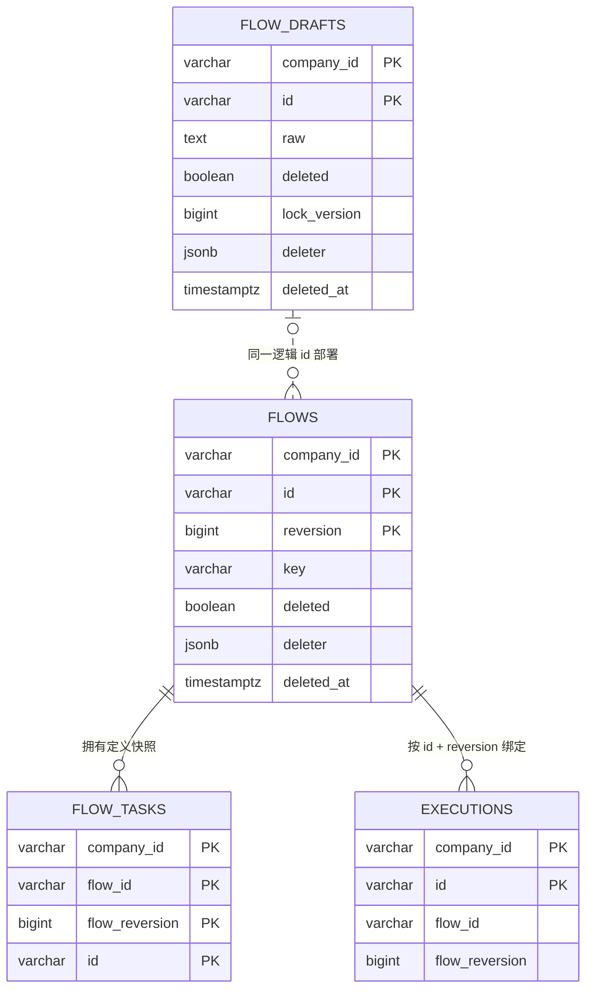

# ADR 0022：将 FlowDraft 建模为独立聚合并移除 draft 字段

## 状态

Accepted

## 背景

ADR 0008 和 ADR 0014 已经把未解析、可编辑的 Flow 来源与完整、不可变的 Flow
Reversion 分为两个聚合和两类 Repository。ADR 0018 又在两个聚合中分别保存固定
值 `draft=true` 和 `draft=false`，并在 PostgreSQL 的 `flow_drafts` 与 `flows`
表中保存相同的固定角色标记。

最新确认的业务语言把可编辑原始定义直接称为 `FlowDraft`。是否为草稿已经能够由
领域类型、Repository 契约和数据表唯一确定，因此固定 `draft` 布尔值不再表达
任何不能稳定推导的业务事实。

`deleted` 与之不同：它会在同一聚合生命周期内从 false 单向变化为 true，仍需要
作为显式业务事实保留。

## 备选方案

### 方案一：保留 FlowDraft 和 Flow 中的固定 draft 字段

可以继续提供统一布尔字段，但字段永远不发生变化，只会重复类型和表已经表达的
角色，并要求领域、Repository、数据库和测试持续保护冗余一致性。

### 方案二：合并为一个 Flow 聚合

可以依赖 `draft` 区分未解析来源与完整定义，但会重新让大量字段只在部分状态下
有效，破坏原始 YAML 与可执行定义之间已经确认的聚合边界。

### 方案三：使用独立 FlowDraft 聚合并移除 draft 字段

`FlowDraft` 表达唯一可编辑原始定义，`Flow` 表达一次完整部署事实。对象类型和
Repository 边界表达角色，只有会真实变化的 `deleted` 进入两个聚合。

## 决策

采用方案三。

### 统一语言与聚合

- `FlowDraft` 取代旧名称 `FlowWithSource`，是 Flow 定义域内的独立聚合根，不建立新的
  顶级限界上下文。
- `FlowDraft` 只保存稳定 `id`、`companyId`、原始 `raw`、删除事实、审计事实和
  技术 `lockVersion`。
- `FlowDraft` 不拥有 `draft`、`reversion`、`key`、description、inputs、
  outputs 或 tasks。
- `Flow` 继续表示一次完整、已解析、已校验的部署 Reversion，不拥有 `draft`
  字段。
- `FlowDraft` 与 `Flow` 共享逻辑 `id`，但没有继承关系，也不在部署时相互转换。

### 生命周期

- `FlowDraft.create` 创建 `deleted=false` 的唯一可编辑草稿。
- `FlowDraft.revise` 只修改原始 YAML、更新审计并递增 `lockVersion`。
- `FlowDraft.delete` 把 `deleted` 从 false 单向改为 true，记录删除审计并递增
  `lockVersion`。
- `Flow.deploy` 从未删除 FlowDraft 产生新的 `deleted=false` Flow Reversion。
- `Flow.delete` 把当前 Reversion 的 `deleted` 从 false 单向改为 true。
- 删除逻辑 Flow 时，Handler 继续在同一事务中删除最新 Flow Reversion 与仍存在
  的 FlowDraft。

### 查询与运行

- FlowDraft 查询只通过 `FlowDraftRepository` 和 `flow_drafts` 表完成，活动草稿
  只要求 `deleted=false`。
- 当前 Flow 仍先选择同一 `id` 下最大 `reversion`，再要求 `deleted=false`；
  不允许删除后回退到旧 Reversion。
- 已启动 Execution 继续按 `flowId + flowReversion` 精确读取定义，即使该
  Reversion 后来被删除。
- 如果某个外部协议需要统一的 `draft` 展示字段，只能由 DTO 根据对象类型派生，
  不能把它重新持久化或加入领域对象。

### PostgreSQL 映射

图中关系由 Repository、租户条件和同一事务维护，数据库继续不建立外键。
`flow_drafts` 与 `flows` 删除 `draft` 列；两表仍使用 `deleted` 及删除审计
CHECK 约束。活动草稿索引只以 `deleted=false` 为条件。

## 理由

- 对象类型、Repository 和表已经完整表达草稿与正式定义的不同有效性边界。
- 移除固定字段符合“只保存不能稳定推导的事实”的领域字段规则。
- 不再存在 `FlowDraft(draft=false)` 或 `Flow(draft=true)` 等无业务意义的非法
  组合，也无需在每次重建和查询时重复校验。
- 保留 `deleted` 可以继续明确表达逻辑删除、审计一致性和删除后不回退规则。
- 使用 `FlowDraft` 而不是泛化 `Draft`，避免与未来其他业务域的草稿概念混淆。

## 后果

- 旧 `FlowWithSource`、对应 Command、Handler、Repository、Entry 和测试替身
  统一重命名为 `FlowDraft` 术语。
- FlowDraft、Flow、Repository 查询和 Execution 启动删除所有 `isDraft()` 判断。
- PostgreSQL 追加迁移删除两个 `draft` 列，重建删除审计约束和活动草稿索引，并
  重新生成 JOOQ。
- ADR 0018 中关于 `draft` 布尔事实的决策被本 ADR 取代；其删除语义继续有效。
- 用户可观察的草稿创建、查询、修改、部署、删除、多租户和版本行为不变，因此
  UC-01 与 UC-02 不需要新增用户场景。

## 取代关系

本 ADR 取代 ADR 0018 中关于领域与 PostgreSQL 显式保存 `draft` 布尔值的结论，
并将 ADR 0008、ADR 0014 中的来源聚合统一命名为 `FlowDraft`。原始来源与正式
Flow 分离、部署后保留草稿、逻辑删除、Reversion 和运行精确绑定等既有决策继续
有效。
