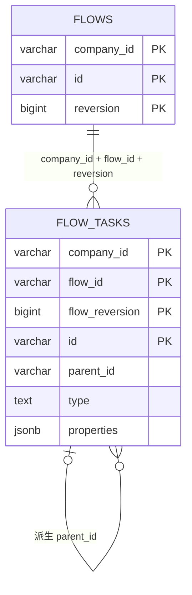

# ADR 0026：以具体 Task 类作为项目内插件

## 状态

Accepted

本 ADR 取代 ADR 0013、0014、0023 和 0024 中关于 `TaskExtension`、
`TaskTypeDispatcher`、类型短名、ServiceLoader、Task 不可变构造以及插件属性显式
编解码的条款；这些 ADR 的其余领域与运行时决定继续有效。

ADR 0027 修订本 ADR 中 `@Plugin` 不携带元数据、注册表只保存类映射的局部条款，
并增加已注册插件目录与按需定义 Schema 查询；本 ADR 的其余决定继续有效。

ADR 0028 增加新 Task 扩展按能力名称建立独立目录的约定；现有已进入类型协议的
内置类地址不在该次变更中迁移。

ADR 0083 进一步规定 Flow 版本和行 ID 由 Repository 分配，并修订本文中
`PublishFlowHandler` 只执行一次直接绑定的条款：草稿允许先移除 Flow 系统字段，
再通过同一个 YAML Mapper 绑定剩余定义字段。

本次实现修订多态绑定的局部职责：`PluginDeserializer` 通过构造器接收
`PluginRegistry`，注册中心解析具体类后由 Jackson 递归绑定；`PluginModule` 负责将
它注册到 `Task.class`。通用 `YamlParser` 不解析插件类型、不反射扫描插件字段，也不
创建业务绑定上下文。YAML Mapper 注册 source 定义配置并生成首次 Task 身份；JSON
Mapper 注册持久化配置并直接绑定已保存身份。调用方不传递 reader attribute。

## 背景

原 Task 扩展需要同时提供具体 `Task` 和伴生 `TaskExtension`，再由 Dispatcher
根据 `AUTO`、`PAUSE`、`PARALLEL` 等短类型选择扩展。外部 classpath 插件又通过
ServiceLoader 进入同一注册表。这使一个 Task 的类型、定义字段和运行能力分散在
多个类与发现协议中，也要求插件维护自定义类型标识和显式属性编解码。

当前阶段只需要项目内扩展。已确认的目标是：新增一个具体 Task 类，实现通用
`Plugin` 与恰好一种运行能力，标注 `@Plugin` 后即可被发现；YAML、API 和数据库
统一使用真实类地址，不保留旧短类型兼容。

## 备选方案

### 方案一：保留 TaskExtension 与短类型

兼容已有定义，但具体 Task 与伴生扩展继续重复声明类型和构造规则，不能达到一次性
收缩机制的目标。

### 方案二：按 YAML type 直接 Class.forName

代码最少，但会把用户输入直接变成任意类加载请求，绕过应用允许列表和启动期能力
校验。

### 方案三：Micronaut 编译期发现具体 Task，注册表解析精确类地址

`@Plugin` 使具体 Task 成为 Micronaut Bean；注册表只接受已发现、已校验的类。
Jackson 先读取 `type`，再通过注册表选择具体类并执行严格字段绑定。

## 决策

采用方案三。

### 插件契约与发现

- `Plugin` 是最小根接口。`Task` 直接实现 `Plugin`，不再存在 `TaskExtension`、
  Task 类型 Dispatcher 或伴生 `*TaskPlugin`。
- `Plugin#getType()` 固定返回具体类的 `Class#getCanonicalName()`。插件不能声明
  别名、短类型、优先级或自定义 type。
- 具体 Task 必须直接标注项目的 `@Plugin`。该注解负责 Micronaut 编译期 Bean
  发现、单例作用域和私有字段 introspection，并可按 ADR 0027 提供可选标题与描述。
- `DefaultPluginRegistry` 在应用启动时收集 Plugin Bean，并建立不可变的插件目录和
  `canonical class name -> PluginMetadata` 映射；`PluginRegistry` 只公开查询。类不是
  公共具体类、没有公共无参构造、缺少直接 `@Plugin`、类型重复，或 Task 没有恰好实现
  `RunnableTask`/`BranchTask` 之一时，应用启动失败。
- 第一版只发现同一项目编译产物中的插件，不支持 ServiceLoader、外部插件 JAR、
  插件目录、独立 ClassLoader、安装卸载、热加载、版本选择或独立插件 API 模块。
- 新增的独立 Task 扩展使用
  `extensions/<extension-name>/<ExtensionName>.java`，具体类使用能力名称且不
  强制添加 `Task` 后缀。Flow 自有编排 Task 按语义所有权统一位于
  `extensions/flow`；目录不参与注册身份，canonical class name 仍是唯一类型协议。

### Task 构造与读取边界

- Task 不采用不可变构造器反序列化。具体 Task 提供公共无参构造，Jackson 由服务
  框架直接绑定字段。
- 绑定完成后的 Task 只通过只读访问器公开状态，不公开 Setter；Builder 仍可用于
  项目代码和测试直接创建对象。
- Task 与 Plugin 不提供 `valid()`。`ModelValidator` 是统一主动校验入口，既校验
  YAML 绑定出的 Task，也供其他服务直接创建 Task 后调用。
- `ModelValidator` 执行 Bean Validation 和 Task 通用不变量，包括 key、路由、
  输入输出、依赖项、递归子任务和运行能力互斥。Flow 聚合继续校验树结构、身份
  复用和跨节点关系。

### YAML 与多态反序列化

- `core/serializers/JacksonMapper` 集中创建项目受控的 JSON/YAML ObjectMapper，
  注册 `PluginModule`，并统一开启未知字段、重复 YAML key 和尾随内容的严格拒绝。
- `YamlParser` 负责严格 YAML 读取，可返回通用只读 Map，也可按调用方给出的目标类型
  执行绑定。它不导入 Flow、Task 或插件绑定上下文；`PublishFlowHandler` 对正式定义
  调用 `parse(source, Flow.class)`，对草稿可先从通用 Map 移除 Flow 系统字段，再调用
  `bind(...)`，最后补充 Flow 生命周期与原始 source 事实。
- 每个 Task 的 `type` 必须与注册表中的 canonical class name 完全相同，区分大小写，
  不执行 trim、大小写归一化、别名解析或短类型回退。`AUTO`、`PAUSE`、
  `PARALLEL` 以及其大小写变体均为未知类型。
- `PluginDeserializer` 作为 `Task.class` 的 Jackson 自定义反序列化器，通过构造器
  接收注册表，取得允许的具体 Task 类，再让当前 `DeserializationContext` 递归绑定
  该类的通用字段和插件专有字段。未知字段和非法值直接失败，不回退到通用 Task。
- `PublishFlowHandler` 在绑定完成后调用 `ModelValidator` 校验 Task；Task 的首次身份
  由已经注册到 YAML Mapper 的 source 插件反序列化器生成，不引入 reader attribute
  或额外的插件预处理器层，也不下沉到 `YamlParser`。
- `JacksonMapper` 只集中配置受控 Mapper 和提供通用对象转换；YAML 读取和错误定位
  由 `YamlParser` 负责，两者均不解释具体 Flow 业务字段。

### 身份与父子关系

- YAML 中的 `key` 是可选的用户维护节点身份。提供时保留外部 key；缺少时系统在当前
  物化版本生成 key。系统为首次出现的 key 生成技术 `id`，后续 reversion 对同一 key
  复用该 id；同一旧 id 不得转移给另一个 key。
- YAML 不接受 `id`、`parentId` 或 `taskId` 等系统身份字段。
- Task 领域对象只用递归 `tasks` 表达编排树，不包含 `parentId`。
- `TaskRun.parentId` 继续表达运行时血缘。关系库的 `flow_tasks.parent_id` 也保留，
  但只由 Repository 展开 Task 树时派生，读取时用于重建树，不注入 Task。

### 持久化

- `flow_tasks.type` 保存具体 Task 的 canonical class name，列类型使用 `text`；不迁移
  旧短类型数据。
- Repository Adapter 使用一个共享的 `TaskPropertiesCodec` 拆分和合并 Task
  properties。id、key、type、route、inputs、outputs、dependOn 和 children 等通用
  字段进入关系列或树结构，剩余插件专有字段进入 `properties` JSONB。
- `FlowTaskEntry` 只静态调用 `TaskPropertiesCodec`。Codec 在内部复用同一个受控
  `JacksonMapper`：读取时合并关系列、`properties` 和已重建的 children，再通过
  注册表驱动的 Jackson 绑定恢复原具体 Task。每个插件不创建自己的 properties
  Codec。

数据库关系不建立外键；Repository 在租户和精确 Flow reversion 范围内维护并校验
该树。

## 理由

- 具体 Task 类成为定义字段、类型身份与运行能力的唯一中心，新增项目内 Task 不再
  创建伴生注册类。
- 注册表仍是显式允许列表，既保留编译期发现的便利，也避免把 YAML 直接交给任意
  类加载。
- canonical class name 消除中心短类型枚举和命名冲突；一次性破坏旧契约避免长期
  维护双轨解析。
- 集中 Jackson 配置让 YAML 部署、数据库恢复和 API 序列化共享同一多态规则，插件
  专有字段无需进入 Task 基类。
- parentId 留在需要它的持久化和运行事实中，定义模型只表达自然的嵌套结构。

## 后果

- 所有 Flow 定义、Demo、测试和 API 返回必须使用具体 Task 的 canonical class
  name；数据库中的旧定义必须由使用方清理后重新部署。
- 类重命名或换包会改变持久化类型标识，是显式的定义兼容性变更；若未来需要兼容，
  必须另行设计插件版本和迁移机制，不能恢复隐式短类型回退。
- 新插件字段应使用 Bean Validation 声明局部约束，并由 `ModelValidator` 主动执行。
- 新增外部插件加载、依赖隔离或运行时安装能力时，需要在当前项目内注册表之外新增
  包管理层并记录新 ADR。
