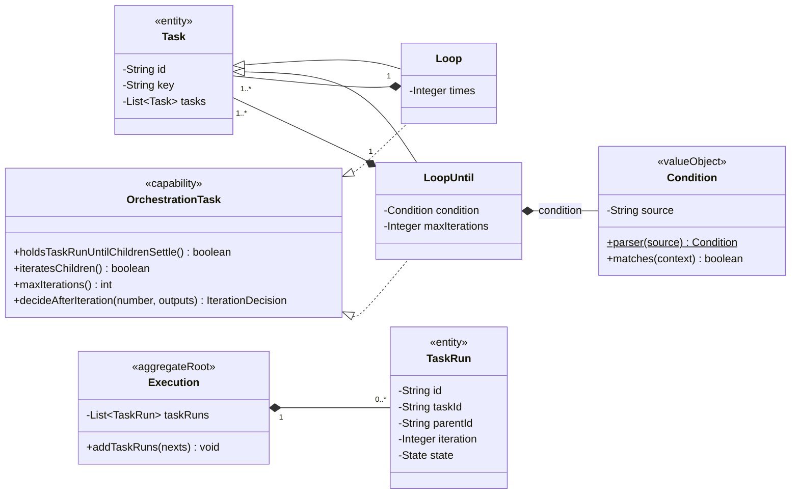
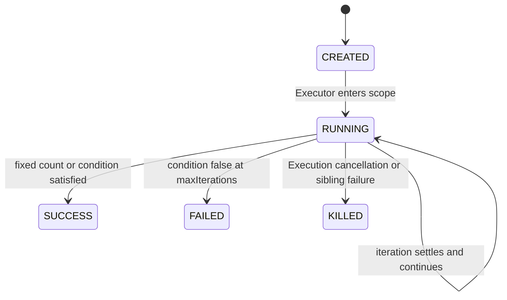
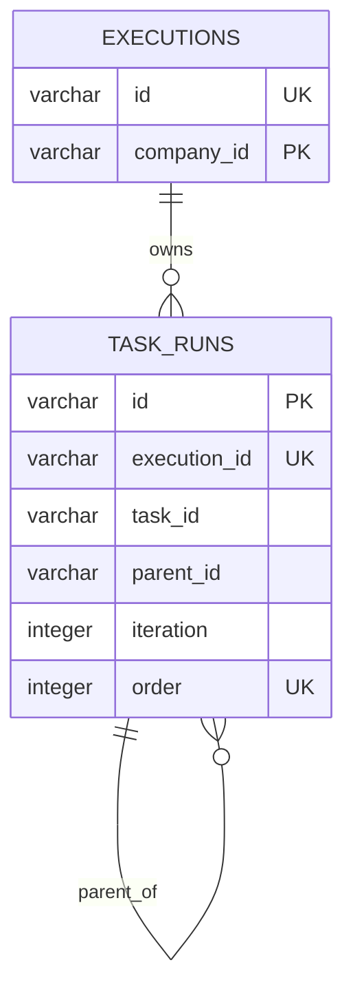

# ADR 0036：将 Loop 与 Loop Until 建模为可恢复的迭代编排作用域

## 状态

Accepted（2026-08-05；条件表达式的语义所有权由 ADR 0074 修订）

本决策补充 ADR 0002、0006、0020 和 0029 中预留的循环运行协议。单
Execution、真实 TaskRun 历史、OrchestrationTask 由 Executor 解释、精确 Flow
Reversion 恢复以及 Flow 自有编排 Task 统一位于 `extensions/flow` 的决策继续
有效。

## 背景

Flow 已经支持串行、条件路由、显式 Parallel 和 Pause，但同一个 Task 定义在一次
Execution 中仍最多产生一个 TaskRun。该限制无法表达以下两类已经要求的编排：

- 按确定次数重复一组 Task。
- 至少执行一轮，并在每轮结束后判断条件，直到条件成立。

循环不能依赖 Executor 内存计数器，否则服务重启后无法确定当前轮次；也不能把
轮次塞进 Task 的业务 inputs 或任意 properties Map，否则定义、业务输入和运行
事实会失去边界。每一轮实际执行的 Task 必须继续形成独立 TaskRun，并由 Execution
聚合原子接受。

## 术语与对象角色

- **Loop**：Flow Reversion 内的固定次数编排 Task；它按定义顺序串行执行完整
  `tasks`，恰好完成 `times` 轮。
- **Loop Until**：Flow Reversion 内的后置条件编排 Task；它每轮串行执行完整
  `tasks`，轮末条件成立时完成，达到上限仍不成立时失败。
- **Loop iteration**：一个 Loop TaskRun 内从 1 开始编号的一轮真实执行范围。
  它不是独立聚合，也不建立 Repository 或单独表。
- **Loop Until condition**：LoopUntil 持有的 Condition；引用使用
  `{{ outputs.<taskKey>.<outputKey> }}`，由 Condition 负责受限比较和逻辑组合，
  仍由 LoopUntil 保护本轮 Task 和 Output 范围。

Loop 与 Loop Until 都是 Flow 聚合内的 Task 定义实体并直接实现
`OrchestrationTask`；它们通过该既有能力的可选迭代特征声明串行轮次规则，不新增
Loop 专有 Interface。它们的 TaskRun 以及每轮子 TaskRun 都属于 Execution 聚合。
只有 ExecutionRepository 持久化这些运行事实。

## 备选方案

### 方案一：只新增两个空 OrchestrationTask 类

Schema 可以展示类型，但 Executor 仍会立即完成它们，无法重复子任务，也无法恢复
轮次，不构成可运行能力。

### 方案二：把 currentIteration 保存进 Loop TaskRun properties

读取方便，但会保存可由有序 TaskRun 历史推导的游标，并需要为每种编排 Task 引入
不受约束的运行 Map。游标与子 TaskRun 写入失败时还可能不一致。

### 方案三：每轮子 TaskRun 保存明确 iteration，进度由历史推导

Loop TaskRun 表达完整作用域并保持 RUNNING；直接子 TaskRun 保存从 1 开始的
`iteration`，后代通过 parentId 链归属该轮。Executor 从精确定义和历史恢复当前
轮次，不保存游标。

## 决策

采用方案三。

### 定义类与字段

- `org.cses.flow.extensions.flow.Loop`
  - `times`：必填正整数。
  - `tasks`：必填非空，按定义顺序串行执行。
- `org.cses.flow.extensions.flow.LoopUntil`
  - `condition`：必填 Condition，由统一条件领域解析和求值，并继续以字符串绑定、
    展示和持久化。
  - `maxIterations`：必填正整数，是同步循环的硬上限。
  - `tasks`：必填非空，按定义顺序串行执行。
- 两个类直接标注 `@Plugin`，继承 Task 并直接实现 `OrchestrationTask`；不形成
  WorkerTask。
- 为确保每轮必然产生可恢复事实，循环体第一个直接子 Task 的 route 必须是
  `DIRECT`。后续 Task 继续使用现有 route 规则。
- 循环体允许 RunnableTask、Pause、Parallel、Loop 和 Loop Until 嵌套。

`OrchestrationTask` 以默认非迭代的特征提供 `iteratesChildren`、最大轮数及一轮
结束后的 `CONTINUE/SUCCESS/FAILURE` 决策。Loop 与 Loop Until 直接覆写这些特征，
并固定持有 TaskRun，直到循环作用域正常完成或失败。Executor 只解释既有
`OrchestrationTask` 契约，不依赖具体扩展类。

### 领域类图

### TaskRun 迭代事实

- `TaskRun.iteration` 为空表示它不是某个循环作用域的直接迭代子运行。
- 非空时必须为从 1 开始的正整数，并且 parentId 必须指向拥有该轮的 Loop 或
  Loop Until TaskRun。
- 循环体的直接子 TaskRun 使用相同 Loop parentId 和轮次；更深后代继续以真实
  parentId 组成树，不复制 iteration。
- 同一个 Task 定义允许在同一 Loop TaskRun 下按不同 iteration 产生多个 TaskRun。
- 一个运行实例由 `executionId + taskId + parentId + iteration` 唯一定位；普通
  非循环 Task 的 iteration 为空，因此仍最多产生一次相同父范围内的运行。
- 每轮进度、完成轮数和最新轮次都从 TaskRun 顺序、parentId 与 iteration 推导，
  不在 Loop TaskRun 另存 currentIteration 游标。

### 运行上下文与输出

- 每轮第一个直接子 Task 接收进入 Loop 时的同一份只读流动上下文。
- 直接迭代 TaskRun inputs 增加 `loop.iteration`，供 RunnableTask 的受限模板读取。
- 每轮各 Task outputs 保留在各自 TaskRun，不自动合并为 Loop outputs。
- Loop 与 Loop Until 本身当前以空 outputs 完成；下游需要循环体结果时使用
  `dependOnOutputs.<taskKey>`，获得该 Task 最新完成的 TaskRun outputs。
- Loop Until 条件只读取当前轮内成功或警告完成的 Task outputs，按 Task key
  隔离；不能读前一轮或其他 Execution 的值。

### 生命周期

- Loop 完成恰好 `times` 轮后进入 SUCCESS。
- Loop Until 至少执行一轮；每轮完整收敛后才检查 condition。
- condition 成立时进入 SUCCESS。
- 第 `maxIterations` 轮结束后仍不成立时，Loop Until 进入 FAILED，并沿现有
  fail-fast 规则终止 Execution 和其他未完成 TaskRun。
- 任一循环体 Task 明确失败时沿现有 Execution 失败路线处理，不再创建下一轮。
- Pause 位于循环体时可以形成稳定 PAUSED 事实；恢复后继续当前轮而非新建一轮。

### PostgreSQL 逻辑关系

`iteration` 是稳定、需要约束和恢复的标量运行事实，使用可空 integer，而不是
JSONB。数据库不创建外键；Execution 聚合批次校验、Repository 同事务保存和有序
重建继续保证父子归属。数据库使用检查约束保证 iteration 为正，并使用表达式唯一
索引保证同一运行范围不会重复创建同一轮 TaskRun。

## 不变量

1. `LOOP-001`：Loop 与 Loop Until 必须直接实现 OrchestrationTask，不能新增
   Loop 专有 Interface，也不能同时实现 RunnableTask。
2. `LOOP-002`：Loop.times 与 LoopUntil.maxIterations 必须为正整数。
3. `LOOP-003`：循环体非空，且第一个直接子 Task route 为 DIRECT。
4. `LOOP-004`：Loop TaskRun 在全部目标轮次收敛前保持 RUNNING。
5. `LOOP-005`：同一轮串行执行循环体；下一轮不能在当前轮收敛前创建。
6. `LOOP-006`：直接迭代 TaskRun 的 iteration 为正数且 parentId 指向循环作用域。
7. `LOOP-007`：同一 Task 在相同 parentId 与 iteration 下最多产生一个 TaskRun。
8. `LOOP-008`：Loop Until 只读取当前轮、声明为 STRING 的确定 Task output。
9. `LOOP-009`：达到 maxIterations 仍不满足条件必须失败，不能伪装正常完成。
10. `LOOP-010`：迭代进度只由 Flow Reversion 与 TaskRun 事实恢复，不保存内存或
    持久化游标。

## 验证场景

- 正向：Loop 执行 1 轮和多轮；Loop Until 第一轮成立、后续轮成立；循环嵌套
  RunnableTask、Parallel、Pause 与另一个 Loop。
- 反向：零或负次数、空循环体、首 Task 非 DIRECT、非法条件语法、条件引用循环体
  外 Task、未声明或非 STRING output、达到上限仍不成立。
- 变异：若复用上一轮 TaskRun、若下一轮提前开始、若 condition 读取旧轮输出、若
  上限被当作成功，测试必须失败。
- 身份：同一 Task 定义的每轮 TaskRun id 不同，taskId 相同，iteration 单调递增。
- 恢复：在循环体 Pause 稳定点持久化并重建后，继续相同 iteration；已完成轮次不
  重跑。
- 并发：同一 Execution 的恢复命令继续由行锁与 lockVersion 串行化，相同轮次的
  occurrence 唯一约束阻止重复运行事实。

## 尚待业务规则确认

- 本轮不增加轮次间延迟、最大总时长、break/continue、并行迭代、集合 ForEach、
  失败重试或循环 outputs 聚合。这些能力不能通过放宽当前字段含义隐式加入。
- Loop Until 第一阶段条件只支持声明 STRING output 的精确相等；数值、布尔、逻辑
  组合和脚本表达式需要独立确认表达式安全边界。

## 实施落点

- Execution 按父运行和 iteration 约束 TaskRun 运行实例，不再按 taskId 全局拒绝
  循环体的合法重复运行。
- Executor 按具体运行范围查找 TaskRun，并从循环轮次历史完成收敛判断；PostgreSQL
  基线、JOOQ 映射和运行历史视图共同保存并展示 iteration。
- TaskRun 和 `task_runs` 当前没有 iteration，需要同步 Domain、基线、JOOQ 和 Entry。
- Plugin 测试目录和 Schema 测试需要注册并覆盖 Loop、Loop Until。

## 后果

- 同一个 Task 定义可以合法产生多个 TaskRun，但每个 TaskRun 仍有独立技术 id、
  状态、inputs、outputs 和错误。
- TaskRun 基础模型增加 iteration；它是跨所有循环类型共享的明确编排事实，不是
  任意扩展数据容器。
- 数据库基线变化后需要重建开发数据库并重新生成 JOOQ，不维护旧数据升级路径。
- Executor 的任务定位从“taskId 唯一”提升为“定义 Task + 运行父范围 + 轮次”。
