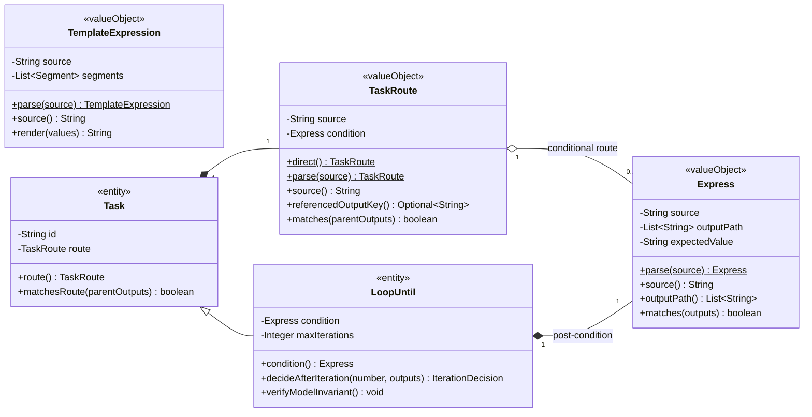

# ADR 0037：由 Express 领域统一受限表达式所有权

## 状态

Accepted（2026-08-05；2026-08-06 纳入模板表达式语义所有权；Flow Input root、
typed literal 与比较运算符于 2026-08-13 由 ADR 0052 修订）

本决策修订 ADR 0006 中 `RouteExpression` 的语义所有权、ADR 0036 中
`LoopConditionExpression` 的独立解析与求值选择，以及 ADR 0028 中
`TemplateExpression` 位于 Task 领域的包归属。ADR 0052 后续扩展 Task Route 的
Input root 和 typed 比较；`DIRECT`、Loop Until 的本轮 outputs 范围、模板语法和
模板缺值失败语义保持不变。

## 适用范围与效力

本文定义受限表达式领域的目标模型：Express 供 Task Route 与 Loop Until 使用，
TemplateExpression 供需要渲染运行输入的 Task 使用。它覆盖条件和模板各自的解析、
引用定位、求值、消费方约束和迁移边界。本文描述的目标模型已经与当前 Java 实现
一致。

统一语言以 [`CONTEXT.md`](../../CONTEXT.md) 为准，领域建模方法遵守
[`domain-object-modeling.md`](../standards/domain-object-modeling.md)。当前 Route
运行语义仍由 ADR 0006 约束，Loop Until 运行语义仍由 ADR 0036 约束。

本决策建立时不扩展两种表达式语言；当前 Task Route 扩展以 ADR 0052 为准。它不
改变 YAML 或 PostgreSQL 中已有字符串形态，也不把 TemplateExpression 合并为
Express 条件语法，不支持算术、逻辑组合、函数调用或任意脚本。

## 背景

Task Route 当前由 `RouteExpression` 解析
`outputs.<outputKey> == "<value>"`，Loop Until 当前由
`LoopConditionExpression` 解析
`outputs.<taskKey>.<outputKey> == "<value>"`。两者分别维护正则、路径字段、
字符串类型判断、精确比较和值相等性。

这些差异只来自消费范围：Route 读取直接父 TaskRun outputs，Loop Until 读取当前
轮按 Task key 隔离的 outputs。表达式本身的词法、运算符、缺值行为和求值规则相同。
继续复制会让新增转义、错误规则或运算符时必须同步修改两套实现，也可能使同一个
表达式在不同编排位置得到不同解释。

## 定义与对象角色

- **Express**：无身份、不可变的值对象，表示一个已经通过语法校验的 outputs
  字符串相等条件。它负责解析、保存 output 路径、定位运行值和返回 boolean；它
  不知道自己被 Route 还是 Loop Until 使用。
- **TaskRoute**：Task 定义内部的值对象，表示无条件 `DIRECT` 或一个 Express
  条件。它拥有 Route 的默认值、允许路径和父 outputs 求值入口，不是通用表达式。
- **Loop Until condition**：LoopUntil 定义持有的 Express。LoopUntil 继续负责
  校验 Task 范围、Output 声明和 DataType，不再拥有表达式解析器。
- **Task Template Expression**：返回字符串的模板值对象，语法、结果和失败语义
  与 boolean 条件不同。它与 Express 同属受限表达式领域，但不通过继承或条件分支
  合并为同一个类型。

Express、TemplateExpression 和 TaskRoute 都属于 Flow 聚合内 Task 定义的值，
不是聚合根或实体，不建立 Repository、Service、Handler 或独立数据库表。
Express 与 TemplateExpression 的 Java 语义所有权位于
`org.cses.flow.core.domains.expressions`；TaskRoute 离开 Task 即失去意义，仍位于
`org.cses.flow.core.domains.tasks`。

## 备选方案

### 方案一：保留两个专用 Expression 值对象

调用方接口不变，但共同的语法和求值规则继续分散，第三个条件消费者出现时仍需
复制或再做一次抽象。

### 方案二：引入 Aviator 或其他脚本表达式引擎

可以支持丰富运算，但会扩大执行权限、依赖、缓存和兼容边界。当前已确认需求只有
只读 outputs 字符串精确相等，不需要脚本引擎。

### 方案三：Express 统一条件语法，消费方保护各自范围

Express 形成一个纯内存深模块：小接口隐藏词法、路径遍历、类型判断和值比较；
TaskRoute 与 LoopUntil 只保留各自真实业务差异。

## 决策

采用方案三。

### 统一表达式语法

- Express 固定接受 `outputs.<path> == "<value>"`。
- `<path>` 至少包含一个片段；每个片段以英文字母开头，后续只允许英文字母、
  数字、下划线或连字符。
- 当前唯一运算符是 `==`，两侧空白允许变化；表达式首尾空白在解析时移除。
- `<value>` 是不包含双引号的字符串，可以为空；不做数字、布尔或隐式类型转换。
- 方法调用、数组下标、算术、逻辑组合、变量写入和脚本均非法。
- 求值遇到路径缺失、中间值不是 Map 或最终值不是 String 时返回 `false`，不会
  猜测默认值或抛运行时缺值异常。

### 消费方约束

- TaskRoute 把 `null`、空白和 `DIRECT` 规范为无条件 Route；`DIRECT` 不是
  Express，也不能由 Loop Until 使用。
- 条件 Route 只接受一个 output 路径片段，即
  `outputs.<outputKey> == "<value>"`。它只读取直接父 TaskRun outputs；Parallel
  入口继续按 ADR 0029 使用父编排输入。
- Loop Until condition 只接受两个 output 路径片段，即
  `outputs.<taskKey>.<outputKey> == "<value>"`。它只读取当前轮已收敛 Task 的
  outputs。
- Express 只确认语法和求值。路径是否属于当前父 Task、Loop body 是否包含目标
  Task、Output 是否已声明且为 STRING，继续分别由 Flow 和 LoopUntil 定义不变量
  负责。

### 兼容边界

- `flow_tasks.route` 继续保存 `DIRECT` 或原表达式字符串，不修改数据库字段。
- LoopUntil properties 中的 `condition` 继续保存表达式字符串，不修改 JSON
  形态或插件 Schema 的 string 类型；Schema 同时声明标准扩展格式
  `flow-expression`，供编排工具选择结构化条件构建器，不能把它解释为允许执行脚本。
- 解析后的 source 使用移除首尾空白后的定义文本；持久化重建必须得到值相等的
  Express 和 TaskRoute。
- 本次不为已发布 Java 类型保留双轨兼容类；迁移一次性删除
  `RouteExpression` 和 `LoopConditionExpression`，项目内调用方统一改用目标类型。
- `TemplateExpression` 从 `core.domains.tasks` 一次性迁入
  `core.domains.expressions`，不保留旧包代理类型；message 的 YAML、Schema 和
  properties JSONB 仍是原字符串，运行结果与失败消息保持不变。

## 领域类图

`TaskRoute.condition` 为空只表示已经确认的 `DIRECT` 业务形态；条件 Route 必须持有
Express。Express 与 TemplateExpression 归属于同一个受限表达式领域，但保持独立
类型和失败语义，也没有共享可变实例或独立生命周期。

## 字段

### Express 字段

| 字段 | 含义 | 规则 |
| --- | --- | --- |
| `source` | 用户确认的条件定义文本 | 必填；移除首尾空白；按原文本持久化和参与值相等性 |
| `outputPath` | `outputs.` 后的有序引用路径 | 至少一个合法片段；构造时防御性复制，对外只读 |
| `expectedValue` | `==` 右侧的字符串期望值 | 不可空；允许空字符串；不做类型转换 |

Express 不保存 Task、TaskRun、Execution、iteration、DataType、运行 outputs 快照、
解析器节点或编译缓存。这些事实要么属于消费方，要么可以从 source 稳定推导。

### TaskRoute 字段

| 字段 | 含义 | 规则 |
| --- | --- | --- |
| `source` | Route 的持久化定义 | `DIRECT` 或条件 Express 的 source |
| `condition` | 可选条件 | `DIRECT` 时不存在；条件 Route 时必填且路径恰好一段 |

LoopUntil 直接持有 Express，不再保存第二份已经解析的 taskKey、outputKey 或
expectedValue 字段。

## 方法

### 创建与重建方法

| 方法 | 用途 | 核心规则 |
| --- | --- | --- |
| `Express.parse(source)` | 从外部字符串创建合法条件值 | 一次完成规范化、语法校验、路径提取和不可变构造 |
| `TaskRoute.direct()` | 创建无条件 Route | source 固定为 `DIRECT`，不创建伪 Express |
| `TaskRoute.parse(source)` | 恢复或绑定 Route | 空值规范为 DIRECT；其他值委托 Express 并校验 Route 路径 |

值对象没有技术身份，持久化回读仍调用同一 parse，不提供绕过不变量的
`rehydrate` 或公共 Setter。

### 业务行为方法

| 方法 | 用途 | 核心规则 |
| --- | --- | --- |
| `Express.matches(outputs)` | 判断只读 outputs 是否满足条件 | 只遍历 Map；缺值、非 Map 或非 String 返回 false；不改变输入 |
| `TaskRoute.matches(parentOutputs)` | 判断子 Task Route | DIRECT 返回 true；条件 Route 委托 Express |
| `LoopUntil.decideAfterIteration(...)` | 每轮收敛后决定继续、成功或失败 | 只把当前轮 outputs 交给 condition；达到上限规则不变 |

### 查询方法

| 方法 | 用途 | 核心规则 |
| --- | --- | --- |
| `source()` | 序列化和定义展示 | 返回规范化后的不可变原文 |
| `outputPath()` | 供消费方验证引用范围 | 返回防御性只读列表，不暴露解析中间对象 |
| `TaskRoute.referencedOutputKey()` | 供 Flow 校验父输出声明 | DIRECT 为空；条件 Route 返回唯一 output key |

## 状态机

不适用：Express 和 TaskRoute 都是随 Flow Reversion 一次性构建的不可变值对象，
没有独立状态、业务动作或终态。Loop Until 的运行状态机继续由 ADR 0036 定义，
本决策不新增表达式状态。

## 聚合关系与业务边界

- Flow 部署物化 Task 时创建 TaskRoute；条件 Route 在该入口形成 Express。
- LoopUntil 在定义绑定时直接形成 Express，并由自身不变量验证引用的 Task 和
  Output。
- Flow 聚合负责 Route 引用范围和父 DataType；LoopUntil 负责循环体引用范围和
  Output DataType；Express 不加载或遍历 Flow 聚合。
- Executor 只向已经验证的值对象提供当前运行 outputs，不解析字符串、不访问
  Repository，也不缓存可变表达式上下文。
- Repository 继续以 Flow 为单位保存 source 字符串；Entry/Jackson 只做边界转换，
  不复制表达式语法。
- TemplateExpression 在同一表达式领域内返回渲染字符串并保护缺路径失败语义；
  RunContext 和具体 Task 只消费其公开渲染能力，不拥有或复制模板解析规则。
- Express 与 TemplateExpression 不通过继承或兼容分支合并：前者缺值返回 false，
  后者缺值失败，两者的结果类型和消费场景不同。

## 版本、审计与并发

- **业务 reversion**：Express 没有独立 reversion；条件文本变化属于 Flow 定义
  变化，只在成功部署新 Flow Reversion 后成为正式事实。
- **审计**：Express 不记录 creator、updater 或 timestamp；沿用所属 FlowDraft
  和 Flow 部署链路的审计事实。
- **并发**：Express 没有 lockVersion；不可变值可被并发求值，调用方每次传入
  自己的只读 outputs。
- 解析或定义校验失败不能生成 Flow Reversion，也不能留下部分 Express 状态。

## 领域不变量

### Express 不变量

- `EXP-001`：source 必须完整匹配受限 outputs 字符串相等语法，不能只解析前缀。
- `EXP-002`：outputPath 至少一段，所有片段必须满足稳定 key 字符规则。
- `EXP-003`：当前只允许 `==` 和字符串期望值，不执行脚本、函数或类型转换。
- `EXP-004`：求值只读取调用方 outputs；缺失或类型不匹配只能得到 false。
- `EXP-005`：source、outputPath 和 expectedValue 创建后不可变，集合不能泄漏。

### TaskRoute 不变量

- `RTE-001`：TaskRoute 只能是 DIRECT 或条件 Route，两种形态互斥且始终完整。
- `RTE-002`：条件 Route 的 Express outputPath 必须恰好包含一个 output key。
- `RTE-003`：DIRECT 不创建 Express；条件 Route 不把缺值解释为 DIRECT。
- `RTE-004`：Flow 必须继续确认引用来自直接父范围且 DataType 为 STRING。

### Loop Until condition 不变量

- `LUC-001`：LoopUntil.condition 必须是 Express，且 outputPath 恰好为
  `taskKey + outputKey` 两段。
- `LUC-002`：taskKey 必须属于当前 Loop Until body，outputKey 必须由该 Task
  声明且 DataType 为 STRING。
- `LUC-003`：条件只对当前轮 outputs 求值，不能读取旧轮、父范围或其他 Execution。

## 场景校验

- **正向**：同一 Express 接口分别解析并求值 Route 的一段 outputPath 与
  Loop Until 的两段 outputPath；DIRECT Route 始终匹配。
- **反向**：拒绝空条件、非法 key、单等号、未闭合字符串、方法调用、额外逻辑；
  消费方拒绝错误路径层级、越界 Task、未声明或非 STRING Output。
- **变异**：删除完整匹配、字符串类型判断、当前轮隔离或消费方路径层级校验时，
  对应测试必须失败。
- **身份**：不适用；值对象没有技术 ID。相同规范化 source 的保存和重建结果必须
  值相等。
- **版本**：失败解析不产生 Flow Reversion；已发布表达式只能通过新部署变化。
- **恢复**：Route 列和 LoopUntil properties 字符串往返后恢复相同 source、路径
  和求值结果。
- **并发**：同一个 Express 实例并发读取不同 outputs 时结果互不污染，不保存上次
  求值上下文。

## 后续修订

- ADR 0052 已确认字符串转义、typed scalar、`!=`、数值顺序比较和 Flow Input
  root；逻辑组合、函数和更多运行上下文仍未确认，不能通过调用脚本引擎隐式加入。
- Express 条件与 TemplateExpression 模板已经统一归属表达式领域；是否进一步共享
  内部路径词法实现不影响公开接口，也不能改变二者不同的缺值和结果语义。

## 现有实现迁移差距

- 已新增 `core/domains/expressions/Express.java` 及接口和完成度矩阵测试。
- `RouteExpression` 已一次性迁移为 Task 语义明确的 `TaskRoute`；DIRECT、Route
  字符串协议和父 outputs 行为保持不变。
- `LoopUntil.condition` 已改为 Express，在定义绑定时一次解析，并继续由
  LoopUntil 校验路径范围、Task、Output 和 DataType。
- `LoopConditionExpression` 已删除，原解析与求值测试已迁移到 Express seam。
- `TemplateExpression` 已从 Task 包迁入 expressions 包，Log、RunContext、持久化
  映射和测试统一依赖新语义地址，旧包类型不再保留。
- Flow 定义绑定、插件 Schema、FlowTaskEntry 字符串往返以及 Executor/Worker
  相关调用方均已纳入回归验证。
- 当前没有未完成的 Java、数据库或 JOOQ 迁移；UC 用户行为和外部定义格式不变。

## 理由

Express 的接口只有 parse、source、outputPath 和 matches，却集中隐藏完整语法、
不可变性、路径遍历、类型判断和精确比较。删除该模块会让相同复杂度重新散回 Route
与 Loop Until，说明这个 seam 具有实际深度和复用价值。

TaskRoute 与 LoopUntil 不被合并，因为 DIRECT、父范围、循环体范围、定义校验和
失败语义不同。TemplateExpression 也不并入 Express，因为它生成字符串且缺值必须
失败。三者只把通用的表达式语义归入同一领域，不抹平各自业务差异。

## 后果

- 条件语法和求值修改只需在 Express 中完成，两个消费者继续独立保护引用范围。
- Java 类型地址会发生一次项目内破坏性迁移，但 YAML、Schema 和数据库字符串保持
  兼容。
- Express 与 TemplateExpression 保持纯内存、无依赖、无副作用，不需要抽象
  Interface、Adapter 或缓存 seam。
- 更复杂表达式仍需新的业务确认和 ADR，不能把 Express 逐步演变为任意脚本容器。

## 相关文档

- [`CONTEXT.md`](../../CONTEXT.md)：统一语言。
- [`domain-object-modeling.md`](../standards/domain-object-modeling.md)：统一建模方法。
- [`project-development.md`](../standards/project-development.md)：复用、类型和变更规则。
- [`ADR 0006`](0006-single-execution-branch-routing-and-join.md)：现有 Route 语义。
- [`ADR 0028`](0028-add-log-extension-and-task-template-expressions.md)：独立的模板表达式。
- [`ADR 0036`](0036-model-loop-and-loop-until-as-recoverable-orchestration-scopes.md)：
  Loop Until 与当前条件模型。
- [`Express 完成度验证`](../harness/express-completeness.md)：支持、拒绝、消费和恢复
  场景矩阵。
