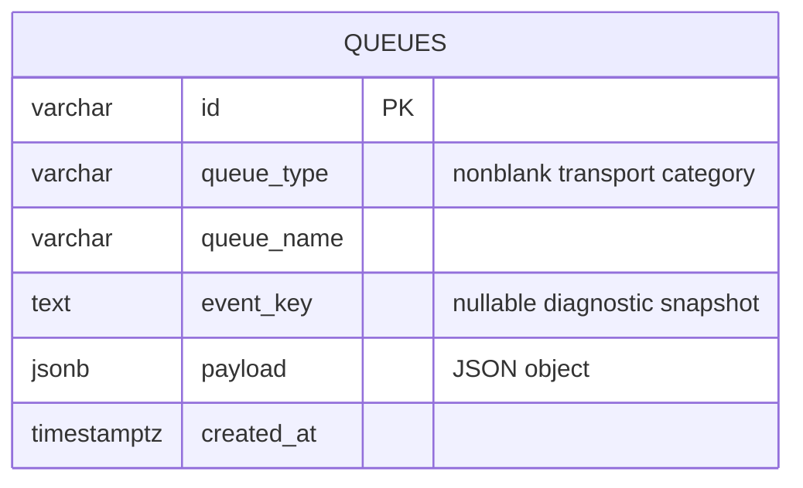

# ADR 0047：实现 Default Dispatch Queue Adapter 与统一消息表

## 状态

Accepted

本决策修订 ADR 0046 “当前范围”中暂不提供数据库 Adapter、消息表和后台消费线程的
阶段性结论；ADR 0046 的类型化 Queue Interface 与业务 Event 所有权决策保持不变。
Queue 的消息载荷统一存入 `queues`，传输类别和逻辑 Queue 分别通过
`queue_type` 与 `queue_name` 区分，不为 Dispatch、Broadcast 等类别复制载荷表。

## 背景

ADR 0046 已建立类型化 Dispatch Queue 契约，并让 `Event` 直接提供可空事务级
`DSLContext dsl()`。Flow 已固定使用 PostgreSQL、具名 `flow` 数据源和 JOOQ；同步
发布可以使用 Event 携带的 DSL，使 Queue 消息与业务写入加入同一本地事务。

当前唯一生产实现是基于数据库周期轮询的默认 Dispatch Queue，因此公开实现名表达其
项目内角色，不暴露 JDBC 驱动细节；PostgreSQL Store、轮询线程和行锁协议留在实现
内部。项目已有 PAAS `JsonFactory` 作为一般 JSON 的统一入口，没有必要再要求每个
业务 Queue 提供外置事务解析器或编解码 Interface。Default Queue 只需绑定一个确定的
业务 `Class<T>`，就可以统一构造 JSONB Queue Entry 并恢复 Event。

本 Adapter 只负责稳定传输，不判断 Consumer 的业务处理结果，也不建立显式 ACK、
Lease、重试次数或业务结果记录。Consumer 正常返回即确认；Consumer 抛出异常表示本次
领取事务没有完成，原消息继续保留并可被再次领取。该结论由 ADR 0051 修订，以满足
持久化业务 Command 不得因普通进程内异常而丢失的要求。

## 备选方案

### 方案一：领取时先删除并提交，再调用 Consumer

这种方式不会重复交付，但进程在删除提交后、Consumer 调用前崩溃时会永久丢失消息，
不满足数据库 Queue 的恢复目标。

### 方案二：建立 ACK、Lease 和重试状态机

Lease 可以缩短数据库事务并恢复失联 Consumer，但会引入确认、超时、尝试次数、
重新投递和清理协议，超出当前 Queue 只负责传输的边界。

### 方案三：事务内竞争锁定、调用 Consumer 并删除

一个领取事务使用 `FOR UPDATE SKIP LOCKED` 锁定一条消息，在同一事务内恢复并调用
Consumer；只有 Consumer 正常返回才删除消息并提交。Consumer 抛出异常、进程或连接
在提交前异常终止时事务回滚，原消息重新可见。

### 同步事务来源

- 在 Queue Interface 增加 `emit(DSLContext, ...)` 会为同一发布能力形成两套方法，
  并让调用方重复传递 Event 已经拥有的事务。
- 注入独立 Event 事务解析器可以保持 Event 表面上不依赖 JOOQ，但只有一个事务来源，
  每个业务 Queue 还要重复装配一层透传 Interface。
- 让 Event 直接提供可空 `dsl()`，同步 Queue 只需读取 Event 自身；返回 `null` 时由
  Queue 开启事务。

采用第三种事务来源。JOOQ 类型进入 Event Interface 是经过确认的窄化依赖；SQL、
消息表和数据库操作仍不进入 Queue Core。

### Event JSON 转换

- 由每个业务 Queue 提供编解码 Interface 可以支持任意 wire protocol，但当前只有
  JSONB 一种存储协议和 PAAS `JsonFactory` 一个统一 JSON 实现，这个额外 Seam 没有
  第二个真实 Adapter。
- Default Queue 直接接收 `Class<T>`，统一使用 `JsonFactory` 把业务 Event 重组为
  JSON object Queue Entry，并用同一个 Class 恢复类型。业务内部 `eventType` 仍是
  Event 自己维护的普通字段，Queue 不解析、不枚举也不建立中心类型目录。

采用第二种 JSON 转换方式。

## 决策

采用事务内竞争锁定、Event 直接提供同步 DSL、Default Queue 统一 JSONB 转换，以及
跨传输类别共享的 Queue Message 表。

### 数据模型

一行 `queues` 保存一个 Queue Event 的持久化载荷。`queue_type` 是可扩展的
传输类别，初始定义 `DISPATCH` 并为未来广播预留 `BROADCAST`；`queue_name` 在类别内
标识逻辑 Queue，两者共同形成消息的 Queue 归属。当前只实现 Dispatch Adapter，因此
目前只生产和领取 `queue_type = 'DISPATCH'` 的行。Dispatch 消息没有可更新状态；
行存在即待交付，完成传输后物理删除。

- `id` 是应用通过 `StringUtil.newId()` 生成的消息记录身份；
  `pk_queues` 将其作为表主键，`ck_queues_id` 保证其非空白。
- `queue_type` 是 Queue 基础设施拥有的可扩展传输类别，非空且去除首尾空白后必须仍有
  内容。`DISPATCH` 是当前实现使用的值，`BROADCAST` 是已预留的下一类语义；数据库不以
  枚举约束封死取值，后续 Adapter 可以定义新的非空白类别。它不等同于业务 Event
  payload 内部的 `eventType`，也不形成业务 Event 类型目录。DDL 使用
  `varchar(32) NOT NULL` 和 `CHECK (length(btrim(queue_type)) > 0)`，不设置默认值，写入
  Adapter 必须显式给出类别；该非空白不变量由
  `ck_queues_type` 保证。
- `queue_name` 在 `queue_type` 内标识类型化逻辑 Queue。Default Adapter 允许空字符串，
  但不允许 `null`；同名的 Dispatch 与未来 Broadcast Queue 因 `queue_type` 不同而彼此
  隔离。
- `event_key` 保存 Event 在发布时返回的可空业务 key 快照，只用于诊断，不参与路由、
  顺序、唯一性或去重。
- `payload` 是 Default Queue 使用项目现有 `JsonFactory` 从 Event 业务字段构造的
  JSON object；列使用 PostgreSQL `jsonb`，并由 `ck_queues_payload`
  保证顶层类型为 object。
- Queue Entry 构造必须显式排除 `DSLContext`。`dsl()` 是一次同步发布的事务上下文，
  不是 Event 业务事实，不进入 JSONB，也不会到达 Consumer。
- Default Queue 在装配时接收确定的 `Class<T>`，领取消息后使用该 Class 和
  `JsonFactory` 恢复 Event。数据库不保存 Java 类名，不建立中心类型注册。
- 业务 Event 可以自行保存和解释内部 `eventType`；它只是 payload 的业务字段，
  不参与 Queue 路由、类型选择或消费策略。
- `created_at` 只用于待交付扫描。普通 Dispatch 不承诺全局或严格 FIFO 顺序。
- 当前 Dispatch 链路不在消息行保存 `company_id`、状态、尝试次数、Lease、消费历史、
  软删除或审计字段。租户及业务类型属于 Event payload。

Queue 不按 Event 内部字段查询 payload，因此不为 `payload` 建立 GIN 索引；待交付扫描
依赖 `idx_queues_pending (queue_type, queue_name, created_at, id)`。JSONB 是可重建
Event 的持久化快照，不把业务字段所有权转移给 Queue。`queues` 是所有 Queue
传输类别的唯一消息
载荷表，不按传输类别新增专属载荷表。

Broadcast Queue Interface、广播消费游标、投递状态和保留清理仍不在当前实现范围。
未来实现 Broadcast 时，其 Event payload 仍写入 `queues`，并使用
`queue_type = 'BROADCAST'`；如果一对多投递确实需要每个订阅者的游标、确认或保留状态，
这些专属状态使用独立表保存，不把消息载荷复制到另一张 Broadcast 消息表。

### 同步发布与事务

- 单条同步 `emit(T)` 直接读取 `event.dsl()`。非空 DSL 表示使用调用方事务，不另开或
  嵌套事务；返回只表示消息写入已在该事务中暂存，最终提交或回滚仍由调用方负责。
  `dsl()` 返回 `null` 时，Queue 使用具名 `flow` JOOQ 开启自己的事务；方法成功返回时
  该事务已经提交。
- 同步批量发布只接受两种事务集合：全部 Event 的 `dsl()` 都返回 `null`，此时整批
  使用一个 Queue 自有事务；或全部 Event 返回同一个 `DSLContext` 实例，此时整批
  使用该调用方事务。混合空与非空 DSL，或返回不同 DSL 实例，均在写库前以
  `QueueException` 失败。
- 批量发布先通过 `JsonFactory` 把全部 Event 重组为不含 DSL 的不可变 JSONB Entry，
  再使用一条多行 INSERT；整批 Queue 接受全有或全无。

### 异步发布与事务

- `emitAsync(...)` 在调用线程先通过 `JsonFactory` 构造不含 DSL 的不可变 JSONB Entry，
  再交给 Queue 管理的虚拟线程 Executor；后台任务只携带 Entry，不携带原 Event 或
  调用方 `DSLContext`。
- 异步发布不把 `event.dsl()` 作为事务来源，无条件由 Queue 开启新事务。对应
  `CompletionStage` 只在该独立事务提交后成功完成。
- 异步发布不能与调用方业务事务原子提交；需要同事务发布时必须使用同步 `emit`。

### 竞争消费与恢复

- 每个 Subscription 使用一条虚拟线程周期轮询数据库，每次最多领取一条消息；
  `pollIntervalMillis` 由具体 Default Adapter 配置，不进入 Core Queue Interface。
- 多个 Subscription 和多个 JVM 使用
  `FOR UPDATE SKIP LOCKED` 竞争同一逻辑 Queue 的行；索引
  `idx_queues_pending (queue_type, queue_name, created_at, id)` 支持待交付扫描。
  Default Dispatch Queue
  领取时同时固定 `queue_type = 'DISPATCH'` 和自身 `queue_name`，不会读取未来的
  Broadcast 消息。
- Consumer 在领取事务内调用，因此一次活跃回调会占用一个数据库连接并持有消息行锁。
- Consumer 正常返回后删除消息并提交；抛出 `RuntimeException` 时领取事务回滚，消息
  保持待交付，Subscription 等待下一轮后重试。Queue 仍不判断业务结果，Consumer 必须
  把已处理的确定性业务失败转换为正常返回的业务状态。
- `JsonFactory` 无法按 Queue 的 `Class<T>` 恢复 Event，表示传输尚未到达 Consumer；
  领取事务回滚并保留原消息，Subscription 按普通基础设施失败等待下一轮轮询，不把
  错误 payload 静默删除。
- 恢复后的 Event 只包含 JSONB 中的业务字段，不带发布端 DSL；内部 `eventType` 的
  解释仍由该 Event 类及其业务 Consumer 负责。
- 若 JVM、连接或事务在删除提交前异常终止，数据库回滚使原行重新可见；这可能让已经
  产生部分外部副作用的 Consumer 再次看到同一 Event。业务仍负责自身结果协议与幂等。
- 数据库或删除失败时领取事务回滚，消息保持待交付；这属于未完成的原始传输，不创建
  新消息、重试记录或尝试次数。

### 生命周期与装配

- `pause` 立即阻止下一次领取，不等待也不中断当前 Consumer。领取线程锁定具体行后、
  恢复 Event 前再次检查 Subscription 状态；若这时已经暂停或关闭，则保留消息并只
  释放行锁。状态检查先通过的领取视为已经开始；`resume` 唤醒本地轮询。
- 外部线程调用 Subscription 或 Queue 的 `close` 时，等待当前回调和轮询线程结束；
  Consumer 内调用自身 Subscription 的 `close` 只标记关闭，当前回调返回后由轮询线程
  完成退出，避免等待自身。
- 任一 Consumer 在回调内调用所属 Queue 的 `close` 时，Queue 先一次性通知全部
  Subscription 停止新领取，然后不等待任何活跃回调直接返回；各轮询线程在各自回调
  返回后退出。该调用也只对异步 Executor 发出非阻塞关闭请求，不等待已经提交的异步
  发布；后续外部 `close` 仍会等待这些任务结束。该例外既避免两个 Consumer 同时关闭
  同一个 Queue 时形成相互等待，也避免 Consumer 持有数据库连接时等待一个正在获取
  连接的异步发布。
- Queue 关闭先一次性通知全部 Subscription 停止新领取，再等待各自当前回调结束，
  避免慢 Consumer 让尚未轮到的 Subscription 继续消费；随后等待已经提交给异步
  Executor 的发布任务。关闭后的新发布和订阅失败为 `QueueException`。
- 通用 `DefaultDispatchQueue<T>` 不是全局 Singleton。业务组合根为每个 Event 契约
  创建具名 Bean，传入 Queue 名、具名 `flow` JOOQ、用于恢复的 `Class<T>` 和轮询
  间隔，并把 `close` 注册为销毁方法。
- Adapter 位于 `org.cses.flow.infrastructure.queues`。PostgreSQL Store、轮询
  Subscription 和 JOOQ Entry 是内部实现；Queue Core 只因 `Event.dsl()` 依赖
  JOOQ 类型，不依赖 PostgreSQL、消息表、线程或具体 JSONB 实现。

## 理由

- PostgreSQL 行锁直接提供跨 Subscription、跨 JVM 的竞争领取，不需要进程内协调器。
- 未提交事务由数据库自动恢复，保留了进程崩溃时的待交付消息。
- Consumer 只有正常返回才确认，避免持久化 Command 因进程内异常被静默丢弃；Queue
  不区分异常类型，也不维护业务重试状态。
- 直接复用 PAAS `JsonFactory` 和 `Class<T>`，让 JSONB 构造与类型恢复集中在 Default
  Queue，无需为当前唯一协议维护业务编解码 Interface。
- Event 直接提供可空 DSL，让同步发布可以加入业务事务，无需外置事务解析 Interface 或
  DSL 发布重载；Default Queue 同时负责确保该基础设施成员不进入持久化 Entry。
- `DefaultDispatchQueue` 的小型 Interface 隐藏 JSONB 重组、数据库锁、周期轮询和
  生命周期协调，为调用方提供更深的 Queue Module。
- 单一 `queues` 保存所有传输类别的 Event payload，避免为 Dispatch、Broadcast
  重复相同 Schema；`queue_type + queue_name` 又保持各类逻辑 Queue 的查询隔离。

## 后果

- 每个活跃 Consumer 回调占用一个 `flow` 数据库连接；部署时连接池容量至少要覆盖
  并发 Subscription、普通业务事务和运维余量。Consumer 不应执行无限期阻塞操作。
- 崩溃恢复可能重复调用 Consumer；业务需要使用 Event 自身标识和结果协议处理可能的
  重复副作用，但 Queue 不维护幂等表。
- 业务 Event 必须兼容 PAAS `JsonFactory`，并实现可空 `dsl()`；事务 DSL 只服务同步
  发布，持久化与恢复后的 Event 均不包含它。
- 使用相同 `queue_name` 的全部 Queue 实例必须使用相同且 wire-compatible 的
  `Class<T>`；该约束限定在相同 `queue_type` 内。Queue 不持久化类名、不协商版本，
  也不管理业务 `eventType`。
- 当前仅实现 `DISPATCH` 的写入、轮询和删除。`BROADCAST` 作为预留类别只表示共享
  存储边界已经固定，不表示 Broadcast Interface、消费游标或清理任务已经可用；开放的
  `queue_type` 取值也不构成已实现能力清单。
- 同步批量发布不能混用事务；`emitAsync` 不能与调用方业务写入原子提交。
- 已有开发数据库必须按 ADR 0033 重建并重新生成 JOOQ；应用仍不自动迁移 Schema。
- 并发完整性与基础性能使用独立的
  [`dispatchQueueLoadTest`](../harness/dispatch-queue-load-test.md) 场景验证，不进入普通
  `test`、`check` 或 `build` 链路，也不替代多节点故障注入和生产容量认证。
- Execution 启动链路由 ADR 0051 接入该 Queue；Worker 在独立的消费事务内同步运行。
