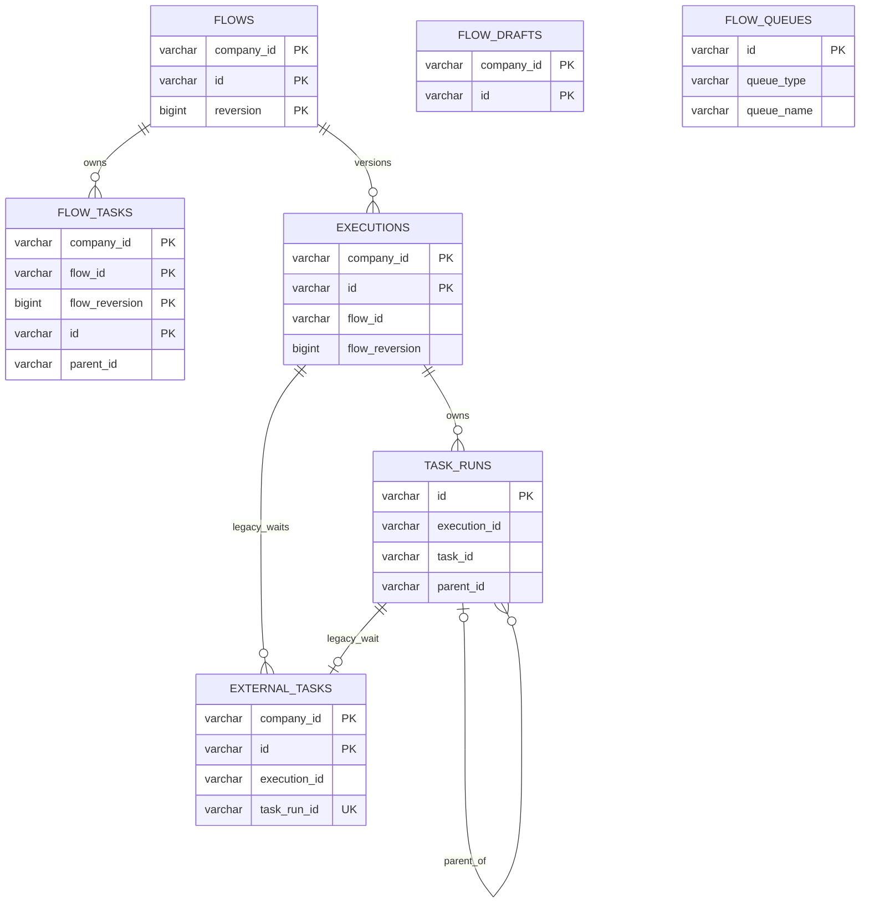

# ADR 0048：按表隔离 Schema DDL 并统一复数表名

## 状态

Accepted（2026-08-11）

本决策修订 ADR 0033 的单一物理文件布局，但保留单一开发期基线、允许丢弃旧开发
数据和应用不自动迁移 Schema 的决策。

## 背景

开发期完整 Schema 原来集中在 `gen/sql/flow/001_create_flow_tables.sql`。随着表和
索引增加，一张表的定义与相邻表容易在同一大文件中混杂，表级变更的所有权和审查
边界不够清晰。

现有表名大多已经使用小写蛇形复数，但 `task_run` 与 `external_task` 的最后一个
单词仍是单数。同一 Schema 内并存两种命名方式会让 SQL、JOOQ 生成类和 Repository
引用缺少一致规则。

## 备选方案

### 方案一：继续维护一个包含所有 DDL 的 SQL 文件

执行入口简单，但不能形成清晰的表级修改边界，也会继续允许命名风格分叉。

### 方案二：按文件名自动排序并依次执行表脚本

每张表可以隔离，但完整基线的顺序由文件名、Shell 和排序环境共同决定；新增或误放
文件还会被隐式执行。

### 方案三：保留一个显式入口并按表拆分 DDL

入口使用 psql `\ir` 明确列出所有表脚本和顺序，每个表文件只拥有一张表、约束与
索引。入口在一个事务中执行完整 Schema。

## 决策

采用方案三：

- `gen/sql/flow/001_create_flow_tables.sql` 继续作为唯一完整基线入口，但不直接定义
  表；它显式包含 `gen/sql/flow/tables/<table_name>.sql`。
- 每个表文件恰好包含一张表的 `CREATE TABLE IF NOT EXISTS`、该表约束和该表索引，
  文件名与表名一致。
- 表名统一使用小写 `snake_case`，最后一个单词使用复数。Flow 通过“最后一个单词
  以 `s` 结尾”执行确定性静态校验，不采用不以 `s` 结尾的不规则复数。
- `task_run` 改为 `task_runs`，`external_task` 改为 `external_tasks`；对应约束、
  索引、JOOQ 生成类型和数据库 Adapter 引用同步复数化。
- 字段仍按所引用的一行事实命名，因此 `task_run_id` 等单数关系字段保持不变。
- 基线入口使用 `BEGIN` / `COMMIT`，任一表脚本失败时不保留半建 Schema。
- 旧开发 Schema 和数据不提供原地改名或升级路径；开发数据库必须重建并重新生成
  JOOQ。

## 最终逻辑关系

图中均为逻辑关系。Flow 仍不创建 PostgreSQL 外键，跨表归属由聚合校验、同事务
写入、租户条件和 Repository 重建保证。`flow_drafts` 与 `flow_queues` 在当前
Schema 中没有需要数据库强制的直接关系。

## 理由

- 表文件成为稳定的修改、审查和冲突边界，约束与索引不会离开所属表。
- 显式入口保留现有 `psql -f` 操作方式，同时让执行顺序和完整集合可审查。
- 可机械验证的命名规则让 SQL、JOOQ 和 Adapter 常量保持一致。
- 事务入口避免某张表失败后留下部分可用、部分缺失的开发 Schema。

## 后果

- Schema 执行依赖 psql 对 `\ir` 的支持；现有部署和开发手册本来就使用
  `psql -f`，命令无需改变。
- 新增表必须新增同名文件并显式加入入口，否则结构校验失败。
- 表重命名后生成类变为 `TaskRuns*`、`ExternalTasks*`，表常量变为
  `TASK_RUNS`、`EXTERNAL_TASKS`；领域类型 `TaskRun`、`ExternalTask` 保持单数。
- 验证脚本必须复制完整 `gen/sql/flow` 目录，在容器内通过入口执行两次，并比较
  表文件集合与最终数据库表集合。
