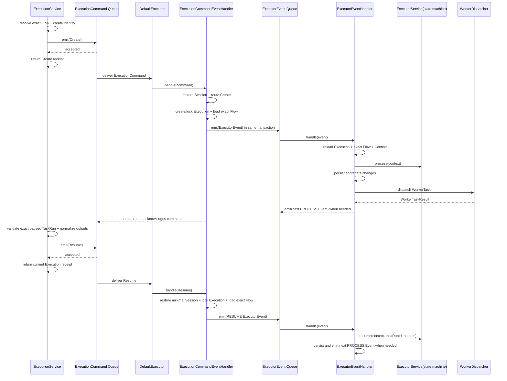

# ADR 0051：通过 Executor Command Queue 创建和推进 Execution

## 状态

Accepted

两阶段 pending Execution 启动条款由
[ADR 0068](0068-remove-two-phase-execution-start.md) 取代；Execution 现在只通过一次
`create` Command 完整受理。

本 ADR 中 `Create.dsl()` 的兼容描述由 ADR 0066 修订；Create 现在不再声明事务方法，
普通发布直接使用 Queue 自有事务。

本 ADR 的外部 Command 受理边界继续有效；内部运行提交循环和状态交接已由
[ADR 0059](0059-route-executor-state-handoffs-through-executor-event-queue.md) 修订为
`ExecutorEvent` Queue 与 `handlers.ExecutorEventHandler`。

本决策修订 ADR 0002、0012 和 0020 中由 `DefaultExecutor` 直接承担 Execution
运行提交边界的职责；状态机、精确 Flow Reversion、Worker 同步调用和持久化顺序保持
有效。

## 背景

原有 `ExecutionService.create` 在调用线程的 Command 事务内直接进入执行循环，直到
流程成功、失败或暂停才返回。宿主 Service 实际只需要可靠受理一次启动：确定
Execution id 与 Flow Reversion，把 `Create` 指令投递给 Executor 后即可返回；
Execution 的物化和推进应由独立消费者完成。

Flow 已有 PostgreSQL `DefaultDispatchQueue`。Executor 未来还会增加其他 Command，
因此启动消息不能由一个专用 Publisher、一个专用 Consumer 和一个 Core 内部运行
Command 串成三层透传；Command 类型、队列路由和实际处理应集中在 Executor Module。

## 备选方案

### 方案一：Service 内同步执行

调用方可直接得到终态，但 Task 时延和失败耦合到请求线程，无法用 Queue 做崩溃恢复。

### 方案二：Core Handler 保存 Execution 并投递专用 Start Event

可以原子保存与投递，但让 Core Handler 依赖 Executor 传输实现，并产生
Publisher -> Consumer -> Core Run Command -> DefaultExecutor 的透传链路。新增 Executor
Command 时还会继续复制同样的入口。

### 方案三：Service 投递统一 Executor Command，由 Executor Handler 物化和推进

`ExecutionService` 构造 Executor 拥有的 `Create`、`Resume` 或 `Cancel`，统一 Queue 保存 Command；
`DefaultExecutor` 只负责两条 Queue 生命周期和消息路由，
`ExecutionCommandEventHandler` 解释具体外部 Command，物化 Execution 并投递内部
`ExecutorEvent`。采用此方案。

## 决策

### Command 与受理边界

- `org.cses.flow.executor.commands.ExecutionCommand` 是 Executor Command Queue 的封闭
  多态契约；具体类型包括 `Create`、`Resume` 和 `Cancel`，Queue 名为
  `flow-executor-command`。
- `ExecutionService.create(session, flowId)` 在调用线程读取最新、未删除 Flow，生成稳定
  Execution id，并用精确 `flowId + flowReversion` 构造 `Create` 后同步 `emit`。
- Queue 使用自有事务提交普通 `Create`。Service 返回 `Create` Queue 受理回执；返回
  不表示 Execution 已持久化、开始运行或到达稳定状态。
- `Create` payload 保存 execution id、company id、actor id、精确 Flow 引用以及
  ADR 0052 定义的已规范化 Flow inputs；不保存 DSL。消费者通过宿主
  `SessionFactory` 恢复最小必要 Session/User。
- `ExecutionService.resume(session, executionId, taskRunId, outputs)` 先按租户读取当前
  Execution，按其精确 Flow Reversion 校验并规范化 Resume inputs，再投递 `Resume`。
  `Resume` payload 只保存 company id、actor id、execution id、taskRun id 和规范化
  outputs，不复制 Flow、Session 设备信息或 DSL。
- `ExecutionService` 不提供 pending 创建、继续启动或公开的历史版本启动入口；
  `CREATED` 只作为 Consumer 原子物化并交接首个 `ExecutorEvent` 时的内部初始状态。

### 路由与处理

- `DefaultExecutor` 是 eager 生命周期 Bean，同时订阅 `DispatchQueue<ExecutionCommand>`
  和 `DispatchQueue<ExecutorEvent>`，分别路由给
  `ExecutionCommandEventHandler` 和 `handlers.ExecutorEventHandler`，关闭时关闭两条
  订阅。它不访问 Repository、`ExecutorService`、`WorkerDispatcher` 或 DSLContext。
- `ExecutionCommandEventHandler` 是 Executor Command 的唯一外部处理入口。它恢复最小
  必要 Session，按 Command 具体类型分派，并为每条消息开启独立 Flow JOOQ 事务；它
  只物化/锁定 Execution、校验命令并投递内部 `ExecutorEvent`，不直接驱动状态机。
- 处理 `Create` 时，Handler 加载 Command 固定的 Flow Reversion；若 Execution 尚不
  存在，就使用 Command 中的稳定 id 创建；若已存在，就校验 Flow 引用一致并按租户锁定。
  终态或暂停态的重复 `Create` 是幂等空操作。
- 处理 `Resume` 时，Handler 锁定 execution id 对应的 Execution，加载其精确 Flow
  Reversion，复核目标 Pause TaskRun 和 outputs，然后调用既有 Resume 运行入口；重复或
  已失效的 Resume 是幂等空操作。Resume 运行入口内部先调用 `ExecutorService.resume`
  再由 `ExecutorEvent` Queue 交给 `ExecutorEventMessageHandler` 继续调度后续工作。
- 原 `ExecutionCommandPublisher`、`ExecutionCommandConsumer`、
  `ExecutionStartCommand` 与 Core `RunExecutionCommand/Handler` 删除；Command 不再跨
  Executor/Core 来回转换。

### 运行提交

- 原 `DefaultExecutor` 的状态机提交循环迁移到内部 `ExecutorEventMessageHandler`。它调用
  `ExecutorService`、保存 Execution、同步投递 WorkerTask、应用结果，并在需要时投递
  下一条 `ExecutorEvent`。
- 首次异步推进和异步 Resume 期间，确定性的 `RunnableTask` 运行时异常由
  `ExecutorEventMessageHandler` 转换为失败结果，使 Execution 落为 `FAILED` 后正常确认 Queue
  Command；同步 `cancel` 仍保留异常传播与事务回滚语义。
- `DefaultDispatchQueue` 只在 Handler 正常返回时删除消息；Handler 异常使领取事务回滚
  并重试。
- Execution 查询继续以父行共享锁固定聚合读取边界，避免异步提交期间拼出不一致快照。

## 调用顺序

## 不变量

- `ECMD-001`：Service 构造的 `Create` 必须携带稳定 execution id 和精确 Flow
  Reversion；`Resume` 必须携带稳定 execution id 和精确 taskRun id；Handler 不在消费时
  重新选择 latest。
- `ECMD-002`：`DefaultExecutor` 只做 Queue 订阅和 handler 路由，不拥有领域推进、
  Repository 或 Worker 协调逻辑。
- `ECMD-003`：所有 Executor Command 只由 `ExecutionCommandEventHandler` 解释；不能为每个
  Command 复制 Publisher/Consumer/Core Run Command 链路。
- `ECMD-004`：启动和 Resume 返回只代表 Queue 受理；Execution 的持久化与运行是异步
  结果。
- `ECMD-005`：公开启动只能投递一次完整 `Create`；不能持久化与启动 Command/Event
  脱离的 pending Execution。
- `ECMD-006`：重复 `Create` 不能改变 Execution 的 Flow 引用，也不能重复推进终态或
  暂停态 Execution。
- `ECMD-007`：Queue payload 不保存 DSLContext；Session 恢复必须保留 tenant 与 actor
  身份；Resume 不携带 Create 的设备和请求元数据快照。
- `ECMD-008`：Queue Consumer 异常保留消息重试；确定性 Task 业务失败形成可查询的
  Execution/TaskRun 失败事实。

## 后果

- 调用方必须使用返回的 execution id 查询 Execution；紧接 `create` 的第一次查询允许尚未
  找到持久化行。
- Executor Command Module 形成一个小 Interface：Service 只学习具体 Command 和 Queue
  受理语义；路由、身份恢复、事务、幂等和运行推进集中在实现内部。
- 交付为至少一次；Task 在产生数据库外部副作用时仍须使用自身业务标识保证幂等。
- Queue Handler 的运行事务与领取事务会同时占用数据库连接；连接池必须为 Subscription
  和普通命令保留余量。
- 当前异步类型包括 `Create`、`Resume` 和 `Cancel`；后续增加其他异步 Command 时继续扩展封闭
  契约和同一个 Handler，不扩展 `DefaultExecutor` 的领域职责。
