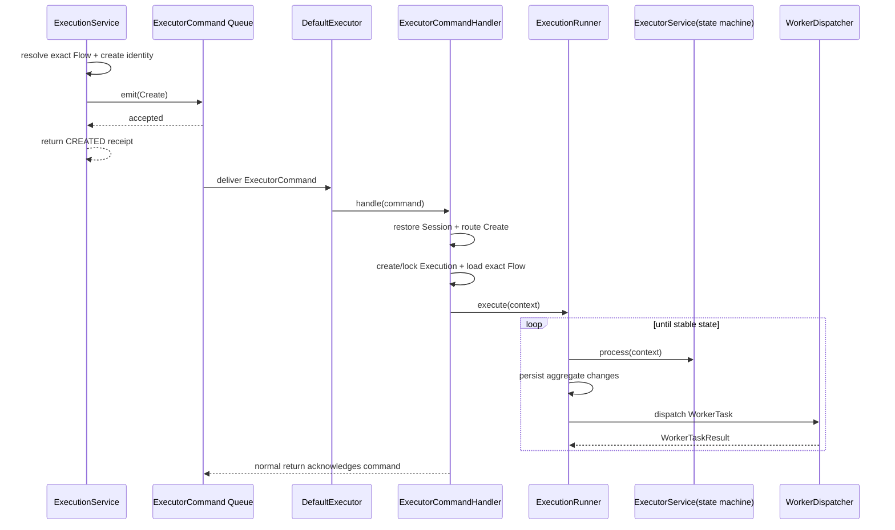

# ADR 0051：通过 Executor Command Queue 创建和启动 Execution

## 状态

Accepted

本决策修订 ADR 0002、0012 和 0020 中由 `DefaultExecutor` 直接承担 Execution
运行提交边界的职责；状态机、精确 Flow Reversion、Worker 同步调用和持久化顺序保持
有效。

## 背景

原有 `ExecutionService.create` 在调用线程的 Command 事务内直接进入执行循环，直到
流程成功、失败或暂停才返回。宿主 Service 实际只需要可靠受理一次启动：确定
Execution id 与 Flow Reversion，把 `Create` 指令投递给 Executor 后即可返回；
Execution 的物化和推进应由独立消费者完成。

Flow 已有 PostgreSQL `DefaultDispatchQueue`。Executor 未来还会增加其他 Command，
因此启动消息不能由一个专用 Publisher、一个专用 Consumer 和一个 Core 内部运行
Command 串成三层透传；Command 类型、队列路由和实际处理应集中在 Executor Module。

## 备选方案

### 方案一：Service 内同步执行

调用方可直接得到终态，但 Task 时延和失败耦合到请求线程，无法用 Queue 做崩溃恢复。

### 方案二：Core Handler 保存 Execution 并投递专用 Start Event

可以原子保存与投递，但让 Core Handler 依赖 Executor 传输实现，并产生
Publisher -> Consumer -> Core Run Command -> DefaultExecutor 的透传链路。新增 Executor
Command 时还会继续复制同样的入口。

### 方案三：Service 投递统一 Executor Command，由 Executor Handler 物化和推进

`ExecutionService` 构造 Executor 拥有的 `Create`，统一 Queue 保存 Command；
`DefaultExecutor` 只负责 Queue 生命周期和消息路由，`ExecutorCommandHandler` 解释具体
类型并调用内部运行提交逻辑。采用此方案。

## 决策

### Command 与受理边界

- `org.cses.flow.executor.commands.ExecutorCommand` 是 Executor Command Queue 的封闭
  多态契约；当前首个具体类型是 `Create`，Queue 名为 `flow-executor-command`。
- `ExecutionService.create(session, flowId)` 在调用线程读取最新、未删除 Flow，生成稳定
  Execution id，并用精确 `flowId + flowReversion` 构造 `Create` 后同步 `emit`。
- 普通 `Create.dsl()` 返回 `null`，Queue 使用自有事务提交。Service 返回的
  `CREATED` Execution 是受理回执和身份快照；返回不表示 Execution 已持久化、开始运行
  或到达稳定状态。
- `Create` payload 保存 execution id、company id、精确 Flow 引用、actor id/name、
  请求 Session 元数据，以及 ADR 0052 定义的已规范化 Flow inputs；不保存 DSL。
  消费者通过宿主 `SessionFactory` 创建具体
  Session/User 类型，并优先重新加载用户资料。
- `createPending` 仍同步物化但不启动 Execution。`continueExecution` 锁定一个
  `CREATED` Execution、按精确 Reversion 确认 Flow inputs 后，由 Service 在同一
  `CommandExecutor` 事务完成 `Create`
  投递；这条可信外部业务链路继续保持 Execution 行与 Queue 行原子提交。

### 路由与处理

- `DefaultExecutor` 是 eager 生命周期 Bean，只订阅 `DispatchQueue<ExecutorCommand>`，
  将消息路由给 `ExecutorCommandHandler`，关闭时关闭订阅。它不访问 Repository、
  `ExecutorService`、`WorkerDispatcher` 或 DSLContext。
- `ExecutorCommandHandler` 是 Executor Command 的唯一处理入口。它恢复 Session，按
  Command 具体类型分派，并为每条消息开启独立 Flow JOOQ 事务。
- 处理 `Create` 时，Handler 加载 Command 固定的 Flow Reversion；若 Execution 尚不
  存在，就使用 Command 中的稳定 id 创建；若已存在，就校验 Flow 引用一致并按租户锁定。
  终态或暂停态的重复 `Create` 是幂等空操作。
- 原 `ExecutionCommandPublisher`、`ExecutionCommandConsumer`、
  `ExecutionStartCommand` 与 Core `RunExecutionCommand/Handler` 删除；Command 不再跨
  Executor/Core 来回转换。

### 运行提交

- 原 `DefaultExecutor` 的状态机提交循环迁移到内部 `ExecutionRunner`。它调用
  `ExecutorService`、保存 Execution、同步投递 WorkerTask 并应用结果。
- 首次异步推进期间，确定性的 `RunnableTask` 运行时异常由 `ExecutionRunner.execute`
  转换为失败结果，使 Execution 落为 `FAILED` 后正常确认 Queue Command；同步
  `resume`/`cancel` 仍保留异常传播与事务回滚语义。
- `DefaultDispatchQueue` 只在 Handler 正常返回时删除消息；Handler 异常使领取事务回滚
  并重试。
- Execution 查询继续以父行共享锁固定聚合读取边界，避免异步提交期间拼出不一致快照。

## 调用顺序

## 不变量

- `ECMD-001`：Service 构造的 `Create` 必须携带稳定 execution id 和精确 Flow
  Reversion；Handler 不在消费时重新选择 latest。
- `ECMD-002`：`DefaultExecutor` 只做 Queue 订阅和 handler 路由，不拥有领域推进、
  Repository 或 Worker 协调逻辑。
- `ECMD-003`：所有 Executor Command 只由 `ExecutorCommandHandler` 解释；不能为每个
  Command 复制 Publisher/Consumer/Core Run Command 链路。
- `ECMD-004`：普通启动返回只代表 Queue 受理；Execution 的持久化与运行是异步结果。
- `ECMD-005`：可信 pending continuation 的 Execution 行和 `Create` Queue 行必须在同一
 事务提交或回滚。
- `ECMD-006`：重复 `Create` 不能改变 Execution 的 Flow 引用，也不能重复推进终态或
  暂停态 Execution。
- `ECMD-007`：Queue payload 不保存 DSLContext；Session 恢复必须保留 tenant 与 actor
  身份。
- `ECMD-008`：Queue Consumer 异常保留消息重试；确定性 Task 业务失败形成可查询的
  Execution/TaskRun 失败事实。

## 后果

- 调用方必须使用返回的 execution id 查询 Execution；紧接 `create` 的第一次查询允许尚未
  找到持久化行。
- Executor Command Module 形成一个小 Interface：Service 只学习具体 Command 和 Queue
  受理语义；路由、身份恢复、事务、幂等和运行推进集中在实现内部。
- 交付为至少一次；Task 在产生数据库外部副作用时仍须使用自身业务标识保证幂等。
- Queue Handler 的运行事务与领取事务会同时占用数据库连接；连接池必须为 Subscription
  和普通命令保留余量。
- 当前只有 `Create`；增加 Resume、Kill 等异步 Command 时扩展封闭契约和同一个 Handler，
  不扩展 `DefaultExecutor` 的领域职责。
