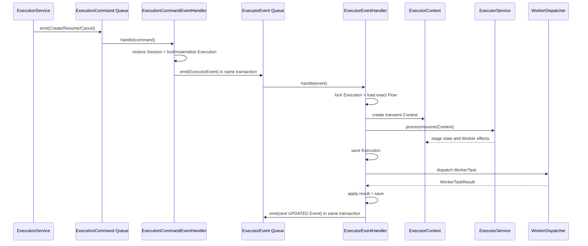

# ADR 0059：通过 ExecutorEvent Queue 交接 Executor 内部状态

## 状态

Accepted（2026-08-14）

本决策修订 ADR 0020、0051 以及相关运行文档中由 `ExecutionRunner` 持有内部提交
循环的描述。`ExecutorContext` 的职责继续有效，但它只存在于一个内部 Event 处理
周期内，不作为 Queue 消息或跨周期运行对象。

## 背景

Executor 同时存在两种不同边界：外部调用方提交的 `Create`/`Resume`/`Cancel` Command，以及
Executor 自己在推进 Execution 时产生的下一轮状态交接。若两者都直接进入状态机，
命令校验、状态推进、事务提交和下一轮调度会混在同一个入口中；若把
`ExecutorContext` 直接放入 Queue，又会把可变的本轮工作对象误当成可恢复消息。

项目已有不可修改的泛型 Handler 契约：

```java
Optional<ExecutorContext> handle(T event);
```

需要在不改变该契约的前提下，同时明确外部命令入口和内部状态交接入口。

## 决策

### 两类 Handler

- `ExecutionCommandEventHandler` 实现
  `ExecutorEventHandler<ExecutionCommand>`，是 Executor Module 外部
  `ExecutionCommand` 进入运行链路的唯一入口。
- 它负责恢复最小 Session、按精确 Flow Reversion 校验 Command、规范化输入、创建或
  锁定并更新 Execution，并在同一事务中投递 `ExecutorEvent`；它不创建
  `ExecutorContext` 或调用 `ExecutorService` 推进调度周期。
- `handlers.ExecutorEventHandler` 实现
  `ExecutorEventHandler<ExecutorEvent>`，是 Executor 内部状态循环的唯一处理器。
  它从 Queue 领取 Event，锁定并恢复 Execution 与精确 Flow，创建
  `ExecutorContext`，推进一个周期，保存变化并处理 Worker 效果。
- 泛型 Handler Interface、`handle` 签名和 `Optional<ExecutorContext>` 返回契约不修改。

### `ExecutorEvent` 与 Queue

- `ExecutorEvent` 是可持久化的内部交接消息，Queue 名为
  `flow-executor-event`；其生命周期类型为 `CREATED`、`UPDATED` 和
  `TERMINATED`。外部 `CREATE`、`RESUME`、`CANCEL` Command 在进入内部
  Executor 后分别映射为创建、更新和终止生命周期事件。
- Event 只保存重新建立运行边界所需的 Execution 租户身份和生命周期类型：
  `executionId`、`companyId` 和 `eventType`。处理器先由 Execution 的
  `flowKey + flowVersion` 反查精确 Flow reversion。Resume 的 TaskRun、outputs 和
  Cancel 的终止意图先在 Command Handler 事务内作用于并持久化 Execution，
  Event 本身不再复制这些命令数据。处理器根据已加载的 Flow creator 建立最小
  Session，不持久化 Session、设备、网络或客户端版本快照。它不保存 Flow、
  Execution、`ExecutorContext`、Repository、`DSLContext` 或 Worker 对象。
- 一个 Event 的处理完成后，如果 Execution 仍可推进，内部 Handler 在当前事务中
  投递 `event.nextUpdate()`；下一轮必须重新从 Repository 锁定读取聚合并重新创建
  Context。
- `DefaultExecutor` 同时订阅 `ExecutionCommand` Queue 和 `ExecutorEvent` Queue，
  只负责订阅生命周期和把消息交给对应 Handler。

### `ExecutorContext` 与持久化

- `ExecutorContext` 的固定输入是精确 Flow 和 Execution；`nexts`、WorkerTask、
  编排完成项、状态观察和变更标记都是本轮临时效果。
- 一个内部 Event 的事务边界内，处理器按“加载聚合 -> 创建 Context -> 应用 Event ->
  推进 ExecutorService -> 保存 Execution -> 同步调用 Worker -> 应用结果 -> 投递
  后续 Event”的顺序工作。
- Worker 调用前必须保存包含目标 TaskRun 的 Execution；Worker 结果应用后再次保存，
  后续周期与本轮保存及 Queue 投递使用同一个事务。
- Queue Consumer 正常返回后确认当前消息；异常回滚当前领取事务并保留消息重试。
  异步启动、Resume 和 Cancel 中的确定性 RunnableTask 异常转换为 FAILED 结果；命令
  受理异常仍由 Command Queue 的消费事务回滚并重试。

### Flow inputs 的权威来源

- Flow 的 `inputs` 仍是定义级 Input 目录。
- 真实启动时的规范化值持久化在 `Execution.inputs`，这是 Route、ExecutorContext
  恢复和 Worker `$flow.inputs` 的唯一运行时来源。
- TaskRun.inputs 只保存当前 TaskRun 的业务输入，不保存 `flowInputs` 快照。
  Worker 使用 `$flow.inputs` 表示 Execution 级 Flow inputs，使用
  `$flow.taskInputs` 表示当前 TaskRun inputs。

## 调用顺序



## 不变量

- `EEH-001`：外部 `ExecutionCommand` 只能由 `ExecutionCommandEventHandler` 解释；
  它不能直接调用 Executor 状态机。
- `EEH-002`：Executor 内部的状态周期只能由 `ExecutorEvent` Queue 交接；
  `ExecutorContext` 不进入消息 payload，也不跨 Queue 保存。
- `EEH-003`：每个内部 Event 都按租户锁定同一个 Execution，并按 Execution 保存的
  `flowKey + flowVersion` 加载精确 Flow。
- `EEH-004`：后续周期 Event 必须在本轮 Execution 变更和 Worker 结果提交的同一事务
  中投递，避免已保存状态没有后续交接或交接没有对应状态。
- `EEH-005`：`Execution.inputs` 是运行时 Flow inputs 的唯一权威来源；TaskRun 不得
  通过保留键复制它。
- `EEH-006`：Queue 至少一次交付要求 Command Handler 和 Event Handler 都具备幂等
  重复处理语义。

## 后果

- `ExecutionRunner` 删除，运行提交边界由 `ExecutorEventMessageHandler` 的单 Event 事务
  承担，状态机本身仍由 `ExecutorService` 实现。
- 内部状态交接具备持久消息、崩溃恢复和清晰的重试边界；代价是一次流程推进可能
  产生多个 Event 和多个事务提交。
- `ExecutorContext` 更容易测试和重建，但不能再被调用方当作跨周期游标使用。
- Cancel 也经过同一 `ExecutionCommand` Queue 和
  `ExecutionCommandEventHandler`，不再保留 Core 同步处理器或旁路入口；Service 返回
  Queue 受理时的 Execution 快照，终态由内部 `ExecutorEvent` 周期异步提交。
