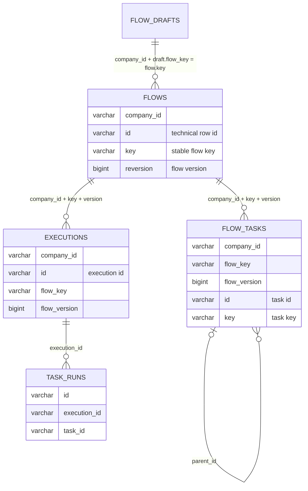

# ADR 0063：以 company_id、flow_key 和 flow_version 绑定 Flow 快照

## 状态

Accepted

本 ADR 修订 [ADR 0062](0062-use-company-flow-key-and-version-as-business-identity.md)
中“Execution 可以通过技术 `Flow.id + version` 恢复”的内部绑定条款；ADR 0062
关于 Flow 业务身份、Draft key 和版本发布规则的其他内容继续有效。更早 ADR 中的
`flowId + flowReversion` 表述保留为历史记录，不再作为当前持久化绑定模型。

本 ADR 中“不建立 `FlowId` 包装值”的 Repository 表达已由 ADR 0070 修订：`FlowId`
现在仅作为 Flow Repository 的业务选择器，不能作为 Flow 实体身份或跨对象引用。

## 背景

Flow 的 `id` 在每次发布时重新生成，只能标识 `flows` 表中的一条技术行；稳定的
Flow 身份是 `(company_id, flow_key)`，确定一个不可变定义则还需要
`flow_version`。Task 没有独立版本，Task 定义是 Flow 版本的一部分；同一个稳定
Task key 在多个 Flow 版本中可以继续复用同一个 Task id。因此，Task 快照和
Execution 如果保存技术 `flow_id`，就会把 Flow 业务版本概念割裂成两套绑定规则。

## 决策

- 当前唯一的 Flow 版本引用仍为 `(company_id, flow_key, flow_version)`。Task 快照归属、
  Execution 归属和运行时恢复都由这三个真实字段定义；Repository 查询可使用 ADR 0070
  规定的 `FlowId` 选择器。
- `flows.id` 是 Flow 自身稳定的字符串实体 ID，进入 Flow Domain 和 HTTP View，但
  不得进入 Task 或 Execution 的 Flow 版本绑定，也不能替代 key/version 查询。
- `flow_tasks` 使用 `flow_key`、`flow_version` 替代 `flow_id`、`flow_reversion`，
  主键为 `(company_id, flow_key, flow_version, id)`，Task key 唯一约束为
  `(company_id, flow_key, flow_version, key)`。
- `executions` 保存 `flow_key`、`flow_version`。Execution 的持久化、恢复、暂停
  Resume、Executor 上下文校验以及按版本查询均通过这两个字段和 `company_id` 完成。
- Task id 的稳定复用规则不变：同一个 Flow key 的新版本可以复用同一个 Task id，
  但它只在所属的 `(company_id, flow_key, flow_version)` 快照范围内解释。
- `task_runs` 继续只保存 `execution_id`、`task_id` 和运行事实；TaskRun 通过所属
  Execution 的 Flow 版本引用解析对应的 Task 定义，不直接保存技术 Flow id。
- Core 的 Flow 查询和 Handler 只暴露按 key/version 的精确查询；Repository 中若
  仍需按 `flows.id + reversion` 定位待更新或待删除的物理行，必须保持在 PostgreSQL
  Adapter 内部，不得成为领域绑定或公共查询 API。

逻辑关系如下；数据库仍不创建外键，约束由复合主键/唯一键、租户过滤和同事务写入
共同保证：

## 理由

统一使用业务版本引用后，任何需要读取 Flow 定义的路径都能直接回答“哪个租户的
哪个 Flow key 的哪个版本”，不会因为技术行 id 在版本间变化而产生隐式转换。Task
快照的联合主键也明确表达了 Task id 的作用域，Execution 的历史恢复与普通 Flow
查询使用完全相同的身份模型。

## 后果

- Schema 基线、JOOQ 生成代码、Flow/Execution Entry 和 Executor 链路需要同时变更。
- 旧列名 `flow_id`、`flow_reversion` 不再属于当前开发基线；开发数据库需要按新的
  完整建表基线重建，当前项目不提供生产数据迁移脚本。
- Execution 的领域访问器和 HTTP 视图使用 `flowKey`、`flowVersion`，避免把 key
  误称为技术 id、把 version 误称为 reversion。
- 未来如果要完全从 `flows` 表移除技术行 id，仍需另行决策；本 ADR 只改变绑定语义，
  不改变 Flow 物理行的内部更新定位。
