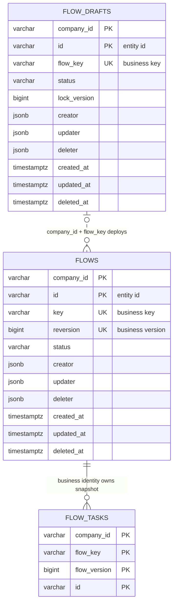

# ADR 0067：领域对象继承字符串实体身份与审计状态

## 状态

Accepted

本决策取代 ADR 0041 的审计能力组合方案，并修订 ADR 0018、ADR 0022、ADR 0062
和 ADR 0064 中把领域实体 ID、业务选择器及 `deleted` 布尔事实混合表达的条款。

本 ADR 关于不建立 `FlowId` 包装值的局部条款已由 ADR 0070 修订：`FlowId` 仅作为
Flow Repository 的业务查询选择器，不是实体身份。

## 背景

Flow 与 FlowDraft 都需要同时保护租户内业务身份、创建审计、最后更新审计、通用
记录状态和删除审计。ADR 0041 选择由聚合分别保存字段并组合 `Auditable`、
`Deletable` Interface，实际仍让相同的不变量和状态变化散落在多个聚合中。

同时，Flow 已确认由 `companyId + key + version` 精确选择一个业务版本，FlowDraft
由 `companyId + flowKey` 唯一选择。历史方案曾担心将这些复合字段包装为 `FlowId` 会
与实体身份混淆；当前通过 ADR 0070 将其限定为 Repository 选择器。Execution、Task
和 TaskRun 的 `*Id` 包装只代理一个字符串，也没有形成独立业务不变量。

## 备选方案

### 方案一：继续组合能力 Interface

聚合可以选择能力，但字段校验、可信操作者转换、时间单调性、状态变化和删除审计
仍需分别实现，不能保证同一规则只在一个 Module 中维护。

### 方案二：建立字符串实体身份与审计继承骨架

`BaseDomain` 统一字符串实体 ID、租户和创建审计；只有可审计对象继续继承 `Audited`，
由它统一最后更新、记录状态和删除审计。具体聚合继续拥有自己的业务字段、行为和
并发规则。

## 决策

采用方案二。

### 实体 ID 与业务选择器

- `BaseDomain` 的 `id()` 返回稳定非空的 `String` 实体 ID，并同时保存 `companyId`。
- Flow、FlowDraft、Execution、Task 与 TaskRun 都只通过 `id()` 暴露自身 ID；删除
  `Identity`、`ExecutionId`、`TaskId`、`TaskRunId`、`recordId()` 和 `identifier()` 等
  平行实体身份表达。`FlowId` 仅按 ADR 0070 作为 Repository 选择器存在。
- Flow 的 `key + version`、FlowDraft 的 `flowKey` 以及租户 `companyId` 继续作为
  真实业务字段；Repository 和 Execution 按这些字段精确选择 Flow 版本，Flow
  Repository 的查询参数可由 `FlowId` 统一承载，但不改变实体身份模型。
- Flow、FlowDraft 和普通新建实体在领域创建入口使用 `StringUtil.newId()` 生成 ID；
  持久化 Adapter 只原样保存和恢复。Execution 可沿用由可靠 Command 预先分配的稳定
  字符串 ID，以保证 Queue 重投时幂等物化。
- 跨对象引用使用目标语义命名的字符串字段，例如 `executionId`、`taskId`、
  `taskRunId` 与 `parentId`。

### 创建审计

`BaseDomain` 统一保存不可变的字符串实体 ID、`companyId`、`creator` 和 `createdAt`。
租户聚合只保留两条构造路径：普通创建接收可信 Session，由 `SessionUtil` 取得租户
和 ActorRef，并由 `TimeUtil` 记录创建时间；持久化重建显式接收全部详细事实并原样
沿用。不得再提供 `companyId + ActorRef + createdAt` 形式的普通创建兼容重载。
ActorRef 本身不依赖 Session。

Task、TaskRun 等聚合内对象不单独接收 Session；其身份和生命周期继续由所属聚合
管理。值对象也不为满足租户聚合构造形式而引入 Session。

### Audit Status 与更新审计

`Audited` 在 `BaseDomain` 上统一保存：

- `RecordState status`；
- `ActorRef updater` 与 `long updatedAt`；
- 可空的 `ActorRef deleter` 与 `Long deletedAt`。

新对象固定从 `RecordState.Open` 开始，创建人同时是初始更新人，创建时间同时是
初始更新时间。Audit Status 接受 `RecordState` 的全部值；当前只为 Open 初始化和
Delete 提供专门领域行为，其他状态通过要求可信操作者和服务器时间的 `withState`
兼容入口改变。

`withState(Delete, ...)` 必须执行完整删除行为，不能只改变状态。状态没有变化时
不产生新的更新审计。任何成功的状态变化都同步更新 updater 和 updatedAt。

### 删除不变量

Delete 是不可逆终态，必须同时满足：

1. `status == Delete` 当且仅当 `deleter` 与 `deletedAt` 同时存在；
2. 删除操作者同时是最后更新操作者；
3. 删除时间同时是最后更新时间；
4. 删除后不能再次更新状态或业务内容；
5. 时间不能早于已有 updatedAt；
6. 失败操作不能留下部分状态、审计或并发版本变化。

FlowDraft 在每次成功修改、状态变化或删除后只推进一次 `lockVersion`。Flow 没有
乐观锁版本，已部署定义除审计状态外保持不可变。

### PostgreSQL 映射

`flow_drafts` 与 `flows` 使用非空文本 `status` 保存 RecordState 名称并移除冗余
`deleted` 布尔列。数据库 CHECK 保证 Delete 与删除审计同时存在，其他状态不得携带
删除审计。逻辑关系继续由 Repository 和同一事务维护，不建立 PostgreSQL 外键。

## 理由

- Audit Module 的 Interface 只暴露身份、查询与完整状态行为，操作者转换、时间
  单调性和删除原子性隐藏在同一实现中，调用方不再重复拼装审计字段。
- 只有真实需要审计状态的对象继承 `Audited`，并发仍由具体聚合选择，不把
  lockVersion 强加给所有对象。
- 单一 `String id()` Interface 让领域错误、跨对象引用和持久化恢复使用同一身份；
  业务 key 与复合选择器仍保留自身语义，不与实体 ID 混淆。
- 单一 status 可以保留宿主全部 RecordState，而当前 Flow 仍只把 Delete 解释为
  不可用终态。

## 后果

- `Auditable` 与 `Deletable` 不再是 Flow、FlowDraft 的领域 Interface，并从 Core
  删除；`Identified` 统一使用字符串 `id()`。
- Flow 的 Entry 与 Repository 原样保存 `flow.id()`，Flow Domain 和 Controller View
  均可读取它；Execution 的 Flow 绑定仍只使用 `companyId + flowKey + flowVersion`。
- Queue payload 的 `executionId` 继续序列化为 JSON 字符串，不保留 ID 包装兼容层。
- PostgreSQL 开发期基线、JOOQ 生成代码和真实 PostgreSQL 集成测试必须同步更新。
- ADR 0041 标记为被本决策取代；ADR 0018、ADR 0022 中保留独立 `deleted` 布尔事实
  的条款不再有效。
