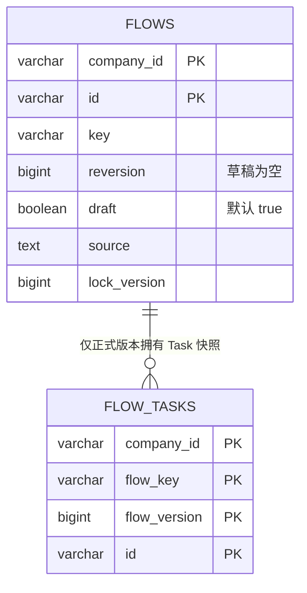

# ADR 0069：统一草稿与已部署 Flow 定义

## 状态

Accepted（2026-08-24）

本决策取代 ADR 0008、0014、0022 和 0064 中将 `FlowDraft` 建模为独立聚合、
独立 Repository 与独立数据表的条款，并修订 ADR 0013、0018、0062 和 0063 中
关于 Flow 创建、恢复、业务身份和持久化的相关描述。

## 背景

原模型把可编辑 YAML 放在 `FlowDraft`，部署时再解析为另一个 `Flow` 聚合。
保存草稿、读取草稿、部署和删除因此需要两套领域对象、Repository、Entry、表结构
和映射链路。调用方还必须理解 YAML 来源对象与已部署定义对象之间的转换关系。

草稿的业务职责实际上只有两项：原样保存并回显 YAML，以及抽取 Flow 的公共字段。
它不需要独立生命周期、`recordId` 或 Task 快照。已部署版本也需要保留产生自己的
原始 YAML，因此来源并不是只属于草稿的概念。

## 备选方案

### 方案一：继续维护独立 FlowDraft 聚合

可以让草稿表只保存 YAML，但会继续保留两套近似身份、审计、锁和删除链路，部署仍是
跨聚合转换。

### 方案二：在 Flow 外增加通用 Source 实体

可以复用 YAML 存储，但会引入一个没有独立业务生命周期的实体，并使查询一个 Flow
仍需额外关联。

### 方案三：使用一个携带 source 的 Flow 聚合类型

草稿和正式版本使用同一具体领域类型、Repository 与表，由 `draft` 布尔值表达定义
状态。采用此方案。

## 决策

### 领域结构

- `AbstractFlow` 保存 Flow 的公共定义字段和草稿状态约束；`Flow` 保存 Task、
  原始来源和并发版本，是草稿和已部署版本唯一可创建、可恢复的具体聚合类型。
- `Flow.source` 保存该对象对应的原始 YAML。它在草稿和已部署版本中都
  必须存在，不能通过重新序列化领域对象替代。
- 不定义 `FlowDraft`、`FlowDefinitionState` 或 `recordId`。对象只使用继承而来的
  `id`，并用 `draft` 布尔属性表达状态；该属性默认值为 `true`。
- 领域属性字段不使用 `final`。集合和 Map 仍在构造边界复制为不可变值，避免调用方
  绕过领域方法修改内部定义。

### 状态不变量

| 状态 | `draft` | `version` | `source` | 公共字段 | Task |
| --- | --- | --- | --- | --- | --- |
| 草稿 | `true` | `null` | 必填原始 YAML | 从 YAML 抽取 | 创建时物化；持久化以 source 为准 |
| 已部署 | `false` | 正整数 | 必填部署所用 YAML | 完整物化 | 完整物化 |

同一租户和 Flow key 最多保存一个草稿；已部署版本继续按
`companyId + key + version` 唯一。部署不会覆盖可继续编辑的草稿，而是从草稿的
`source` 创建一个同为 `Flow` 的正式版本快照。实例行需要分开以保留版本
历史，但领域类型、行为入口和存储模型不再分开。

### 创建与恢复

- 创建是正向领域入口。保存草稿和部署都先通过 Jackson 直接把 YAML 绑定为
  `Flow`；草稿会得到可回显和编辑所需的公共字段，能绑定的 Task 同时物化，无法
  绑定的 Task 不阻断草稿保存。完整 Task 业务校验只在部署时执行。`source` 始终
  保留原始 YAML。
- 恢复是持久化入口。Repository 从 `flows` 及正式版本对应的 `flow_tasks` 读取事实，
  通过 `Flow.rehydrate` 恢复对象，不重新解析 `source`，也不重新生成身份、
  审计时间或锁版本。
- `Flow` 通过 `create`、`deploy` 和 `rehydrate` 支持传统的完整领域入口，并通过
  无参绑定后的 `initialize` 补充 Session、状态、版本和 source；构造方法不公开，
  `AbstractFlow` 不提供创建入口，避免调用方创建不携带 YAML 来源的 Flow。

### 持久化

- Core 只定义一个 `FlowRepository`，PostgreSQL Adapter 只实现一个
  `FlowPostgresRepository` 和一个 `FlowEntry`。
- 草稿和正式版本统一存储在 `flows`。`draft=true` 时 `reversion IS NULL`；
  `draft=false` 时 `reversion > 0`。
- 删除 `flow_drafts` 表及其 JOOQ 生成对象。`flows` 使用局部唯一索引分别保证
  草稿 key 唯一和正式版本 key + reversion 唯一。
- `flow_tasks` 只保存 `draft=false` 的 Task 快照；草稿恢复依赖 `source` 和公共字段，
  不通过反向序列化重新生成 Task 身份。

## 理由

该模型让 YAML 来源成为 Flow 自己的定义事实，而不是另一个聚合的中转数据。保存、
部署、查询、删除和恢复共享同一套领域语言与持久化边界；草稿阶段又不会为了回显
YAML 而提前承担完整 Task 物化和部署校验。`draft` 与可空版本的组合足以表达当前两种
状态，无需增加枚举或并行状态对象。

## 后果

- 删除 `FlowDraft`、`FlowDraftRepository`、`FlowDraftEntry`、对应 PostgreSQL Adapter
  与 `flow_drafts` 基线表，是不兼容的开发期结构变更；现有开发数据库必须重建。
- 保存草稿会拒绝语法错误、未知顶层字段和无效公共字段，但 Task Plugin、依赖和路由
  的完整校验延迟到部署。
- 已部署版本可以直接回显当次部署使用的原始 YAML，不需要从 Task 快照反向序列化。
- 草稿修改继续使用 `lock_version` 做乐观锁；正式版本也保留统一的锁与审计结构。
- Flow 保存入口统一为一个 `PublishFlowCommand`/`PublishFlowHandler`，由
  `draft=true/false` 选择保存草稿或正式版本，不再为部署维护平行 Command 链路。
- Flow 删除入口统一为一个 `DeleteFlowCommand`/`DeleteFlowHandler`，由
  `draft=true/false` 选择只删除草稿或只删除最新正式版本；两种状态互不连带删除。
