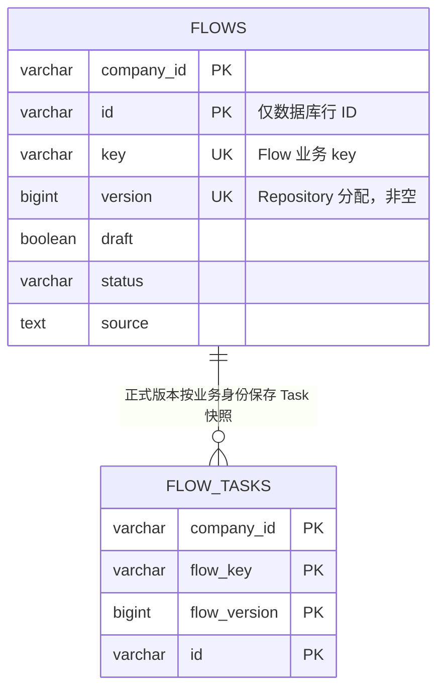

# ADR 0083：由 Flow Repository 分配内部版本并追加保存

## 状态

Accepted（2026-09-04）

本决策修订 ADR 0062、0064、0069、0070 和 0073 中关于草稿唯一性、Flow 版本
来源、保存更新以及技术 ID 稳定性的条款。

## 背景

Flow 的版本已经成为所有持久化状态的必要事实，草稿、正式定义和删除状态都不能再
使用空版本。版本属于 Flow 内部持久化协议，不能由 YAML、调用方或领域创建入口指定。
同时，`flows.id` 只用于定位一条数据库记录，业务上的精确 Flow 仍由
`company_id + key + version` 确定。

原保存逻辑按 `company_id + id` 更新已有行，仅在新建正式定义时插入。这会让草稿
没有版本，也会覆盖上一次保存的记录，无法保留同一 Flow key 的完整保存顺序。

## 备选方案

### 方案一：继续由 Flow Domain 计算正式版本

草稿仍需另一套版本规则，而且 Domain 必须读取持久化历史才能保证所有保存共用同一
序列，因此不采用。

### 方案二：使用数据库全局序列

实现简单，但版本不再是租户和 Flow key 范围内从一开始递增的内部编号，因此不采用。

### 方案三：Repository 查询当前最大版本后追加一行

Repository 已拥有事务 `DSLContext` 和数据库映射职责，可以在同一保存链路中查询、
分配版本、构造 Entry 并插入记录。采用此方案。

## 决策

### 保存协议

`FlowRepository.save` 每次只追加，不更新已有 `flows` 行，并按以下顺序执行：

1. 按 `company_id + key` 查询全部 `flows.version`，不区分草稿、正式定义、Audit
   Status 或删除状态，按版本倒序读取最大值；
2. 没有历史行时分配版本 `1`，否则分配最大版本加一；
3. 使用 `StringUtil.newId()` 生成本次数据库行 ID，以 Repository 分配的版本和 Flow
   提供的定义、状态、审计事实构造 `FlowEntry`；
4. 插入新的 `flows` 记录；正式定义同时以相同业务版本追加 `flow_tasks` 快照；
5. 返回带本次行 ID 和版本的脱离持久化对象。

调用方传入对象是否已有 ID 或版本不影响新行的 ID 和版本。Repository 不生成或修改
Flow 的业务定义、Audit Status、操作者与时间。

### 来源字段所有权

- `companyId`、Audit Status 和审计信息由 Flow Domain 根据 Session 与领域行为维护；
  `draft` 由 Command 选择；持久化行 ID 和版本由 Repository 分配。这些字段都不由
  Flow YAML 决定。
- 草稿仍原样保存用户提交的 source。为允许草稿回显尚未清理的系统字段，Handler
  在领域绑定前从通用 YAML Map 中移除这些字段；它们只留在原始 source，不进入暂态
  Flow，也不会覆盖领域或 Repository 生成的事实。
- 正式定义继续使用严格绑定。无论 YAML 是否出现可绑定的 `companyId`、状态、版本或
  草稿标记，领域初始化和 Repository 保存都不会使用这些值维护对应系统事实。

### 身份与约束

- `flows` 主键继续使用 `(company_id, id)`，只负责数据库行身份。
- 所有 Flow 状态的业务唯一约束统一为
  `UNIQUE (company_id, key, version)`；不再保留“一个 key 只有一条草稿”的局部唯一
  索引。
- `version` 为非空正向序列事实。草稿和正式定义共用同一个版本序列，所以正式版本号
  可以因中间的草稿保存而不连续。
- 删除通过追加带 `Delete` Audit Status 的新版本保存。后续分配必须包含该删除版本，
  已经使用过的版本不会复用。
- 草稿查询只返回每个 key 的最新草稿；当最新草稿版本已删除时不能回退到更旧的活动
  草稿。之后使用相同 key 保存新草稿会继续追加更高版本。

### 并发边界

`UNIQUE (company_id, key, version)` 是并发竞争的最终完整性约束。当前没有已确认的
自动重试、行锁或事务隔离升级需求；并发事务分配到相同版本时，其中一个保存以稳定
的持久化冲突失败，不会覆盖既有版本。

## 理由

版本的计算依赖数据库中同一租户、同一 key 的完整历史，属于 Repository 能够直接
维护的持久化事实。统一追加协议让草稿、正式定义和删除共享一种保存方式；数据库唯一
约束继续保护业务身份，而行 ID 不再泄漏为 Flow 的业务选择器。

## 后果

- 每次保存都会得到新版本和新数据库行 ID，历史行不会被更新。
- `FlowRepository.save` 返回保存结果，Handler 必须使用该结果向调用方返回系统分配的
  ID 和版本。
- `Flow.rehydrate` 对草稿和正式定义都要求正版本；新解析的暂态 Flow 在保存前可以
  尚未分配版本。
- 已部署 Task 快照和 Execution 仍按 `company_id + flow_key + flow_version` 绑定，
  `flows.id` 不参与运行时引用。
- 开发期 PostgreSQL 基线需要重建，JOOQ 生成代码必须从新基线重新生成。
- 若未来确认同一 key 的高并发保存必须全部自动成功，再单独决定锁或重试协议。
