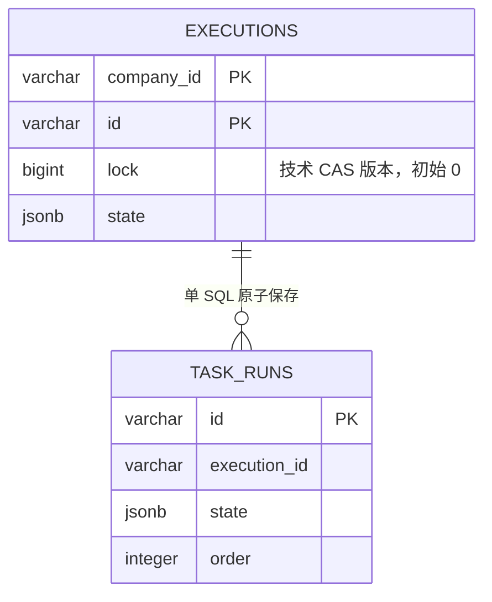

# ADR 0086：用仓储会话保存 Execution 加载锁版本

## 状态

Accepted（2026-09-08）。修订 ADR 0084 的技术版本来源和内存生命周期，保留普通
读取、单 SQL 聚合保存、不跨 Worker 回调开启业务事务的边界。

公开 `inScope` 接口及清理方式已由 [ADR 0091](0091-hide-repository-cas-behind-save.md)
修订为数据库入口内部管理，业务继续使用普通 `find/save`。以下保留原决策背景。

## 背景与选择

用户要求 `lock_version` 更名为 `lock`，技术版本不进入领域，不额外保留完整领域
快照，并在操作结束后清理。`xmin` 是数据库事务标识，同一事务内多次更新不能提供
每次保存递增的版本；只按 Execution ID 共享版本则会让旧对象误用后加载对象的版本。

不恢复跨服务业务事务，也不使用单例版本表、线程变量或保存时重新查询最新版本。
选择显式仓储会话，在其独立 DSL 配置中只保存弱引用对象键和 `Long` 版本。

## 决策

- `ExecutionRepository.inScope(dsl, operation)` 派生独立 DSL 配置；它不是数据库事务。
  写调用在会话内完成，普通查询可以在会话外执行，但会话外加载的对象不能更新已有行。
- 读取根与子集合的同一条 SQL 同时取得 `lock`。每次加载的对象独立绑定加载版本，
  不复制或强引用领域快照；同一 ID 的多个对象不能互相借用版本。
- 没有加载版本只允许首次 INSERT，`lock = 0`；已存在身份返回冲突，不盲目覆盖。
  已加载对象只执行带 `company_id + id + lock` 的 UPDATE，并令 `lock = lock + 1`。
  已删除根不能被陈旧 UPDATE 重新插入。
- 根 CAS 成功才写 TaskRun；整个根更新、子集合增删改在一个 SQL 内原子提交。
  根未命中抛出 `DataChangedException`；子记录失败时根及 `lock` 一起回滚。
  TaskRun 只按已有唯一键 `execution_id + id` 更新；撞到其他根的子记录 ID 必须使
  整条 SQL 失败，不能静默改变子记录归属。
- 成功保存后只给本次对象登记新版本，支持会话内连续保存。失败后将该对象标为不可再写，
  必须重读再应用业务操作，不能给旧对象补查最新版本重试。
- 会话在 `finally` 中清空并解除版本表，不论操作正常返回或抛异常。对象与 DSL
  不得跨会话继续写入；并发操作使用不同会话，数据库 CAS 协调线程与进程间竞争。
- 当前自动提交读取不能在读事务结束时清掉加载版本，否则保存时已无比较依据。
  若调用方使用显式数据库事务，会话必须在该事务提交或回滚后结束，不能跨事务复用。
  数据库行中的 `lock` 永久保留；清理的是内存元数据，不是数据库列。

## 理由与后果

领域和业务版本完全不变。Flow 定义仍按 ADR 0083 追加版本，不引入 Execution 的
可变行 CAS 协议。版本表只占用与本次加载对象数成正比的少量元数据，生命周期明确；
代价是写调用必须使用仓储会话，脱离会话的查询副本必须重新加载才能修改。

开发期仅修改完整 Schema 基线并重新生成 JOOQ，不提供旧库迁移或兼容列。真实
PostgreSQL 验证覆盖同版本并发、重复加载、连续保存、缺失版本、失败回滚及会话清理。
