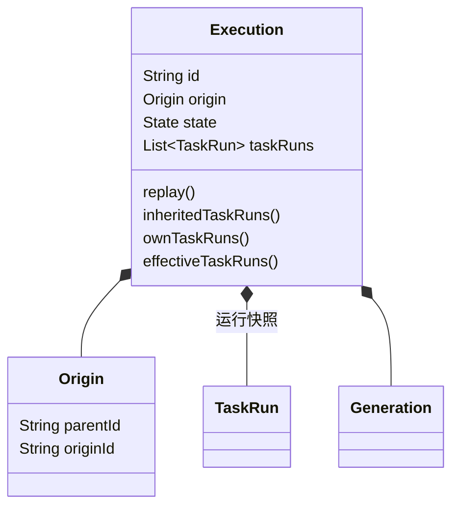
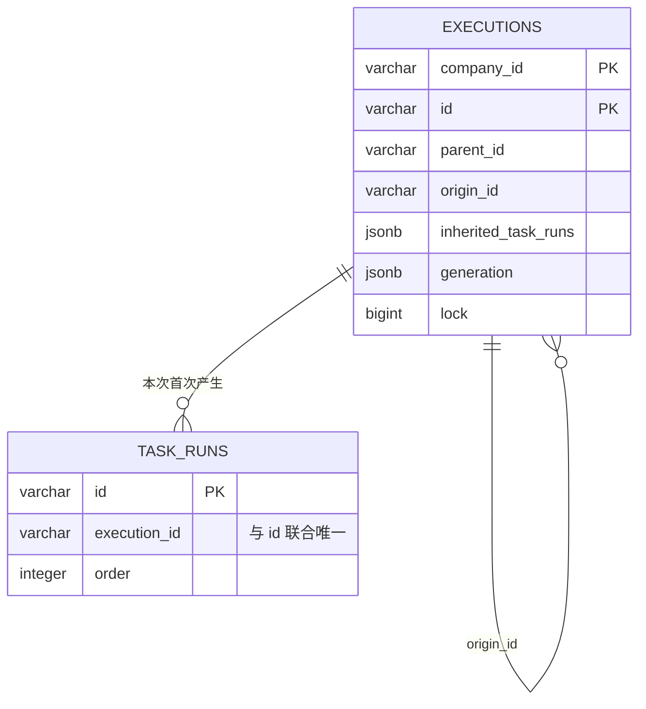

# ADR 0087：退回时派生独立 Execution 快照

## 状态

Accepted（2026-09-08）。依据用户确认的 Origin 两字段、退回产生新 Execution、保留真实路径，以及直接重构且不提供兼容代码的要求。
整体接替为主 Agent 根据已授权接替方向采用的实现选择：旧实例停止，未受影响并行分支在新实例保留身份和进度。
修订 ADR 0078、0085 的同实例退回行为，保留 ADR 0084、0086 的单 SQL 保存及仓储会话 CAS。

## 背景

同一个 Execution 内反复退回会改变祖先编排节点的当前输出。State 历史只保存状态与时间，不能还原曾被覆盖的输出。
新的运行需要独立身份，同时保留旧执行事实、跨次来源，以及未受影响并行分支的等待进度。

## 方案与取舍

- 只增加来源字段：无法独立保存退回前后的结果与推进责任。
- 让调度器跨实例动态读取祖先的可变 TaskRun：扩大调度、变量、父子和循环解析边界，并使后续运行依赖祖先当前状态。
- 派生自足的运行快照：复用现有调度器、Generation、TaskRun 与变量协议；代价是每次派生保存一份继承历史。采用此方案。

## 领域与身份

- `Execution` 继续是独立聚合根和 Repository 保存单位。
- `Origin` 是不可变值对象，只有 `parentId` 和 `originId`。前者引用直接父 Execution，后者引用整棵树最初的 Execution。
- 首次启动使用 `Origin(null, execution.id)`；派生实例使用 `Origin(source.id, source.origin.originId)`。实例不能将自己标为父实例，派生实例不能将自己标为根。
- `Execution.replay` 接收预分配新 ID、可信 Session、源/目标 TaskRun、原因及精确影响集合。它完整校验新快照后，再停止旧实例。
- `taskRuns()` 返回该快照的完整运行历史；`inheritedTaskRuns()` 返回继承前缀；`ownTaskRuns()` 返回本次首次产生的运行记录。继承前缀长度由恢复的快照数组派生，不新增存储游标。
- 继承的 TaskRun 沿用原 ID、父 ID、轮次和已发生的状态历史，数据独立复制；再次执行的受影响步骤生成新 TaskRun ID。继承意味着延续已有运行事实，不代表重新执行了一次。
- 创建者、创建时间及 Execution State 历史属于新实例；Flow 版本和启动 inputs 沿用源实例的精确绑定。

## 生命周期与路径

| 对象 | replay 成功时 | 后续行为 |
| --- | --- | --- |
| 旧 Execution | 追加 KILLING、KILLED，结束活动 Generation 和未完成 TaskRun | 历史可查询，不再接受恢复或继续调度 |
| 新 Execution | 独立 CREATED、RUNNING 历史，继承源快照并记录新的 Generation | 从目标重新执行，由本实例继续至终态 |
| 无关并行分支 | 在新实例继承已有进度和 TaskRun ID | 已完成动作不重复，等待节点用新 executionId 恢复 |
| 受影响片段 | 新快照记录精确失效集合，终止受影响旧运行并重开部分祖先 | 后续调度产生新的 TaskRun，旧实例输出不被清空 |

继续采用已确认的因果路径规则：跨 Sequence、Route、Parallel 退回保留无关分支；不增加循环内部源/目标支持。
正在执行的 RunnableTask 必须先提交结果；Rewind 命令通过已有 Queue 重投机制等待，再重新加载和校验，避免复制一个无 Worker 接续的 RUNNING 记录，也不重复执行外部动作。

不变量：

1. 新旧 Execution 的 ID 不同、租户相同，根来源和 Flow 版本保持一致。
2. 校验失败不改变源实例；保存失败不产生部分交接。
3. 继承快照与旧实例不共享可变 TaskRun 或 Generation。
4. 新发生的 TaskRun 只属于新实例，继承标记与当前有效路径分别可查询。
5. 旧执行编号的回调不能自动转发到新实例。
6. 同一 Rewind 命令携带固定的新实例 ID，重投时校验已有绑定并再次发出推进信号，不创建第二个实例。

## 存储与并发

图中为逻辑关系，不新增外键或 CHECK。`origin_id` 的冗余由创建与恢复边界保护，用于租户内同源查询；按租户建立 origin 和 parent 查询索引。
`inherited_task_runs` 保存本实例拥有的独立历史快照，JSONB 是有意保留的时间点事实，后续祖先变化不回写它。
`task_runs` 只保存本实例首次产生的 TaskRun，继续保留全局 ID 主键及 `execution_id + id` 唯一约束，禁止抢占其他实例的实体身份。

`ExecutionRepository.save(dsl, source, derived)` 将旧根 CAS、旧根子记录、新根 INSERT 和新根子记录组合为一条 SQL。
旧根 CAS 成功才允许新根 INSERT；新根身份冲突或任意子写失败使整条 SQL 回滚。技术版本由数据库执行入口内部管理（[ADR 0091](0091-hide-repository-cas-behind-save.md)），不新增跨服务事务。
Worker 和 Queue 继续使用原有边界；数据库提交成功但内部事件发布失败时，同一 Rewind 重投会找到既有新实例并补发信号。

## 公开接口与历史回放

- 正式 `ExecutionService.rewind` 与 HTTP `POST /executions/executions/{executionId}/task-runs/{taskRunId}/rewind` 直接采用新语义，无同实例旧实现分支。完整路径包含现有 Controller 的 `/executions` 前缀。
- 返回 `executionId`（预分配的新实例 ID）、`sourceExecution`（受理时原实例快照）、`affectedTaskRunIds`。返回只证明 Queue 受理，调用方重新查询新实例，不能把受理当成异步交接完成。
- 调用方需持久保留业务历史引用，并将当前处理坐标切换为新 executionId。继承等待任务沿用 taskRunId，新生成任务使用查询得到的新 ID。
- `ExecutionService.lineage(session, executionId)` 和对应 `GET /executions/executions/{executionId}/lineage` 返回当前租户内同源的全部快照。
- HTTP ExecutionView 暴露 `origin`、`inheritedTaskRunIds` 和 `effectiveTaskRunIds`；原有 TaskRun 继续提供父子、轮次、输入、输出、状态和时间。
- Task 的运行变量 `execution.origin.parentId` 和 `execution.origin.originId` 暴露同一来源关系，`execution.id` 始终为当前实际推进实例。
- 历史回放读取已保存的 Flow 版本与运行事实，继承记录按原 TaskRun ID 关联，父子及并行关系按实际定义/运行结构解释；不重新执行 Task、重新计算历史条件或把并行记录按时间误判为串行。

## 后果与验证

- 每次 replay 保存完整继承快照，存储随历史长度和派生次数增长。若长派生链的存储成本成为实际问题，再分离共享的不可变历史块；当前不引入事件溯源框架。
- 不修改 Flow DSL、Task 插件和 Loop 自身的轮次模型；Generation 继续表达每次精确退回片段，删除旧区间推断及缺失 affectedTaskRunIds 的兼容逻辑。
- 直接更新开发期 Schema 基线并重新生成 JOOQ，使用本任务隔离数据库验证，不升级或清空已有数据库。
- 用户场景由 UC04、UC10、UC11 及其测试负责；技术验证覆盖双聚合原子性、CAS、快照隔离、JSON 往返、命令重投和租户隔离。实际执行结论以本次测试报告为准。
