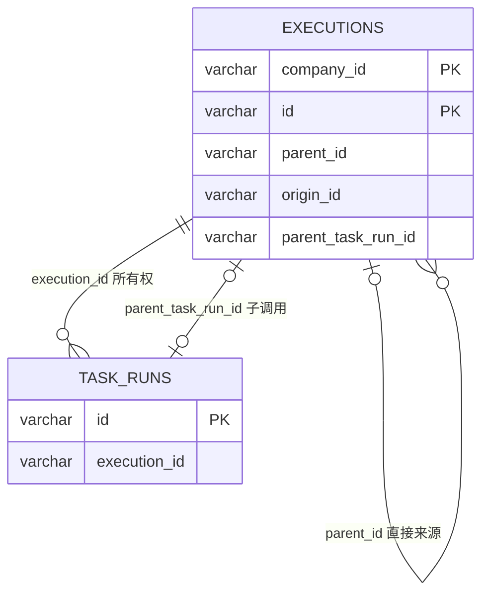

# ADR 0098：SubFlow 创建关联的独立 Execution

## 状态

Accepted（2026-09-10）。用户确认统一 inputs、独立 Execution 与来源追溯，
本阶段完成首次调用闭环，暂不实现重试、重启恢复和 Replay 接续。
2026-09-14 根据用户确认，将流程引用字段直接放在 SubFlow，移除通用接口中的子流程业务。

## 背景与选项

2026-09-14：SubFlow 的独立执行能力由 [ADR 0099](0099-resolve-task-orchestration-as-read-only-plans.md) 修订，不再实现 OrchestrationTask。

内嵌子 TaskRun 无法表达独立运行；只保存 Origin 无法区分同一父运行中的多个调用。
选择复用 OrchestrationTask、Execution 与现有队列，保存精确调用节点。

## 决策

- SubFlow 位于 extensions/flow，实现 OrchestrationTask，直接配置 `flowKey`、`flowVersion`，
  不再封装引用对象。流程键非空，引用版本必须明确且为正数。
  OrchestrationTask 只声明分支、循环、等待等通用编排特征，不参与具体任务业务。
  Executor 和子流程处理器识别 SubFlow 并读取其自身字段；通用接口不提供子流程引用能力。
  旧的 `flow.key/version` 配置不做兼容，已有定义须调整后重新发布。
- 沿用 Task.inputs 与 Input.bind；按声明从父 Execution.inputs 取得同名值，
  支持已有 Input 默认值与校验。绑定后再次通过目标 Flow.bindInputs 校验，最终值
  同时保存于父调用 TaskRun.inputs 和子 Execution.inputs。不新增 arguments 或表达式参数协议。
- 子运行限定父租户；调用前检查目标最新正式状态未删除，并读取精确版本。
  子运行从 CREATED 开始，拥有独立运行历史，不继承父 TaskRun。
- 子 Origin.parentId 为父 Execution.id，Origin.originId 沿用父根编号。
  子 Execution.parentTaskRunId 保存精确父调用节点；根运行和普通 Replay 派生为空。
  该字段属于调用关联，不扩充两字段 Origin。
- 父调用从 CREATED 进入 RUNNING 与子运行创建复用双聚合原子保存；保存后发布子调度事件。
  父调用等待期间不占用 Worker；子 Pause 仅暂停子运行，恢复后沿正常执行链收敛。
- SubFlow.Output 定义 executionId 和 outputs。outputs 复用 RunVariables 的按 Task key
  汇集的有效成功/警告结果视图，省略 VoidOutput；嵌套结果保留其层次。
  此任务的 outputs(RunContext) 接收已完成的子运行上下文，普通编排仍接收自己的上下文。
- 子终态按 parentTaskRunId 应用到父最新快照；成功/警告回传结果，失败使父调用失败。
  对已结束或已失效父节点不重复应用。并行 CAS 冲突只重做结果合并，不重新执行子流程。
  父完成保存后发布父调度事件，后续节点可以读取 `outputs.call.outputs.wait.approved`。
- 输入或目标不可用使父调用明确失败，不创建无效子运行。设施异常仍由事件入口报告。
  本阶段无子取消传播、Replay 替换接续、超时、重试或跨保存与发消息的崩溃恢复协议；
  因而不承诺进程中断后的自动恢复。

## 关系模型

以上均为逻辑关系，不创建外键。一个本阶段调用节点最多创建一个子运行，父 CAS
及双根原子保存保证并发创建边界。按 Origin 查询继续使用已有租户索引；完成事件直接
按父主键读取，不增加无读取路径的新索引。调用字段属于子运行的独立关系事实，
没有引入结果的额外数据库副本，结果回传作为父调用自身的完成快照保存。

## 理由与后果

复用已有调度、输入绑定、输出投影及 CAS；新增持久化字段只有 parent_task_run_id。
HTTP Execution 视图同时公开该字段与 inputs，配合既有 lineage 可追溯到具体调用。
Schema 直接维护开发期基线，须空库重建并重新生成 JOOQ。验证入口为 UC13、
SubFlowTest 与既有 Execution/Repository 回归，重试和恢复不在本次验收范围。
