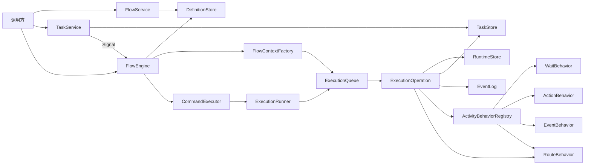
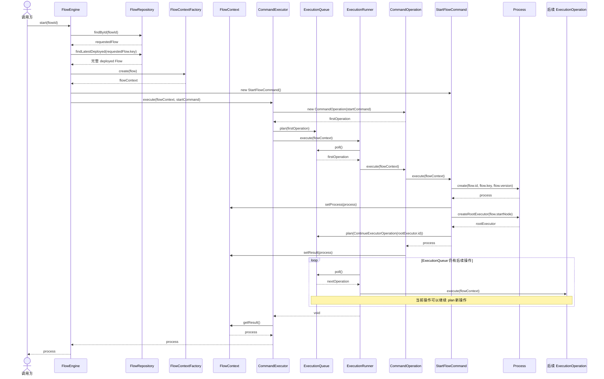
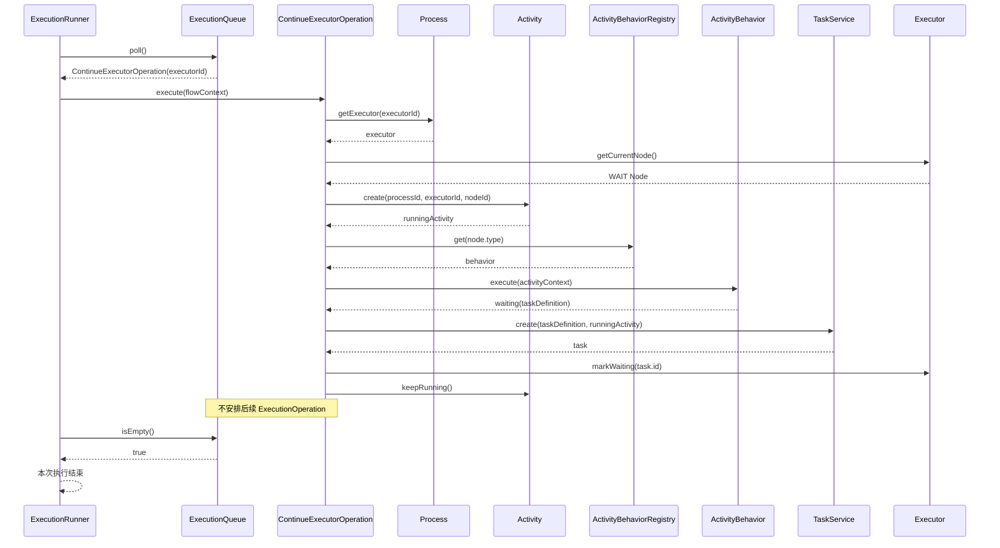
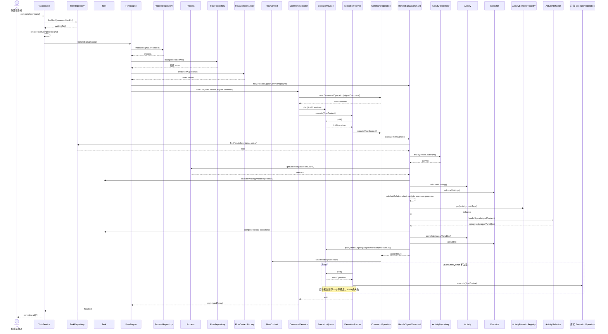

# 工作流核心运行架构设计

## 状态

提议中

## 背景

当前项目需要设计一个工作流引擎的运行核心。已有方案提出了 `Flow`、`Node`、`Edge`、`Executor`、`Process`、`Activity`、`Task` 等关键概念，并明确了两类典型运行场景：

- 审批类工作流：流程通常单向推进，不允许随意回退。
- 任务类工作流：流程可以前进、后退、重新进入某些节点。

经过讨论，工作流核心不应把“审批流”“任务流”作为引擎级类型。引擎只理解流程图，以及运行时如何沿流程图移动。业务上是否可逆、是否可撤回、是否允许跳转，应由流程图定义和运行策略共同决定。

本设计不依赖或照搬任何外部流程引擎的领域模型，但可以借鉴成熟流程引擎在执行游标、行为分派、运行调度和事务边界方面的核心思想。核心目标是形成一个足够简单、可解释、可测试、可扩展的自有运行模型。

## 核心原则

### 流程图是唯一运行依据

工作流本质是一张有向流程图。流程如何定义，运行时就如何走。

引擎不内置审批流、任务流、表单流等业务分类。所有业务差异都表达为：

- 节点类型和节点行为
- 边的方向和条件
- 运行策略
- 外部信号

### 定义和运行分离

`Flow`、`Node`、`Edge` 描述流程定义。

`Process`、`Executor`、`Activity`、`Task` 描述流程运行。

定义层可以被编辑、校验、部署和版本化。一个 `Flow` 就是某个版本下的完整流程定义。运行层只能引用一个具体的、已部署的 `Flow`，不能受同一 `key` 后续新版本影响。

### FlowEngine 是统一运行入口

流程推进只能由运行引擎完成。外部服务可以发起动作，但不能直接决定下一个节点。

- `FlowService` 负责流程定义、部署、版本。
- `TaskService` 负责任务生命周期。
- `FlowEngine` 负责接收流程运行请求并组织一次运行调用。
- `Process` 负责创建和管理属于本次流程进程的 Executor。
- `CommandExecutor` 负责把一次运行命令安排为第一个待执行操作。
- `ExecutionRunner` 只负责依次执行已经安排好的操作。

`TaskService.complete(...)` 不直接推动流程，而是产生一个 `Signal`。`FlowEngine` 消费这个信号后继续推进。

### Task 是外部交互，不是流程本身

流程实例在运行到需要外部参与的节点时创建 `Task`。人、系统任务、异步通知都可以通过 Task 承载。

Task 的完成结果只是一种输入。流程是否继续、走哪条边、是否失败、是否挂起，由运行引擎结合节点行为、边条件和运行策略判断。

### 路由能力是节点行为

选择、分叉、汇合不作为引擎外的特殊结构存在，而是流程图中的节点行为。

这样运行引擎面对的都是统一的节点：

```text
enter node -> execute node behavior -> produce result -> choose outgoing edge -> move executor
```

## 需求摘要

- 支持基于节点和边定义一条完整流程。
- 流程至少包含一个开始节点、一个非结束业务节点、一个结束节点。
- 流程部署后成为不可变、可启动的完整 Flow。
- 同一个流程定义标识升级时创建新的 Flow，新旧 Flow 使用相同 key，不同 version。
- 启动流程时必须绑定一个具体的 deployed Flow。
- 运行时使用 Executor 作为流程图上的执行游标。
- 节点被 Executor 进入后产生 Activity 记录。
- 需要外部参与的节点创建 Task。
- 支持条件路由、并行分支、分支合并。
- 支持可逆流程，但可逆能力由流程图和策略表达，不由 Flow 类型表达。
- 支持审计和排错，运行过程应可追踪。

## 总体架构



### 模块划分

#### FlowService

负责流程定义生命周期。

- 创建 Flow 草稿
- 修改 Flow 草稿
- 校验 Flow 图结构
- 部署 Flow
- 基于同一 key 创建新版本 Flow
- 废弃 Flow
- 查询已部署版本

FlowService 不负责运行流程。

#### FlowEngine

负责流程运行生命周期，是统一运行入口。

- 根据 `flowId` 启动并返回 Process
- 创建独立的 FlowContext
- 将启动、信号等请求转换为 Command
- 通过 CommandExecutor 发起一次运行
- 处理 Task 信号
- 结束流程实例
- 标记失败和补偿状态

FlowEngine 是核心运行入口，但不直接执行待运行操作，也不直接创建或持有 Executor。待运行操作由 ExecutionRunner 执行，Executor 由所属 Process 创建和管理。

#### CommandExecutor

负责组织一次命令调用。

- 接收 FlowContext 和 Command
- 将 Command 包装成第一个 CommandOperation
- 把 CommandOperation 放入 FlowContext 的 ExecutionQueue
- 调用 ExecutionRunner 执行队列
- 从 FlowContext 取得命令结果并返回

CommandExecutor 不负责具体节点行为，也不直接推进 Executor。

#### ExecutionRunner

只负责执行 FlowContext 中已经安排好的 ExecutionOperation。

- 从 ExecutionQueue 取出下一个操作
- 调用该操作的 execute(flowContext)
- 重复执行，直到队列为空或当前运行被异常中断

ExecutionRunner 不创建 FlowContext，不创建第一个操作，不解析 Flow，不创建 Process 或 Executor，也不决定下一条 Edge。

#### TaskService

负责任务生命周期和外部交互。

- 查询待办任务
- 领取任务
- 完成任务
- 取消任务
- 记录任务处理结果
- 把外部 complete 请求转换为 Signal
- 同步调用 FlowEngine.handleSignal(signal)

TaskService 不直接选择下一条 Edge，也不直接移动 Executor。complete 方法在 FlowEngine 本次执行结束后返回。

#### ActivityBehaviorRegistry

负责根据节点类型找到对应的节点行为。

节点行为只回答三个问题：

- 进入节点时做什么
- 是否需要等待外部结果
- 节点完成后产出什么结果

#### RouteBehavior

负责流程图中的路由行为。

- 根据条件选择一条边
- 根据条件选择多条边
- 创建多个子 Executor
- 判断多个 Executor 是否已经到达合并点
- 合并完成后销毁或关闭子 Executor

#### StateStore

持久化定义层和运行层状态。可以在实现时拆为：

- `DefinitionStore`
- `RuntimeStore`
- `TaskStore`
- `EventLog`

核心要求是事务一致性和并发控制。

## 定义层核心概念

定义层只描述流程图本身，不保存任何运行数据或业务数据。

定义层包含：

- `Flow`：完整流程定义。
- `Node`：流程图中的静态节点定义。
- `Edge`：节点之间的连接定义。

运行时的变量、任务结果、审批意见、执行时间、当前处理人等信息都不属于定义层。

### Flow

Flow 表示一个完整的流程定义。

它不是流程族，也不是只保存流程元信息的容器。一个 Flow 自身就包含流程运行需要的完整信息，包括节点、边、节点配置、边条件、状态和版本。

同一个流程定义标识的多次升级通过相同 `key` 和不同 `version` 表达。不同版本是不同的 Flow，拥有不同的 `id`，也可以拥有不同的节点和边。

例如：

```text
flow_id = flow_001
key = leave_approval
version = 1
state = deployed

flow_id = flow_002
key = leave_approval
version = null
state = draft
base_flow_id = flow_001
base_version = 1

flow_id = flow_003
key = leave_approval
version = 2
state = deployed
```

这三个 Flow 属于同一个流程定义标识 `leave_approval` 的不同版本，但每一个 Flow 都是完整流程定义。

建议字段：

```text
id
key
name
description
state
version
baseFlowId
baseVersion
draftOwnerId
nodes
edges
createdAt
updatedAt
deployedAt
```

状态：

```text
draft       草稿，可编辑，不可启动
deployed    已部署，可启动
deprecated  已废弃，不可启动新实例
```

状态规则：

- `draft` 可以修改节点、边和配置。
- `deployed` 可以启动流程进程，部署后不再修改。
- `deprecated` 不允许启动新流程进程，但不影响已经基于它启动的 Process 继续运行。

状态流转规则：

```text
create
  -> draft

update draft
  -> 直接修改当前 Flow

deploy draft
  -> draft 变为 deployed
  -> 如果 version 为空，部署时生成正式 version

edit deployed
  -> deployed Flow 保持不变
  -> 复制 deployed Flow，生成一个新的 draft Flow
  -> 新 draft 的 baseFlowId 指向来源 Flow
  -> 新 draft 的 baseVersion 记录来源版本

deprecate key
  -> 相同 key 下的所有 Flow 都变为 deprecated
```

版本规则：

- `key` 表示流程定义标识，例如 `leave_approval`。
- `version` 表示该 `key` 下已经部署成功的版本号。
- `draft` 不预占正式 version，version 可以为空。
- `draft` 部署时，version 取当前 key 下最大 deployed version + 1。
- 版本升级时创建一个新的 draft Flow，而不是修改已部署 Flow。
- 新版本 Flow 和旧版本 Flow 的 `key` 相同，`id` 不同，部署后的 `version` 不同。
- Process 启动后绑定具体 `flowId`，后续同 key 的新 Flow 不影响已启动 Process。

草稿唯一性规则：

- 第一阶段，同一个 `key` 下同一时间最多只能存在一个 `draft` Flow。
- 编辑 `deployed` Flow 时，如果该 `key` 下已经存在 draft，则直接返回这个 draft，不再创建新的 draft。
- 如果未来需要支持多个用户并行编辑，可以把草稿唯一性扩展为 `key + draftOwnerId`。
- 多用户 draft 部署时仍然需要串行生成 version，并检查来源版本是否已经落后。

#### Flow 的完整加载和对象关系

Flow 是完整流程定义。通过 `flowId` 查询 Flow 时，应一次获得该 Flow 的全部定义数据，包括所有 Node、Edge、节点配置和边条件。核心运行过程不依赖懒加载，也不在 Executor 推进过程中逐个查询 Node 或 Edge。

完整 Flow 加载后，需要装配 Node 和 Edge 的双向对象关系：

```text
Node.incoming  -> 进入该 Node 的 Edge 集合
Node.outgoing  -> 离开该 Node 的 Edge 集合
Edge.source    -> 来源 Node
Edge.target    -> 目标 Node
```

Executor 到达一个 Node 后，直接读取该 Node 的 `outgoing`，选择可通过的 Edge，再通过 `edge.target` 得到下一个 Node。完整 Flow 本身就是运行时的流程图结构。

对于新 Process，FlowEngine 先根据传入的 `flowId` 找到 `key`，再查找该 key 下最新的 deployed Flow，并加载这个完整 Flow。Process 创建后固定绑定最终选中的 `flowId` 和 `version`。

对于已经运行的 Process，应按照 Process 绑定的 `flowId` 精确加载完整 Flow。即使该 Flow 后来被标记为 deprecated，已有 Process 仍然可以继续读取并运行该 Flow。

### Node

Node 是 Flow 定义层中的静态节点定义。

它只说明流程图上有一个什么节点、这个节点是什么类型、Executor 到达该节点时运行引擎应使用哪种行为规则，以及该行为需要哪些静态配置。

Node 不保存任何运行数据或业务数据。它不保存任务结果、审批意见、变量值、执行状态、执行时间或当前处理人。

建议字段：

```text
id
flowId
name
type
incoming
outgoing
config
metadata
```

字段说明：

- `id`：Node 的唯一 ID。
- `flowId`：所属 Flow。
- `name`：节点展示名称。
- `type`：节点类型，决定运行时选择哪个节点行为。
- `incoming`：进入当前节点的 Edge 集合。
- `outgoing`：从当前节点出去的 Edge 集合。
- `config`：节点行为配置，只包含定义期静态配置。
- `metadata`：设计器辅助信息，例如坐标、展示样式、备注。

Node 记录 incoming 和 outgoing Edge 对象，Edge 也记录 source 和 target Node 对象。两者共同描述流程图连接关系：

```text
node.incoming = edges where edge.targetId = node.id
node.outgoing = edges where edge.sourceId = node.id
```

`sourceId` 和 `targetId` 用于持久化和校验，`source`、`target`、`incoming`、`outgoing` 是完整 Flow 加载后的对象关系。部署前必须校验两侧连接关系一致，避免出现 Node 引用了不存在的 Edge，或 Edge 指向了不存在的 Node。

节点类型建议从最小集合开始：

```text
START   开始节点
END     结束节点
WAIT    等待节点，需要外部信号后继续
ACTION  动作节点，由系统执行并等待结果
EVENT   事件节点，触发动作后不等待结果
SWITCH  选择节点，从多条出边中选择一条
FORK    分叉节点，展开多条执行路径
MERGE   汇合节点，等待多条执行路径到达后继续
```

#### Node config 和 metadata

`config` 和 `metadata` 都属于定义层，但用途不同。

`config` 给运行引擎使用，影响节点运行时如何处理。它只能保存节点行为需要的静态配置，不能保存某次流程运行中的业务数据。

`metadata` 给流程设计器和人使用，不参与核心运行判断。运行引擎不应依赖 metadata 推进流程。

区别：

```text
config
  给运行引擎看的，影响节点如何执行。

metadata
  给设计器和人看的，不影响核心运行。
```

`config` 可以放：

```text
WAIT:
  taskName
  assignment
  completion
  timeoutPolicy

ACTION:
  executor
  timeoutSeconds
  retry

EVENT:
  eventName
  waitResult

SWITCH:
  decisionMode
```

`metadata` 可以放：

```text
x
y
width
height
color
remark
```

Node 不应该放：

```text
本次流程的表单数据
审批意见
任务结果
流程变量
当前执行状态
当前处理人
```

#### Node 示例

最小流程：

```text
START -> WAIT -> END
```

Node 定义示例：

```json
[
  {
    "id": "node_start",
    "flowId": "flow_leave_v1",
    "name": "开始",
    "type": "START",
    "incoming": [],
    "outgoing": [
      {
        "id": "edge_start_to_submit",
        "sourceId": "node_start",
        "targetId": "node_submit"
      }
    ],
    "config": {},
    "metadata": {
      "x": 80,
      "y": 120,
      "width": 120,
      "height": 48,
      "remark": "流程入口"
    }
  },
  {
    "id": "node_submit",
    "flowId": "flow_leave_v1",
    "name": "提交申请",
    "type": "WAIT",
    "incoming": [
      {
        "id": "edge_start_to_submit",
        "sourceId": "node_start",
        "targetId": "node_submit"
      }
    ],
    "outgoing": [
      {
        "id": "edge_submit_to_end",
        "sourceId": "node_submit",
        "targetId": "node_end"
      }
    ],
    "config": {
      "taskName": "提交申请",
      "assignment": {
        "type": "starter"
      },
      "completion": {
        "mode": "manual"
      }
    },
    "metadata": {
      "x": 280,
      "y": 120,
      "width": 160,
      "height": 64,
      "remark": "需要发起人完成"
    }
  },
  {
    "id": "node_end",
    "flowId": "flow_leave_v1",
    "name": "结束",
    "type": "END",
    "incoming": [
      {
        "id": "edge_submit_to_end",
        "sourceId": "node_submit",
        "targetId": "node_end"
      }
    ],
    "outgoing": [],
    "config": {},
    "metadata": {
      "x": 520,
      "y": 120,
      "width": 120,
      "height": 48,
      "remark": "流程结束"
    }
  }
]
```

配套 Edge 定义示例：

```json
[
  {
    "id": "edge_start_to_submit",
    "flowId": "flow_leave_v1",
    "sourceId": "node_start",
    "targetId": "node_submit",
    "condition": null,
    "priority": 1
  },
  {
    "id": "edge_submit_to_end",
    "flowId": "flow_leave_v1",
    "sourceId": "node_submit",
    "targetId": "node_end",
    "condition": null,
    "priority": 1
  }
]
```

### Edge

Edge 是 Flow 定义层中连接两个 Node 的边。

它描述从哪个 Node 可以走到哪个 Node，以及在什么条件下可以通过这条边。Edge 只承载连接关系和静态路由规则，不保存任何运行数据。

建议字段：

```text
id
flowId
sourceId
targetId
source
target
condition
priority
metadata
```

字段说明：

- `id`：Edge 的唯一 ID。
- `flowId`：所属 Flow。
- `sourceId`：来源 Node 的 ID。
- `targetId`：目标 Node 的 ID。
- `source`：来源 Node 引用，通常是加载 Flow 后在内存中装配出来的对象引用。
- `target`：目标 Node 引用，通常是加载 Flow 后在内存中装配出来的对象引用。
- `condition`：通过这条边的条件定义，只描述判断规则，不保存本次判断结果。
- `priority`：同一个 Node 存在多条 outgoing Edge 时的判断顺序。
- `metadata`：设计器辅助信息，例如连线标签、折线路径、备注。

`sourceId` 和 `targetId` 是持久化核心字段。`source` 和 `target` 是对象引用或装配结果，不建议作为独立持久化字段重复保存完整 Node。

Edge 表达“可以从哪里走到哪里”。condition 表达“什么情况下可以走”。

无条件 Edge：

```json
{
  "id": "edge_start_to_submit",
  "flowId": "flow_leave_v1",
  "sourceId": "node_start",
  "targetId": "node_submit",
  "condition": null,
  "priority": 1
}
```

条件 Edge：

```json
{
  "id": "edge_approve_pass",
  "flowId": "flow_leave_v1",
  "sourceId": "node_approve",
  "targetId": "node_end",
  "condition": {
    "field": "approved",
    "operator": "eq",
    "value": true
  },
  "priority": 1,
  "metadata": {
    "label": "通过",
    "remark": "满足 approved == true 时通过"
  }
}
```

Edge 不应该保存：

```text
当前是否已经走过
本次条件计算结果
任务结果
执行时间
执行人
流程变量
```

如果需要可逆流程，推荐显式定义反向 Edge，或者定义可回退策略。不要让引擎隐式认为所有边都可以反向走。

## 运行层核心概念

运行层描述某个 Flow 被启动后的执行过程。

运行层包含：

- `Process`：某个 Flow 启动后产生的一次流程进程。
- `Executor`：在该 Process 中沿 Flow 图移动的执行单元。
- `Activity`：Executor 进入某个 Node 后产生的一次节点执行记录。
- `Task`：节点执行时产生的外部交互任务。
- `Signal`：外部世界传回运行引擎的输入。

运行层必须引用定义层，但不能修改定义层。

### Process

一次 Flow 启动后产生的流程实例。

Process 是运行层中 Executor 的创建者和管理者。FlowEngine 创建 Process 后，由 Process 根据 Flow 的 START Node 创建根 Executor；后续分支产生的子 Executor 也必须由同一个 Process 创建。FlowEngine 不直接构造 Executor。

建议字段：

```text
id
flowId
flowKey
flowVersion
businessKey
state
variables
startedAt
endedAt
startedBy
```

状态：

```text
running
suspended
completed
failed
terminated
```

### Executor

流程图上的执行游标。一个 Executor 表示流程实例中的一条正在运行的路径。

原始方案中提到 Executor 类似 Flow 的流程运行实例。这里建议进一步明确：Process 是流程实例，Executor 是流程实例中的运行游标。

建议字段：

```text
id
processId
parentId
currentNodeId
state
scopeKey
mergeKey
createdAt
updatedAt
```

状态：

```text
active       可以继续推进
suspended    暂停，等待外部主动恢复
waiting      等待其他 Executor 或外部结果
completed    当前路径完成
terminated   被终止
failed       当前路径失败
```

分支时创建子 Executor。合并后子 Executor 完成或销毁，由父 Executor 继续前进。

### Activity

Executor 进入某个节点后产生的运行记录。

同一个节点可以被多次进入，因此 Activity 是历史记录，不是节点本身。

建议字段：

```text
id
processId
executorId
nodeId
nodeType
state
inputVariables
outputVariables
startedAt
endedAt
errorMessage
```

状态：

```text
running
completed
failed
cancelled
skipped
```

Activity 用于追踪流程实际走过的路径，也是回退、审计、排错的基础。

### Task

节点运行时产生的外部交互任务。

建议字段：

```text
id
processId
executorId
activityId
nodeId
type
state
assignee
candidateUsers
candidateGroups
payload
result
createdAt
claimedAt
completedAt
```

任务类型：

```text
manual  需要外部操作者处理，需要等待结果
system  由系统处理，需要等待结果
event   触发后不等待结果
```

任务状态：

```text
created
claimed
completed
cancelled
expired
failed
```

### Signal

外部世界给运行引擎的输入。

Task 完成、外部回调、人工撤回、系统重试，都应转换为 Signal。

建议字段：

```text
id
processId
executorId
activityId
taskId
type
payload
idempotencyKey
createdAt
handledAt
```

常见 Signal：

```text
task_completed
task_failed
external_callback
manual_suspend
manual_resume
manual_move
manual_terminate
```

### FlowContext

FlowContext 是某个完整 Flow 在一次引擎调用中的独立运行上下文。FlowEngine 加载本次运行所绑定的完整 Flow 后创建 FlowContext；启动命令执行完成或运行进入等待状态后，本次调用结束。

FlowContext 建议包含：

```text
flow              本次调用绑定的完整 Flow
process           当前 Process；启动命令执行前可以为空
executionQueue    本次调用的待执行操作队列
result            本次 Command 的返回结果
attributes        仅在本次调用中使用的临时数据
```

FlowContext 不替代 Process、Executor、Activity 和 Task 的持久化状态。Process 进入等待后，FlowContext 不需要持续驻留；收到新的 Signal 时，可以根据 Process 绑定的 flowId 重新加载同一个 Flow，并创建新的 FlowContext。

FlowContext 不保存唯一的 currentExecutor 或 currentNode。一次运行调用可能同时推进多个分支，每个 ExecutionOperation 必须明确携带自己要处理的 executorId 等定位信息。

### Command

Command 表示外部对工作流核心发起的一次运行请求，例如：

```text
StartFlowCommand
HandleSignalCommand
TerminateProcessCommand
```

Command 执行后可以继续向 ExecutionQueue 安排后续 ExecutionOperation。Command 本身不负责循环执行队列。

建议的统一接口：

```java
public interface Command<T> {
    T execute(FlowContext flowContext);
}
```

### ExecutionOperation

ExecutionOperation 是 ExecutionRunner 能够执行的最小运行操作，对应运行主循环中的 Runnable。每个操作完成当前职责后，可以向同一个 ExecutionQueue 继续安排后续操作。

```java
public interface ExecutionOperation {
    void execute(FlowContext flowContext);
}
```

核心操作可以包括：

```text
CommandOperation
ContinueExecutorOperation
ExecuteActivityOperation
TakeOutgoingEdgesOperation
HandleSignalOperation
```

其中 CommandOperation 只负责把 Command 适配成运行主循环可以执行的第一个 ExecutionOperation：

```java
public final class CommandOperation<T> implements ExecutionOperation {

    private final Command<T> command;

    @Override
    public void execute(FlowContext flowContext) {
        T result = command.execute(flowContext);
        flowContext.setResult(result);
    }
}
```

### ExecutionQueue

ExecutionQueue 属于 FlowContext，保存本次运行调用中尚未执行的 ExecutionOperation。

队列中的第一个操作由 CommandExecutor 创建，后续操作由正在执行的 Command、ActivityBehavior 或 ExecutionOperation 根据运行结果继续安排。

核心运行采用单线程、先进先出的内存队列。ExecutionQueue 不是持久化任务队列；当流程进入等待状态时，队列应自然耗尽，持久化的是 Process、Executor、Activity 和 Task 的等待状态。

### CommandExecutor 与 ExecutionRunner

CommandExecutor 负责创建第一个操作并发起运行：

```java
public <T> T execute(FlowContext flowContext, Command<T> command) {
    ExecutionOperation firstOperation = new CommandOperation<>(command);
    flowContext.getExecutionQueue().plan(firstOperation);

    executionRunner.execute(flowContext);

    return flowContext.getResult();
}
```

ExecutionRunner 只负责执行：

```java
public void execute(FlowContext flowContext) {
    ExecutionQueue queue = flowContext.getExecutionQueue();

    while (!queue.isEmpty()) {
        ExecutionOperation operation = queue.poll();
        operation.execute(flowContext);
    }
}
```

因此，第一个 Runnable 的创建规则是：

```text
FlowEngine 创建 Command
  -> CommandExecutor 创建 CommandOperation
  -> CommandExecutor 将其作为第一个操作放入 ExecutionQueue
  -> ExecutionRunner 只负责取出并执行
```

## 流程定义校验规则

部署前必须校验流程图。

基础规则：

- 必须有且只有一个 START 节点。
- 至少有一个 END 节点。
- START 节点不能有 incoming edge。
- START 节点必须有 outgoing edge。
- START 节点后不能直接连接 END 节点，必须经过至少一个非结束节点。
- END 节点不能有 outgoing edge。
- 每条 Edge 的 source 和 target 必须存在。
- Node.incoming 中的 Edge 必须满足 `edge.targetId == node.id`。
- Node.outgoing 中的 Edge 必须满足 `edge.sourceId == node.id`。
- 除 START 外，每个可达节点都应至少有一条 incoming edge。
- 除 END 外，每个可达节点都应至少有一条 outgoing edge，等待型节点除非被明确配置为终止点。
- 不允许存在不可达节点，除非该节点被标记为 disabled。
- 条件路由节点的 outgoing edge 条件不能全部为空，除非只有一条 outgoing edge。
- 并行分支必须有明确的合并规则。

版本规则：

- draft 可以修改。
- deployed Flow 不可修改。
- deprecated Flow 不可启动新 Process。
- 对已部署 Flow 做版本升级时，先创建一个相同 key、version 为空的 draft Flow。
- draft Flow 部署成功时，生成递增的正式 version。
- Process 启动后固定引用一个具体 Flow。

## 运行数据流

### 部署流程

```text
调用方
  -> FlowService.deploy(flowId)
  -> 读取 Flow 草稿
  -> 校验 Node 和 Edge
  -> 生成正式 version
  -> 标记 Flow 为 deployed
  -> 冻结该 Flow 的节点、边和配置
  -> 返回 flowId + key + version
```

### 启动流程



FlowEngine.start 的返回类型是 Process。Executor 不作为启动结果返回，也不由 FlowEngine 直接创建。

StartFlowCommand 在被第一个 CommandOperation 执行时创建 Process。根 Executor 仍然由 Process 创建；StartFlowCommand 只调用 Process 的创建方法，并把继续推进根 Executor 的操作安排到 ExecutionQueue。

### 进入普通节点

```text
ContinueExecutorOperation 执行
  -> 根据 executorId 取得 Executor 当前 Node
  -> 创建 Activity
  -> 调用 ActivityBehavior.execute(...)
  -> 如果节点可立即完成，写入 Activity 结果
  -> 安排 TakeOutgoingEdgesOperation
  -> TakeOutgoingEdgesOperation 选择 outgoing Edge
  -> Executor 移动到下一个 Node
```

### 进入人工等待节点

人工节点使用 `WAIT` Node，并通过 `config.completion.mode = manual` 表示必须由外部主动调用 complete。人工节点不会阻塞 ExecutionRunner 所在线程，而是把 Activity、Task 和 Executor 的等待状态持久化，然后让本次 ExecutionQueue 自然耗尽。



进入人工等待后的稳定状态是：

```text
Process.state  = running
Executor.state = waiting
Activity.state = running
Task.state     = created 或 claimed
```

此时不存在仍在等待的线程，也不保留本次 FlowContext 和 ExecutionQueue。需要持久化的是 Process、Executor、Activity 和 Task。

### 外部 complete 人工任务

外部操作者必须调用：

```java
TaskService.complete(CompleteTaskCommand command);
```

CompleteTaskCommand 至少包含：

```text
taskId
result
operatorId
idempotencyKey
```

TaskService 将 complete 请求转换为 `task_completed` Signal，并同步调用 `FlowEngine.handleSignal(signal)`。它不直接完成 Activity、不修改 Executor，也不选择 Edge。

FlowEngine 根据 Task 所属 Process 绑定的 `flowId` 加载同一个完整 Flow，创建新的 FlowContext，并以 `HandleSignalCommand` 开始一次新的执行。



complete 的返回边界是本次 ExecutionQueue 执行完毕：

- 如果后续都是自动节点，继续同步推进。
- 如果到达下一个人工节点，创建新的 Task 后返回。
- 如果到达 END，Process 完成后返回。
- 如果执行失败，按本次运行的事务和异常规则处理。

外部 complete 必须满足：

- Task、Activity、Executor 和 Process 的关联一致。
- Task 处于 `created` 或 `claimed`，Activity 处于 `running`，Executor 处于 `waiting`。
- complete 请求携带幂等键，同一个 Task 的有效完成只处理一次。
- ActivityBehavior.handleSignal 返回 `completed` 后才能安排 TakeOutgoingEdgesOperation。
- 外部调用不能传入目标 Node 或目标 Edge，流程路径仍由当前 Node 的 outgoing Edge 决定。

### 条件路由

```text
Executor 到达 SWITCH
  -> 读取 outgoing edges
  -> 按 priority 计算 condition
  -> 选择第一条满足条件的 Edge
  -> Executor 移动到目标 Node
```

如果没有任何 Edge 满足条件：

- 如果有 default edge，走 default edge。
- 如果没有 default edge，流程进入 failed，记录错误事件。

### 并行分支

```text
Executor 到达 FORK
  -> 读取 outgoing edges
  -> 为每条需要执行的 Edge 创建子 Executor
  -> 子 Executor 分别进入目标 Node
  -> 父 Executor 进入 waiting 或 completed_branch 状态
```

并行分支可以支持两种策略：

- 全部 outgoing edge 都执行。
- 满足条件的 outgoing edge 执行。

并行分叉默认执行全部 outgoing Edge，以保持分支语义明确。

### 分支合并

```text
子 Executor 到达 MERGE
  -> 记录到达事件
  -> 判断同一 mergeKey 下需要等待的 Executor 是否全部到达
  -> 未全部到达时，当前 Executor 进入 waiting
  -> 全部到达时，关闭子 Executor
  -> 恢复父 Executor
  -> 父 Executor 从 MERGE 继续向后推进
```

MERGE 必须能判断等待集合。等待集合建议在创建分叉时生成，而不是在汇合节点临时推断。

## 可逆流程设计

可逆能力不属于 Flow 类型。是否可逆由图和策略决定。

### 推荐方式一：显式反向 Edge

如果节点 A 可以退回节点 B，就在流程图中定义 A -> B 的 Edge。

优点：

- 最清晰
- 可审计
- 权限和条件容易表达
- 不会出现隐式跳转

缺点：

- 流程图会更复杂

### 推荐方式二：运行策略允许回退到历史 Activity

根据历史 Activity 找到可回退节点，由运行策略判断是否允许。

优点：

- 图更简洁
- 适合任务类流程

缺点：

- 需要明确回退后如何处理已完成 Activity 和 Task
- 容易造成状态歧义

### 回退设计建议

回退优先通过显式反向 Edge 表达。

审批类流程如果没有反向 Edge，就天然不可逆。任务类流程如果需要回退，就显式画出回退路径。

这样可以保持核心引擎简单，并且符合“流程图如何定义，工作流就如何走”的原则。

## 变量模型

流程运行需要变量，但变量不应直接散落在各个模块。

建议分三类：

```text
process variables   流程实例级变量
activity variables  节点运行级变量
task payload        任务展示和处理数据
```

变量写入规则：

- 启动流程时写入 process variables。
- 节点执行时读取 process variables 和 activity variables。
- Task 完成后将 result 转换为 activity output。
- Activity 完成后，由 FlowEngine 协调决定是否合并到 process variables。
- Edge condition 只读取稳定变量，不应产生副作用。

## 并发和一致性

工作流运行必须处理重复调用和并发推进。

核心要求：

- 同一个 Executor 同一时间只能被一个推进事务持有。
- Task complete 必须幂等。
- Signal 只能被成功消费一次。
- Activity 从 running 到 completed 必须原子更新。
- Executor 移动节点必须和 Activity 状态更新在同一事务内完成。
- 并行合并必须使用 mergeKey 或 merge instance 防止重复合并。

建议引入乐观锁字段：

```text
version
updatedAt
```

对于 Task、Executor、Process 这些运行时实体，都应支持并发版本控制。

## 事件和审计

运行引擎每个关键动作都应写入 EventLog。

建议事件：

```text
flow_deployed
process_started
executor_created
executor_moved
activity_started
activity_completed
task_created
task_completed
signal_received
route_decided
merge_waiting
merge_completed
process_completed
process_failed
```

EventLog 的目标：

- 排查流程为什么走到某个节点
- 审计谁在什么时候完成了什么任务
- 支持后续运行轨迹可视化
- 支持失败恢复和人工干预

## 关键接口定义

以下是架构层面的接口，不是最终代码。

### FlowService

```java
Flow createFlow(CreateFlowCommand command);

Flow updateFlow(UpdateFlowCommand command);

Flow deployFlow(String flowId);

void deprecateFlow(String flowId);
```

### FlowEngine

```java
Process start(String flowId);

void advanceExecutor(String executorId);

void handleSignal(Signal signal);

void moveExecutor(MoveExecutorCommand command);

void terminateProcess(String processId, String reason);
```

### TaskService

```java
Task claimTask(String taskId, String operatorId);

void complete(CompleteTaskCommand command);

void fail(FailTaskCommand command);

void cancelTask(String taskId, String reason);
```

### ActivityBehavior

```java
ActivityExecuteResult execute(ActivityExecuteContext context);

ActivitySignalResult handleSignal(ActivitySignalContext context);
```

`ActivityExecuteResult` 建议包含：

```text
completed
waiting
failed
createdTask
outputVariables
```

### EdgeCondition

```java
boolean matches(ConditionContext context);
```

条件表达式使用简单结构化条件，不引入复杂表达式语言。

## 推荐目录结构

```text
server/src/main/java/org/cses/flow/
  definition/
    FlowService.java
    FlowValidator.java
    FlowRepository.java
    model/
  runtime/
    FlowEngine.java
    FlowContext.java
    FlowContextFactory.java
    Command.java
    CommandExecutor.java
    ExecutionOperation.java
    ExecutionQueue.java
    ExecutionRunner.java
    CommandOperation.java
    StartFlowCommand.java
    ContinueExecutorOperation.java
    ExecutorService.java
    ActivityService.java
    ProcessRepository.java
    ExecutorRepository.java
    ActivityRepository.java
    model/
  task/
    TaskService.java
    TaskRepository.java
    model/
  behavior/
    ActivityBehavior.java
    ActivityBehaviorRegistry.java
    WaitBehavior.java
    ActionBehavior.java
    EventBehavior.java
    SwitchBehavior.java
    ForkBehavior.java
    MergeBehavior.java
  condition/
    EdgeConditionEvaluator.java
  event/
    EventLogService.java
    FlowEvent.java
  api/
    FlowController.java
    RuntimeController.java
    TaskController.java
```

当前项目实际入口类位于 `server/src/main/java/org/flow/server/Application.java`，但 AGENTS.md 约定包名为 `org.cses.flow`。实现前需要统一包名，建议以 AGENTS.md 为准。

## 影响范围

- 需要新增流程定义、运行、任务、行为、事件等核心模块。
- 需要新增持久化表或等价存储结构。
- 需要设计 API 层，但 API 不应泄漏运行引擎内部细节。
- 需要为部署校验、流程启动、任务完成、分支合并添加测试。
- 不需要引入外部流程引擎依赖。

## 风险

### 概念边界不清

如果 TaskService 直接推进流程，后续会出现多个模块都能修改 Executor 的问题。

应坚持 FlowEngine 是统一运行入口，CommandExecutor 负责编排一次调用，ExecutionRunner 只执行队列操作，Process 是 Executor 的唯一创建者和管理者。

### 分支合并复杂度被低估

并行分支最大风险是合并点不知道要等谁。

应在创建分支时生成 mergeKey 和等待集合，合并时只判断这个集合，不临时扫描整张图。

### 隐式回退导致状态混乱

如果引擎默认允许退回任意历史节点，Activity、Task、变量都会变得难以解释。

回退设计应优先使用显式反向 Edge。

### 条件表达式过早复杂化

复杂表达式语言会引入安全、调试、版本兼容问题。

条件设计只支持结构化条件，例如字段、操作符、值的组合。

### 已部署 Flow 被修改

如果 deployed Flow 仍允许修改节点、边或配置，运行中的流程会被后续修改影响。

部署后必须冻结完整图结构和节点配置。版本升级应创建新的 Flow，而不是修改旧 Flow。

### 并发重复推进

任务重复完成、信号重复消费、Executor 被多个线程推进，都会造成流程状态错乱。

运行时实体必须有幂等键和版本控制。

## 核心设计待补齐内容

当前文档仍需要继续补齐以下核心设计：

1. ContinueExecutorOperation、ExecuteActivityOperation、TakeOutgoingEdgesOperation 的详细职责和调用时序。
2. ExecutionRunner 的异常停止规则，以及一次运行调用的事务边界。
3. ActivityBehavior 的统一行为接口，以及不同 Node 类型对应的运行规则。
4. Activity 的创建、完成、等待、失败和重复进入规则。
5. 人工 complete 以外的 Signal 类型及其等待恢复规则。
6. SWITCH 的条件选择，以及 FORK、MERGE 的执行路径管理规则。
7. Process 完成、失败、终止和挂起的判定规则。
8. 变量读写、事务边界、并发控制、幂等和运行审计规则。

## 未决问题

- Flow 的 nodes 和 edges 使用 JSON 存储，还是拆分为结构化表？
- 变量是否需要支持作用域隔离，例如分支变量和全局变量？
- ACTION 节点的执行由当前服务同步执行，还是通过任务队列异步执行？
- 核心是否支持人工干预 moveExecutor？
- Task assignee 和候选人是否依赖外部组织权限系统？

## 推荐结论

工作流核心应采用“流程图定义 + Executor 游标运行 + Task 信号交互”的架构。

引擎不区分审批流和任务流。审批不可逆、任务可逆，都由流程图边、节点行为、运行策略表达。

核心运行链路应形成完整闭环：

```text
Flow deploy
  -> start Process
  -> Process create root Executor
  -> Executor enter START
  -> execute ActivityBehavior
  -> move Executor by Edge
  -> wait or continue
  -> handle branch or merge
  -> Executor enter END
  -> finish Process
```

本文档应持续补齐这条运行链路中的全部核心规则，不拆分成多份阶段文档。
