# Flow 核心流程设计（第一阶段 MVP）

## 文档说明

**状态：** 待团队评审  
**阶段：** 第一阶段 MVP 核心设计  
**日期：** 2026-07-14

这份文档用于帮助团队统一理解 Flow 的核心设计。它重点回答以下问题：

- 一个流程是如何定义和发布的？
- 流程启动后，内部如何一步步向前运行？
- 自动节点、人工节点、Edge 条件、循环和并行分别如何工作？
- 一个旧版本正在运行时，发布新版本会发生什么？
- 第一阶段使用内存保存数据，未来如何替换成数据库？

本文描述的是第一阶段 MVP 的目标设计，不代表当前代码已经完成全部能力。

本文不讨论前端流程设计器、数据库表结构、Flowable 兼容方式和具体业务系统接入。

---

# 第一部分：核心设计

## 1. 整体认识

整个设计分为两个部分：

- **定义层**负责描述“流程是什么”。
- **运行层**负责记录“某一次流程现在运行到哪里”。

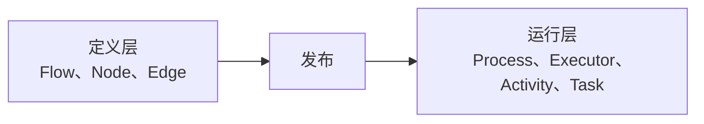

定义层不保存某次流程的申请数据和运行状态。运行层也不会反过来修改已经发布的流程定义。

这种分离保证了同一份流程定义可以启动很多次，而每次运行又拥有各自独立的数据和进度。

## 2. Flow 是什么

Flow 是**某一个版本下完整的流程定义**。

可以把 Flow 理解成一张有方向的流程图：

- Node 是图中的节点。
- Edge 是节点之间有方向的连线。
- 流程如何定义，运行时就如何沿着这些连线向前走。

从数学上看，Flow 是一个有向图 `G = (V, E)`。其中 `V` 表示全部 Node，`E` 表示全部 Edge。

例如，一个简单的采购流程可以表示为：

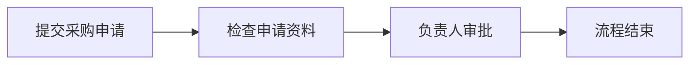

这里的 Flow 不是“流程名称的外壳”，而是包含所有 Node、Edge 和配置的完整定义。

## 3. Flow 的身份与版本

Flow 通过三个信息表达身份：

| 概念 | 含义 | 示例 |
|---|---|---|
| key | 表示这些 Flow 属于同一个流程系列 | `procurement-approval` |
| id | 表示某一份具体、完整的 Flow | `flow-procurement-v2` |
| version | 表示同一个 key 下的发布顺序 | `2` |

同一个 key 的不同版本是不同的 Flow：

- 它们拥有不同的 id。
- 它们都是完整的流程定义。
- 它们可以拥有完全不同的节点和边。
- 新版本不会覆盖旧版本。

## 4. Flow 的状态与流转

Flow 有三种状态：

| 状态 | 含义 |
|---|---|
| DRAFT | 草稿，可以继续修改，不能启动流程 |
| DEPLOYED | 已部署，内容不再修改，可以启动流程 |
| DEPRECATED | 已弃用，不能再启动新流程 |

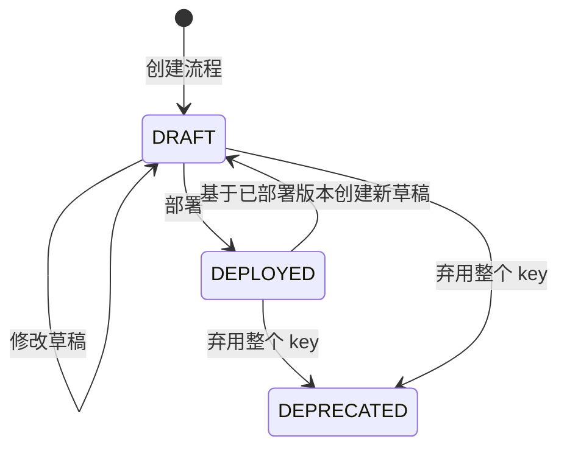

图中的“DEPLOYED 到 DRAFT”表示复制出一份新的草稿；原来的 DEPLOYED Flow 保持不变。

具体规则如下：

1. 新建流程时，先创建一份 DRAFT。
2. DRAFT 中的任何修改都直接更新这份草稿，不产生新版本。
3. 明确部署后，这份 DRAFT 变为 DEPLOYED，并获得正式 version。
4. DEPLOYED 不允许直接修改。再次编辑时，需要复制出一份新的完整 DRAFT。
5. 新 DRAFT 部署后，version 等于当前最大历史版本加一。
6. 弃用某个 key 时，这个 key 下的全部 Flow 都标记为 DEPRECATED。
7. 弃用不会中断已经启动的 Process，只会阻止新的 Process 启动。

为了支持多人编辑，DRAFT 按照 `key + 编辑用户` 保持唯一：

- 同一个用户编辑同一个 key，只会得到一份草稿。
- 不同用户可以分别拥有自己的草稿。
- 多个草稿部署时必须依次生成版本。
- 如果其他人已经发布了更新版本，旧草稿部署前必须提示版本已经落后。

## 5. Node 是什么

Node 是 Flow 中的一个位置，用来说明流程到达这里时应该做什么。

Node 只保存定义信息，不保存申请单内容、审批结果、当前处理人或运行状态。

第一阶段需要支持以下节点含义：

| 节点 | 通俗解释 |
|---|---|
| 开始节点 | 流程入口，可以由人工调用，也可以由外部事件自动触发 |
| 自动节点 | 到达后立即执行，不需要等待人工操作 |
| 人工节点 | 创建待办并暂停当前路径，等待外部完成 |
| 并行开始节点 | 同时开启多条运行路径 |
| 并行汇合节点 | 等待同一轮并行路径全部到达 |
| 结束节点 | 结束当前运行路径 |

每个 Node 主要承载两类内容：

- **运行配置**：决定节点如何工作，例如使用哪个执行行为、人工任务名称、谁可以处理、并行汇合标识。
- **辅助信息**：帮助团队理解或展示，例如节点说明、标签和设计器坐标。这些信息不影响流程运行。

Node 还保存进入自己的 Edge 和离开自己的 Edge。Flow 完整加载后，可以直接从当前 Node 知道它从哪里来、可能去哪里。

## 6. Edge 是什么

Edge 是连接两个 Node 的有向边。

每条 Edge 都需要明确：

- 从哪个 Node 出发。
- 到哪个 Node 结束。
- 通过这条边需要满足什么条件。
- 多条边同时满足时，按照什么优先级选择。
- 没有条件满足时，是否有默认路线。

Flow 加载完成后：

- Edge 可以直接找到来源 Node 和目标 Node。
- Node 可以直接找到进入和离开自己的全部 Edge。
- 运行时不再额外创建一份 Graph，也不需要在每经过一个节点时重新查询完整定义。

## 7. Edge 条件如何选择路线

条件属于 Edge，不属于 Node。当前 Node 完成后，引擎检查它的 outgoing Edge，并根据 Edge 上的条件决定下一步。

路线选择必须给出确定的结果，不能在相同输入下随机选择不同路线。

选择顺序如下：

1. 查看当前 Node 的全部 outgoing Edge。
2. 按优先级依次判断条件。
3. 选择第一条满足条件的 Edge。
4. 没有条件满足时，选择唯一的默认 Edge。
5. 仍然无法选择，或者同时出现无法区分的结果，本次运行报错。

条件可以读取明确开放的信息，例如流程数据、节点运行结果和可信的用户权限信息。

第一阶段不允许在条件中执行任意 Java、Shell 或不受控制的脚本，避免流程定义变成不可预测的程序。

## 8. 流程如何定义和发布

第一阶段支持文本和 JSON 两种输入形式。两种形式只是表达方式不同，最终都要变成同一种完整 Flow。

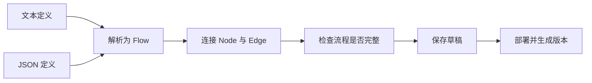

文本定义采用受约束的描述格式，不是任意自然语言。这样才能保证同一份定义每次解析都得到相同结果。

部署前至少要检查：

- 节点和边的标识不能重复。
- 每条边引用的来源和目标必须存在。
- 必须存在开始节点，并且能够到达结束节点。
- 普通节点不能出现无法解释的多条出边。
- 同一个 Node 的 Edge 条件必须能够确定唯一的路线。
- 并行开始和并行汇合必须正确配对。
- 自动循环必须有单次推进次数保护。

只有全部检查通过，DRAFT 才能变为 DEPLOYED。

---

# 第二部分：运行层概念

## 9. Process：一次流程运行

Process 表示某个 Flow 被实际启动的一次运行。

例如，同一个采购审批 Flow 可以分别为三张采购申请创建三个 Process。它们使用相同的流程定义，但各自拥有独立的申请数据、执行路径和待办任务。

Process 只需要重点关注两个状态：

| 状态 | 含义 |
|---|---|
| RUNNING | 正在自动推进，或者正在等待人工处理 |
| COMPLETED | 所有运行路径都已经结束 |

人工节点等待期间，Process 仍然是 RUNNING，而不是结束或失败。

失败状态可以在模型中预留，但第一阶段发生异常时会回滚本次操作，不在同一个失败事务中强行保存 FAILED。

## 10. Executor：流程游标

Executor 可以理解成流程图上的游标，它表示当前运行路径走到了哪个 Node。

Executor 只记录位置和状态，不负责执行节点，也不负责查询流程定义。

常见状态：

- **ACTIVE**：可以继续向前。
- **WAITING**：正在等待人工操作或其他并行路径。
- **COMPLETED**：这条路径已经结束。

一个普通单向流程只需要一个 Executor。出现并行后，一个 Process 可以同时拥有多个 Executor。

**Executor 只能由 Process 创建和管理。** FlowEngine、人工任务服务和节点行为都不能绕过 Process 创建游标。

## 11. Activity：一次节点运行记录

Activity 表示某个 Executor 对某个 Node 的一次实际运行。

Node 是流程中的固定位置，Activity 是运行时的一次到达记录。两者不能混在一起。

例如流程中存在循环，同一个“检查资料”节点被进入两次，就必须产生两条 Activity：

- 第一次记录资料不完整。
- 第二次记录补充资料后检查通过。

这样能够保留完整历史，而不是用第二次结果覆盖第一次。

### 节点状态如何展示

Node 本身没有运行状态。界面或查询中看到的节点状态，需要根据 Activity、Executor 和 Task 共同判断：

| 展示状态 | 表示什么 |
|---|---|
| 未开始 | 还没有产生这个 Node 的 Activity |
| 运行中 | Activity 正在执行，Executor 可以继续推进 |
| 等待中 | 正在等待人工 Task，或者等待其他并行路径 |
| 已通过 | 最近一次 Activity 已正常完成 |
| 失败 | 最近一次运行留下了失败记录；第一阶段只预留这种表达 |
| 已结束 | 结束节点已经完成，对应运行路径已经结束 |

存在循环时，同一个 Node 可能有多条 Activity。查询时既要能展示最近状态，也要保留之前每一轮的历史。

## 12. Task：需要外部完成的事情

人工节点到达后会创建 Task。Task 是流程向外部暴露的待办事项。

Task 会记录它属于哪个 Process、Executor、Activity 和 Node，同时记录谁可以处理、处理结果以及防重复提交的信息。

外部完成 Task 时，只需要提交：

- 要完成的 Task。
- 处理结果。
- 当前操作者。
- 用于防止重复提交的唯一标识。

外部不能指定下一个 Node 或下一条 Edge。Task 完成后去哪里，仍然由原 Flow 决定。

节点上的权限配置会在创建 Task 时变成这一条 Task 的权限要求。完成 Task 时，引擎使用宿主系统提供的可信用户身份进行校验，客户端不能自行声明一个角色来绕过权限。

## 13. 并行关系如何记录

并行不需要额外的运行对象，父子 Executor 本身就可以表达并行关系。

到达并行开始节点后，当前 Executor 成为父 Executor。Process 按照这个节点当时的 outgoing Edge 创建相同数量的子 Executor，每个子 Executor 都记录同一个父 Executor。

到达并行汇合节点后，引擎只统计同时满足以下条件的子 Executor：

- 属于同一个父 Executor。
- 已经到达当前汇合节点。
- 正处于等待汇合的状态。

当等待汇合的子 Executor 数量等于并行开始节点当时的 outgoing Edge 数量时，说明所有路径已经到达，可以完成这些子 Executor 并恢复父 Executor。

上一轮并行产生的子 Executor 已经是完成状态，因此再次进入同一个并行节点时不会被计入。嵌套并行时，当前子 Executor 可以继续成为下一层并行的父 Executor。

## 14. 几个运行概念的关系

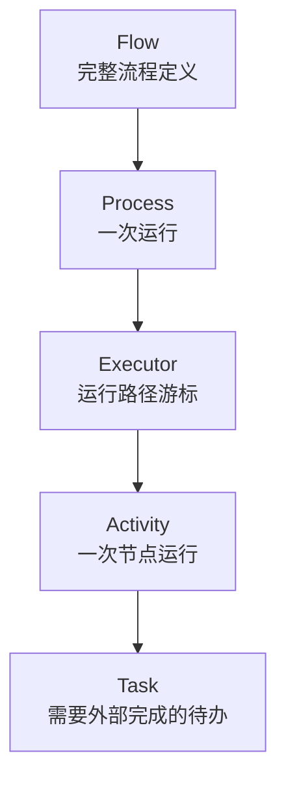

可以用一句话概括：

> Flow 定义路线，Process 代表一次出发，Executor 表示走到哪里，Activity 记录经过了什么，Task 表示正在等谁处理；多个具有同一父 Executor 的子 Executor 表示并行路径。

## 15. 流程数据放在哪里

流程运行需要的数据保存在 Process 中，例如采购金额、资料是否完整、预算是否通过和审批结果。

这些数据可以来自：

- 启动流程时传入的初始数据。
- 自动节点产生的结果。
- 人工任务提交的结果。
- 引擎补充的运行信息。

Node 和 Flow 不保存这些业务数据，因此同一份流程定义可以安全地运行很多次。

并行路径写入数据时，第一阶段要求不同路径使用不同的数据名称。例如预算路径写入“预算是否通过”，审批路径写入“负责人是否通过”。两个并行路径不能同时覆盖同一个值。

## 16. Process 与 Flow 版本绑定

启动时，FlowEngine 根据传入的 flowId 找到所属 key，并选择该 key 下最新的 DEPLOYED Flow。

Process 创建后会记住真正使用的 flowId 和 version。这个绑定之后不会改变。

因此：

- V1 启动的 Process 永远按 V1 运行。
- 发布 V2 不会修改正在运行的 V1 Process。
- V1 即使后来被弃用，已经启动的 Process 仍然可以继续读取 V1。
- V2 发布后，新 Process 使用 V2。

---

# 第三部分：核心如何运行

## 17. 核心组件

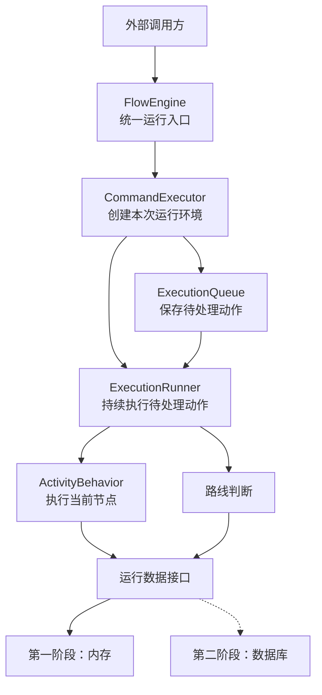

主要组件及其职责如下：

| 组件 | 用通俗语言解释 |
|---|---|
| FlowService | 管理 Flow 的草稿、修改、部署、版本和弃用 |
| FlowEngine | 流程运行的统一入口，负责接收启动和外部完成事件 |
| Process | 创建和管理 Executor，保存本次流程的整体状态 |
| CommandExecutor | 为一次外部调用创建运行环境、生成第一个动作，并负责最终提交或回滚 |
| ExecutionRunner | 本次调用中的推进器，按照顺序把待处理动作执行完 |
| ExecutionQueue | 保存本次调用接下来需要处理的动作 |
| ActivityBehavior | 描述一种节点到达后具体做什么 |
| 路线判断组件 | 根据 Node、Edge、条件和并行状态决定下一步 |
| FlowContext | 保存本次推进所使用的 Flow 和 Process |
| RuntimeSession | 在本次操作中读取和更新 Process、Activity 与 Task |
| DefinitionSession | 启动时选择最新版本，恢复时读取 Process 原来绑定的版本 |
| RuntimeQuery | 在运行结束后提供状态查询，不参与流程推进 |

这些组件各自只处理自己的环节。当前环节完成后，把下一步交给推进器，而不是在一个类中把查询、执行、路由和保存全部做完。

## 18. 为什么需要 ExecutionRunner

FlowEngine 只负责接收调用，不适合自己从开始节点一直运行到结束节点。

ExecutionRunner 是内部推进器。它会不断执行“当前待处理动作”，直到：

- 流程运行完成。
- 到达人工节点，需要等待外部操作。
- 某条并行路径正在等待其他路径。
- 本次执行发生错误。

启动或完成人工任务时，引擎会先把这次请求包装成第一个待处理动作。这个动作完成初始化后，再加入“进入节点”“执行节点”“判断路线”等后续动作。

所有动作都在同一次调用和同一个事务范围中运行。ExecutionRunner 只负责按顺序执行，不查询 Flow、不判断节点类型，也不提交事务。

## 19. 启动流程

FlowEngine 对外提供 `start`。传入 flowId 后，启动过程如下：

1. 根据 flowId 找到所属 key。
2. 选择该 key 下最新的 DEPLOYED Flow，并一次获得全部 Node 和 Edge。
3. 创建 Process，并绑定实际使用的 flowId 和 version。
4. 由 Process 创建根 Executor，把它放在开始节点。
5. 创建 FlowContext，并把“进入开始节点”加入 ExecutionQueue。
6. ExecutionRunner 执行这个动作，创建开始节点的 Activity并连续推进。
7. 当本次推进稳定后，提交结果并返回 Process。

**FlowEngine.start 只返回 Process。Executor 是 Process 内部管理的运行游标，不直接返回给启动方。**

人工启动、定时触发和业务事件触发最终都使用同一个 FlowEngine 启动入口。第一阶段只定义这个统一入口，不负责实现定时器或消息中间件。

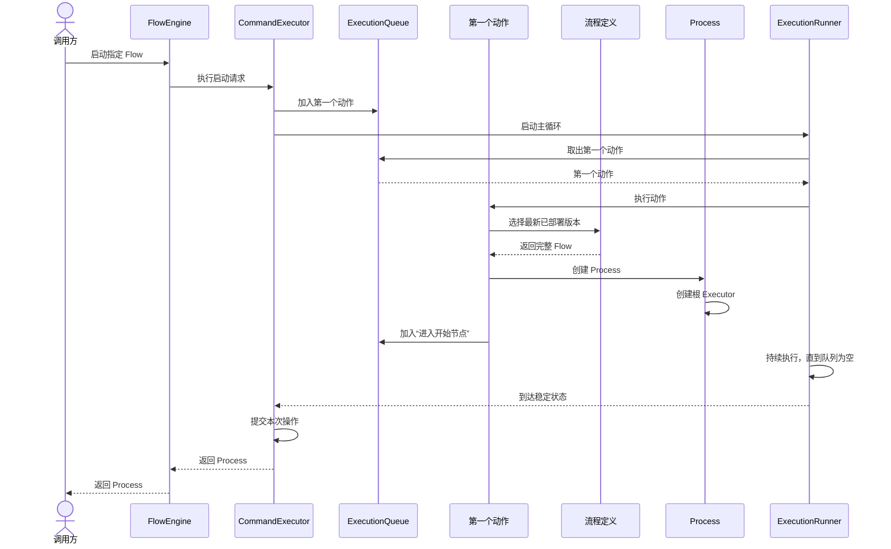

## 20. 节点推进的内部机制

节点推进不是由 FlowEngine 一次性完成，也不是一个 Node 直接调用下一个 Node。内部采用“完成当前阶段，再安排下一阶段”的接力方式。

一次完整的节点推进分为五个阶段：

| 阶段 | 内部发生的事情 |
|---|---|
| 进入 Node | 确认 Executor 可以运行并且位于当前 Node，然后创建一条 RUNNING Activity |
| 执行 Node | 根据 Node 找到对应的 ActivityBehavior，由它完成这个节点自身的工作 |
| 处理结果 | 节点立即完成时保存输出；需要外部参与时创建 Task 并让 Executor 等待 |
| 选择 Edge | 节点完成后读取 outgoing Edge，根据条件、优先级或并行规则决定下一步 |
| 移动 Executor | 校验 Edge 的来源是当前 Node，把 Executor 移到目标 Node，并安排下一次“进入 Node” |

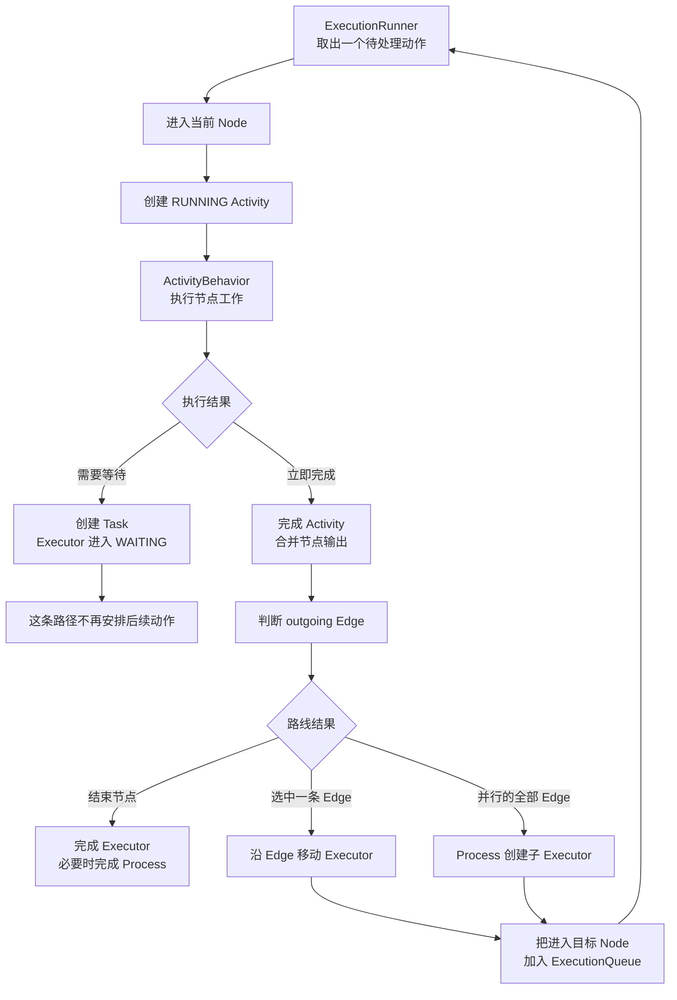

### 20.1 ExecutionQueue 中放什么

ExecutionQueue 保存的不是 Flow、Node 或 Process 数据，而是“接下来要执行的动作”。例如：

- 进入某个 Node。
- 完成当前 Activity。
- 判断当前 Node 的 outgoing Edge。
- 沿某条 Edge 移动 Executor。
- 从人工节点恢复。
- 结束一条 Executor 路径。

当前动作只完成自己的阶段，然后把下一步动作放入队列。它不会直接递归执行整个后续流程。

### 20.2 第一个动作如何产生

调用 FlowEngine 后，CommandExecutor 会创建本次调用使用的 CommandContext、事务、DefinitionSession、RuntimeSession 和 ExecutionQueue，然后把外部请求包装成队列中的第一个动作。此时还没有 FlowContext，因为具体使用哪个 Flow 和 Process 尚未确定。

启动流程时，第一个动作负责：

1. 选择最新的 DEPLOYED Flow。
2. 创建 Process 和根 Executor。
3. 使用选中的 Flow 和新 Process 创建 FlowContext。
4. 把“进入开始节点”加入 ExecutionQueue。

完成人工任务时，第一个动作负责：

1. 根据 taskId 恢复 Process、Executor、Activity 和 Task。
2. 读取 Process 原来绑定的 Flow。
3. 使用原 Flow 和恢复出的 Process 创建 FlowContext。
4. 校验本次完成请求。
5. 把“恢复人工节点”加入 ExecutionQueue。

第一个动作完成后，启动和人工恢复都会进入同一套节点推进主循环。

### 20.3 ExecutionRunner 如何形成主循环

ExecutionRunner 的规则非常简单：

1. 从 ExecutionQueue 取出最早加入的动作。
2. 执行这个动作。
3. 当前动作可能向队列加入后续动作。
4. 继续取下一个动作。
5. 队列为空时，结束本次推进。

队列为空不一定表示 Process 已结束，也可能表示所有当前路径都在等待人工操作或并行汇合。这种状态称为“本次推进已经稳定”。

### 20.4 一个自动节点的内部时序

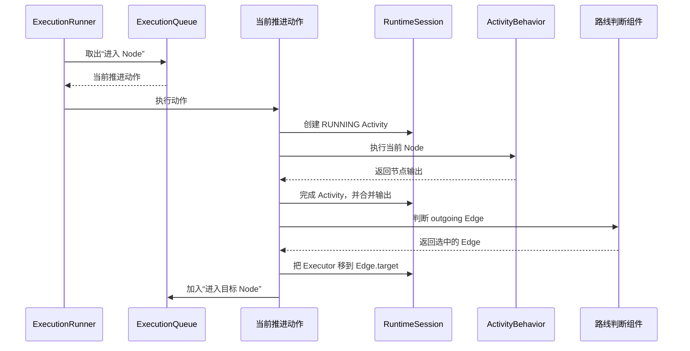

如果目标仍然是自动节点，ExecutionRunner 会继续消费刚加入的动作，因此多个自动节点可以在同一次调用中连续运行。

### 20.5 每个阶段何时保存状态

每个阶段完成自身修改后，都会立即写入本次 RuntimeSession：

- 创建 Activity 后立即记录 RUNNING。
- 节点完成后立即记录 Activity 结果和 Process 数据。
- Executor 移动后立即记录新的 current Node。
- 创建 Task 后立即记录 Task 和 Executor 的 WAITING 状态。

这些修改仍然属于同一次事务。队列正常耗尽后统一提交；中途任何阶段失败，本次调用产生的全部修改一起回滚。

## 21. 人工节点如何等待和恢复

到达人工节点后，引擎会：

1. 创建 Activity，并保持在运行中。
2. 创建一条 Task。
3. 将当前 Executor 标记为 WAITING。
4. 停止为这条路径安排后续动作。
5. 提交当前结果并结束本次调用。

等待期间不会一直占用线程，也不会保留一个长期事务。FlowContext 和本次执行队列都会关闭。

外部人员完成 Task 后：

1. TaskService 把完成请求交给 FlowEngine。
2. 根据 taskId 一次找到关联的 Process、Executor、Activity 和 Task。
3. 根据 Process 绑定的 flowId 读取原来的 Flow 版本。
4. 检查 Task 状态、操作者权限和防重复提交标识。
5. 保存处理结果，完成 Activity，并重新激活 Executor。
6. 从原 Flow 的 outgoing Edge 继续推进。

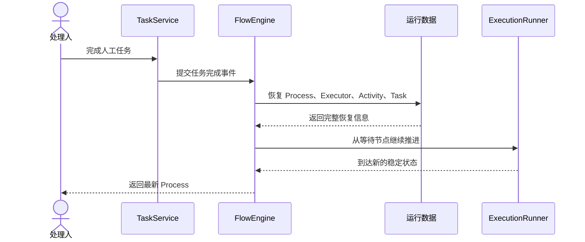

## 22. 带条件的 Edge 如何运行

当前 Node 完成后，引擎读取允许使用的数据，然后按照 outgoing Edge 的条件和优先级选择路线。这个判断不会创建一个额外的 Node 或 Activity。

例如：

- 资料完整，进入预算和审批环节。
- 资料不完整，进入补充资料环节。
- 预算和负责人都通过，创建采购单。
- 任意一项不通过，记录驳回结果。

如果条件定义无法得到唯一结果，本次执行失败并回滚，不能随便选择一条边继续。

## 23. 循环如何运行

循环不需要特殊节点。只要某条 Edge 指向前面已经经过的 Node，就形成循环。

每次重新进入 Node 都创建新的 Activity，因此能够看到每一轮的执行情况。

为了防止全部由自动节点组成的错误循环一直占用线程，单次调用设置最大推进次数。超过限制时立即停止并报告流程定义或运行错误。

## 24. 并行如何运行

到达并行开始节点后：

1. 父 Executor 进入等待。
2. Process 按照 outgoing Edge 的数量创建多个子 Executor。
3. 每个子 Executor 记录相同的父 Executor。
4. 每个子 Executor 分别沿自己的 Edge 向前推进。

到达并行汇合节点后：

1. 先到达的子 Executor 进入 WAITING。
2. 引擎统计同一父 Executor 下，已经到达当前汇合节点的等待中子 Executor。
3. 将统计数量与并行开始节点当时的 outgoing Edge 数量比较。
4. 数量不足时继续等待；数量相等时，说明全部路径已经到达。
5. 全部子 Executor 进入 COMPLETED，父 Executor 恢复，并从汇合节点后面继续运行。

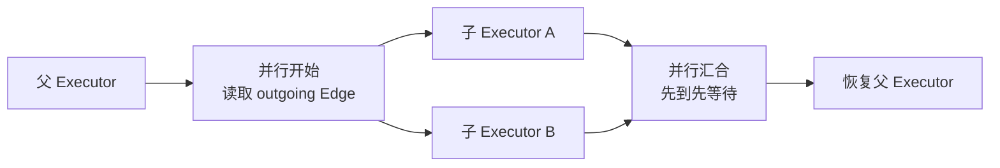

判断汇合时只统计当前仍在等待的子 Executor。已经完成的历史 Executor 不参与下一轮判断。

## 25. 事务、异常与内存实现

一次启动或一次人工任务完成，就是一个完整的操作边界。

运行过程中，每个环节完成后都会把结果同步写入当前运行会话。全部动作执行完后统一提交；任何环节发生异常时，本次操作整体回滚。

因此不会出现“Task 已完成，但 Executor 没有继续移动”这样的半完成状态。

第一阶段使用内存保存 Flow 和运行数据：

- 开始操作时，以当前已提交数据创建本次运行视图。
- 运行过程中，所有读取和修改都发生在这个视图中。
- 成功时一次性发布修改后的结果。
- 失败时直接丢弃本次修改。

核心依赖的是统一的数据访问接口，而不是内存 Map。第二阶段替换为数据库时，流程推进规则和核心组件职责不需要改变。

同一个 Task 的重复完成请求通过唯一标识保证幂等：

- 相同 Task 和相同唯一标识重复提交时，返回第一次结果，不重复推进。
- Task 已完成但使用不同唯一标识再次提交时，返回冲突。

---

# 第四部分：采购申请流程演绎

## 26. 真实流程图

下面用采购申请完整演示自动节点、人工节点、Edge 条件、循环和并行。

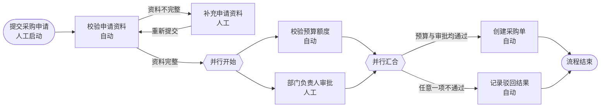

## 27. 发布采购流程 V1

团队先创建采购流程草稿，在草稿中定义完整节点、连线和条件。

部署前检查：

- 每条边的来源和目标都存在。
- 资料不完整时可以回到补充资料环节。
- 并行开始与并行汇合正确配对。
- 最终无论通过还是驳回，都可以到达结束节点。

检查通过后发布为 V1。此时 Flow 状态为 DEPLOYED，可以启动 Process。

## 28. 第一次启动并进入资料补充

申请人提交一张采购申请。初始信息包括申请人、部门、采购金额和申请资料。

FlowEngine 启动流程后：

1. 选择最新的 DEPLOYED V1。
2. 创建 Process P1，并绑定 V1。
3. P1 创建根 Executor，从“提交采购申请”开始运行。
4. “校验申请资料”自动执行，发现资料不完整。
5. “校验申请资料”离开时，满足“资料不完整”的 Edge 条件，因此进入补充资料节点。
6. 引擎创建补充资料 Task，Executor 进入 WAITING。
7. 本次启动结束，P1 仍是 RUNNING。

此时系统已经保存第一次资料校验的 Activity，因此后面重新校验不会覆盖这次记录。

## 29. 补充资料并形成循环

申请人完成“补充申请资料”Task，并提交新的资料。

引擎根据 Task 恢复 P1 和原来的 Executor，然后继续运行：

1. 完成补充资料 Activity。
2. 按照 Flow 中的 Edge 回到“校验申请资料”。
3. 为第二次资料校验创建新的 Activity。
4. 资料检查通过。
5. “校验申请资料”离开时，满足“资料完整”的 Edge 条件，因此进入并行开始节点。

到这里，“校验申请资料”已经产生两条 Activity，分别表达第一次不完整和第二次通过。

## 30. 同时进行预算校验和负责人审批

到达并行开始节点后：

1. 根 Executor 暂停在并行范围外等待。
2. 并行开始节点有两条 outgoing Edge。
3. Process 创建预算路径和审批路径两个子 Executor，它们都指向同一个根 Executor。

预算路径自动检查采购金额和预算额度，得到“预算通过”，随后到达并行汇合点等待。

审批路径进入“部门负责人审批”，创建人工 Task，然后等待负责人处理。

此时 P1 的状态仍然是 RUNNING：

- 预算路径已经完成自己的工作。
- 审批路径正在等待人工操作。
- 父 Executor 正在等待两条路径汇合。

## 31. 完成审批并汇合

部门负责人完成审批 Task，结果为“同意采购”。

审批路径到达并行汇合点后，引擎发现：并行开始节点有两条 outgoing Edge，当前汇合节点上也正好有两个属于同一父 Executor 的等待中子 Executor。因此可以确认两条路径都已经到达：

1. 两个子 Executor 完成。
2. 根 Executor 恢复。
3. 根 Executor 从并行汇合节点继续判断 outgoing Edge。

“预算通过”和“负责人通过”同时满足，因此引擎选择通往“创建采购单”的 Edge。

创建采购单完成后，根 Executor 到达结束节点。所有 Executor 都已经结束，P1 进入 COMPLETED。

## 32. 最终运行历史

P1 的主要 Activity 历史如下：

| 顺序 | 节点 | 说明 |
|---|---|---|
| 1 | 提交采购申请 | 开始流程 |
| 2 | 第一次校验申请资料 | 资料不完整 |
| 3 | 补充申请资料 | 通过 Edge 条件进入，等待申请人并完成 |
| 4 | 第二次校验申请资料 | 资料完整，通过另一条 Edge 进入并行环节 |
| 5 | 并行开始 | 创建两条运行路径 |
| 6 | 校验预算额度 | 自动完成 |
| 7 | 部门负责人审批 | 等待负责人并完成 |
| 8 | 两条路径分别到达并行汇合 | 完成本轮并行 |
| 9 | 创建采购单 | 汇合节点的 Edge 条件满足后进入 |
| 10 | 流程结束 | Process 完成 |

Edge 条件判断本身不产生 Activity，因此历史中没有“判断资料是否完整”或“判断是否全部通过”这类虚拟节点。这段历史能够清楚回答：流程经过了哪些真实节点、同一节点执行了几次、在哪些位置等待过，以及并行路径何时完成汇合。

## 33. P1 运行期间发布 V2

假设 P1 正在等待部门负责人审批时，团队发布采购流程 V2。

- P1 已经绑定 V1，所以完成人工任务后仍然按照 V1 继续。
- V2 不会改变 P1 当前的位置、节点和路线。
- V2 发布后新启动的 P2 使用 V2。

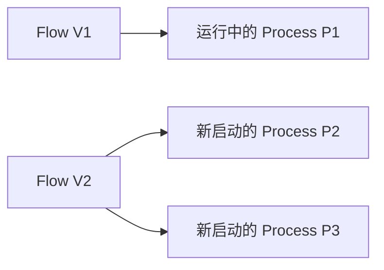

这保证了流程版本升级不会破坏已经运行的实例。

---

# 第五部分：第一阶段交付边界

## 34. 第一阶段需要形成的能力

第一阶段核心设计需要能够完整说明并支撑以下过程：

- 使用文本或 JSON 定义完整 Flow。
- 管理 Flow 草稿、部署、版本升级和弃用。
- 根据最新 DEPLOYED Flow 启动 Process。
- 由 Process 创建 Executor，并沿 Node 和 Edge 推进。
- 自动节点在一次调用中连续运行。
- 人工节点稳定等待，并由外部完成 Task 后继续。
- Node 完成后，根据 outgoing Edge 的条件确定地选择路线。
- 循环保留每一轮 Activity，并具有自动循环保护。
- 并行路径能够分发、等待和汇合。
- 已运行 Process 始终绑定启动时选择的 Flow 版本。
- 第一阶段使用内存运行，未来可以替换为数据库实现。

## 35. 第一阶段暂不处理

以下内容不属于本次核心设计交付：

- 前端流程设计器。
- 数据库表结构和 SQL 优化。
- 跨服务的分布式锁。
- 定时器和消息中间件的具体实现。
- 任意脚本执行能力。
- 运行中的 Process 自动迁移到新 Flow 版本。
- 流程撤回、跳转、补偿和动态加签。
- 完整组织权限系统；核心只使用宿主系统提供的可信身份信息。
- 对 Flowable API、节点名称或数据库结构的兼容。

## 36. 团队评审需要确认的结论

完成评审时，团队需要对以下结论达成一致：

1. Flow 是一个版本下完整的有向流程图。
2. Flow、Node 和 Edge 只保存定义，不保存运行状态。
3. Process 表示一次运行，并永久绑定启动时选中的 Flow 版本。
4. Executor 是 Process 创建和管理的运行游标。
5. Activity 记录每一次节点运行，循环不会覆盖历史。
6. Task 是人工节点与外部系统之间的等待点。
7. FlowEngine 负责接收启动和恢复请求，ExecutionRunner 负责内部推进。
8. 外部只能完成 Task，不能指定流程下一步去哪里。
9. 条件属于 Edge，不存在独立的条件 Node；循环和并行仍然建立在同一套 Node、Edge 和 Executor 模型上。
10. 一次启动或完成操作要么整体成功，要么整体回滚。
11. 内存和数据库只是存储方式不同，不改变流程运行规则。

以上结论确认后，这份文档可以作为第一阶段代码实现、测试验证和后续数据库设计的共同基础。
