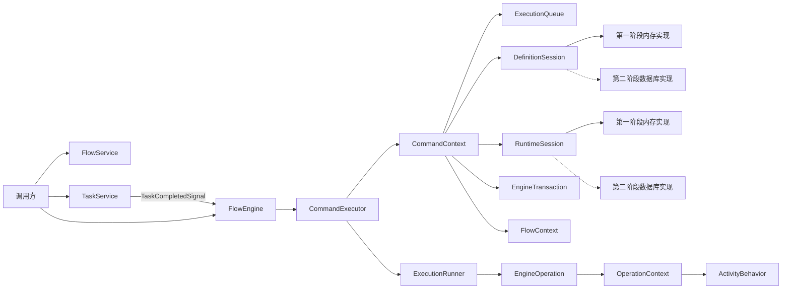
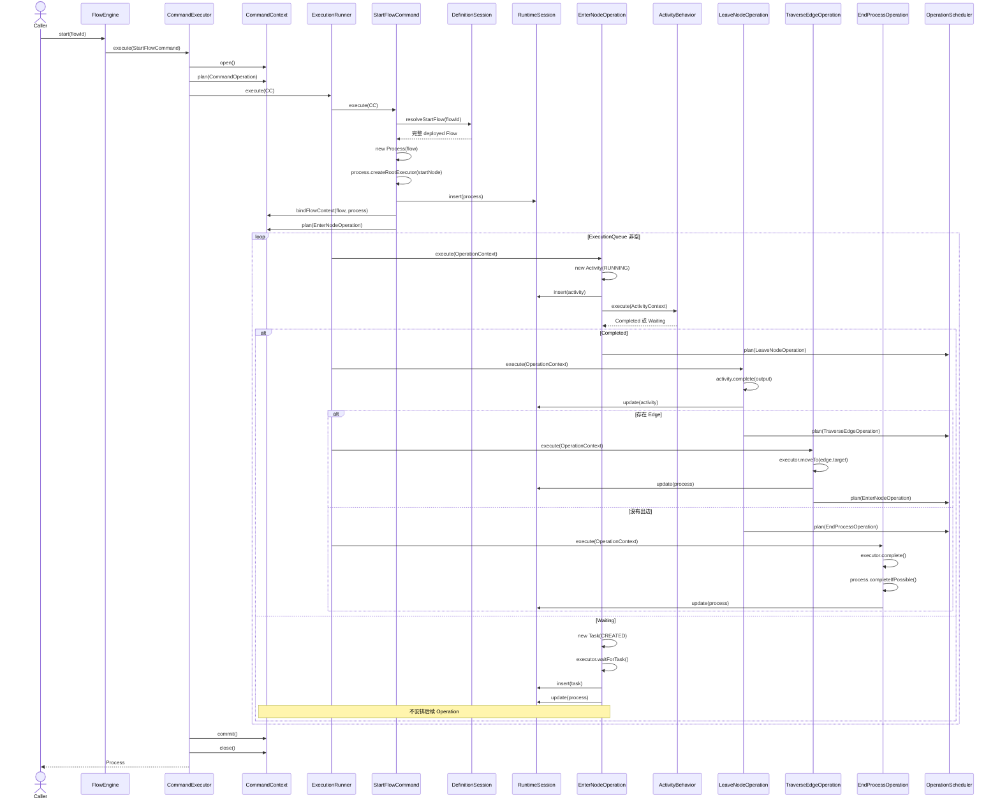
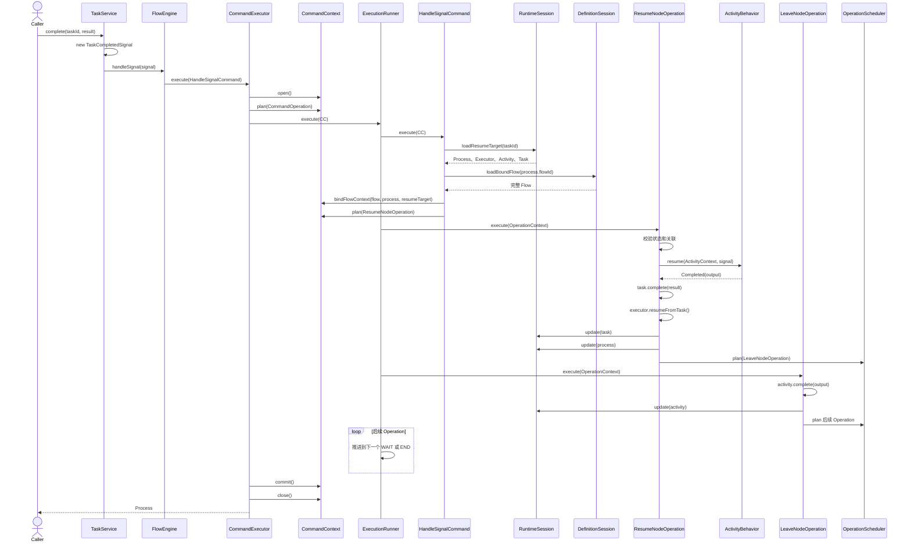

# 工作流核心运行架构设计 V2

## 状态

提议中

## 文档目的

本文档定义工作流核心第二版架构，作为后续代码结构重写、验证规范调整和数据库实现的共同依据。

V2 不在当前原型代码上继续增加补丁。当前代码只用于证明以下运行语义可行：

- 已部署 Flow 可以启动 Process。
- Executor 可以沿 Node 和 Edge 自动推进。
- WAIT Node 可以创建 Task 并进入稳定等待。
- 外部 complete 可以恢复 Executor 并继续推进。

V2 在保留这些语义的基础上，重新划分 Command、Context、Session、Operation、Behavior 和运行实体的职责。

## V2 的结构性变化

相对于 V1，V2 做出以下调整：

1. 增加 `CommandContext`，负责一次外部调用的事务、Session、ExecutionQueue、结果和异常。
2. `FlowContext` 不再承担事务、查询、Command 结果和队列所有权，只保存本次流程推进需要的流程语义。
3. 增加 `OperationContext`，作为 Operation 可使用的最小运行环境。
4. 增加 `ActivityContext`，限制 ActivityBehavior 只能处理节点语义。
5. ExecutionQueue 由 CommandContext 创建和持有，第一个 CommandOperation 可以在 FlowContext 创建前进入队列。
6. Service 和 FlowEngine 不查询 Task、Activity、Process 或 Flow 运行数据。
7. Command 负责一次调用的首次加载或 Process 创建。
8. Operation 不直接使用 Repository，而是通过当前 RuntimeSession 同步写入本阶段结果。
9. 不引入公开的 `RuntimeUnitOfWork` 和 `RuntimeChanges`。
10. 每个 Operation 完成自身阶段并写入成功后，才能安排下一个 Operation。
11. 第一阶段使用内存 Session；第二阶段在不改变核心接口的前提下替换为数据库 Session。

## 当前阶段范围

第一阶段需要支持：

```text
START
ACTION
WAIT
END
```

以及以下流程组合：

```text
全部自动节点
单个人工节点
自动节点和人工节点混合
多个不同人工节点顺序等待
```

第一阶段不实现：

```text
数据库存储
条件分支
并行分支和合并
循环保护
流程暂停和管理员恢复
流程终止
失败状态独立记录事务
外部副作用 Outbox
事件审计存储
HTTP 接口
前端
```

这些能力可以预留状态和扩展位置，但不能增加第一阶段运行主链的复杂度。

## 核心原则

### 流程图是唯一运行依据

工作流核心只理解完整 Flow、Node、Edge、运行游标和外部 Signal。

流程如何定义，Executor 就如何沿图运行。外部 complete 只能提交 Task 结果，不能指定目标 Node 或 Edge。

### 定义层和运行层分离

定义层：

```text
Flow
Node
Edge
```

运行层：

```text
Process
Executor
Activity
Task
Signal
```

运行层可以读取定义层，但不能修改已部署 Flow。

### 一个外部调用对应一个 CommandContext

以下每次调用都创建独立 CommandContext：

```text
FlowEngine.start(...)
FlowEngine.handleSignal(...)
TaskService.complete(...)
```

CommandContext 中的全部 Command 和 Operation 位于同一事务中。

### 环节完成后通过 Operation 交接

节点之间不直接调用：

```text
Node A -> Node B
```

而是：

```text
进入 Node A
-> 完成 Node A 行为
-> 安排离开 Operation
-> 选择 Edge
-> 安排经过 Edge Operation
-> Executor 移动到 Node B
-> 安排进入 Node B Operation
```

### 按阶段同步写入，最终统一提交

每个 Operation 在内存中完成本阶段的完整状态变化后，通过 RuntimeSession 同步写入当前事务。

```text
修改状态
-> 校验本阶段不变量
-> insert/update
-> 写入成功
-> plan next Operation
```

不按单个字段写入，也不等到流程全部结束后再公开生成变更清单。

整个 CommandContext 最终只执行一次 commit。

### 等待不占用线程

WAIT Node 创建 Task、将 Executor 标记为 WAITING 后，不安排后续 Operation。

ExecutionQueue 自然耗尽，本次事务提交并返回。等待期间不保留线程、FlowContext 或 ExecutionQueue。

## 总体架构



## 模块职责

### FlowService

负责 Flow 定义生命周期：

- 创建和修改草稿。
- 校验 Flow 图结构。
- 部署 Flow。
- 创建新版本草稿。
- 废弃相同 key 下的 Flow。

FlowService 不启动或推进 Process。

FlowService 通过定义层的 `FlowRepository` 保存和查询 Flow 草稿、部署版本及废弃状态。FlowRepository 只服务于定义生命周期，不进入流程运行主链。

### FlowEngine

FlowEngine 是流程运行统一入口，但只负责把外部动作转换成 Command。

```java
public final class FlowEngine {

    private final CommandExecutor commandExecutor;

    public Process start(String flowId) {
        return commandExecutor.execute(new StartFlowCommand(flowId));
    }

    public Process handleSignal(Signal signal) {
        return commandExecutor.execute(new HandleSignalCommand(signal));
    }
}
```

FlowEngine 不持有 DefinitionSession、RuntimeSession、Repository、ActivityBehaviorRegistry 或 OperationFactory。

### EngineConfiguration

EngineConfiguration 是引擎组装时注入 CommandContext 的只读依赖集合，第一阶段只包含：

```text
IdGenerator
ActivityBehaviorRegistry
```

OperationContext 可以读取 EngineConfiguration 来生成运行实体 id 和定位 ActivityBehavior。EngineConfiguration 不保存运行状态，不提供查询能力，也不替代 Session。

### TaskService

TaskService 负责接收外部任务操作，并转换为 Signal。

```text
complete request
-> TaskCompletedSignal
-> FlowEngine.handleSignal(signal)
```

TaskService 不预先查询 Task，不完成 Activity，不移动 Executor，不选择 Edge。

### CommandExecutor

CommandExecutor 负责：

- 创建 CommandContext。
- 创建第一个 CommandOperation。
- 调用 ExecutionRunner。
- 成功时 commit。
- 异常时 rollback。
- 最后关闭 CommandContext。

### ExecutionRunner

ExecutionRunner 只负责 FIFO 消费 ExecutionQueue：

```java
while (!queue.isEmpty()) {
    EngineOperation operation = queue.poll();
    operation.execute(commandContext);
}
```

ExecutionRunner 不创建 Context，不查数据，不决定路由，不处理节点类型，也不提交事务。

### ActivityBehavior

ActivityBehavior 只回答当前 Node 如何运行：

```text
立即完成
进入等待
```

Behavior 不写库、不修改 Executor 位置、不完成 Process、不安排 Operation。

## 定义层

### Flow

Flow 是某个版本下的完整流程定义，不是流程族或只保存元信息的容器。

建议字段：

```text
id
key
name
description
state
version
baseFlowId
baseVersion
draftOwnerId
nodes
edges
createdAt
updatedAt
deployedAt
```

状态：

```text
DRAFT
DEPLOYED
DEPRECATED
```

只有 DEPLOYED Flow 可以启动新的 Process。

### Flow 版本规则

```text
create
-> 新建 DRAFT Flow

update draft
-> 直接修改当前 DRAFT Flow

deploy draft
-> DRAFT 变为 DEPLOYED
-> version = 当前 key 最大已部署版本 + 1

edit deployed
-> 原 DEPLOYED Flow 保持不变
-> 复制为新的完整 DRAFT Flow
-> baseFlowId 指向来源 Flow

deprecate key
-> 相同 key 下所有版本标记为 DEPRECATED
```

不同版本具有：

```text
相同 key
不同 id
不同 version
可以具有不同 Node 和 Edge
```

Process 启动后绑定实际选中的 flowId 和 flowVersion，后续部署新版本不影响已运行 Process。

草稿唯一性第一阶段按照：

```text
key + draftOwnerId
```

约束。单用户场景下 draftOwnerId 可以使用固定系统用户。

### Node

Node 是静态节点定义，只描述节点是什么、使用哪个 Behavior，以及 Behavior 所需的静态配置。

Node 不包含 Task 结果、运行状态、执行时间、当前处理人或 Process variables。

建议字段：

```text
id
flowId
name
type
config
metadata
incoming
outgoing
```

第一阶段 NodeType：

```text
START
ACTION
WAIT
END
```

`config` 保存运行配置，例如：

```json
{
  "executor": "noop",
  "completion": {
    "mode": "manual"
  },
  "taskName": "人工确认"
}
```

`metadata` 只保存不影响核心运行语义的扩展描述。

### Edge

Edge 连接来源 Node 和目标 Node。

建议字段：

```text
id
flowId
sourceId
targetId
source
target
condition
config
metadata
```

完整 Flow 加载后必须装配：

```text
Node.incoming
Node.outgoing
Edge.source
Edge.target
```

Executor 推进期间直接读取对象关系，不根据 nodeId 或 edgeId 查询定义数据。

### Flow 启动选择

`FlowEngine.start(flowId)` 的语义是：

```text
通过传入 flowId 找到 key
-> 选择相同 key 下最新 DEPLOYED Flow
-> 加载完整 Flow
-> Process 绑定最终 Flow 的 id 和 version
```

已有 Process 恢复时必须精确加载 `process.flowId`，不能再次选择最新版本。

## 运行层

### Process

Process 是一个 Flow 启动后产生的流程进程，也是 Executor 的创建者和管理者。

建议字段：

```text
id
flowId
flowKey
flowVersion
businessKey
state
variables
executors
rootExecutorId
startedAt
endedAt
startedBy
revision
```

状态：

```text
RUNNING
SUSPENDED
COMPLETED
FAILED
TERMINATED
```

第一阶段只实际使用 RUNNING 和 COMPLETED。

Process 不设置 WAITING。人工等待期间 Process 仍为 RUNNING。

### Executor

Executor 是 Process 中沿 Flow 图移动的运行游标。

建议字段：

```text
id
processId
parentId
currentNodeId
state
createdAt
updatedAt
revision
```

状态：

```text
ACTIVE
WAITING
SUSPENDED
COMPLETED
FAILED
TERMINATED
```

第一阶段状态转换：

```text
创建             -> ACTIVE
进入 WAIT        ACTIVE -> WAITING
完成 Task        WAITING -> ACTIVE
到达 END         ACTIVE -> COMPLETED
```

只有 Process 可以创建 Executor。

### Activity

Executor 每次进入 Node 都创建新的 Activity。Activity 是一次节点执行记录，不是 Node 的运行字段。

建议字段：

```text
id
processId
executorId
nodeId
nodeType
state
inputVariables
outputVariables
startedAt
endedAt
errorMessage
revision
```

状态：

```text
RUNNING
COMPLETED
FAILED
CANCELLED
SKIPPED
```

人工等待期间 Activity 保持 RUNNING。

### Task

Task 表示 Node 运行过程中产生的外部交互任务。

建议字段：

```text
id
processId
executorId
activityId
nodeId
type
state
name
payload
result
assignee
completedBy
idempotencyKey
createdAt
claimedAt
completedAt
revision
```

第一阶段 TaskType：

```text
MANUAL
```

状态：

```text
CREATED
CLAIMED
COMPLETED
CANCELLED
EXPIRED
FAILED
```

第一阶段实际转换：

```text
CREATED -> COMPLETED
```

### Signal

Signal 是外部世界提交给 FlowEngine 的输入。

第一阶段 TaskCompletedSignal 只包含：

```text
taskId
result
operatorId
idempotencyKey
```

不允许包含：

```text
processId
executorId
activityId
targetNodeId
targetEdgeId
```

这些内部关联必须由 RuntimeSession 根据 taskId 恢复和校验。

## 状态不变量

### 人工等待稳定状态

```text
Process.state  = RUNNING
Executor.state = WAITING
Activity.state = RUNNING
Task.state     = CREATED 或 CLAIMED
Queue          = EMPTY
```

同时必须满足：

```text
Task.processId  = Process.id
Task.executorId = Executor.id
Task.activityId = Activity.id
Task.nodeId     = Activity.nodeId
Executor.currentNodeId = Activity.nodeId
```

第一阶段同一个人工 Activity 只能存在一个有效 Task。

### Process 完成

到达 END 不能直接无条件完成 Process：

```text
当前 Executor COMPLETED
-> Process 检查全部 Executor
-> 不存在 ACTIVE、WAITING、SUSPENDED Executor
-> Process COMPLETED
```

该规则为后续并行 Executor 保留扩展空间。

### 状态修改权限

| 状态变化 | 唯一负责方 |
| --- | --- |
| 创建 Process | StartFlowCommand |
| 创建根 Executor | Process |
| 创建 Activity | EnterNodeOperation |
| Activity 完成 | LeaveNodeOperation |
| 创建 Task | EnterNodeOperation 的 WAIT 分支 |
| Executor 进入 WAITING | EnterNodeOperation |
| Task 完成 | ResumeNodeOperation |
| Executor 恢复 ACTIVE | ResumeNodeOperation |
| Executor 移动 Node | TraverseEdgeOperation |
| Executor 完成 | EndProcessOperation |
| Process 完成 | Process 自身判断 |

实体不提供任意 setter，只提供带状态校验的意图方法。

## Context 设计

### CommandContext

CommandContext 是一次外部调用的事务和调度上下文。

建议字段：

```text
id
state
executionQueue
definitionSession
runtimeSession
transaction
configuration
flowContext
result
failure
```

状态：

```text
OPEN
COMMITTED
ROLLED_BACK
CLOSED
```

允许转换：

```text
OPEN -> COMMITTED -> CLOSED
OPEN -> ROLLED_BACK -> CLOSED
```

CommandContext 负责创建和关闭 Session、提交或回滚事务、保存 Command 结果。

### FlowContext

FlowContext 只保存本次流程推进语义：

```text
flow
process
resumeTarget
attributes
```

FlowContext 不持有 Repository，不创建事务，不拥有 Command 结果，也不负责最终 commit。

FlowContext 不保存唯一 currentExecutor。每个 Operation 明确携带自己的 Executor、Node、Activity 或 Edge。

### OperationContext

OperationContext 是 FlowOperation 可以使用的最小上下文：

```text
flowContext
runtimeSession
operationScheduler
configuration
```

Operation 可以读取 Flow 和 Process、修改运行实体、同步写入当前阶段、安排后续 Operation。

### ActivityContext

ActivityContext 是 Behavior 可以使用的最小上下文：

```text
flow
process
executor
node
activity
processVariables read view
```

ActivityContext 不暴露 RuntimeSession、ExecutionQueue 或 OperationScheduler。

### ResumeTarget

ResumeTarget 是人工任务恢复所需运行对象的组合：

```java
public record ResumeTarget(
        Process process,
        Executor executor,
        Activity activity,
        Task task) {
}
```

它由 RuntimeSession 一次恢复并校验对象关联。

## Session 和 Adapter

第一阶段只稳定语义接口，不设计 SQL、JOIN、索引、数据库缓存或表结构。

### DefinitionSession

```java
public interface DefinitionSession {

    Flow resolveStartFlow(String requestedFlowId);

    Flow loadBoundFlow(String flowId);
}
```

`resolveStartFlow` 返回相同 key 下最新 DEPLOYED 的完整 Flow。

`loadBoundFlow` 精确返回已有 Process 绑定的完整 Flow，即使该 Flow 后来被标记为 DEPRECATED。

### RuntimeSession

```java
public interface RuntimeSession {

    ResumeTarget loadResumeTarget(String taskId);

    void insert(Process process);

    void insert(Activity activity);

    void insert(Task task);

    void update(Process process);

    void update(Activity activity);

    void update(Task task);
}
```

RuntimeSession 在一个 CommandContext 中复用已经加载的实体。具体缓存和数据访问方式属于 Adapter 实现。

### EngineSessionFactory

```java
public interface EngineSessionFactory {

    EngineTransaction openTransaction();

    DefinitionSession openDefinitionSession(
            EngineTransaction transaction);

    RuntimeSession openRuntimeSession(
            EngineTransaction transaction);
}
```

CommandContextFactory 必须先创建 EngineTransaction，再使用同一个 transaction 创建 DefinitionSession 和 RuntimeSession。数据库实现中，两个 Session 必须绑定同一个事务资源和数据库连接。

### EngineTransaction

```java
public interface EngineTransaction extends AutoCloseable {

    void commit();

    void rollback();
}
```

### 第一阶段内存实现

```text
InMemoryEngineSessionFactory
InMemoryDefinitionSession
InMemoryRuntimeSession
InMemoryEngineTransaction
InMemoryDefinitionState
InMemoryRuntimeState
InMemoryRuntimeQuery
```

内存 Session 按照与数据库事务相同的接口工作。实现细节可以使用当前命令的隔离内存视图，commit 后发布，rollback 时丢弃。

### 第二阶段数据库实现

```text
DatabaseEngineSessionFactory
DatabaseDefinitionSession
DatabaseRuntimeSession
DatabaseEngineTransaction
DatabaseRuntimeQuery
```

数据库 Adapter 可以自由选择 JOOQ、锁、缓存和查询方式，不修改 Command、Operation、Behavior 或 FlowEngine。

### 只读查询接口

运行轨迹展示和测试验证使用独立只读接口：

```java
public interface RuntimeQuery {

    Optional<Process> findProcess(String processId);

    List<Activity> findActivities(String processId);

    List<Task> findTasks(String processId);
}
```

RuntimeQuery 不参与流程推进。

## Command 和运行主循环

### Command

```java
public interface Command<T> {

    T execute(CommandContext context);
}
```

Command 负责本次调用的首次加载或创建，并安排第一个 FlowOperation。

### EngineOperation

```java
public interface EngineOperation {

    void execute(CommandContext context);
}
```

### FlowOperation

普通流程 Operation 通过基类被限制为只能使用 OperationContext：

```java
public abstract class FlowOperation implements EngineOperation {

    @Override
    public final void execute(CommandContext commandContext) {
        execute(commandContext.operationContext());
    }

    protected abstract void execute(OperationContext context);
}
```

### CommandOperation

CommandExecutor 创建的第一个操作：

```java
public final class CommandOperation<T> implements EngineOperation {

    private final Command<T> command;

    @Override
    public void execute(CommandContext context) {
        T result = command.execute(context);
        context.setResult(result);
    }
}
```

### ExecutionQueue

ExecutionQueue 属于 CommandContext，是一次调用内的 FIFO 内存队列。

```text
CommandContext 创建队列
CommandExecutor 放入第一个 CommandOperation
Command 和 FlowOperation 安排后续 Operation
WAIT 不安排后续 Operation
队列为空代表本次同步推进结束
```

队列为空不等于 Process 完成，也可能代表 Process 已经稳定等待。

### CommandExecutor

```java
public <T> T execute(Command<T> command) {
    CommandContext context = contextFactory.open();

    try {
        context.executionQueue().plan(new CommandOperation<>(command));
        executionRunner.execute(context);
        context.commit();
        return context.result();
    } catch (Throwable throwable) {
        context.rollback(throwable);
        throw throwable;
    } finally {
        context.close();
    }
}
```

### ExecutionRunner

```java
public void execute(CommandContext context) {
    ExecutionQueue queue = context.executionQueue();

    while (!queue.isEmpty()) {
        EngineOperation operation = queue.poll();
        operation.execute(context);
    }
}
```

## Operation 协议

### EnterNodeOperation

负责进入 Node：

```text
校验 Executor ACTIVE 且位于目标 Node
-> 创建 Activity(RUNNING)
-> RuntimeSession.insert(activity)
-> 调用 ActivityBehavior.execute(ActivityContext)
```

Behavior 返回 Completed：

```text
plan LeaveNodeOperation
```

Behavior 返回 Waiting：

```text
创建 Task(CREATED)
-> Executor ACTIVE -> WAITING
-> insert Task
-> update Process
-> 不安排后续 Operation
```

### LeaveNodeOperation

负责离开当前 Node：

```text
Activity RUNNING -> COMPLETED
-> update Activity
-> 读取 Node.outgoing
-> 选择可通过 Edge
```

存在 Edge：

```text
plan TraverseEdgeOperation
```

不存在 Edge：

```text
plan EndProcessOperation
```

第一阶段非 END Node 必须恰好有一条 outgoing Edge，不执行条件判断。

### TraverseEdgeOperation

负责经过 Edge：

```text
校验 edge.source 等于 Executor 当前 Node
-> executor.moveTo(edge.target)
-> update Process
-> plan EnterNodeOperation(executor, edge.target)
```

### ResumeNodeOperation

负责从 WAIT 恢复：

```text
校验 ResumeTarget 关联
-> 校验 Task CREATED/CLAIMED
-> 校验 Activity RUNNING
-> 校验 Executor WAITING
-> 调用 ActivityBehavior.resume(ActivityContext, signal)
-> Task -> COMPLETED
-> Executor WAITING -> ACTIVE
-> update Task
-> update Process
-> plan LeaveNodeOperation
```

Activity 的完成仍由 LeaveNodeOperation 负责，因此自动执行和人工恢复共用相同离开链路。

### EndProcessOperation

负责完成当前执行路径：

```text
Executor ACTIVE -> COMPLETED
-> Process 检查所有 Executor
-> 如果不存在可继续运行的 Executor，则 Process -> COMPLETED
-> update Process
```

## ActivityBehavior 协议

```java
public interface ActivityBehavior {

    NodeExecutionResult execute(ActivityContext context);

    NodeExecutionResult resume(
            ActivityContext context,
            Signal signal);
}
```

第一阶段结果：

```java
public sealed interface NodeExecutionResult {

    record Completed(
            Map<String, Object> output) implements NodeExecutionResult {
    }

    record Waiting(
            TaskDefinition task) implements NodeExecutionResult {
    }
}
```

节点失败直接抛异常，不通过 Failed result 返回。

## 启动与自动推进时序



## 人工 Task 完成时序



## 四种第一阶段运行链

### 全自动

```text
Command
-> Enter START
-> Leave START
-> Traverse
-> Enter ACTION
-> Leave ACTION
-> Traverse
-> Enter END
-> Leave END
-> EndProcess
```

### 单个人工节点

```text
start:
Command -> Enter START -> Leave -> Traverse -> Enter WAIT -> Queue empty

complete:
Command -> Resume WAIT -> Leave -> Traverse -> Enter END -> Leave -> EndProcess
```

### 自动和人工混合

```text
start:
自动推进 -> Enter WAIT -> Queue empty

complete:
Resume WAIT -> Leave -> 自动推进 -> EndProcess
```

### 多个人工节点顺序等待

```text
start:
Enter WAIT_A -> Queue empty

complete A:
Resume WAIT_A -> 自动推进 -> Enter WAIT_B -> Queue empty

complete B:
Resume WAIT_B -> 自动推进 -> EndProcess
```

## 事务与异常

### 正常调用

```text
open CommandContext
-> open Sessions 和 Transaction
-> plan CommandOperation
-> consume ExecutionQueue
-> Queue empty
-> commit
-> close
```

### 异常调用

```text
Behavior 或 Operation 抛出异常
-> 当前 Operation 不安排后续 Operation
-> ExecutionRunner 中断
-> CommandExecutor rollback
-> close
-> 异常返回调用方
```

每个 Operation 即使已经执行 insert/update，也因为处于同一个事务中而被整体回滚。

第一阶段不在即将 rollback 的事务中把 Process 标记为 FAILED。需要持久化失败时，应在 rollback 后通过独立命令记录，属于后续阶段。

## 幂等和并发边界

第一阶段至少保证：

- complete 请求必须携带 idempotencyKey。
- 相同 Task 和相同 idempotencyKey 的重复 complete 返回第一次结果，不重复推进。
- 已完成 Task 使用不同 idempotencyKey 再次 complete 时拒绝执行。
- RuntimeSession 恢复时校验 Task、Activity、Executor、Process 关联。
- 同一个 Executor 在同一时间只能有一个推进调用。

具体数据库锁和 revision 更新方式在第二阶段设计。

## 关键接口

### FlowEngine

```java
public interface FlowEngine {

    Process start(String flowId);

    Process handleSignal(Signal signal);
}
```

### TaskService

```java
public interface TaskService {

    Process complete(CompleteTaskRequest request);
}
```

### CompleteTaskRequest

```text
taskId
result
operatorId
idempotencyKey
```

### RuntimeQuery

```java
public interface RuntimeQuery {

    Optional<Process> findProcess(String processId);

    List<Activity> findActivities(String processId);

    List<Task> findTasks(String processId);
}
```

## 推荐目录结构

```text
org.cses.flow/
├── definition/
│   ├── model/
│   ├── service/
│   ├── repository/
│   │   └── FlowRepository.java
│   └── session/
│       └── DefinitionSession.java
│
├── runtime/
│   ├── engine/
│   │   ├── FlowEngine.java
│   │   └── EngineConfiguration.java
│   ├── model/
│   │   ├── Process.java
│   │   ├── Executor.java
│   │   ├── Activity.java
│   │   ├── Task.java
│   │   └── Signal.java
│   ├── command/
│   │   ├── Command.java
│   │   ├── StartFlowCommand.java
│   │   └── HandleSignalCommand.java
│   ├── context/
│   │   ├── CommandContext.java
│   │   ├── CommandContextFactory.java
│   │   ├── FlowContext.java
│   │   ├── OperationContext.java
│   │   ├── ActivityContext.java
│   │   └── ResumeTarget.java
│   ├── execution/
│   │   ├── CommandExecutor.java
│   │   ├── CommandOperation.java
│   │   ├── ExecutionRunner.java
│   │   ├── ExecutionQueue.java
│   │   ├── EngineOperation.java
│   │   ├── FlowOperation.java
│   │   └── OperationScheduler.java
│   ├── execution/operation/
│   │   ├── EnterNodeOperation.java
│   │   ├── LeaveNodeOperation.java
│   │   ├── TraverseEdgeOperation.java
│   │   ├── ResumeNodeOperation.java
│   │   └── EndProcessOperation.java
│   ├── behavior/
│   │   ├── ActivityBehavior.java
│   │   ├── ActivityBehaviorRegistry.java
│   │   ├── NodeExecutionResult.java
│   │   └── impl/
│   ├── session/
│   │   ├── RuntimeSession.java
│   │   ├── EngineSessionFactory.java
│   │   └── EngineTransaction.java
│   └── query/
│       └── RuntimeQuery.java
│
├── task/
│   ├── service/
│   │   └── TaskService.java
│   └── command/
│       └── CompleteTaskRequest.java
│
└── infrastructure/
    └── memory/
        ├── InMemoryDefinitionState.java
        ├── InMemoryRuntimeState.java
        ├── InMemoryFlowRepository.java
        ├── InMemoryDefinitionSession.java
        ├── InMemoryRuntimeSession.java
        ├── InMemoryEngineTransaction.java
        ├── InMemoryEngineSessionFactory.java
        └── InMemoryRuntimeQuery.java
```

## 依赖规则

```text
definition.model
      ↑
runtime.model
      ↑
runtime.behavior
      ↑
runtime.execution
      ↑
runtime.command
      ↑
runtime.engine
```

基础设施 Adapter 依赖核心接口：

```text
infrastructure.memory
-> DefinitionSession
-> RuntimeSession
-> EngineSessionFactory
-> EngineTransaction
-> RuntimeQuery
```

核心包不能导入 `infrastructure.memory`。

## 当前原型代码迁移原则

保留并重整概念：

```text
Flow、Node、Edge
Process、Executor、Activity、Task
FlowValidator
ActivityBehaviorRegistry
ExecutionQueue
ExecutionRunner
```

按 V2 职责重写：

```text
FlowEngine
FlowContext
CommandExecutor
StartFlowCommand
HandleSignalCommand
TaskService
ContinueExecutorOperation
TakeOutgoingEdgesOperation
```

删除或替代：

```text
ExecutionOperationFactory
ProcessRepository
ActivityRepository
TaskRepository
Operation 中的 Repository 依赖
TaskService 中的 Task 预查询
TaskCompletedSignal 中的内部关联字段
```

原型代码不要求逐文件兼容。验证场景和外部核心语义保持兼容，内部结构按照 V2 重新组织。

## 验证要求

V2 第一阶段仍需通过 `VER-FLOW-001` 的四个场景，但验证重点需要增加：

1. FlowEngine 和 TaskService 不持有运行 Repository 或 Session。
2. CommandExecutor 创建第一个 CommandOperation。
3. Command 创建并绑定 FlowContext。
4. ExecutionQueue 属于 CommandContext。
5. Behavior 不访问 Session 或 Scheduler。
6. Operation 完成本阶段写入后再安排下一 Operation。
7. WAIT 不安排后续 Operation。
8. complete 只通过 taskId 恢复内部关联。
9. 自动执行和人工恢复共用 LeaveNodeOperation。
10. 每次 start 或 complete 只 commit 一次。

## 关联文档迁移

V2 被正式采纳并开始实现前，需要同步调整以下文档：

```text
docs/standards/in-memory-workflow-core.md
docs/verification/01-flow-start-and-node-progression.md
docs/agents/reviewer.md
```

需要移除或替换的 V1 规则包括：

```text
FlowContext 持有 ExecutionQueue
FlowEngine 创建 FlowContext
运行层直接依赖 ProcessRepository、ActivityRepository、TaskRepository
TaskService 在发送 Signal 前查询 Task
Operation 每次通过 Repository 保存运行实体
```

在关联文档完成迁移前，V2 文档是目标架构说明，现有验证规范仍只适用于 V1 原型代码，不能用于判断 V2 内部结构是否验收通过。

## 后续阶段

第二阶段：

- 数据库 Session 和事务 Adapter。
- 表结构、索引、锁和 revision 策略。
- 数据库集成验证。

第三阶段：

- Edge condition。
- 多 Edge 路由。
- 并行 Executor。
- 分支合并。

第四阶段：

- 暂停、终止、失败记录和重试。
- EventLog 和审计。
- 外部副作用 Outbox。
- 运行恢复和运维接口。

## 最终结论

V2 的核心运行链是：

```text
Service
-> FlowEngine
-> CommandExecutor
-> CommandContext
-> CommandOperation
-> Command 创建 FlowContext
-> FlowOperation 按阶段推进
-> RuntimeSession 同步写入阶段结果
-> ExecutionQueue 清空
-> CommandContext commit
```

定义层保持完整 Flow 图；Process 管理 Executor；Activity 记录节点执行；Task 承载外部等待；Behavior 只实现节点语义；Operation 负责公共生命周期和环节交接；Session 隔离内存与未来数据库实现。
