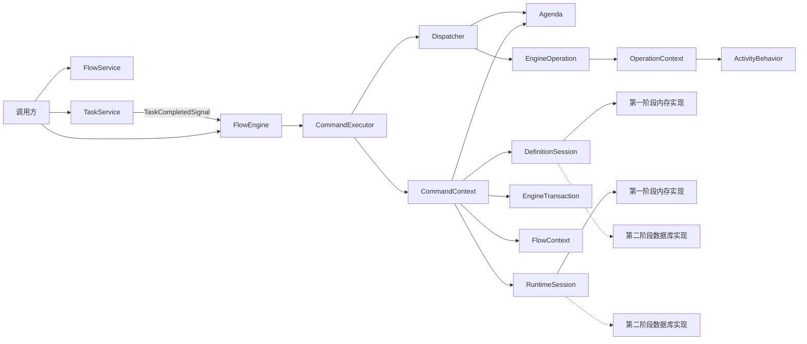
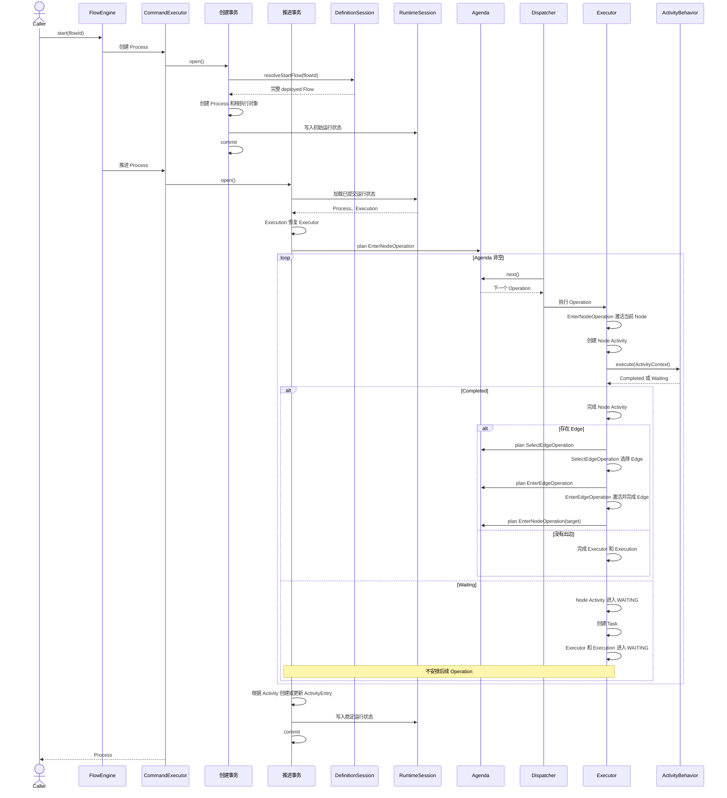
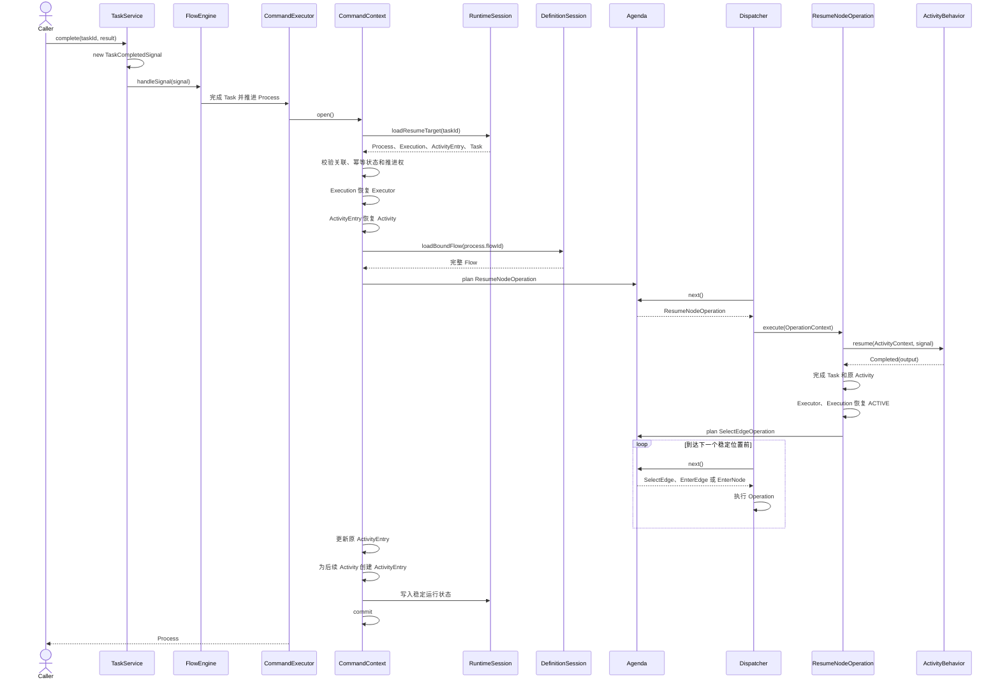

# 工作流核心运行架构设计 V2

## 状态

提议中

## 文档目的

本文档定义工作流核心第二版架构，作为后续代码结构重写、验证规范调整和数据库实现的共同依据。

V2 不在当前原型代码上继续增加补丁。当前代码只用于证明以下运行语义可行：

- 已部署 Flow 可以启动 Process。
- Executor 可以沿 Node 和 Edge 自动推进。
- WAIT Node 可以创建 Task 并进入稳定等待。
- 外部 complete 可以恢复 Executor 并继续推进。

V2 在保留这些语义的基础上，重新划分 Command、Context、Session、Operation、Behavior 和运行实体的职责。

## V2 的结构性变化

相对于 V1，V2 做出以下调整：

1. 增加 `CommandContext`，负责一个事务推进单元的 Session、Agenda、结果和异常。
2. `FlowContext` 不再承担事务、查询、Command 结果和队列所有权，只保存本次流程推进需要的流程语义。
3. 增加 `OperationContext`，作为 Operation 可使用的最小运行环境。
4. 增加 `ActivityContext`，限制 ActivityBehavior 只能处理节点语义。
5. Agenda 由 CommandContext 创建和持有，第一个 CommandOperation 可以在 FlowContext 创建前进入 Agenda。
6. Service 和 FlowEngine 不查询 Task、ActivityEntry、Process 或 Flow 运行数据。
7. Command 负责当前事务推进单元的首次加载或 Process 创建。
8. Operation 不直接使用 Repository 或 RuntimeSession，只修改当前事务工作区中的运行对象。
9. 不引入公开的 `RuntimeUnitOfWork` 和 `RuntimeChanges`。
10. 每个 Operation 完成自身阶段后，通过 Agenda 安排后续 Operation。
11. 第一阶段使用内存 Session；第二阶段在不改变核心接口的前提下替换为数据库 Session。

## 当前阶段范围

第一阶段需要支持：

```text
START
ACTION
WAIT
END
```

以及以下流程组合：

```text
全部自动节点
单个人工节点
自动节点和人工节点混合
多个不同人工节点顺序等待
```

第一阶段不实现：

```text
数据库存储
条件分支
并行分支和合并
循环保护
流程暂停和管理员恢复
流程终止
失败状态独立记录事务
外部副作用 Outbox
事件审计存储
HTTP 接口
前端
```

这些能力可以预留状态和扩展位置，但不能增加第一阶段运行主链的复杂度。

## 核心原则

### 流程图是唯一运行依据

工作流核心只理解完整 Flow、Node、Edge、运行游标和外部 Signal。

流程如何定义，Executor 就如何沿图运行。外部 complete 只能提交 Task 结果，不能指定目标 Node 或 Edge。

### 定义层和运行层分离

定义层：

```text
Flow
Node
Edge
```

运行层：

```text
Process
Executor
Execution
Activity
ActivityEntry
Task
Signal
```

运行层可以读取定义层，但不能修改已部署 Flow。

### 一个事务推进单元对应一个 CommandContext

Process 创建和 Process 内部推进使用不同的 CommandContext：

```text
启动 Flow
-> 创建 Process
-> commit
-> 创建新的 CommandContext
-> 从当前稳定位置推进到下一个稳定位置
-> commit
```

人工 Task 完成、恢复当前 Activity 以及继续推进到下一个稳定位置位于同一个 CommandContext 中。CommandContext 中的全部 Command 和 Operation 位于同一事务中。

### 环节完成后通过 Operation 交接

节点之间不直接调用：

```text
Node A -> Node B
```

而是：

```text
EnterNodeOperation(Node A)
-> 节点执行器完成 Node A 行为
-> SelectEdgeOperation 选择 Edge
-> EnterEdgeOperation 激活并经过 Edge
-> EnterNodeOperation(Node B)
```

### 按阶段更新运行状态，稳定后统一提交

每个 Operation 在内存中完成本阶段的完整状态变化。Execution 可以在事务工作区内持续更新，Activity 保留在当前推进过程内；到达稳定位置后，根据 Activity 统一创建或更新 ActivityEntry，并通过 RuntimeSession 写入当前事务。

```text
修改状态
-> 校验本阶段不变量
-> 更新事务工作区
-> plan next Operation
```

不按单个字段写入，也不等到流程全部结束后再公开生成变更清单。

到达稳定位置后，整个 CommandContext 执行一次 commit。

### 等待不占用线程

WAIT Node 创建 Task、将 Executor 标记为 WAITING 后，不向 Agenda 安排后续 Operation。

Agenda 自然耗尽后，本次涉及的 Execution、ActivityEntry 和 Task 一起提交。等待期间不保留线程、FlowContext、Activity、Operation 或 Agenda。

## 总体架构



## 模块职责

### FlowService

负责 Flow 定义生命周期：

- 创建和修改草稿。
- 校验 Flow 图结构。
- 部署 Flow。
- 创建新版本草稿。
- 废弃相同 key 下的 Flow。

FlowService 不启动或推进 Process。

FlowService 通过定义层的 `FlowRepository` 保存和查询 Flow 草稿、部署版本及废弃状态。FlowRepository 只服务于定义生命周期，不进入流程运行主链。

### FlowEngine

FlowEngine 是流程运行统一入口，负责把外部动作转换成事务推进单元。启动 Flow 时先执行 Process 创建事务，提交后再执行内部推进事务；处理 Signal 时，Task 完成、Activity 恢复和后续推进位于同一个事务推进单元。

FlowEngine 不持有 DefinitionSession、RuntimeSession、Repository、ActivityBehaviorRegistry 或 OperationFactory。

### EngineConfiguration

EngineConfiguration 是引擎组装时注入 CommandContext 的只读依赖集合，第一阶段只包含：

```text
IdGenerator
ActivityBehaviorRegistry
```

OperationContext 可以读取 EngineConfiguration 来生成运行实体 id 和定位 ActivityBehavior。EngineConfiguration 不保存运行状态，不提供查询能力，也不替代 Session。

### TaskService

TaskService 负责接收外部任务操作，并转换为 Signal。

```text
complete request
-> TaskCompletedSignal
-> FlowEngine.handleSignal(signal)
```

TaskService 不预先查询 Task，不完成 Activity，不移动 Executor，不选择 Edge。

### CommandExecutor

CommandExecutor 负责：

- 创建 CommandContext。
- 创建第一个 CommandOperation。
- 调用 Dispatcher。
- 成功时 commit。
- 异常时 rollback。
- 最后关闭 CommandContext。

### Dispatcher

Dispatcher 只负责 FIFO 消费 Agenda：

```java
while (!agenda.isEmpty()) {
    EngineOperation operation = agenda.next();
    operation.execute(commandContext);
}
```

Dispatcher 不创建 Context，不查数据，不决定路由，不处理节点类型，不生成 ActivityEntry，也不提交事务。

### ActivityBehavior

ActivityBehavior 只回答当前 Node 如何运行：

```text
立即完成
进入等待
```

Behavior 不写库、不修改 Executor 位置、不完成 Process、不安排 Operation。

## 定义层

### Flow

Flow 是某个版本下的完整流程定义，不是流程族或只保存元信息的容器。

建议字段：

```text
id
key
name
description
state
version
baseFlowId
baseVersion
draftOwnerId
nodes
edges
createdAt
updatedAt
deployedAt
```

状态：

```text
DRAFT
DEPLOYED
DEPRECATED
```

只有 DEPLOYED Flow 可以启动新的 Process。

### Flow 版本规则

```text
create
-> 新建 DRAFT Flow

update draft
-> 直接修改当前 DRAFT Flow

deploy draft
-> DRAFT 变为 DEPLOYED
-> version = 当前 key 最大已部署版本 + 1

edit deployed
-> 原 DEPLOYED Flow 保持不变
-> 复制为新的完整 DRAFT Flow
-> baseFlowId 指向来源 Flow

deprecate key
-> 相同 key 下所有版本标记为 DEPRECATED
```

不同版本具有：

```text
相同 key
不同 id
不同 version
可以具有不同 Node 和 Edge
```

Process 启动后绑定实际选中的 flowId 和 flowVersion，后续部署新版本不影响已运行 Process。

草稿唯一性第一阶段按照：

```text
key + draftOwnerId
```

约束。单用户场景下 draftOwnerId 可以使用固定系统用户。

### Node

Node 是静态节点定义，只描述节点是什么、使用哪个 Behavior，以及 Behavior 所需的静态配置。

Node 不包含 Task 结果、运行状态、执行时间、当前处理人或 Process variables。

建议字段：

```text
id
flowId
name
type
config
metadata
incoming
outgoing
```

第一阶段 NodeType：

```text
START
ACTION
WAIT
END
```

`config` 保存运行配置，例如：

```json
{
  "executor": "noop",
  "completion": {
    "mode": "manual"
  },
  "taskName": "人工确认"
}
```

`metadata` 只保存不影响核心运行语义的扩展描述。

### Edge

Edge 连接来源 Node 和目标 Node。

建议字段：

```text
id
flowId
sourceId
targetId
source
target
condition
config
metadata
```

完整 Flow 加载后必须装配：

```text
Node.incoming
Node.outgoing
Edge.source
Edge.target
```

Executor 推进期间直接读取对象关系，不根据 nodeId 或 edgeId 查询定义数据。

### Flow 启动选择

`FlowEngine.start(flowId)` 的语义是：

```text
通过传入 flowId 找到 key
-> 选择相同 key 下最新 DEPLOYED Flow
-> 加载完整 Flow
-> Process 绑定最终 Flow 的 id 和 version
```

已有 Process 恢复时必须精确加载 `process.flowId`，不能再次选择最新版本。

## 运行层

### Process

Process 是一个 Flow 启动后产生的流程进程，也是 Executor 的创建者和管理者。一个流程实例只创建一个 Process，Process 记录整条流程实例的生命周期状态。

建议字段：

```text
id
flowId
flowKey
flowVersion
businessKey
state
variables
executors
rootExecutorId
startedAt
endedAt
startedBy
revision
```

状态：

```text
RUNNING
SUSPENDED
COMPLETED
FAILED
TERMINATED
```

第一阶段只实际使用 RUNNING 和 COMPLETED。

Process 不设置 WAITING。人工等待期间 Process 仍为 RUNNING。

流程内仍有任意 Executor 处于 ACTIVE、WAITING 或 SUSPENDED 时，Process 保持 RUNNING。全部执行路径结束后，Process 回填最终状态和 endedAt。

### Executor

Executor 是 Process 中沿一条 Flow 路径推进的内存运行对象。它保存当前命令执行期间所需的游标、状态和父子关系，并通过 Execution 进入 RuntimeSession。

建议字段：

```text
id
processId
parentId
executionId
currentNodeId
state
children
createdAt
updatedAt
```

状态：

```text
ACTIVE
WAITING
SUSPENDED
COMPLETED
FAILED
TERMINATED
```

第一阶段状态转换：

```text
创建             -> ACTIVE
进入 WAIT        ACTIVE -> WAITING
完成 Task        WAITING -> ACTIVE
到达 END         ACTIVE -> COMPLETED
```

只有 Process 可以创建 Executor。

线性流程只有一个根 Executor。并行分支、子流程或多实例需要独立推进时，当前 Executor 为每条执行路径创建子 Executor；子路径再次分叉时继续创建下一层子 Executor。Executor 通过 parentId 和 children 组成树，每个 Executor 只跟踪自己所在路径的生命周期。

### Execution

Process 创建 Executor 时同时创建与其一一对应的 Execution。Execution 进入 RuntimeSession 后，在同一个 Executor 的后续推进中持续更新。

建议字段：

```text
id
processId
executorId
parentExecutionId
currentNodeId
activeActivityId
state
createdAt
updatedAt
revision
```

Execution.state 与对应 Executor.state 使用相同状态集合。parentExecutionId 与 Executor.parentId 表达同一层级关系，由全部 Execution 组成可恢复的执行树。

以下运行变化完成后更新对应 Execution：

```text
创建 Executor
激活 Node 或选中的 Edge
完成当前 Activity 并激活下一个元素
进入或离开 WAITING
创建或结束子 Executor
进入 SUSPENDED、COMPLETED、FAILED 或 TERMINATED
```

状态变化、Execution 更新和后续 Operation 的安排位于同一个 CommandContext 中。到达稳定位置后，Execution 与本次推进产生的 ActivityEntry 一起提交。

恢复运行时，RuntimeSession 加载 Process、Execution 树以及当前 ActivityEntry、Task 等关联数据，根据每个 Execution 重建 Executor，并按 parentExecutionId 恢复父子关系。Execution 指向未完成的 ActivityEntry 时，根据该 ActivityEntry 恢复当前 Activity。重建后的 Executor.id、位置、状态和层级必须与 Execution 一致；已有 Process 仍按 process.flowId 加载原 Flow 版本。

### Activity

Activity 是 Executor 对一个流程元素的一次运行时激活。只有 Executor 可以创建 Activity，每个 Activity 只属于创建它的 Executor。

Node 和被选中的 Edge 都属于可激活元素：

```text
Executor 位于 Node A
-> 激活 Node A，创建 Activity(Node A)
-> Node A 执行完成，Activity(Node A) 完成
-> 选择 Edge A-B
-> 激活 Edge A-B，创建 Activity(Edge A-B)
-> Executor 经过 Edge A-B 到达 Node B
-> Activity(Edge A-B) 完成
-> 激活 Node B，创建 Activity(Node B)
```

未选中的候选 Edge 不创建 Activity。选边过程中的技术执行信息进入 Trace，选中 Edge 的 Activity 保存本次业务选择结果。

一个 Executor 同一时刻最多有一个未完成 Activity。并行分支创建子 Executor 后，每个子 Executor 分别激活自己路径上的 Edge 和 Node，不由 Activity 表达 Executor 之间的父子关系。

### ActivityEntry

ActivityEntry 根据 Activity 产生，是 Activity 在稳定事务中的运行数据。Activity 与 ActivityEntry 一一对应，ActivityEntry 不承担流程游标、执行树或跨 Executor 链路的管理职责。

自动推进期间，Activity 保留在当前事务工作区中。运行到 WAIT、流程结束、主动暂停或其他稳定停止位置时，根据本次推进涉及的 Activity 统一创建或更新 ActivityEntry：

```text
已完成 Node Activity      -> 对应 COMPLETED ActivityEntry
已完成 Edge Activity      -> 对应 COMPLETED ActivityEntry
当前人工 Node Activity    -> 对应 WAITING ActivityEntry
```

人工 Task 完成时，通过 Execution 和原 ActivityEntry 恢复对应 Activity。在完成 Task 的同一个事务中修改原 ActivityEntry 的状态，然后由 Executor 继续激活后续 Edge 和 Node。审批拒绝后重新回到同一个审批节点时，上一轮 ActivityEntry 保持已完成，新一轮激活创建新的 Activity 和 ActivityEntry。

推进过程中发生技术异常或服务崩溃时，当前事务回滚，本次尚未提交的 Activity 不产生 ActivityEntry，Execution 回到上一个稳定位置。技术异常、Operation 调用和回滚过程记录在独立 Trace 链路中，不写入业务 ActivityEntry。

### Task

Task 表示 Node 运行过程中产生的外部交互任务。

建议字段：

```text
id
processId
executorId
activityId
nodeId
type
state
name
payload
result
assignee
completedBy
idempotencyKey
createdAt
claimedAt
completedAt
revision
```

第一阶段 TaskType：

```text
MANUAL
```

状态：

```text
CREATED
CLAIMED
COMPLETED
CANCELLED
EXPIRED
FAILED
```

第一阶段实际转换：

```text
CREATED -> COMPLETED
```

### Signal

Signal 是外部世界提交给 FlowEngine 的输入。

第一阶段 TaskCompletedSignal 只包含：

```text
taskId
result
operatorId
idempotencyKey
```

不允许包含：

```text
processId
executorId
activityId
targetNodeId
targetEdgeId
```

这些内部关联必须由 RuntimeSession 根据 taskId 恢复和校验。

## 状态不变量

### Executor 与 Execution

```text
每个 Executor 恰好对应一个 Execution
每个 Execution 恰好恢复一个 Executor
根 Executor.parentId 和根 Execution.parentExecutionId 均为空
子 Executor.parentId 对应父 Executor.id
子 Execution.parentExecutionId 对应父 Execution.id
Executor 与 Execution 的 processId、currentNodeId 和 state 一致
```

流程推进只更新当前 Executor 对应的 Execution。只有 Process 创建新 Executor 时才创建新的 Execution。

### 人工等待稳定状态

```text
Process.state  = RUNNING
Executor.state = WAITING
Execution.state = WAITING
ActivityEntry.state = WAITING
Task.state     = CREATED 或 CLAIMED
Agenda         = EMPTY
```

同时必须满足：

```text
Task.processId  = Process.id
Task.executorId = Executor.id
Task.activityId = ActivityEntry.activityId
Task.nodeId     = ActivityEntry.elementId
Executor.currentNodeId = ActivityEntry.elementId
Execution.executorId = Executor.id
Execution.currentNodeId = Executor.currentNodeId
Execution.activeActivityId = ActivityEntry.activityId
```

第一阶段同一个人工 Activity 只能存在一个有效 Task。

### Process 完成

到达 END 不能直接无条件完成 Process：

```text
当前 Executor COMPLETED
-> 对应 Execution COMPLETED
-> Process 检查全部 Executor
-> 不存在 ACTIVE、WAITING、SUSPENDED Executor
-> Process COMPLETED
```

该规则为后续并行 Executor 保留扩展空间。

### 状态修改权限

| 状态变化 | 唯一负责方 |
| --- | --- |
| 创建 Process | StartFlowCommand |
| 创建根 Executor | Process |
| 创建根 Execution | StartFlowCommand |
| 创建子 Executor | Process |
| 创建子 Execution | SelectEdgeOperation 的多分支路径 |
| 激活 Node Activity | Executor，由 EnterNodeOperation 驱动 |
| 完成 Node Activity | Executor，由 EnterNodeOperation 驱动 |
| 激活和完成 Edge Activity | Executor，由 EnterEdgeOperation 驱动 |
| 创建或更新 ActivityEntry | CommandContext 的稳定提交阶段 |
| 创建 Task | EnterNodeOperation 的 WAIT 分支 |
| Executor 进入 WAITING | EnterNodeOperation |
| Execution 记录 WAITING | EnterNodeOperation |
| Task 完成 | ResumeNodeOperation |
| Executor 恢复 ACTIVE | ResumeNodeOperation |
| Execution 记录 ACTIVE | ResumeNodeOperation |
| Executor 指向 Edge | SelectEdgeOperation |
| Executor 进入 Node | EnterNodeOperation |
| Execution 记录当前位置 | SelectEdgeOperation、EnterNodeOperation |
| Executor 完成 | EnterNodeOperation 的 END 分支 |
| Execution 完成 | EnterNodeOperation 的 END 分支 |
| Process 完成 | Process 自身判断 |

实体不提供任意 setter，只提供带状态校验的意图方法。

## Context 设计

### CommandContext

CommandContext 是一个事务推进单元的事务和调度上下文。

建议字段：

```text
id
state
agenda
definitionSession
runtimeSession
transaction
configuration
flowContext
result
failure
```

状态：

```text
OPEN
COMMITTED
ROLLED_BACK
CLOSED
```

允许转换：

```text
OPEN -> COMMITTED -> CLOSED
OPEN -> ROLLED_BACK -> CLOSED
```

CommandContext 负责创建和关闭 Session、提交或回滚事务、保存 Command 结果。

### FlowContext

FlowContext 只保存本次流程推进语义：

```text
flow
process
resumeTarget
attributes
```

FlowContext 不持有 Repository 或 Agenda，不创建事务，不拥有 Command 结果，也不负责最终 commit。

FlowContext 不保存唯一 currentExecutor。每个 Operation 明确携带自己的 Executor、Execution、Node、Activity 或 Edge。

### OperationContext

OperationContext 是 FlowOperation 可以使用的最小上下文：

```text
flowContext
agenda
configuration
```

Operation 可以读取 Flow 和 Process、修改当前运行实体，并通过 Agenda 安排后续 Operation。

### ActivityContext

ActivityContext 是 Behavior 可以使用的最小上下文：

```text
flow
process
executor
node
activity
processVariables read view
```

ActivityContext 不暴露 RuntimeSession、Agenda 或 Dispatcher。

### ResumeTarget

ResumeTarget 是人工任务恢复所需运行对象的组合：

```java
public record ResumeTarget(
        Process process,
        Executor executor,
        Execution execution,
        Activity activity,
        ActivityEntry activityEntry,
        Task task) {
}
```

它由 Command 在把 ResumeNodeOperation 放入 Agenda 前完成加载和恢复。恢复范围只包含 Task 所属的 Execution 及其关联对象，不恢复其他兄弟 Execution：

```text
根据 taskId 加载 Task
-> 加载原 ActivityEntry
-> 加载 ActivityEntry 所属 Execution
-> Execution 恢复 Executor
-> ActivityEntry 恢复 Activity
-> 加载 Process 和绑定的 Flow
-> 校验对象关联、幂等状态和当前推进权
-> 创建 ResumeTarget
-> Agenda.plan(ResumeNodeOperation)
```

不同 Execution 独立恢复和推进。只有进入汇合节点时，汇合逻辑才读取相关兄弟 Execution 的完成状态。

## Session 和 Adapter

第一阶段只稳定语义接口，不设计 SQL、JOIN、索引、数据库缓存或表结构。

### DefinitionSession

```java
public interface DefinitionSession {

    Flow resolveStartFlow(String requestedFlowId);

    Flow loadBoundFlow(String flowId);
}
```

`resolveStartFlow` 返回相同 key 下最新 DEPLOYED 的完整 Flow。

`loadBoundFlow` 精确返回已有 Process 绑定的完整 Flow，即使该 Flow 后来被标记为 DEPRECATED。

### RuntimeSession

```java
public interface RuntimeSession {

    ResumeTarget loadResumeTarget(String taskId);

    Process loadProcess(String processId);

    List<Execution> loadExecutions(String processId);

    void insert(Process process);

    void insert(Execution execution);

    void insert(ActivityEntry activityEntry);

    void insert(Task task);

    void update(Process process);

    void update(Execution execution);

    void update(ActivityEntry activityEntry);

    void update(Task task);
}
```

RuntimeSession 在一个 CommandContext 中复用已经加载的实体。具体缓存和数据访问方式属于 Adapter 实现。

### EngineSessionFactory

```java
public interface EngineSessionFactory {

    EngineTransaction openTransaction();

    DefinitionSession openDefinitionSession(
            EngineTransaction transaction);

    RuntimeSession openRuntimeSession(
            EngineTransaction transaction);
}
```

CommandContextFactory 必须先创建 EngineTransaction，再使用同一个 transaction 创建 DefinitionSession 和 RuntimeSession。数据库实现中，两个 Session 必须绑定同一个事务资源和数据库连接。

### EngineTransaction

```java
public interface EngineTransaction extends AutoCloseable {

    void commit();

    void rollback();
}
```

### 第一阶段内存实现

```text
InMemoryEngineSessionFactory
InMemoryDefinitionSession
InMemoryRuntimeSession
InMemoryEngineTransaction
InMemoryDefinitionState
InMemoryRuntimeState
InMemoryRuntimeQuery
```

内存 Session 按照与数据库事务相同的接口工作。实现细节可以使用当前命令的隔离内存视图，commit 后发布，rollback 时丢弃。

### 第二阶段数据库实现

```text
DatabaseEngineSessionFactory
DatabaseDefinitionSession
DatabaseRuntimeSession
DatabaseEngineTransaction
DatabaseRuntimeQuery
```

数据库 Adapter 可以自由选择 JOOQ、锁、缓存和查询方式，不修改 Command、Operation、Behavior 或 FlowEngine。

### 只读查询接口

运行轨迹展示和测试验证使用独立只读接口：

```java
public interface RuntimeQuery {

    Optional<Process> findProcess(String processId);

    List<Execution> findExecutions(String processId);

    List<ActivityEntry> findActivityEntries(String processId);

    List<Task> findTasks(String processId);
}
```

RuntimeQuery 不参与流程推进。

## Command 和运行主循环

### Command

```java
public interface Command<T> {

    T execute(CommandContext context);
}
```

Command 负责当前事务推进单元的首次加载或创建，并安排第一个 FlowOperation。

### EngineOperation

```java
public interface EngineOperation {

    void execute(CommandContext context);
}
```

### FlowOperation

普通流程 Operation 通过基类被限制为只能使用 OperationContext：

```java
public abstract class FlowOperation implements EngineOperation {

    @Override
    public final void execute(CommandContext commandContext) {
        execute(commandContext.operationContext());
    }

    protected abstract void execute(OperationContext context);
}
```

### CommandOperation

CommandExecutor 创建的第一个操作：

```java
public final class CommandOperation<T> implements EngineOperation {

    private final Command<T> command;

    @Override
    public void execute(CommandContext context) {
        T result = command.execute(context);
        context.setResult(result);
    }
}
```

### Agenda

Agenda 属于 CommandContext，是一个事务推进单元内承载 Operation 的 FIFO 容器。

```text
plan(operation)  -> Operation 进入队尾
next()           -> 取出并移除队首 Operation
isEmpty()        -> 判断是否还有待执行 Operation
```

Agenda 不执行 Operation，不判断路由，不修改运行对象，不管理事务，也不参与持久化和恢复。Agenda 为空只表示没有待执行 Operation，不等于 Process 必然完成。

### CommandExecutor

```java
public <T> T execute(Command<T> command) {
    CommandContext context = contextFactory.open();

    try {
        context.agenda().plan(new CommandOperation<>(command));
        dispatcher.dispatch(context);
        context.validateStableState();
        context.flushStableState();
        context.commit();
        return context.result();
    } catch (Throwable throwable) {
        context.rollback(throwable);
        throw throwable;
    } finally {
        context.close();
    }
}
```

### Dispatcher

```java
public void dispatch(CommandContext context) {
    Agenda agenda = context.agenda();

    while (!agenda.isEmpty()) {
        EngineOperation operation = agenda.next();
        operation.execute(context);
    }
}
```

Dispatcher 只从 Agenda 取出并执行 Operation。Agenda 为空后，Dispatcher 返回 CommandExecutor；稳定状态校验、ActivityEntry 生成以及事务提交仍由 CommandExecutor 和 CommandContext 负责。

## Operation 协议

每个 Operation 只处理一个流程交接阶段：

```text
校验当前运行状态
-> 完成本 Operation 负责的状态变化
-> 更新事务工作区
-> 向 Agenda 安排 0、1 或多个后续 Operation
-> 返回 Dispatcher
```

不安排后续 Operation 表示当前线路到达 WAIT、END 或其他稳定停止位置；安排一个 Operation 表示线性推进；安排多个 Operation 表示产生多条子 Executor 路径。Operation 之间不能直接调用，Node 或 Edge 的内部执行器也不能访问 Agenda。

### EnterNodeOperation

负责把 Executor 从上一流程元素交接到目标 Node，并包围节点执行器的完整调用过程：

```text
校验 Executor 和 Execution 状态
-> Executor 指向目标 Node
-> 激活 Node Activity
-> 调用 nodeExecutor.execute(ActivityContext)
```

Behavior 返回 Completed：

```text
完成 Node Activity
-> 如果当前 Node 是 END，完成 Executor、Execution 和 Process，不安排后续 Operation
-> 否则 Agenda.plan(SelectEdgeOperation)
```

Behavior 返回 Waiting：

```text
创建 Task(CREATED)
-> 当前 Node Activity -> WAITING
-> Executor ACTIVE -> WAITING
-> Execution ACTIVE -> WAITING
-> 不安排后续 Operation
```

### SelectEdgeOperation

负责从已完成 Node 的出边中选择可以继续运行的 Edge：

```text
读取当前 Node.outgoing
-> 执行选边规则
-> 得到符合条件的 Edge
```

选中一条 Edge：

```text
当前 Executor 指向选中 Edge
-> Agenda.plan(EnterEdgeOperation)
```

选中多条 Edge：

```text
当前 Executor 创建多个子 Executor
-> 每个子 Executor 创建对应 Execution
-> 每个子 Executor 指向自己选中的 Edge
-> 为每条子路径 Agenda.plan(EnterEdgeOperation)
```

Dispatcher 仍按 FIFO 顺序推进这些 Operation。它们属于逻辑并行线路，不创建多个执行线程。未选中的候选 Edge 不创建 Activity。

### EnterEdgeOperation

负责激活并经过 SelectEdgeOperation 已经选中的 Edge：

```text
校验 Executor 当前指向目标 Edge
-> 激活 Edge Activity
-> 执行 Edge 内部行为
-> 完成 Edge Activity
-> Agenda.plan(EnterNodeOperation(edge.target))
```

EnterEdgeOperation 不提前把 Executor 指向 target Node。Executor 从 Edge 到 target Node 的位置变化由下一个 EnterNodeOperation 完成。

### ResumeNodeOperation

负责把单任务人工节点从外部完成请求交接回内部推进链。Command 在安排该 Operation 前已经加载 Task、ActivityEntry、Execution、Process 和 Flow，并恢复 Executor 与 Activity。

```text
校验 Executor、Execution、Activity 和 Task 都处于 WAITING
-> 调用 nodeExecutor.resume(ActivityContext, taskResult)
-> 节点执行器返回 COMPLETED
-> 完成 Task
-> 完成原 Activity
-> Executor 和 Execution 恢复 ACTIVE
-> Agenda.plan(SelectEdgeOperation)
```

单任务节点的 resume 只能完成当前节点。审批通过和审批拒绝都是 COMPLETED 业务结果，由后续 SelectEdgeOperation 根据结果选边。返回 WAITING、重复创建 Task、直接选边或直接移动 Executor 都属于节点执行器违反协议。

ResumeNodeOperation 不查询运行数据、不选择 Edge、不提交事务，也不直接更新 ActivityEntry。原 ActivityEntry 在本次推进到达下一个稳定位置后统一更新。如果 resume 或后续自动推进发生技术异常，Task、ActivityEntry 和 Execution 的变化一起回滚。

### 人工恢复职责隔离

| 组件 | 恢复阶段职责 |
| --- | --- |
| Command | 加载关联对象、校验幂等状态并取得 Task 所属 Execution 的推进权 |
| Execution | 恢复当前 Executor 的稳定运行状态 |
| ActivityEntry | 恢复当前等待中的 Activity |
| ResumeNodeOperation | 调用节点恢复入口并完成当前节点交接 |
| 节点执行器 | 处理人工结果，不访问 Agenda，不移动 Executor |
| Executor | 只修改自己线路的位置和状态 |
| Agenda | FIFO 承载 Operation |
| Dispatcher | 取出并执行 Operation |
| CommandExecutor | 校验稳定状态、生成 ActivityEntry 并提交或回滚事务 |
| Trace | 独立记录技术执行过程和异常 |

一个 Execution 的恢复事务不修改其他执行线路。汇合节点需要等待兄弟 Execution 时，由汇合逻辑单独读取和判断，不扩大普通 ResumeNodeOperation 的恢复范围。

### 稳定状态提交

Agenda 到达空队列后，CommandContext 检查当前运行状态。运行已经到达 WAIT、END、主动暂停或其他稳定停止位置时：

```text
根据本次推进中的 Activity 创建 ActivityEntry
-> 根据恢复并完成的 Activity 更新原 ActivityEntry
-> 写入 Execution、ActivityEntry、Task 和 Process 的变化
-> commit
```

如果 Operation 抛出技术异常或服务在提交前崩溃，当前推进事务整体回滚，不生成本次 ActivityEntry。Trace 链路保留本次执行和异常信息。

## ActivityBehavior 协议

```java
public interface ActivityBehavior {

    NodeExecutionResult execute(ActivityContext context);

    NodeExecutionResult resume(
            ActivityContext context,
            Signal signal);
}
```

第一阶段结果：

```java
public sealed interface NodeExecutionResult {

    record Completed(
            Map<String, Object> output) implements NodeExecutionResult {
    }

    record Waiting(
            TaskDefinition task) implements NodeExecutionResult {
    }
}
```

节点失败直接抛异常，不通过 Failed result 返回。

## 启动与自动推进时序



## 人工 Task 完成时序



## 四种第一阶段运行链

### 全自动

```text
Command
-> Enter START
-> SelectEdge
-> EnterEdge
-> Enter ACTION
-> SelectEdge
-> EnterEdge
-> Enter END
-> Agenda empty
```

### 单个人工节点

```text
start:
Command -> Enter START -> SelectEdge -> EnterEdge -> Enter WAIT -> Agenda empty

complete:
Command -> Resume WAIT -> SelectEdge -> EnterEdge -> Enter END -> Agenda empty
```

### 自动和人工混合

```text
start:
自动推进 -> Enter WAIT -> Agenda empty

complete:
Resume WAIT -> SelectEdge -> 自动推进 -> Enter END -> Agenda empty
```

### 多个人工节点顺序等待

```text
start:
Enter WAIT_A -> Agenda empty

complete A:
Resume WAIT_A -> 自动推进 -> Enter WAIT_B -> Agenda empty

complete B:
Resume WAIT_B -> SelectEdge -> 自动推进 -> Enter END -> Agenda empty
```

## 事务与异常

### 正常调用

```text
open CommandContext
-> open Sessions 和 Transaction
-> plan CommandOperation
-> Dispatcher 消费 Agenda
-> Agenda empty
-> 校验稳定状态
-> 创建或更新 ActivityEntry
-> commit
-> close
```

### 异常调用

```text
Behavior 或 Operation 抛出异常
-> 当前 Operation 不安排后续 Operation
-> Dispatcher 中断
-> CommandExecutor rollback
-> close
-> 异常返回调用方
```

每个 Operation 对事务工作区产生的变化都会被整体回滚，本次推进中的 Activity 不生成 ActivityEntry。

技术异常、Operation 调用、耗时和回滚过程进入独立 Trace 链路，不写入业务 ActivityEntry。

第一阶段不在即将 rollback 的事务中把 Process 标记为 FAILED。需要持久化失败时，应在 rollback 后通过独立命令记录，属于后续阶段。

## 幂等和并发边界

第一阶段至少保证：

- complete 请求必须携带 idempotencyKey。
- 相同 Task 和相同 idempotencyKey 的重复 complete 返回第一次结果，不重复推进。
- 相同 idempotencyKey 的第一次推进如果回滚，后续请求允许从原 WAITING 状态重新执行。
- 已完成 Task 使用不同 idempotencyKey 再次 complete 时拒绝执行。
- 两个请求并发完成同一个 Task 时，只有一个请求可以取得对应 Execution 的推进权。
- RuntimeSession 恢复时校验 Task、ActivityEntry、Execution、Process 关联，并校验重建后的 Executor、Activity 与对应持久化数据一致。
- 同一个 Execution 在同一时间只能有一个推进调用，revision 用于拒绝过期状态写入。
- 人工恢复只加载 Task 所属 Execution 及关联对象，不恢复或锁定其他执行线路。
- 只有汇合逻辑读取相关兄弟 Execution，并等待它们全部完成。

具体数据库锁和 revision 更新方式在第二阶段设计。

## 关键接口

### FlowEngine

```java
public interface FlowEngine {

    Process start(String flowId);

    Process handleSignal(Signal signal);
}
```

### TaskService

```java
public interface TaskService {

    Process complete(CompleteTaskRequest request);
}
```

### CompleteTaskRequest

```text
taskId
result
operatorId
idempotencyKey
```

### RuntimeQuery

```java
public interface RuntimeQuery {

    Optional<Process> findProcess(String processId);

    List<Execution> findExecutions(String processId);

    List<ActivityEntry> findActivityEntries(String processId);

    List<Task> findTasks(String processId);
}
```

## 推荐目录结构

```text
org.cses.flow/
├── definition/
│   ├── model/
│   ├── service/
│   ├── repository/
│   │   └── FlowRepository.java
│   └── session/
│       └── DefinitionSession.java
│
├── runtime/
│   ├── engine/
│   │   ├── FlowEngine.java
│   │   └── EngineConfiguration.java
│   ├── model/
│   │   ├── Process.java
│   │   ├── Executor.java
│   │   ├── Execution.java
│   │   ├── Activity.java
│   │   ├── ActivityEntry.java
│   │   ├── Task.java
│   │   └── Signal.java
│   ├── command/
│   │   ├── Command.java
│   │   ├── StartFlowCommand.java
│   │   └── HandleSignalCommand.java
│   ├── context/
│   │   ├── CommandContext.java
│   │   ├── CommandContextFactory.java
│   │   ├── FlowContext.java
│   │   ├── OperationContext.java
│   │   ├── ActivityContext.java
│   │   └── ResumeTarget.java
│   ├── execution/
│   │   ├── CommandExecutor.java
│   │   ├── CommandOperation.java
│   │   ├── Dispatcher.java
│   │   ├── Agenda.java
│   │   ├── EngineOperation.java
│   │   └── FlowOperation.java
│   ├── execution/operation/
│   │   ├── EnterNodeOperation.java
│   │   ├── SelectEdgeOperation.java
│   │   ├── EnterEdgeOperation.java
│   │   └── ResumeNodeOperation.java
│   ├── behavior/
│   │   ├── ActivityBehavior.java
│   │   ├── ActivityBehaviorRegistry.java
│   │   ├── NodeExecutionResult.java
│   │   └── impl/
│   ├── session/
│   │   ├── RuntimeSession.java
│   │   ├── EngineSessionFactory.java
│   │   └── EngineTransaction.java
│   └── query/
│       └── RuntimeQuery.java
│
├── task/
│   ├── service/
│   │   └── TaskService.java
│   └── command/
│       └── CompleteTaskRequest.java
│
└── infrastructure/
    └── memory/
        ├── InMemoryDefinitionState.java
        ├── InMemoryRuntimeState.java
        ├── InMemoryFlowRepository.java
        ├── InMemoryDefinitionSession.java
        ├── InMemoryRuntimeSession.java
        ├── InMemoryEngineTransaction.java
        ├── InMemoryEngineSessionFactory.java
        └── InMemoryRuntimeQuery.java
```

## 依赖规则

```text
definition.model
      ↑
runtime.model
      ↑
runtime.behavior
      ↑
runtime.execution
      ↑
runtime.command
      ↑
runtime.engine
```

基础设施 Adapter 依赖核心接口：

```text
infrastructure.memory
-> DefinitionSession
-> RuntimeSession
-> EngineSessionFactory
-> EngineTransaction
-> RuntimeQuery
```

核心包不能导入 `infrastructure.memory`。

## 当前原型代码迁移原则

保留并重整概念：

```text
Flow、Node、Edge
Process、Executor、Execution、Activity、ActivityEntry、Task
FlowValidator
ActivityBehaviorRegistry
Agenda
Dispatcher
```

按 V2 职责重写：

```text
FlowEngine
FlowContext
CommandExecutor
StartFlowCommand
HandleSignalCommand
TaskService
EnterNodeOperation
SelectEdgeOperation
EnterEdgeOperation
ResumeNodeOperation
```

删除或替代：

```text
ExecutionOperationFactory
ExecutionQueue
ExecutionRunner
OperationScheduler
LeaveNodeOperation
TraverseEdgeOperation
EndProcessOperation
ProcessRepository
ActivityRepository
TaskRepository
Operation 中的 Repository 依赖
TaskService 中的 Task 预查询
TaskCompletedSignal 中的内部关联字段
```

原型代码不要求逐文件兼容。验证场景和外部核心语义保持兼容，内部结构按照 V2 重新组织。

## 验证要求

V2 第一阶段仍需通过 `VER-FLOW-001` 的四个场景，但验证重点需要增加：

1. FlowEngine 和 TaskService 不持有运行 Repository 或 Session。
2. CommandExecutor 创建第一个 CommandOperation。
3. Command 创建并绑定 FlowContext。
4. Agenda 属于 CommandContext，并按 FIFO 承载全部 Operation。
5. Dispatcher 只消费 Agenda，不判断路由、稳定状态或事务结果。
6. Behavior 不访问 Session、Agenda 或 Dispatcher。
7. Operation 完成本阶段的内存状态变化后，只通过 Agenda 安排后续 Operation。
8. EnterNodeOperation、SelectEdgeOperation 和 EnterEdgeOperation 完成 Node 到 Edge 再到 Node 的通用交接。
9. WAIT 和 END 不安排普通后续 Operation。
10. complete 只通过 taskId 恢复 Task 所属 Execution 及关联对象，不恢复其他执行线路。
11. ResumeNodeOperation 完成 Task 和原 Activity 后安排 SelectEdgeOperation。
12. 相同 Task 和 Execution 同一时刻只有一个恢复事务；幂等重试不重复推进。
13. 每个 Executor 都有且只有一个 Execution，父子关系可以还原完整 Executor 树。
14. Operation 在移动、等待、恢复和完成后更新事务工作区中的对应 Execution，再安排后续 Operation。
15. Node 和选中的 Edge 都由 Executor 激活，并分别产生 Activity。
16. 到达稳定位置时，本次 Activity 统一产生 ActivityEntry；技术异常回滚时不产生业务 ActivityEntry。
17. 人工恢复修改原 WAITING ActivityEntry，并与 Task 完成和后续推进一起提交。
18. Process 创建和首次内部推进使用不同事务；每次内部推进或 complete 到稳定位置只 commit 一次。

## 关联文档迁移

V2 被正式采纳并开始实现前，需要同步调整以下文档：

```text
docs/standards/in-memory-workflow-core.md
docs/verification/01-flow-start-and-node-progression.md
docs/agents/reviewer.md
```

需要移除或替换的 V1 规则包括：

```text
FlowContext 持有运行队列
FlowEngine 创建 FlowContext
运行层直接依赖 ProcessRepository、ActivityRepository、TaskRepository
TaskService 在发送 Signal 前查询 Task
Operation 每次通过 Repository 保存运行实体
```

在关联文档完成迁移前，V2 文档是目标架构说明，现有验证规范仍只适用于 V1 原型代码，不能用于判断 V2 内部结构是否验收通过。

## 后续阶段

第二阶段：

- 数据库 Session 和事务 Adapter。
- 表结构、索引、锁和 revision 策略。
- 数据库集成验证。

第三阶段：

- Edge condition。
- 多 Edge 路由。
- 并行 Executor。
- 分支合并。

第四阶段：

- 暂停、终止、失败记录和重试。
- EventLog 和审计。
- 外部副作用 Outbox。
- 自动恢复调度和运维接口。

## 最终结论

V2 的核心运行链是：

```text
Service
-> FlowEngine
-> CommandExecutor
-> CommandContext
-> CommandOperation
-> Command 创建 FlowContext
-> Agenda 承载 Operation
-> Dispatcher 消费 Agenda
-> Operation 按 EnterNode、SelectEdge、EnterEdge 阶段推进
-> Agenda 清空并校验稳定状态
-> RuntimeSession 写入 Execution、ActivityEntry、Task 和 Process 变化
-> CommandContext commit
```

定义层保持完整 Flow 图；Process 记录流程实例状态并管理 Executor；Executor 沿各自路径推进并激活 Node 或 Edge；Execution 保存可恢复的 Executor 状态和执行树；Activity 表示一次运行时激活；ActivityEntry 保存稳定位置已经提交的 Activity 数据；Task 承载外部等待；Trace 独立记录技术执行过程；Behavior 只实现节点语义；Operation 负责公共生命周期和环节交接；Agenda 按 FIFO 承载 Operation；Dispatcher 只负责调度执行；Session 隔离内存与未来数据库实现。
