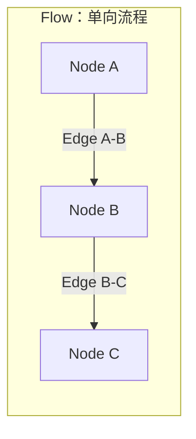
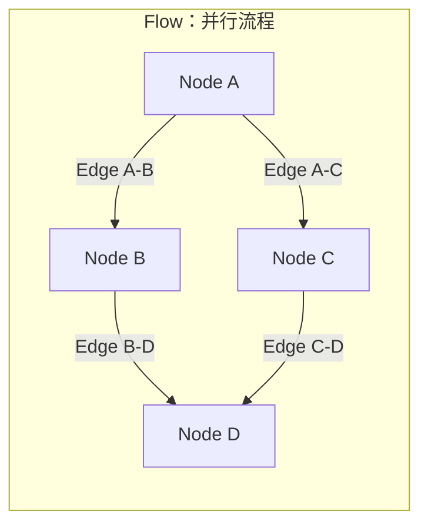
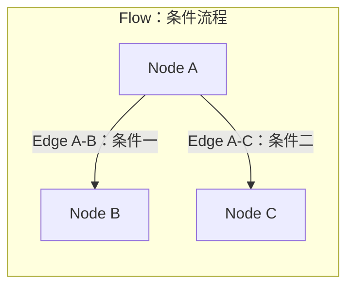
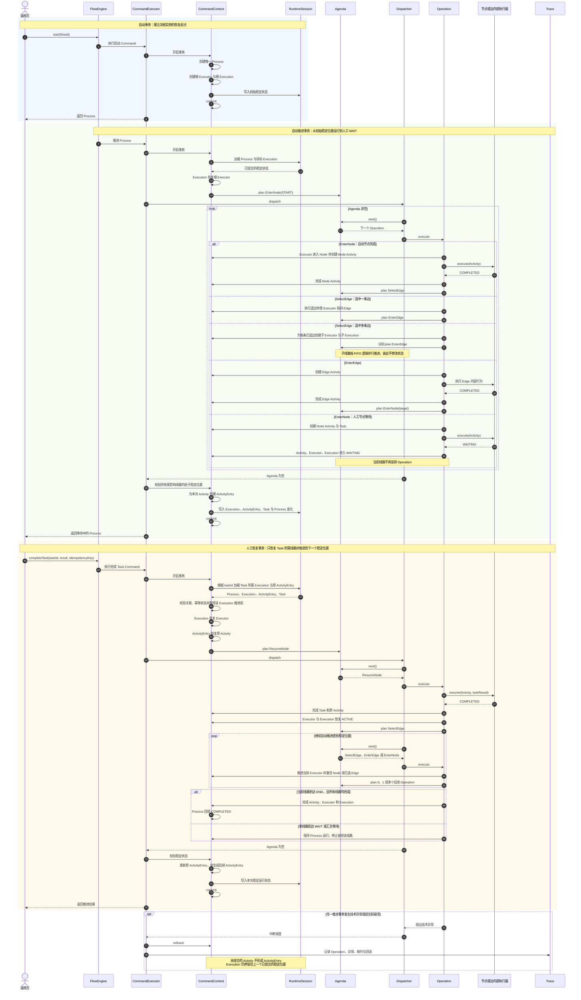

# 工作流核心运行架构设计 V3

状态：提议中

日期：2026-07-16

评审范围：工作流运行内核、流程交接、稳定状态提交与恢复

## 1. 文档目标与范围

本文用于说明 Flow 从启动、自动推进、进入人工等待、恢复执行，直到结束的核心运行逻辑。评审重点是运行对象之间的职责、Operation 的交接协议、事务如何到达稳定位置，以及服务中断后如何从已提交状态继续运行。

V3 是核心运行机制的技术评审基线。V2 保留前期演进过程和更细的接口、目录及迁移设想；本文只保留运行设计，不展开字段、表结构、索引、Java 接口和工程目录。

本文覆盖：

- 单线路自动流程；
- 单任务人工节点的等待与恢复；
- 选出多条边后形成的多线路；
- 汇合的基本等待原则；
- 事务、崩溃恢复、幂等、并发和技术 Trace 的边界。

子流程、多实例、汇合算法、数据库锁策略和持久化模型将在后续设计中展开。它们应遵守本文确定的运行原则。

## 2. 定义层

定义层描述一条流程本身是什么。它只保存流程在某个版本下的静态结构和运行规则，不表示任何一次真实运行，也不记录流程当前走到哪里。

### 2.1 Flow：完整流程定义

Flow 是一份完整的、带版本的流程定义。它包含构成该流程的全部 Node 和 Edge，以及这些定义之间已经装配好的关系。Flow 不是流程名称或流程元信息的简单容器，也不是一次正在运行的流程实例。

Flow 发布后成为可以启动的确定版本。已经运行的流程始终绑定启动时选定的 Flow 版本；后续发布新版本不会改变已有流程实例所使用的定义。

### 2.2 Node：流程中的静态位置

Node 是 Flow 中的静态节点定义，表示流程图中的一个确定位置，并保存该位置所需的静态配置。Node 只说明这个位置是什么、应使用什么规则，不保存某次运行中的处理结果、当前状态、执行时间或处理人。

Node 可以知道与自己连接的进入 Edge 和离开 Edge，使流程引擎在加载完整 Flow 后能够直接沿定义关系读取后续结构，而不需要在推进过程中重新拼装流程图。

### 2.3 Edge：节点之间的有向连接

Edge 是 Flow 中连接两个 Node 的有向关系。它具有明确的来源 Node 和目标 Node，用来表达流程允许从哪个位置流向哪个位置。Edge 还可以携带静态的选择条件或连接规则，但不保存某次运行是否选择了它。

同一个 Node 可以连接多条候选 Edge。候选关系属于定义层；某次运行最终选择了哪条 Edge，则属于运行层产生的事实。

### 2.4 Flow、Node 与 Edge 的组成关系

一个完整 Flow 由 Node 集合和 Edge 集合共同组成。Node 提供流程中的位置，Edge 把这些位置连接成有方向的流程图：

```text
Flow
├── Node 集合：定义流程中有哪些位置
└── Edge 集合：定义这些位置之间允许如何流转

Edge.source -> 来源 Node
Edge.target -> 目标 Node
```

Node 脱离 Flow 没有独立的流程语义；Edge 也必须连接同一个 Flow 中有效的来源 Node 和目标 Node。只有 Node 和 Edge 的关系完整、可达且满足流程定义约束时，Flow 才是一份可以部署和运行的完整定义。

### 2.5 三种常见 Flow 结构

下面只展示 Flow、Node 和 Edge 如何组成流程定义，不表示流程运行时产生的数据。

#### 单向流程

单向流程中的 Node 按一个方向依次连接，每个 Edge 都明确指向下一个 Node。



#### 并行流程

并行流程从同一个 Node 引出多条 Edge，形成多个分支；分支也可以通过后续 Edge 连接到同一个 Node。



#### 条件流程

条件流程同样从一个 Node 定义多条候选 Edge，不同 Edge 分别携带自己的静态选择条件，并指向对应的目标 Node。



### 2.6 定义层与运行层的边界

定义层回答“流程是什么”，运行层回答“这份流程定义的某次实例如何运行”。二者的关系是同一份定义可以被启动多次，每次启动产生相互独立的运行实例，但它们共同读取已经绑定的 Flow 定义。

| 定义层 | 表达内容 | 运行后对应的事实 |
| --- | --- | --- |
| Flow | 完整流程结构及版本 | 启动后产生一条独立流程实例 |
| Node | 流程中的静态位置和配置 | Executor 到达该位置时产生一次节点激活 |
| Edge | Node 之间允许发生的有向流转 | 选边后，只有实际进入的 Edge 产生一次边激活 |

运行层不能在推进过程中修改已经绑定的 Flow、Node 或 Edge。运行状态、选择结果和执行行踪分别由 Process、Executor、Execution、Activity 和 ActivityEntry 等运行对象承载。

## 3. 核心设计结论

Flow 的运行由两组相互对应的对象支撑：

| 事务中的运行对象 | 稳定状态对象 | 关系 |
| --- | --- | --- |
| Executor | Execution | Executor 跟随一条执行线路运行；Execution 保存这条线路最近一次已提交的稳定状态，并可恢复出 Executor |
| Activity | ActivityEntry | Activity 表示节点或选中边的一次激活；ActivityEntry 保存这次激活在稳定位置上的结果，并可恢复等待中的 Activity |

一个流程实例只有一个 Process。Process 记录整个实例的生命周期；一条线性流程通常只有一个 Executor 和一个 Execution。只有出现多分支、子流程或多实例，才创建子 Executor 及其一一对应的子 Execution。继续分支时继续创建下一层，最终形成执行树。

流程元素之间不直接互相调用。流程推进被拆成固定的 Operation，Operation 放入 FIFO 的 Agenda，由 Dispatcher 依次取出执行。每个 Operation 完成自己负责的状态变化后，只安排下一步 Operation，不直接调用下一步。

自动推进不会在每经过一个节点或一条边时单独提交。一次推进从上一个稳定位置开始，在同一事务中持续执行，直到到达下一个可等待、可停止或已结束的位置。此时统一生成或更新 ActivityEntry，更新 Execution 和 Process，再提交事务。

如果服务在自动推进中途崩溃，当前事务回滚。恢复时从上一个已经提交的 Execution 和 ActivityEntry 继续，而不是尝试恢复未提交的内存步骤。技术执行过程、异常和回滚进入独立 Trace 链路，不写入业务 ActivityEntry。

## 4. 从启动流程开始理解运行对象

### 4.1 Process：一条流程实例

调用方启动一个已部署的 Flow 时，系统先创建 Process。Process 表示这一次完整的流程运行，因此一个流程实例从开始到结束只存在一个 Process。

Process 在启动时进入运行状态；人工等待期间仍然表示流程正在运行；当所有执行线路都完成后，再回填完成状态和结束时间。Process 不负责记录某一条线路当前走到哪里，这由 Executor 和 Execution 负责。

Process 的创建和初始运行状态写入构成第一个事务。提交成功后，系统再从已提交的初始状态开始内部推进。这样即使后续节点执行失败，流程实例本身仍有明确的恢复起点。

### 4.2 Executor 与 Execution：一条线路的运行和恢复

Process 创建根 Executor，让它沿 Flow 中的一条线路推进。Executor 是事务内的真实运行对象，持有当前线路的位置、状态和父子关系。节点和边的激活只能由 Executor 发起，因此流程的运行行踪由 Executor 负责。

创建 Executor 时同时创建一个与它一一对应的 Execution。Execution 保存 Executor 最近一次已经提交的稳定状态。服务重新启动或人工任务恢复时，系统加载 Execution，并据此重建相同位置、状态和层级的 Executor。

二者遵守以下不变量：

- 每个 Executor 恰好对应一个 Execution；
- 每个 Execution 恰好恢复一个 Executor；
- Executor 只推进自己所在的线路；
- Executor 的稳定位置和状态必须与对应 Execution 一致；
- 创建子 Executor 时必须同时创建对应的子 Execution；
- 普通线路的推进不能修改兄弟线路的 Executor 或 Execution。

在线性流程中，根 Executor 会贯穿整条线路，因此通常只有一个 Execution。选择出多条边、进入子流程或展开多实例时，当前线路需要拆成可以独立推进的子线路，Process 才为它们创建子 Executor 和子 Execution。子线路再次分叉时继续创建下一层，Executor 与 Execution 分别形成结构一致的树。

### 4.3 Activity 与 ActivityEntry：一次流程元素激活

Executor 到达某个节点时，会激活该节点并创建一个 Activity；选中并进入某条边时，也会激活该边并创建一个新的 Activity。Activity 因此表示某个 Executor 对一个节点或一条已选边的一次运行时激活。

例如 `Node A -> Edge A-B -> Node B` 的运行轨迹是：

```text
激活 Node A，创建 Activity(Node A)
-> Node A 完成
-> 激活已选中的 Edge A-B，创建 Activity(Edge A-B)
-> Edge A-B 完成
-> 激活 Node B，创建 Activity(Node B)
```

没有被选中的候选边不属于实际运行轨迹，因此不创建 Activity。一个 Executor 同一时刻最多只有一个未完成 Activity；每个 Activity 只属于创建它的 Executor。Executor 的父子关系由 Execution 树记录，不由 Activity 之间的关系表达。

ActivityEntry 是 Activity 到达稳定位置后形成的运行记录，并与 Activity 一一对应。已完成的节点或边形成完成状态的 ActivityEntry；当前稳定等待的人工节点形成等待状态的 ActivityEntry。恢复人工节点时，系统从原 ActivityEntry 重建原 Activity，而不是创建一条替代记录。

Activity 是当前事务中的运行事实，ActivityEntry 是提交后的稳定事实。自动推进尚未到达稳定位置时，Activity 只存在于事务工作区中。如果事务回滚，这一轮未提交的 Activity 不会形成 ActivityEntry。

### 4.4 Task：需要外部协作时的等待凭证

Task 只在节点需要外部人员或外部系统协作时创建，普通自动节点不会创建 Task。Task 绑定产生它的人工节点 Activity，并用于把外部处理结果准确交回该 Activity 所属的 Execution。

本文先限定单任务人工节点：完成 Task 就代表当前节点本轮执行完成。审批通过和审批拒绝都是业务上的完成结果，后续由选边规则根据结果决定进入哪一条边。若拒绝路线最终重新回到同一个审批节点，那是一次新的节点激活，会创建新的 Activity 和 ActivityEntry；上一轮记录保持完成。

## 5. 运行不变量

流程推进必须始终满足以下规则：

| 范围 | 不变量 |
| --- | --- |
| 流程实例 | 一个流程实例只有一个 Process |
| 执行线路 | 一条独立线路由一个 Executor 跟随；Executor 与 Execution 一一对应 |
| 元素激活 | Node 和已选 Edge 的每次激活各有一个 Activity；Activity 与 ActivityEntry 一一对应 |
| 归属 | Activity 只由 Executor 激活，并且只属于一个 Executor |
| 选边 | 只为实际选中的 Edge 创建 Activity |
| 人工等待 | Task、等待中的 Activity、ActivityEntry、Executor 和 Execution 必须指向同一线路及同一节点 |
| 线路隔离 | 恢复或推进一条线路时不修改其他线路；只有汇合逻辑可以读取相关兄弟 Execution |
| 提交 | 只有所有受影响线路都到达稳定位置，当前事务才能提交 |
| 异常 | 技术异常进入 Trace；未提交的业务运行变化随事务回滚 |

## 6. 事务边界与稳定位置

稳定位置是可以完整提交，并能在进程重启后无歧义恢复的运行位置。当前设计中的稳定位置包括：

- 人工节点进入 WAIT，等待外部 Task；
- Executor 到达 END 并完成；
- 显式暂停或终止；
- 多线路在汇合点等待其他线路完成。

一次 Flow 运行分为以下事务单元：

1. 启动事务：解析已部署 Flow，创建 Process、根 Executor 和根 Execution，写入初始状态并提交。
2. 内部推进事务：从一个已提交的稳定位置恢复 Executor，连续执行 Operation，直到下一个稳定位置，统一写入运行变化并提交。
3. 人工恢复事务：完成 Task、恢复等待中的 Activity、继续自动推进到下一个稳定位置，全部位于同一个事务中。

在内部推进事务中，经过自动节点和边只是内存状态变化，并不形成新的事务边界。这样可以保证节点完成、选边、线路移动和稳定状态写入是一个原子结果。

Agenda 为空只表示当前没有待执行 Operation。提交前还必须验证所有受影响的 Executor 已经 WAITING、COMPLETED、SUSPENDED、TERMINATED，或处于明确的汇合等待状态。如果某条线路仍为活动状态，却因为漏排 Operation 而停止，稳定性校验必须失败并回滚。

## 7. Agenda 与 Dispatcher

### 7.1 Agenda：承载待执行 Operation

Agenda 属于当前 CommandContext，是本次事务推进期间的 FIFO 容器。Operation 通过 `plan` 进入队尾，Dispatcher 通过 `next` 从队首取出；`isEmpty` 用来判断是否还有待执行工作。

Agenda 只保存本次事务接下来要做的流程交接，不执行 Operation、不选择路由、不判断稳定状态、不提交事务，也不参与持久化或恢复。事务结束后，本次 Agenda 随 CommandContext 一起释放。

### 7.2 Dispatcher：执行 Agenda

Dispatcher 是 Operation 调度器。它重复执行下面的循环：

```text
Agenda 非空
-> 取出下一个 Operation
-> 执行 Operation
-> Operation 安排后续 Operation
-> 返回循环
```

Dispatcher 不理解节点、边、人工等待或 Process 状态。Agenda 为空后，Dispatcher 只把控制权交还 CommandExecutor；CommandExecutor 再负责稳定状态校验、稳定运行数据写入、提交或回滚。

当一个 Operation 安排多个后续 Operation 时，它们仍由同一个 Dispatcher 按 FIFO 顺序处理。这表示一个事务内的逻辑并行线路，不表示创建多个运行线程。

## 8. Operation 交接协议

Operation 描述流程元素之间的一次交接。每个 Operation 都遵守同一协议：

```text
校验当前线路状态
-> 完成本 Operation 负责的状态变化
-> 更新事务工作区
-> 向 Agenda 安排 0、1 或多个后续 Operation
-> 返回 Dispatcher
```

安排 0 个后续 Operation，表示当前线路已到达 WAIT、END 或其他稳定停止位置；安排 1 个表示线性推进；安排多个表示为多条子线路继续推进。Operation 之间不能直接调用。

节点和边各自可以有内部执行器，用于完成元素内部的业务行为。内部执行器不参与流程交接：它不能访问 Agenda，不能移动 Executor，不能选择 Edge，也不能提交事务。

### 8.1 EnterNodeOperation：进入并执行节点

EnterNodeOperation 把指定 Executor 交接到目标 Node，并由该 Executor 激活 Node Activity。随后它调用节点内部执行器。

节点执行完成时，EnterNodeOperation 完成当前 Activity。如果当前节点是 END，它同时完成当前 Executor 和 Execution；当 Process 判断全部线路都已完成时，再完成 Process，不安排后续 Operation。如果不是 END，则安排 SelectEdgeOperation。

节点需要外部协作时，EnterNodeOperation 创建 Task，使当前 Activity、Executor 和 Execution 进入等待状态，不安排后续 Operation。这条线路就到达了一个稳定位置，但 Agenda 中其他线路已经排入的 Operation 仍可继续执行。

### 8.2 SelectEdgeOperation：选择下一条线路

SelectEdgeOperation 读取已完成节点的出边，并根据流程变量和节点结果执行选边规则。

只选中一条 Edge 时，当前 Executor 的位置推进到该 Edge，然后安排 EnterEdgeOperation。

同时选中多条 Edge 时，当前线路发生分支。Process 为每条选中 Edge 创建一个子 Executor，并为每个子 Executor 创建对应的子 Execution。每个子 Executor 指向自己的 Edge，然后分别安排 EnterEdgeOperation。候选但未选中的 Edge 不创建 Executor，也不创建 Activity。

### 8.3 EnterEdgeOperation：进入已选边

EnterEdgeOperation 校验 Executor 当前确实指向已选 Edge，然后由 Executor 激活 Edge Activity。边的内部行为完成后，当前 Edge Activity 完成，并安排目标 Node 的 EnterNodeOperation。

EnterEdgeOperation 不提前把 Executor 指向目标 Node。Executor 从 Edge 到目标 Node 的位置变化由下一次 EnterNodeOperation 完成，因此每个位置变化都有明确的 Operation 负责。

### 8.4 ResumeNodeOperation：把人工结果交回节点

ResumeNodeOperation 只处理已经由外部 Task 唤醒的单任务人工节点。执行它之前，Command 已经根据 Task 找到所属 Execution，从该 Execution 恢复 Executor，并从原 ActivityEntry 恢复等待中的 Activity。

ResumeNodeOperation 校验 Task、Activity、Executor 和 Execution 均处于同一个等待状态，然后调用节点内部执行器的恢复入口。节点返回完成后，它完成 Task 和原 Activity，使 Executor 与 Execution 恢复为活动状态，再安排 SelectEdgeOperation。

ResumeNodeOperation 不加载数据、不直接更新 ActivityEntry、不选择 Edge、不提交事务。原 ActivityEntry 会在本次事务到达下一个稳定位置时由统一提交阶段修改为完成状态。

## 9. 完整运行时序

下面的时序把 Process 创建、自动推进、人工等待、恢复、分支和结束放在同一条运行链中。图中的 RuntimeSession 表示运行数据的加载和写入边界；CommandContext 持有本次事务、Agenda 和事务内运行对象。



## 10. 自动流程的完整交接

以全自动的 `Node A -> Edge A-B -> END B` 为例，一次内部推进事务按下面的顺序运行：

1. Command 向 Agenda 安排 `EnterNode(A)`。
2. Dispatcher 取出 EnterNodeOperation。Executor 进入 A，创建 `Activity(Node A)`，节点内部执行器完成 A；Operation 完成该 Activity，并安排 SelectEdgeOperation。
3. SelectEdgeOperation 选中 A-B，使 Executor 指向这条 Edge，并安排 EnterEdgeOperation。
4. EnterEdgeOperation 创建 `Activity(Edge A-B)`，执行并完成这条 Edge，再安排 `EnterNode(B)`。
5. EnterNodeOperation 使 Executor 进入 END B，创建 `Activity(Node B)`，执行 END 行为并完成 Activity、Executor 和 Execution。
6. Process 检查全部线路。没有其他活动、等待或暂停线路时，Process 完成。
7. Agenda 为空。CommandExecutor 校验稳定状态，根据三个 Activity 生成对应 ActivityEntry，更新 Execution 和 Process，提交事务。

这段交接说明了 Executor 的位置只在负责该位置的 Operation 中变化；Activity 则在节点或边真正被激活时创建。即使自动流程经过多个元素，对外仍只提交一个完整的稳定结果。

## 11. 人工等待与恢复

### 11.1 进入人工等待

EnterNodeOperation 激活人工节点后，节点内部执行器返回等待结果。当前事务创建 Task，使 Node Activity、Executor 和 Execution 进入 WAITING。该线路不再安排 Operation。

如果 Agenda 中还有其他子线路的 Operation，Dispatcher 继续推进它们；只有 Agenda 为空且所有受影响线路均稳定后，才统一提交。提交后，等待状态由 Execution、ActivityEntry 和 Task 共同支撑：Execution 可以恢复 Executor，ActivityEntry 可以恢复当前 Activity，Task 可以接收外部结果。

### 11.2 完成 Task 并恢复

外部完成 Task 时，Command 先根据 taskId 找到 Task 所属 Execution。普通人工恢复只加载这条 Execution 以及关联的 Process、原 ActivityEntry 和 Task，不加载或锁定其他兄弟线路。

恢复顺序是：

```text
Task -> 所属 Execution -> 恢复 Executor
Task -> 原 ActivityEntry -> 恢复 Activity
Process -> 加载实例绑定的 Flow 版本
-> 安排 ResumeNodeOperation
```

ResumeNodeOperation 将人工结果交给节点恢复入口。节点完成后，原 Task 和原 Activity 完成，Executor 与 Execution 恢复活动状态，随后按正常的 SelectEdge、EnterEdge、EnterNode 链继续推进。

Task 完成与后续自动推进属于同一个事务。假设人工节点之后还有两个自动节点，而第二个自动节点发生技术异常，那么 Task 完成、原 ActivityEntry 修改和中间自动推进全部回滚。下一次仍从原 WAITING Execution 和原 WAITING ActivityEntry 恢复，外部可以使用原幂等键重试。

### 11.3 审批拒绝后重走审批

审批拒绝是当前审批 Activity 的正常完成结果。SelectEdgeOperation 根据拒绝结果选择打回边，Executor 沿打回线路继续运行。

如果后续流程再次进入同一个审批 Node，EnterNodeOperation 会进行一次新的激活，创建新的 Activity；到达稳定等待后再创建新的 ActivityEntry 和 Task。两轮记录的含义分别是“第一次审批已拒绝并完成”和“第二次审批正在等待”，不会覆盖成同一次激活。

## 12. 多线路与汇合

SelectEdgeOperation 同时选中多条 Edge 时，当前线路产生多个子 Executor 和子 Execution。每个子 Executor 只推进自己的路径，并独立创建 Activity。Agenda 可以同时承载这些线路的后续 Operation，Dispatcher 仍按 FIFO 顺序执行。

某条子线路进入人工等待时，只停止为该线路安排后续 Operation，不影响 Agenda 中其他子线路继续推进。某条 Task 恢复时，也只加载和推进其所属 Execution。所有线路都遵守相同的事务稳定性要求，但彼此不能通过普通 Operation 修改对方状态。

汇合节点是唯一需要观察相关兄弟 Execution 的位置。汇合逻辑判断要求到达的子线路是否全部完成：

- 未全部完成时，当前线路停在汇合等待位置；
- 全部完成时，汇合逻辑恢复父线路或创建约定的后续线路；
- 普通 ResumeNodeOperation 不承担兄弟线路加载和汇合判断；
- 汇合算法必须保持子 Execution 的完成事实，并保证只触发一次后续推进。

具体的汇合计数、到达集合、并发竞争和父线路恢复方式不在本文中确定，将在并行执行设计中单独评审。

## 13. 技术异常与崩溃恢复

业务运行记录和技术执行记录分开处理。

ActivityEntry 只记录已经提交的业务激活状态，例如节点完成、已选边完成或人工节点等待。节点执行器、Operation 调用、耗时、异常堆栈、事务回滚和进程中断属于技术事实，由 Trace 链路记录。

技术异常发生时：

```text
节点或边内部执行器 / Operation 抛出异常
-> Dispatcher 停止
-> CommandExecutor 回滚当前事务
-> 本次未提交 Activity 不生成 ActivityEntry
-> Execution 保持上一个已提交稳定位置
-> Trace 保存本次技术执行和失败信息
```

服务重新启动后，不需要重建崩溃前尚未提交的 Agenda，也不从 Trace 推导业务状态。系统加载最近一次已提交的 Execution；如果它指向等待中的 ActivityEntry，则同时恢复 Activity。随后通过新的 Command 和 Agenda 从该稳定位置继续。

## 14. 隔离、幂等与并发

人工恢复至少遵守以下规则：

- 完成 Task 必须携带幂等键；
- 同一 Task 使用相同幂等键重复完成时，提交成功后返回第一次结果，不再次推进；
- 第一次请求如果整体回滚，同一幂等键可以从原等待状态重试；
- 已完成 Task 使用不同幂等键再次请求时拒绝执行；
- 并发完成同一 Task 时，只有一个请求能取得该 Task 所属 Execution 的推进权；
- 同一个 Execution 同一时间只能被一个事务推进；
- 取得一条 Execution 的推进权不能锁定或修改兄弟 Execution；
- 只有汇合逻辑可以按规则读取相关兄弟 Execution，并等待它们全部完成。

Command 负责加载和校验关联对象、处理幂等，并取得目标 Execution 的推进权。Operation 只在已经建立好的事务工作区内推进，不自行查询数据库或扩大锁定范围。具体锁方式和版本竞争策略由持久化设计决定，但不能改变上述隔离边界。

## 15. 运行职责总览

| 组件 | 运行职责 |
| --- | --- |
| Process | 表示唯一流程实例，管理 Executor 的创建并汇总整条流程生命周期 |
| Executor | 跟随一条线路运行，维护该线路的当前位置、状态和子线路关系 |
| Execution | 保存 Executor 已提交的稳定状态，并恢复对应 Executor |
| Activity | 表示 Executor 对一个 Node 或已选 Edge 的一次激活 |
| ActivityEntry | 保存 Activity 在稳定位置上的结果，并恢复等待中的 Activity |
| Task | 承接外部协作结果，并定位需要恢复的 Execution 和 Activity |
| Command | 创建或加载本次推进所需对象，完成关联、权限、幂等和并发校验 |
| Agenda | 按 FIFO 承载当前事务待执行的 Operation |
| Dispatcher | 从 Agenda 取出并执行 Operation |
| Operation | 完成一个流程交接阶段，并安排后续 Operation |
| 节点或边内部执行器 | 执行流程元素内部业务行为，不参与流程交接 |
| CommandExecutor | 管理事务，启动调度，校验稳定状态，统一写入并提交或回滚 |
| Trace | 记录技术调用、耗时、异常和回滚，不改变业务运行状态 |

## 16. 风险与后续设计

后续设计需要在不改变本文运行原则的前提下，继续明确：

- 并行汇合的到达判定、父线路恢复和并发去重；
- 子流程与多实例如何创建、结束和汇总子 Executor；
- 持久化对象的字段、关联约束、版本控制和索引；
- Execution 推进权的数据库实现；
- 稳定状态统一写入的原子性和批量顺序；
- 显式暂停、终止和超时 Task 的状态转换；
- Trace 与一次 Command、Operation、事务的关联方式；
- 服务启动后的等待任务扫描、主动恢复和运维查询。

## 17. 技术评审检查项

评审可以按以下问题判断核心设计是否闭合：

- Process 是否始终唯一，并且只在全部线路结束后完成？
- 每条独立线路是否都有一一对应的 Executor 和 Execution？
- 是否只有分支、子流程或多实例才创建子 Executor？
- Node 和已选 Edge 每次激活是否都有独立 Activity？
- ActivityEntry 是否只在稳定提交阶段创建或更新？
- Operation 是否完成自己的状态变化后才安排下一步，并且从不直接调用下一步？
- Agenda 与 Dispatcher 是否保持无业务语义？
- 人工恢复是否只加载 Task 所属 Execution，并恢复原 Activity？
- Task 完成和推进到下一稳定位置是否在同一个事务中？
- 多线路是否互不修改，只有汇合逻辑读取兄弟 Execution？
- Agenda 为空后是否仍执行稳定状态校验？
- 技术异常是否只进入 Trace，并使未提交业务变化整体回滚？
- 服务崩溃后是否能够仅依靠已提交的 Execution 和 ActivityEntry 回到上一个稳定位置？
