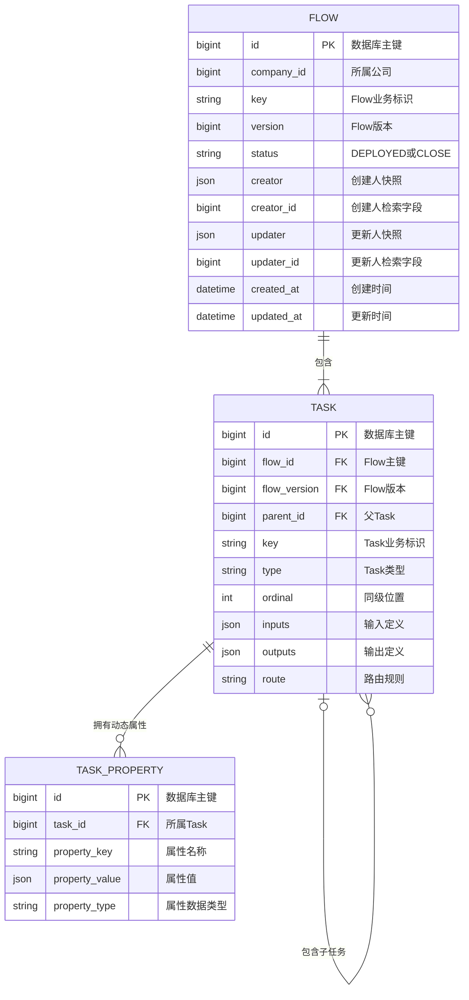

# Flow 与 Task PostgreSQL 数据存储设计

> 修订说明：本文使用 `key + version`、数据库自增 Flow id 和 `CLOSE` 的结构
> 早于 ADR 0008，当前仅保留为历史存储方案，不能直接作为目标领域模型的建表
> 依据。`FlowWithSource`、稳定 String `id`、`reversion`、`CLOSED` 以及两类
> Repository 的目标边界以
> [Flow 定义域模型与生命周期规范](../standards/flow-definition-lifecycle.md)
> 为准；正式迁移数据库前必须重新形成存储 ADR 和迁移方案。
> Task 的目标字段和类型扩展边界以
> [Task 领域模型规范](../standards/task-domain-model.md) 为准，本文中的
> `task_properties` 设计不得直接反推领域 `Map`。
> Data、Input、Output 的身份和类型边界以
> [Data、Input 与 Output 领域模型规范](../standards/data-domain-model.md)
> 为准，正式存储模型必须使用 key、type；类型代码和运行值规则确认后再收紧
> 对应校验。

## 1. 设计范围

本设计定义 Flow、Task 和 Task 动态属性在 PostgreSQL 中的存储结构。

- `flows` 保存已经发布的 Flow 版本。
- `tasks` 保存 Flow 中的基础 Task 定义、顺序和父子结构。
- `task_properties` 保存不同 Task Type 使用的弹性字段。
- 完整 Flow 定义由 `flows`、`tasks` 和 `task_properties` 共同恢复。
- DRAFT 不进入 `flows`。
- Execution、TaskRun 和 Task Type 的存储结构不在本设计范围内。

## 2. 核心存储规则

### 2.1 Flow 与 Task 分开存储

Flow 不保存完整 YAML 或 Task 集合快照。Flow 自身信息保存在 `flows`，Task 定义保存在 `tasks`，类型扩展字段保存在 `task_properties`。

数据库中的完整定义由三部分组成：

```text
Flow 基础信息
+ Task 基础定义和编排结构
+ Task 动态属性
= 完整 Flow 定义
```

### 2.2 Flow 只保存已发布版本

`flows` 中每条记录代表一个已经发布的 Flow version。DRAFT 使用独立机制保存，不占用 Flow version，也不进入本组表。

同一公司下的 Flow 通过 `key` 表达稳定业务身份，通过 `version` 区分已经发布的版本：

```text
company_id + key + version
```

### 2.3 Task 绑定确定的 Flow version

Task 使用 `flow_id + flow_version` 绑定一个确定的 Flow 版本。Task 自身不再重复维护独立 version。

Task 的 `parent_id` 和 `ordinal` 共同表达 YAML 中的递归 `tasks`：

- `parent_id` 为空：Task 位于 `Flow.tasks`。
- `parent_id` 有值：Task 位于父 Task 的 `tasks`。
- `ordinal`：Task 在当前同级 `tasks` 中的位置，从 `0` 开始。

### 2.4 基础字段与动态字段分开

Task 主表保存所有基础 Task 都具有的字段：

- `key`
- `type`
- `inputs`
- `outputs`
- `route`

`wait` 以及不同 Task Type 使用的其他字段存入 `task_properties`。动态属性表只保存具体字段值，不保存字段说明、用法和校验规则。

## 3. 数据关系



## 4. Flow 表

### 4.1 职责

`flows` 保存一个已发布 Flow version 的身份、状态和审计信息。数据库主键 `id` 只用于表关联，不进入 YAML。

YAML 使用 `key` 表达 Flow 的业务身份：

```yaml
key: leave-request-flow
version: 1
status: DEPLOYED
```

### 4.2 字段

| 字段 | 含义 |
|---|---|
| `id` | 数据库主键 |
| `company_id` | Flow 所属公司 |
| `key` | Flow 稳定业务标识，对应 YAML `key` |
| `version` | 已发布版本号 |
| `status` | `DEPLOYED` 或 `CLOSE` |
| `creator` | 创建人信息快照 |
| `creator_id` | 从 `creator.id` 产生的检索字段 |
| `updater` | 最后更新人信息快照 |
| `updater_id` | 从 `updater.id` 产生的检索字段 |
| `created_at` | 创建时间 |
| `updated_at` | 最后更新时间 |

### 4.3 表结构

```sql
CREATE TABLE flows (
    id              bigint GENERATED BY DEFAULT AS IDENTITY PRIMARY KEY,

    company_id      bigint NOT NULL,
    key             varchar(128) NOT NULL,
    version         bigint NOT NULL,
    status          varchar(16) NOT NULL,

    creator         jsonb NOT NULL,
    creator_id      bigint
        GENERATED ALWAYS AS (
            (creator ->> 'id')::bigint
        ) STORED,

    updater         jsonb NOT NULL,
    updater_id      bigint
        GENERATED ALWAYS AS (
            (updater ->> 'id')::bigint
        ) STORED,

    created_at      timestamptz NOT NULL DEFAULT now(),
    updated_at      timestamptz NOT NULL DEFAULT now(),

    CONSTRAINT uq_flows_company_key_version
        UNIQUE (company_id, key, version),

    CONSTRAINT uq_flows_id_version
        UNIQUE (id, version),

    CONSTRAINT ck_flows_key
        CHECK (length(btrim(key)) BETWEEN 1 AND 128),

    CONSTRAINT ck_flows_version
        CHECK (version > 0),

    CONSTRAINT ck_flows_status
        CHECK (status IN ('DEPLOYED', 'CLOSE')),

    CONSTRAINT ck_flows_creator
        CHECK (
            jsonb_typeof(creator) = 'object'
            AND creator ? 'id'
        ),

    CONSTRAINT ck_flows_updater
        CHECK (
            jsonb_typeof(updater) = 'object'
            AND updater ? 'id'
        )
);
```

`creator` 和 `updater` 保存当时的用户信息快照：

```json
{
  "id": 10001,
  "name": "张三",
  "avatar": "https://example.com/avatar.png"
}
```

`creator_id` 和 `updater_id` 由 JSONB 自动产生，只用于关联和检索，不单独写入。

## 5. Task 表

### 5.1 职责

`tasks` 保存一个 Flow version 内的基础 Task 定义及编排位置。

Task 通过以下组合绑定确定的 Flow：

```text
flow_id + flow_version
```

同一个 Flow version 内，Task `key` 保持唯一。

### 5.2 字段

| 字段 | 含义 |
|---|---|
| `id` | 数据库主键 |
| `flow_id` | `flows.id` |
| `flow_version` | `flows.version` |
| `parent_id` | 父 Task 主键，顶层 Task 为空 |
| `key` | Task 业务标识，对应 YAML `key` |
| `type` | Task 类型 |
| `ordinal` | 在当前同级 `tasks` 中的位置 |
| `inputs` | Task 输入定义数组 |
| `outputs` | Task 输出定义数组 |
| `route` | `DIRECT` 或条件表达式 |

### 5.3 表结构

```sql
CREATE TABLE tasks (
    id              bigint GENERATED BY DEFAULT AS IDENTITY PRIMARY KEY,

    flow_id         bigint NOT NULL,
    flow_version    bigint NOT NULL,
    parent_id       bigint,

    key             varchar(128) NOT NULL,
    type            varchar(64) NOT NULL,
    ordinal         integer NOT NULL,

    inputs          jsonb NOT NULL DEFAULT '[]'::jsonb,
    outputs         jsonb NOT NULL DEFAULT '[]'::jsonb,
    route           text NOT NULL DEFAULT 'DIRECT',

    CONSTRAINT fk_tasks_flow
        FOREIGN KEY (flow_id, flow_version)
        REFERENCES flows(id, version),

    CONSTRAINT uq_tasks_id_flow
        UNIQUE (id, flow_id, flow_version),

    CONSTRAINT fk_tasks_parent
        FOREIGN KEY (parent_id, flow_id, flow_version)
        REFERENCES tasks(id, flow_id, flow_version),

    CONSTRAINT uq_tasks_key
        UNIQUE (flow_id, flow_version, key),

    CONSTRAINT uq_tasks_ordinal
        UNIQUE NULLS NOT DISTINCT (
            flow_id,
            flow_version,
            parent_id,
            ordinal
        ),

    CONSTRAINT ck_tasks_parent
        CHECK (parent_id IS NULL OR parent_id <> id),

    CONSTRAINT ck_tasks_key
        CHECK (length(btrim(key)) BETWEEN 1 AND 128),

    CONSTRAINT ck_tasks_type
        CHECK (length(btrim(type)) BETWEEN 1 AND 64),

    CONSTRAINT ck_tasks_ordinal
        CHECK (ordinal >= 0),

    CONSTRAINT ck_tasks_inputs
        CHECK (jsonb_typeof(inputs) = 'array'),

    CONSTRAINT ck_tasks_outputs
        CHECK (jsonb_typeof(outputs) = 'array'),

    CONSTRAINT ck_tasks_route
        CHECK (length(btrim(route)) > 0)
);
```

`fk_tasks_parent` 保证父 Task 与子 Task 属于同一个 `flow_id + flow_version`。循环父子关系由发布校验处理。

### 5.4 基础字段

`inputs` 和 `outputs` 始终保存 JSON 数组。没有数据时保存空数组：

```json
[]
```

`route` 始终有值：

- `DIRECT`：直接承接上游 Task。
- 其他值：能够产生 boolean 结果的条件表达式。

## 6. Task 动态属性表

### 6.1 职责

`task_properties` 保存基础 Task 字段之外的弹性字段。一个 Task 可以拥有零个或多个动态属性，同一个 Task 下的属性名称保持唯一。

动态表保存字段值，不保存以下字段定义信息：

- 展示名称。
- 使用说明。
- 是否必填。
- 默认值。
- 可选值。
- 业务校验规则。
- 对应的 Java 类型。

这些内容后续由 Task Type 的字段定义负责。

### 6.2 表结构

```sql
CREATE TABLE task_properties (
    id              bigint GENERATED BY DEFAULT AS IDENTITY PRIMARY KEY,

    task_id         bigint NOT NULL,
    property_key    varchar(128) NOT NULL,
    property_value  jsonb NOT NULL,

    property_type   varchar(16)
        GENERATED ALWAYS AS (
            jsonb_typeof(property_value)
        ) STORED,

    CONSTRAINT fk_task_properties_task
        FOREIGN KEY (task_id)
        REFERENCES tasks(id)
        ON DELETE CASCADE,

    CONSTRAINT uq_task_properties_key
        UNIQUE (task_id, property_key),

    CONSTRAINT ck_task_properties_key
        CHECK (length(btrim(property_key)) BETWEEN 1 AND 128),

    CONSTRAINT ck_task_properties_reserved
        CHECK (
            property_key NOT IN (
                'key',
                'type',
                'inputs',
                'outputs',
                'route',
                'tasks'
            )
        ),

    CONSTRAINT ck_task_properties_value
        CHECK (property_value <> 'null'::jsonb)
);
```

`property_value` 可以保存 JSON string、number、boolean、object 或 array。对象和数组作为一个完整属性值保存，不继续拆分。

`wait` 不是基础 Task 字段。只有支持等待能力的 Task Type 才能使用 `wait`，并在动态属性表中保存为一个数组属性：

| property_key | property_value | property_type |
|---|---|---|
| `wait` | `["后端构建","前端构建"]` | `array` |

### 6.3 示例

JUMP_TARGET 定义：

```yaml
- key: 返回前置检查
  type: JUMP_TARGET
  inputs: []
  outputs: []
  route: DIRECT
  target: 前置检查
  maxTimes: 2
```

Task 主表保存：

| key | type | route |
|---|---|---|
| 返回前置检查 | JUMP_TARGET | DIRECT |

动态属性表保存：

| property_key | property_value | property_type |
|---|---|---|
| `target` | `"前置检查"` | `string` |
| `maxTimes` | `2` | `number` |

## 7. 完整定义恢复

### 7.1 加载数据

按 `flow_id + flow_version` 查询 Flow 下的全部 Task，并聚合每个 Task 的动态属性：

```sql
SELECT
    t.*,
    COALESCE(
        jsonb_object_agg(
            p.property_key,
            p.property_value
        ) FILTER (WHERE p.id IS NOT NULL),
        '{}'::jsonb
    ) AS properties
FROM tasks t
LEFT JOIN task_properties p
    ON p.task_id = t.id
WHERE t.flow_id = :flowId
  AND t.flow_version = :flowVersion
GROUP BY t.id
ORDER BY
    t.parent_id NULLS FIRST,
    t.ordinal;
```

### 7.2 组合 Task

每个 Task 按以下顺序组合：

```text
key
+ type
+ inputs
+ outputs
+ route
+ 动态属性
+ 根据 parent_id 和 ordinal 生成的 tasks
```

`task_properties` 在数据库中是独立表，输出 YAML 时动态属性直接展开到 Task，不输出 `properties` 包装层。

### 7.3 恢复 Task 树

1. 按 `parent_id` 对 Task 分组。
2. 每组按照 `ordinal` 排序。
3. `parent_id` 为空的 Task 形成 `Flow.tasks`。
4. `parent_id` 指向当前 Task 的记录形成该 Task 的 `tasks`。
5. 从顶层 Task 开始递归组装完整 Task 树。

完整 Flow 最终由 Flow 基础信息和 Task 树组合：

```yaml
key: leave-request-flow
version: 1
status: DEPLOYED

tasks:
  - key: submit-leave
    type: FORM
    inputs: []
    outputs:
      - startDate
      - endDate
      - reason
    route: DIRECT
```

恢复保证定义结构和数组顺序一致，不保证保留原始 YAML 注释、空行和缩进风格。

## 8. 保存与发布约束

Flow、Task 和 Task 动态属性必须在同一事务中写入：

1. 校验 Flow `company_id + key + version` 唯一。
2. 插入 Flow 记录。
3. 插入全部 Task 基础记录。
4. 建立 Task 父子关系和同级顺序。
5. 插入全部 Task 动态属性。
6. 校验 Task key、父子结构、顺序、Route 和动态字段。
7. 校验顶层 Task 至少存在一个，且 `ordinal = 0` 的 Task 为根 Task。
8. 校验通过后提交事务。

已经发布的 Flow、Task 和 Task 动态属性作为一个整体保持不可变。Flow 升级时生成新的 version，并写入一组新的 Flow、Task 和 Task 动态属性记录。

## 9. 索引

```sql
CREATE INDEX idx_flows_company_status
    ON flows (company_id, status);

CREATE INDEX idx_flows_creator_id
    ON flows (creator_id);

CREATE INDEX idx_flows_updater_id
    ON flows (updater_id);

CREATE INDEX idx_tasks_flow_tree
    ON tasks (
        flow_id,
        flow_version,
        parent_id,
        ordinal
    );

CREATE INDEX idx_tasks_type
    ON tasks (type);
```

`task_properties` 的唯一约束已经覆盖 `task_id + property_key` 查询。只有出现明确的跨 Task 动态属性检索条件时，再增加 `property_key` 或 `property_value` 索引。

## 10. 已确定边界

- 数据库表统一使用单列 `id` 作为主键。
- YAML 使用 `key`，不暴露数据库主键 `id`。
- Flow 表不保存 DRAFT。
- Flow 表不保存完整 YAML 或 Task JSON 快照。
- Task 表不保存运行状态。
- Task 动态属性表不保存 Execution、TaskRun 或用户实际输入输出。
- Task Type、动态字段说明和 Java 类型映射后续单独设计。
- Execution 和 TaskRun 的表结构后续单独设计。
