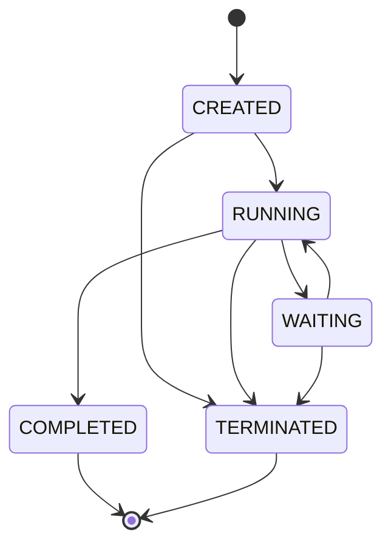

# Flow 核心设计

> 运行域说明：本文中的 Flow 定义示例仍可参考；涉及 Main/Child
> Execution、ExecutionTree、TaskRun WAITING 或 USER_TASK 的运行设计已被
> ADR 0002 取代，不得作为新代码依据。Execution、TaskRun 与运行状态的当前选择
> 通过 [Flow 架构决策索引](README.md) 查找。
>
> 定义域说明：本文第 2 章中使用单一 Flow 表达 DRAFT、创建升级 DRAFT、
> `version` 以及用 CLOSE 表达版本替换的设计已被
> [ADR 0008](0008-separate-flow-source-from-deployed-flow.md) 取代。当前
> Flow 定义域以 ADR 0008、ADR 0014、ADR 0018 和 ADR 0022 为准：草稿使用
> `FlowDraft`，已部署定义使用 `Flow`，业务版本字段为
> `reversion`；草稿由 FlowDraft 类型表达，删除使用 `deleted` 布尔事实，不使用
> 定义状态枚举。
>
> Task 定义域说明：本文第 3 章的通用 properties、dependOn 类型归属和旧运行
> 术语不再作为目标类模型依据。Task、路由、并行和扩展的当前选择通过
> [Flow 架构决策索引](README.md) 查找。
>
> PAUSE 边界说明：本文示例中的审批、表单和人工操作仅用于展示业务场景，不表示
> 这些能力属于 Flow Core。当前设计中，WAITING PAUSE TaskRun 表达等待事实，
> 外部能力通过 `ExecutionService.resume(...)` 提交结果；审批、表单、工单等
> 业务对象由外部能力持有。边界以
> [ADR 0016](0016-separate-pause-from-external-business-capabilities.md)、
> ADR 0017 和 ADR 0024 为准。
>
> Data 定义说明：本文 Input、Output 示例中的 Map、字符串列表和旧字段说明不再
> 作为目标类模型依据。Data 基础接口及 Input、Output 具体对象以
> [ADR 0019](0019-establish-basic-data-types.md) 为准。

## 1. 示例

下面通过顺序、并行、条件分支、DAG 和回跳五个 Flow 展示核心编排结构。

### 1.1 请假流程

提交请假信息后，由同事审批、记录结果并通知申请人。

#### 1.1.1 定义

~~~yaml
key: 请假审批流
status: DEPLOYED
version: 1

tasks:
  - key: 提交请假信息
    type: FORM
    inputs:
      - form:
          id: form-1
          version: 1
    outputs:
      - startDate
      - endDate
      - reason

  - key: 同事审批
    type: USER_TASK
    outputs:
      - decision
      - comment

  - key: 记录审批结果
    type: RECORD
    outputs:
      - recordId

  - key: 通知申请人
    type: NOTIFICATION
    outputs:
      - messageId
~~~

#### 1.1.2 编排结果

~~~mermaid
flowchart LR
    submitLeave["提交请假信息"] --> managerApproval["同事审批"]
    managerApproval --> recordResult["记录审批结果"]
    recordResult --> notifyApplicant["通知申请人"]
~~~

### 1.2 发版流程

前置检查后并行执行前后端检测，分支汇合后通知测试人员点击发版。

#### 1.2.1 YAML 定义

~~~yaml
key: product-release-flow
status: DEPLOYED
version: 1

tasks:
  - key: 发版
    type: RELEASE

  - key: 前置检查
    type: AUTO
    tasks:
      - key: 后端检查
        type: AUTO
        tasks:
          - key: 后端代码版本检测
            type: USER_TASK
            tasks:
              - key: 后端检测结果通知
                type: NOTIFICATION

      - key: 前端检查
        type: AUTO
        tasks:
          - key: 前端版本检测
            type: USER_TASK
            tasks:
              - key: 前端检测结果通知
                type: NOTIFICATION

  - key: 收集信息检查信息
    type: BLOCKED
    dependOn:
      - 后端检测结果通知
      - 前端检测结果通知

  - key: 通知测试检测结果
    type: NOTIFICATION

  - key: 测试点击发版
    type: MANUAL_CONFIRM
~~~

#### 1.2.2 编排结果

~~~mermaid
flowchart LR
    release["发版 Root Task"] --> preCheck["前置检查"]

    preCheck --> backendCheck["后端检查"]
    backendCheck --> backendVersion["后端代码版本检测"]
    backendVersion --> backendNotice["后端检测结果通知"]

    preCheck --> frontendCheck["前端检查"]
    frontendCheck --> frontendVersion["前端版本检测"]
    frontendVersion --> frontendNotice["前端检测结果通知"]

    backendNotice --> summary["收集信息检查信息 等待全部分支"]
    frontendNotice --> summary
    summary --> notifyTest["通知测试检测结果"]
    notifyTest --> confirmRelease["测试点击发版"]
~~~

### 1.3 报销流程

提交报销资料后由老板审批，根据审批结果进入付款或拒绝通知分支。

#### 1.3.1 YAML 定义

~~~yaml
key: 报销审批
status: DEPLOYED
version: 1

tasks:
  - key: 提交报销资料
    type: FORM
    inputs:
      - form:
          id: expense-application-form
          version: 1
    outputs:
      - amount
      - reason

  - key: 老板审批
    type: USER_TASK
    outputs:
      - decision
      - comment
    tasks:
      - key: makePayment
        type: PAYMENT
        route: outputs.decision == "APPROVED"
        outputs:
          - paymentId

      - key: sendRejectNotice
        type: NOTIFICATION
        route: outputs.decision == "REJECTED"
        outputs:
          - messageId
~~~

#### 1.3.2 编排结果

~~~mermaid
flowchart LR
    submitExpense["提交报销资料"] --> managerApproval["老板审批"]
    managerApproval -->|"decision = APPROVED"| makePayment["财务付款"]
    managerApproval -->|"decision = REJECTED"| sendRejectNotice["发送拒绝通知"]
~~~

### 1.4 代码变更验证流程

获取代码快照后执行多项构建和检查任务，再按照 Task 之间的等待关系完成测试、发布准入和制品发布。

#### 1.4.1 YAML 定义

~~~yaml
key: 代码变更验证
status: DEPLOYED
version: 1

tasks:
  - key: 获取代码快照
    type: AUTO
    tasks:
      - key: 后端构建
        type: BUILD

      - key: 前端构建
        type: BUILD

      - key: 数据库变更检查
        type: CHECK

      - key: 集成测试
        type: TEST
        dependOn:
          - 后端构建
          - 前端构建

      - key: 兼容性测试
        type: TEST
        dependOn:
          - 后端构建
          - 数据库变更检查

      - key: 发布准入检查
        type: CHECK
        dependOn:
          - 集成测试
          - 兼容性测试

      - key: 发布制品
        type: RELEASE
        dependOn:
          - 发布准入检查
~~~

#### 1.4.2 编排结果

~~~mermaid
flowchart LR
    source["获取代码快照"] --> backend["后端构建"]
    source --> frontend["前端构建"]
    source --> database["数据库变更检查"]

    backend --> integration["集成测试"]
    frontend --> integration

    backend --> compatibility["兼容性测试"]
    database --> compatibility

    integration --> gate["发布准入检查"]
    compatibility --> gate

    gate --> release["发布制品"]
~~~

### 1.5 产品发版验收回跳流程

测试验收通过后发布制品；需要返工时进入 JUMP Task，由外部选择回跳到前置检查或执行构建。

#### 1.5.1 YAML 定义

~~~yaml
key: 产品发版验收回跳流程
status: DEPLOYED
version: 1

tasks:
  - key: 提交发版申请
    type: FORM
    inputs:
      - form:
          id: release-application-form
          version: 1
    outputs:
      - releaseId
      - releaseVersion

  - key: 前置检查
    type: AUTO
    outputs:
      - environmentReady

  - key: 执行构建
    type: BUILD
    outputs:
      - artifactId
      - buildResult

  - key: 测试验收
    type: USER_TASK
    inputs:
      - form:
          id: release-test-form
          version: 1
    outputs:
      - decision
      - comment
    tasks:
      - key: 人工选择回跳位置
        type: JUMP
        route: outputs.decision == "REWORK"
        inputs:
          - form:
              id: release-jump-form
              version: 1
        outputs:
          - selectedTarget
          - reason
          - operatorId
        tasks:
          - key: 返回前置检查
            type: JUMP_TARGET
            target: 前置检查
            maxTimes: 2

          - key: 返回执行构建
            type: JUMP_TARGET
            target: 执行构建
            maxTimes: 3

      - key: 发布制品
        type: RELEASE
        route: outputs.decision == "APPROVED"
        outputs:
          - releaseRecordId
~~~

#### 1.5.2 编排结果

~~~mermaid
flowchart LR
    submit["提交发版申请"] --> precheck["前置检查"]
    precheck --> build["执行构建"]
    build --> test["测试验收"]

    test -->|"APPROVED"| release["发布制品"]
    test -->|"REWORK"| jump["人工选择回跳位置 JUMP"]

    jump -->|"选择返回前置检查"| backPrecheck["返回前置检查 JUMP_TARGET"]
    backPrecheck --> precheck

    jump -->|"选择返回执行构建"| backBuild["返回执行构建 JUMP_TARGET"]
    backBuild --> build
~~~

## 2. Flow

### 2.1 什么是 Flow

Flow 是一个拥有身份和版本的 Task 集合。

Flow 不参与流程的走向与决策。

### 2.2 Flow 状态

status 用于标识 Flow 当前所处的生命周期阶段，并确定 Flow 在当前阶段可以进行的操作，包括编辑流程定义、发布流程和启动流程实例。

Flow 具有三种状态：

- **DRAFT**：Flow 处于设计状态，可以调整 Task 定义、tasks 顺序和分支结构。设计完成后可以进行发布。
- **DEPLOYED**：Flow 已经完成发布，流程定义和 version 已经确定，可以直接启动流程实例。
- **CLOSE**：Flow 已经关闭，停止启动新的流程实例，已经部署的 version 继续保留。

Flow 的创建、发布和启动过程如下：

~~~mermaid
flowchart LR
    createDraft["定义 DRAFT"] --> publishV1["发布"]
    publishV1 --> deployedV1["DEPLOYED v1"]
    deployedV1 --> startExecution["启动 Flow"]
    startExecution --> execution["Execution 执行"]
    deployedV1 --> upgradeDraft["创建升级 DRAFT"]
    upgradeDraft --> publishV2["再次发布"]
    publishV2 --> deployedV2["DEPLOYED v2"]
~~~

#### Flow 的创建与发布

- 创建 Flow 时通过 YAML 提交业务 key 和完整 Task 集合，系统生成稳定主键
  `id` 并返回一份 DRAFT；`id` 不写入 YAML。
- DRAFT 可以持续保存和修改，草稿修改不会生成新的稳定 version。
- 发布时校验 Flow 身份、Task 定义、Task 顺序和递归结构。
- 校验通过后冻结完整 Flow 定义，将状态更新为 DEPLOYED，并生成稳定 version。
- 校验未通过时保持 DRAFT，继续修改当前定义。

### 2.3 Flow 版本

version 用于标识一次已经部署的稳定 Flow 定义。同一个 Flow.key 可以拥有多个 version，每个 version 分别保存部署时完整且确定的 Task 集合。

Flow 的 version 按照以下规则迭代：

- Flow 首次发布时生成 version 1。
- DRAFT 状态下的编辑不会生成新的 version。
- 修改已发布 Flow 时，基于一个 DEPLOYED version 创建新的 DRAFT，并保留相同的 Flow.key。
- DEPLOYED Flow 被修改并再次发布时，基于最新 version 递增。
- 已经生成的 version 保持不变，并继续保留对应的完整 Flow 定义。
- 新 version 发布后，旧 version 的定义内容保持不变，但状态转为 `CLOSE`；
  新 version 是唯一的 `DEPLOYED` version。
- 已经启动的 Execution 继续使用启动时绑定的 version。
- Flow 定义读取必须同时指定主键 `id`、version 和 status；DRAFT 没有
  version，使用 `id + null + DRAFT`。

### 2.4 Flow 的 tasks

Flow 只持有 Task 集合。流程的顺序、层级和分支关系由 Task 在 tasks 中的位置及其自身定义共同表达。

tasks是一个有序的task集合。

## 3. Task

### 3.1 什么是 Task

Task 是 Flow 中的流程步骤，也是 Flow 内部最主要的任务定义。每个 Task 都是一个最小的原子任务。

每一个Task只负责完成当前步骤定义内的工作，并产出当前步骤需要交接的数据，不会触碰其他的Task。

Task 之间的数据通过 Execution 进行交接，使每个 Task 保持独立。

### 3.2 Task 基础信息

key、type、inputs、outputs 和 route 是每个 Task 都具备的基础信息。

- **key**：Task 在 Flow 中的身份标识。同一个 Flow version 内的 Task.key 保持唯一。
- **type**：Task 的任务类型，决定 Task 负责的工作、使用的配置和对应的执行逻辑。
- **inputs**：Task 的输入定义，没有输入时为空数组。
- **outputs**：Task 的输出定义，没有输出时为空数组。
- **route**：Task 的路由规则，直接承接上游时为 `DIRECT`。

tasks 根据 Task 所在的编排位置进行定义。dependOn 不属于基础 Task 字段，只有具备 DAG 依赖行为的 Task Type 才能定义。YAML 可以省略值为空数组的 inputs、outputs，以及值为 `DIRECT` 的 route；加载后统一补齐基础字段。

### 3.3 Task 的 inputs

inputs 用于声明 Task 执行过程中需要收集的用户输入。

inputs 遵循以下规则：

- inputs 是基础数组，Task 没有用户输入时使用空数组。
- YAML 省略 inputs 时，加载后补齐为空数组。
- inputs 可以包含表单输入和其他自定义输入。
- 表单输入通过 form id 和 form version 指向一个确定的表单版本。
- 表单包含的具体输入项由对应的 form version 确定。
- Task 需要向下游提供输入值时，在 outputs 中声明对应字段。

### 3.4 Task 的 outputs

outputs 用于声明 Task 完成后的输出数据，用于做数据流向。数据可以来自 Task 收集的用户输入，也可以来自 Task 内部产生的执行结果。

outputs 遵循以下规则：

- outputs 是基础数组，Task 没有下游数据时使用空数组。
- YAML 省略 outputs 时，加载后补齐为空数组。
- outputs 中定义 Task 对外提供的字段名称。
- 字段的实际值在 Task 执行过程中产生。
- Task 完成后，实际输出数据通过 Execution 交给下游 Task。

### 3.5 Task 的 route

route 用于判断当前 Task 是否满足执行条件。可以根据上游输出数据进行匹配，并形成当前 Task 的匹配结果。

route 遵循以下规则：

- route 是基础字段；直接承接上游 Task 时使用 `DIRECT`。
- YAML 省略 route 时，加载后补齐为 `DIRECT`。
- Route 表达式必须产生 boolean 结果。
- 同级候选 Task 分别完成自己的 Route 匹配。
- 多个 Route 同时匹配成功时，所有匹配成功的 Task 都形成有效分支。
- 没有 Route 匹配成功时，当前分支终止。
- 可以根据route的匹配规则来完成分支或者是并行分支等等

### 3.6 DAG Task 的 dependOn

dependOn 是具备 DAG 依赖行为的 Task Type 使用的扩展字段，用于声明当前 Task 真正开始执行前必须已经完成的 Task。

dependOn 遵循以下规则：

- dependOn 不属于基础 Task；未声明 DAG 依赖能力的 Task Type 不能定义该字段。
- dependOn 是 Task key 数组，每个元素引用同一个 Flow version 内的 `Task.key`。
- 多个依赖默认全部满足，不区分轮次，也不要求依赖 Task 在同一轮执行。
- 依赖满足范围限定在同一 Main Execution 树内。
- 只有依赖 Task 的 `COMPLETED` TaskRun 可以满足依赖；`CREATED`、`RUNNING`、
  `WAITING` 和 `TERMINATED` 均不满足。
- 同一依赖 Task 因回跳产生多个 `COMPLETED` TaskRun 时，使用 sequence 最大的最新记录及其真实 outputs。
- 依赖完成事实和线路到达事实是两个条件：即使依赖 Task 已经完成，只要应参与本次汇合的 Execution 线路尚未全部到达，当前 Task 仍不能开始。
- Execution 到达但依赖尚未全部满足时，只记录线路当前位置和依赖到达状态，不创建当前 Task 的 TaskRun。
- 全部依赖满足且参与线路全部到达后，结束或合并相关 Child Execution，由 Main Execution 创建当前 Task 唯一的 TaskRun 并继续推进。
- 当前 Task 执行时通过按 Task key 隔离的 `dependOnOutputs` 读取依赖输出，例如 `dependOnOutputs.后端构建.artifactId`。
- dependOn Task 完成后，只有它自己的真实 outputs 进入下一跳流动上下文；`dependOnOutputs` 不自动向下游透传。
- 全部依赖满足后才对当前 Task 进行 Route 匹配和执行。
- Flow 发布时校验不存在的 Task key、自身依赖和循环依赖关系。

### 3.7 Task 的 tasks

tasks 用于保存当前 Task 包含的直接子 Task，是 Task 定义内部流程结构的字段，内部的Task任然遵循Task的定义规范。

## 4. Flow 的运行

Flow 的运行从启动一个 DEPLOYED Flow 开始，由 Execution 负责推进、隔离实例、记录过程和恢复运行态。

### 4.1 如何启动 Flow

Flow 只能从 DEPLOYED 状态启动。启动时使用当前 Flow 最新发布的 version；CLOSE 状态停止启动新的流程实例。

启动 Flow 时依次完成以下操作：

1. 根据 Flow.key 加载最新的 DEPLOYED version。
2. 加载该 version 对应的完整 Flow 和 Task 定义。
3. 创建一个新的 Execution，并绑定当前 Flow.key 和 version。
4. 初始化 Execution 状态、线路当前位置、只读全局上下文和一跳流动上下文。
5. 将 Execution 的执行位置指向 Flow.tasks 中的第一个 Task。

Execution 与 Flow version 的绑定在本次运行期间保持不变。Flow 后续发布新 version 时，已经启动的 Execution 继续使用原来绑定的定义。

### 4.2 Flow 启动后如何推进流程

Flow 启动后，整个流程由 Execution 推进。Flow 提供 Task 集合，Execution 决定当前执行哪个 Task，并负责 Task 之间的数据交接。

Execution 按照以下过程推进：

1. 根据 Execution 保存的当前线路位置取得候选 Task。
2. 如果候选 Task 声明 dependOn，先记录当前 Execution 的到达，再检查同一 Main Execution 树内的依赖完成事实和参与线路到达事实。任一条件未满足时只保存 Execution 的到达位置并停止推进，不创建 TaskRun。
3. 不需要依赖或依赖全部满足后，根据当前可见变量域计算 Route。
4. Route 不成立时，该 Execution 没有经过候选 Task，因此不创建 TaskRun，也不存在 `SKIPPED` TaskRun。
5. Route 成立且 Task 真正开始执行时，创建严格绑定当前 Execution 的新 TaskRun。
6. 根据 Task type 执行当前 Task；TaskRun 保存 executionId、Task 定义引用、sequence，以及执行中真实产生的 inputs、outputs、状态、尝试次数、时间、错误和乐观锁版本等运行数据。它不复制 Task 定义，也不保存 Route 匹配结果、候选 Task、下一 Task 等内部计算结果。
7. Task 完成后，将其真实 outputs 作为当前 Execution 的下一跳流动上下文。
8. 计算有效后续 Task，更新 Execution 线路位置并继续推进。

当前 Task 完成数据交接后，本次 TaskRun 生命周期结束。PAUSE Task 的 Worker
返回 `WAITING` 后，原 TaskRun 进入 `WAITING`；没有其他可运行工作时，Execution
也以 `WAITING` 进入稳定态并提交。
外部能力随后通过 `ExecutionService.resume(...)` 提交结果，仍由 Flow Core
完成原 TaskRun，并继续同一 Execution。

存在多个有效后续 Task 时，原 Execution 沿第一条有效线路继续，其他有效线路分别创建 Child Execution。每个 Execution 始终只跟随一条线路，Main Execution 不会被分叉替换。

多个线路到达同一个 dependOn Task 时，先到达的 Execution 只保存等待依赖的线路状态。最后一个依赖到达时，在同一事务内锁定参与汇合的 Execution，结束或合并 Child Execution，恢复 Main Execution，创建一个绑定 Main Execution 的 dependOn TaskRun，并从 Main Execution 继续推进到下一个稳定态。当前线路没有后续 Task 时该线路结束；所有有效线路结束后 Main Execution 完成。

### 4.3 Flow 如何管理多启动实例

每次启动 Flow 都会创建一个新的主 Execution。多个主 Execution 可以绑定同一个 Flow version，也可以分别绑定不同时期发布的 version。

每个主 Execution 独立持有：

- Execution id。
- 绑定的 Flow.key 和 version。
- 运行状态、当前线路位置和依赖到达状态。
- 当前线路的一跳流动上下文，以及第一阶段只读的全局上下文。
- 当前 Flow 运行产生的 TaskRun 集合。

不同主 Execution 之间不共享运行状态。一个 Execution 的推进、等待、完成、失败或取消不会改变其他 Execution。

流程内部分支创建的子 Execution 归属于当前主 Execution。主 Execution 与全部子 Execution 共同组成一次 Flow 启动对应的 Execution 树。

### 4.4 Flow 如何记录运行过程

Flow 的运行过程通过 Execution 和 TaskRun 两类互补记录保存。

- **Execution**：线路与编排状态的数据真相源，记录绑定的 Flow.key 和 version、Main/Child 树关系、当前线路位置、依赖到达状态、一跳流动上下文和生命周期状态。
- **TaskRun**：Task 实际执行状态的数据真相源。Execution 真正开始执行 Task 时产生一个严格绑定该 Execution 的实例，记录本次执行的状态和真实运行数据。

恢复运行态必须同时读取两者：不能仅依靠 TaskRun 推导尚未开始执行的 dependOn 到达状态，也不能仅依靠 Execution 重建已经发生的 Task 执行事实。

TaskRun 不是按 Task 定义维度的单例。同一 Task 因不同 Execution、回跳或再次经过可以产生多个 TaskRun；每次新的经过获得新的 id 和 sequence。同一 Execution 在任意时刻最多只有一个非终态 TaskRun。超时重试不代表再次经过 Task，因此复用原 TaskRun 并增加 attempt。

Execution 与 TaskRun 不各自定义状态枚举；它们统一使用 Flow 定义域的
`State` 值对象和 `State.Type`。State 保存 `Type current` 和从 CREATED 开始的
有序 `History(state, date)`；Execution 与 TaskRun 各自持有完整 State，不直接
保存或投影 Type。五个具体状态归入四个大类：

- 创建和运行：`CREATED`、`RUNNING`。
- 等待：`WAITING`。
- 正常终止：`COMPLETED`。
- 异常终止：`TERMINATED`。
- `CREATED` 可以进入 `RUNNING` 或 `TERMINATED`。
- `RUNNING` 可以进入 `WAITING`、`COMPLETED` 或 `TERMINATED`。
- `WAITING` 可以恢复为 `RUNNING`，或进入 `COMPLETED`、`TERMINATED`。
- PAUSE TaskRun 等待期间为 `WAITING`；没有其他 CREATED/RUNNING 工作时
  Execution 也为 `WAITING`。
- 第一阶段不定义 `TIMED_OUT` 或重试状态。
- 不定义 `SKIPPED`；Execution 没有经过的 Task 不产生 TaskRun。

所有状态转换都必须携带预期状态和 lockVersion；状态或版本不匹配时拒绝更新，不能重复推进 Execution。

运行过程中按照以下时机更新记录：

- Flow 启动时创建主 Execution。
- Task 可运行时创建新的 `CREATED` TaskRun；派发 Worker 前进入 `RUNNING`。
- PAUSE Worker 返回 WAITING 时保存当前 PAUSE TaskRun 的 `WAITING` 状态。
- Task 完成时更新 TaskRun 的真实 inputs、outputs 和完成状态。
- Task 数据交接完成时更新 Execution 的一跳流动上下文和线路位置。
- 创建分支时记录主 Execution 与子 Execution 的关系。
- 分支到达 dependOn Task 时只更新 Execution；依赖全部满足后，原子记录线路合并、唯一 dependOn TaskRun 和 Main Execution 的继续推进。
- 流程结束、失败或取消时更新 Execution 的最终状态。

Execution 具有以下通用状态：

- **CREATED**：Flow 运行实例已创建但尚未启动。
- **RUNNING**：Flow 正在推进。
- **WAITING**：Flow 正在等待外部结果。
- **COMPLETED**：所有有效执行线路已经完成。
- **TERMINATED**：Execution 因明确失败或主动取消异常终止。明确失败原因由
  TaskRun error 保存；未处理异常仍遵循稳定态事务回滚，不直接留下终止记录。

### 4.5 稳定态事务与并发

一次运行命令从当前稳定态推进到下一个稳定态，整个推进过程属于一个数据库事务。稳定态包括等待外部完成、等待依赖到齐以及 Execution 树进入最终状态。

- 启动后连续执行多个自动 Task，直到遇到外部等待或流程结束，这一整段只提交一次。任一步出现框架异常，Execution、TaskRun 和派生记录全部回滚，不留下本次推进产生的 `TERMINATED` TaskRun。
- `ExecutionService.resume(...)` 从上一个 PAUSE 等待稳定态启动新事务，完成原 TaskRun，并继续执行后续自动 Task，直到下一个稳定态后统一提交；失败时回滚到 Resume 前的稳定态。
- `WAITING` 是外部等待的稳定提交状态；`RUNNING` 只在仍有运行工作或异常恢复边界
  下提交。
- 超时与重试策略不在第一阶段状态机中；引入时必须另行决策，不能复用 PAUSE Resume 表达。
- dependOn 的最后一次到达、参与线路合并、唯一 TaskRun 创建以及 Main Execution 推进到下一稳定态必须原子完成。
- Resume 与取消 Execution 使用状态和版本号进行乐观锁竞争。Resume 必须以
  TaskRun/Execution 仍处于允许恢复的运行态为前置条件，因此两者只能有一个提交成功。
- 同一个 PAUSE TaskRun 被重复恢复时，只有第一次满足状态与版本条件的更新可以
  成功，后续请求不能重复推进 Execution。
- 同一 Execution 在架构上只允许一个工作节点拥有并推进，不设计多个工作节点同时恢复同一 Execution 的竞争路径。
- 启动命令每次创建新的 Main Execution，并立即返回实例信息；第一阶段不为启动提供幂等或自动重试。
- 远程副作用的幂等由远端协议处理，不纳入本阶段数据库事务的一致性承诺。

### 4.6 变量域

变量按用途拆分，不能再使用一个不断累积的 Execution Context：

- **流动上下文**：每条 Execution 独立保存，只携带一跳。A 到 B 时是 A.outputs，B 到 C 时替换为 B.outputs。分叉时，各线路取得分叉前 Task 的同一份流动输出，之后独立演化。
- **依赖输出**：dependOn Task 启动时按依赖 Task key 组织，例如 `dependOnOutputs.A.result`。每个依赖使用同一 Main Execution 树内最新的 `COMPLETED` TaskRun，不做同名字段扁平合并。
- **全局上下文**：属于 Main Execution 树，第一阶段仅允许读取，不允许 Task 写入，因此不定义并行写合并规则。

普通 Task 的 Route 只读取当前线路的一跳流动上下文。dependOn Task 可以读取依赖输出和只读全局上下文。TaskRun 记录实际交接的 inputs/outputs，但不保存 Route 结果、依赖判定、下一 Task 等框架内部临时计算。

### 4.7 如何从数据恢复到运行态

恢复的对象是原 Execution。恢复后继续使用原 Execution id，以及启动时绑定的 Flow.key 和 version。

恢复过程如下：

1. 读取 Execution 记录，取得绑定的 Flow.key 和 version。
2. 加载该 version 对应的完整 Flow 定义。
3. 重新构建 Flow 和 Task 的内存对象。
4. 以 Execution 为编排状态的数据真相源，恢复整体状态、Execution 树、每条线路的位置、依赖到达状态和变量域。
5. 以 TaskRun 为 Task 执行事实的数据真相源，恢复已经完成和仍未完成的 Task 实例及 Task Type 状态。
6. 校验同一 Execution 最多存在一个非终态 TaskRun，并将它与 Execution 的当前位置关联；没有 TaskRun 的依赖等待线路直接从 Execution 保存的位置恢复。
7. 从上次已提交的稳定态继续推进。

已经完成的 Task 使用保存的 TaskRun 事实，不再重新执行。处于 PAUSE 的
Execution 恢复为 `WAITING Execution + WAITING PAUSE TaskRun`，外部能力提交
`executionId + taskRunId + outputs` 后，由 `ExecutionService.resume(...)`
继续推进。TERMINATED 状态不能恢复运行；外部业务对象如何关闭由对应能力负责。
