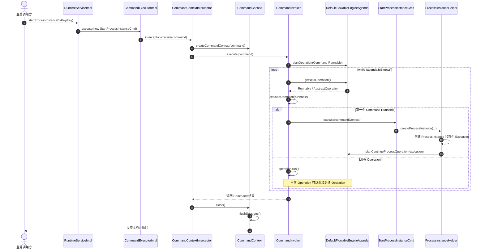
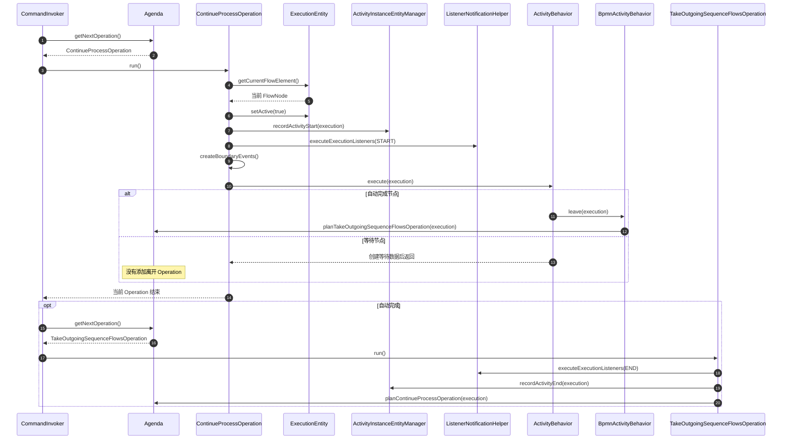
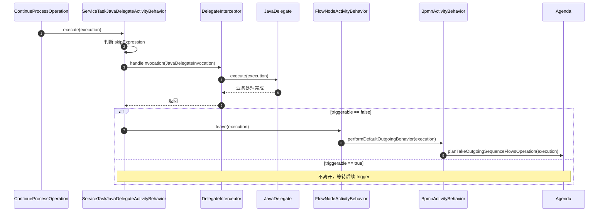
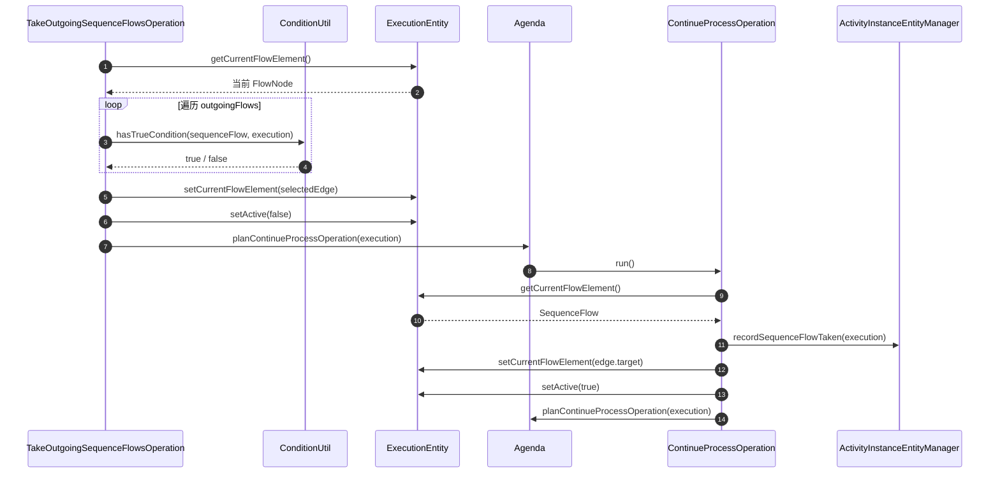
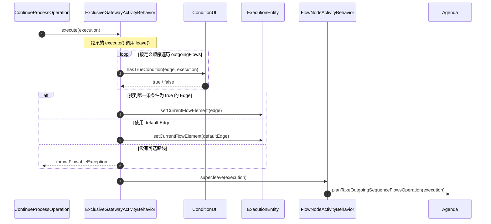
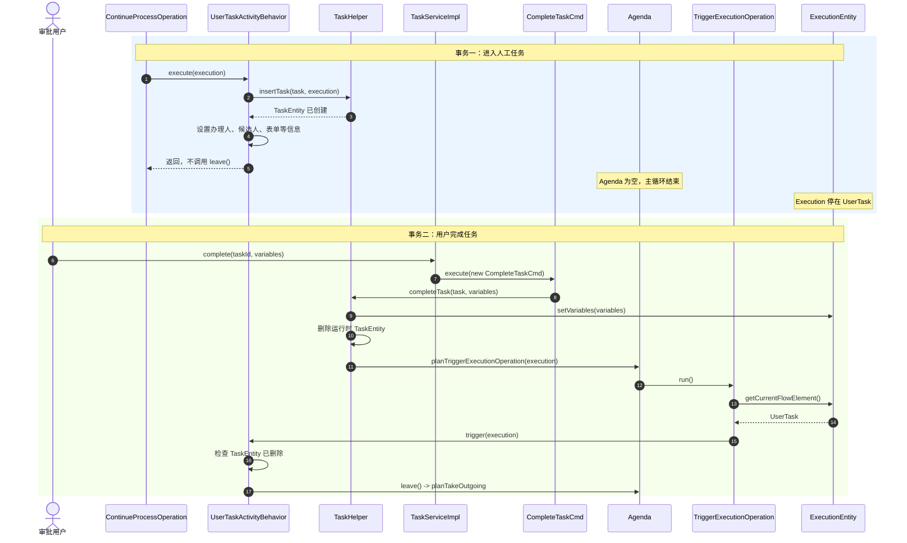

# Flowable 内部流程执行机制与完整时序

## 1. 文档目的

本文从 Flowable 源码角度梳理一个 BPMN 流程从 API 调用、流程启动、节点执行、连线选择、人工任务等待与恢复，直到流程结束的完整运行过程。

重点回答以下问题：

- Flowable 的流程主循环在哪里？
- `Agenda`、`Operation` 和 `Execution` 分别承担什么职责？
- 为什么每个节点能够在自己的职责范围内保持自洽？
- 自动节点、网关、人工任务和结束节点分别如何接入统一运行机制？
- 一个长流程为什么可以跨事务等待，并在外部事件到来后继续执行？

核心结论：

> `Operation` 负责公共生命周期和状态迁移，`ActivityBehavior` 负责节点自身语义，`Execution` 保存运行状态，`Agenda` 串联后续动作，`CommandContext` 保证一次推进过程的事务一致性。

Flowable 中节点之间不会直接互相调用。每个环节完成自身职责后，通过 Agenda 安排下一个 Operation，把控制权交还给统一的流程主循环。

---

## 2. 核心对象及职责

| 核心对象 | 主要职责 | 是否持久化 |
| --- | --- | --- |
| `ProcessDefinition` | 已部署、带版本的完整流程定义 | 是 |
| `ProcessInstance` | 某个流程定义版本的一次运行 | 是 |
| `ExecutionEntity` | 当前运行路径、作用域和节点位置 | 是 |
| `FlowNode` | BPMN 节点定义，例如任务、网关、事件 | 随流程定义持久化 |
| `SequenceFlow` | 节点之间的拓扑关系和条件 | 随流程定义持久化 |
| `ActivityBehavior` | 节点运行时行为 | 否，挂载在解析后的模型上 |
| `Operation` | 对 Execution 执行一次明确的状态迁移 | 否 |
| `Agenda` | 当前 Command 中待执行 Operation 的内存队列 | 否 |
| `CommandContext` | 一次 API 调用的会话、缓存和事务边界 | 否 |
| `TaskEntity` | 等待用户处理的人工任务实例 | 是 |
| `JobEntity` | 等待异步执行器处理的任务实例 | 是 |

三个最重要的关系是：

```text
Operation = 动作
Execution = 状态和游标
Agenda    = 动作队列
```

---

## 3. 节点自洽的运行协议

Flowable 节点通常通过 `ActivityBehavior` 接入运行引擎：

```java
void execute(DelegateExecution execution);
```

支持等待和外部唤醒的节点还实现：

```java
void trigger(
    DelegateExecution execution,
    String signalName,
    Object signalData
);
```

节点行为遵守以下协议：

1. 第一次进入节点时，引擎调用 `execute(execution)`。
2. 自动节点完成业务后调用 `leave(execution)`。
3. 等待节点创建可持久化等待数据，然后直接返回，不调用 `leave()`。
4. 外部事件到达后，引擎重新加载 Execution，并调用 `trigger(execution)`。
5. `trigger()` 确认等待条件已经解除，然后调用 `leave(execution)`。
6. `leave()` 不直接执行下一个节点，而是向 Agenda 添加后续 Operation。

因此，节点只需要决定：

```text
我是立即完成，还是进入等待？
```

节点不需要负责：

- 流程主循环；
- 事务提交；
- 下一个节点的执行；
- 通用历史记录；
- 通用 ExecutionListener；
- 通用边界事件创建；
- 并行路径的统一调度。

---

## 4. 最外层命令执行时序

以启动流程为例：

```java
runtimeService.startProcessInstanceByKey("purchase");
```

完整调用时序如下：



主要调用链：

```text
RuntimeServiceImpl.startProcessInstanceByKey()
  -> CommandExecutorImpl.execute(StartProcessInstanceCmd)
  -> CommandContextInterceptor.execute()
  -> CommandInvoker.execute()
  -> Agenda.planOperation(Command Runnable)
  -> CommandInvoker.executeOperations()
```

相关源码：

- [`RuntimeServiceImpl.startProcessInstanceByKey()`](../../../base_java/flowable-engine/modules/flowable-engine/src/main/java/org/flowable/engine/impl/RuntimeServiceImpl.java)
- [`CommandExecutorImpl.execute()`](../../../base_java/flowable-engine/modules/flowable-engine-common/src/main/java/org/flowable/common/engine/impl/cfg/CommandExecutorImpl.java)
- [`CommandContextInterceptor.execute()`](../../../base_java/flowable-engine/modules/flowable-engine-common/src/main/java/org/flowable/common/engine/impl/interceptor/CommandContextInterceptor.java)
- [`CommandInvoker.execute()`](../../../base_java/flowable-engine/modules/flowable-engine/src/main/java/org/flowable/engine/impl/interceptor/CommandInvoker.java)

---

## 5. Flowable 的流程主循环

真正的流程主循环位于 `CommandInvoker.executeOperations()`：

```java
protected void executeOperations(CommandContext commandContext) {
    FlowableEngineAgenda agenda =
            CommandContextUtil.getAgenda(commandContext);

    while (!agenda.isEmpty()) {
        Runnable runnable = agenda.getNextOperation();

        executeExecutionListenersBeforeExecute(
            commandContext,
            runnable
        );

        try {
            executeOperation(commandContext, runnable);
        } catch (Throwable throwable) {
            executeExecutionListenersAfterException(
                commandContext,
                runnable,
                throwable
            );
            ExceptionUtil.sneakyThrow(throwable);
        }

        executeExecutionListenersAfterExecute(
            commandContext,
            runnable
        );
    }
}
```

Agenda 的底层结构是：

```java
protected LinkedList<Runnable> operations = new LinkedList<>();
```

普通 Operation 从队尾加入、从队头取出：

```java
public void planOperation(Runnable operation) {
    operations.add(operation);
}

public Runnable getNextOperation() {
    return operations.poll();
}
```

因此，同一 Command 中的普通 Operation 基本按照 FIFO 顺序执行。

需要特别注意：

> Flowable 没有一个永久运行、持续扫描所有流程实例的全局流程循环。

主循环只存在于一次 Command 调用期间：

```text
收到外部调用
  -> 创建或复用 CommandContext
  -> 创建 Agenda
  -> 消费 Agenda
  -> Agenda 为空
  -> 刷新数据库会话
  -> 提交事务
```

相关源码：

- [`CommandInvoker`](../../../base_java/flowable-engine/modules/flowable-engine/src/main/java/org/flowable/engine/impl/interceptor/CommandInvoker.java)
- [`AbstractAgenda`](../../../base_java/flowable-engine/modules/flowable-engine-common/src/main/java/org/flowable/common/engine/impl/agenda/AbstractAgenda.java)
- [`DefaultFlowableEngineAgenda`](../../../base_java/flowable-engine/modules/flowable-engine/src/main/java/org/flowable/engine/impl/agenda/DefaultFlowableEngineAgenda.java)

---

## 6. 流程启动与第一个 Operation

`StartProcessInstanceCmd` 调用 `ProcessInstanceHelper.createProcessInstance()`，主要完成：

1. 查找本次启动绑定的 `ProcessDefinition`。
2. 创建流程实例根 Execution。
3. 创建用于实际遍历节点的第一个子 Execution。
4. 将子 Execution 的 `currentFlowElement` 指向 StartEvent。
5. 记录第一个 ActivityInstance。
6. 安排 `ContinueProcessOperation`。

核心代码可以概括为：

```java
ExecutionEntity execution =
    executionEntityManager.createChildExecution(processInstance);

execution.setCurrentFlowElement(initialFlowElement);

activityInstanceEntityManager.recordActivityStart(execution);

agenda.planContinueProcessOperation(execution);
```

此时运行状态为：

```text
ProcessInstance
└── Execution
    ├── currentFlowElement = StartEvent
    ├── active = true
    └── processDefinitionId = 当前流程定义版本 ID
```

相关源码：

- [`StartProcessInstanceCmd`](../../../base_java/flowable-engine/modules/flowable-engine/src/main/java/org/flowable/engine/impl/cmd/StartProcessInstanceCmd.java)
- [`ProcessInstanceHelper`](../../../base_java/flowable-engine/modules/flowable-engine/src/main/java/org/flowable/engine/impl/util/ProcessInstanceHelper.java)

---

## 7. 单个 FlowNode 的标准生命周期

`ContinueProcessOperation` 是进入节点和经过 SequenceFlow 的统一入口。



`ContinueProcessOperation.executeSynchronous()` 统一处理节点进入阶段：

```text
recordActivityStart()
  -> 执行 START ExecutionListener
  -> 创建 BoundaryEvent Execution
  -> 发布 ACTIVITY_STARTED 事件
  -> ActivityBehavior.execute(execution)
```

`TakeOutgoingSequenceFlowsOperation.handleFlowNode()` 统一处理节点离开阶段：

```text
执行 END ExecutionListener
  -> recordActivityEnd()
  -> 发布 ACTIVITY_COMPLETED 事件
  -> 选择 outgoing SequenceFlow
```

因此，各种节点行为不需要重复实现通用生命周期逻辑。

相关源码：

- [`ContinueProcessOperation`](../../../base_java/flowable-engine/modules/flowable-engine/src/main/java/org/flowable/engine/impl/agenda/ContinueProcessOperation.java)
- [`TakeOutgoingSequenceFlowsOperation`](../../../base_java/flowable-engine/modules/flowable-engine/src/main/java/org/flowable/engine/impl/agenda/TakeOutgoingSequenceFlowsOperation.java)

---

## 8. 自动节点的内部闭环

以 Java ServiceTask 为例：



自动节点的标准闭环为：

```text
进入节点
  -> 执行业务
  -> 业务成功
  -> leave(execution)
  -> 安排 TakeOutgoingSequenceFlowsOperation
```

如果业务代码抛出异常：

```text
JavaDelegate 抛出异常
  -> ActivityBehavior.execute() 中断
  -> 不调用 leave()
  -> 不产生后续 Operation
  -> 异常传播到 CommandInvoker
  -> CommandContext 标记失败
  -> 当前事务回滚
```

相关源码：

- [`ServiceTaskJavaDelegateActivityBehavior`](../../../base_java/flowable-engine/modules/flowable-engine/src/main/java/org/flowable/engine/impl/bpmn/behavior/ServiceTaskJavaDelegateActivityBehavior.java)
- [`FlowNodeActivityBehavior`](../../../base_java/flowable-engine/modules/flowable-engine/src/main/java/org/flowable/engine/impl/bpmn/behavior/FlowNodeActivityBehavior.java)
- [`BpmnActivityBehavior`](../../../base_java/flowable-engine/modules/flowable-engine/src/main/java/org/flowable/engine/impl/bpmn/behavior/BpmnActivityBehavior.java)

---

## 9. Edge 如何完成节点之间的交接

节点完成后，`TakeOutgoingSequenceFlowsOperation` 负责选择出边。



Execution 的位置变化是：

```text
Node A
  -> SequenceFlow A-B
  -> Node B
```

而不是：

```text
Node A 直接调用 Node B
```

完整交接责任如下：

```text
Node Behavior             负责完成当前节点
TakeOutgoing Operation    负责选择出口
SequenceFlow              负责描述目标节点
ContinueProcess Operation 负责经过 Edge 并进入目标节点
Execution                 负责记录当前位置
```

当选择多条出边时：

1. 第一条 Edge 复用当前 Execution。
2. 其他 Edge 分别创建新的子 Execution。
3. 每个 Execution 分别获得一个 `ContinueProcessOperation`。
4. 主循环依次执行这些 Operation。

这就是并行路径中一个 ProcessInstance 可以同时存在多个 Execution 的原因。

---

## 10. ExclusiveGateway 的路线选择

普通 BPMN 节点的默认离开规则是：满足条件的出边都可以被选择。

排他网关只能选择一条，因此 `ExclusiveGatewayActivityBehavior` 覆盖了 `leave()`。



网关自己封装“如何选择路线”，公共运行层继续负责：

```text
如何记录历史
如何经过 Edge
如何进入下一个节点
如何提交事务
```

相关源码：

- [`ExclusiveGatewayActivityBehavior`](../../../base_java/flowable-engine/modules/flowable-engine/src/main/java/org/flowable/engine/impl/bpmn/behavior/ExclusiveGatewayActivityBehavior.java)
- [`ConditionUtil`](../../../base_java/flowable-engine/modules/flowable-engine/src/main/java/org/flowable/engine/impl/util/condition/ConditionUtil.java)

---

## 11. UserTask 的等待与恢复

UserTask 的完整生命周期跨越两个独立事务。



进入 UserTask 时：

```text
ContinueProcessOperation
  -> UserTaskActivityBehavior.execute()
  -> TaskService.createTask()
  -> TaskHelper.insertTask()
  -> 配置 assignee / candidate / form / listener
  -> 返回，不调用 leave()
  -> Agenda 为空
  -> 提交 TaskEntity 和 Execution
```

完成 UserTask 时：

```text
TaskServiceImpl.complete()
  -> CompleteTaskCmd.execute()
  -> TaskHelper.completeTask()
  -> 写入流程变量
  -> 删除 TaskEntity
  -> planTriggerExecutionOperation(execution)
  -> TriggerExecutionOperation.run()
  -> UserTaskActivityBehavior.trigger()
  -> leave(execution)
```

这里最关键的规则是：

> Agenda 为空不代表流程已经结束，也可能代表流程已经安全地进入等待状态。

相关源码：

- [`UserTaskActivityBehavior`](../../../base_java/flowable-engine/modules/flowable-engine/src/main/java/org/flowable/engine/impl/bpmn/behavior/UserTaskActivityBehavior.java)
- [`TaskServiceImpl`](../../../base_java/flowable-engine/modules/flowable-engine/src/main/java/org/flowable/engine/impl/TaskServiceImpl.java)
- [`CompleteTaskCmd`](../../../base_java/flowable-engine/modules/flowable-engine/src/main/java/org/flowable/engine/impl/cmd/CompleteTaskCmd.java)
- [`TaskHelper`](../../../base_java/flowable-engine/modules/flowable-engine/src/main/java/org/flowable/engine/impl/util/TaskHelper.java)
- [`TriggerExecutionOperation`](../../../base_java/flowable-engine/modules/flowable-engine/src/main/java/org/flowable/engine/impl/agenda/TriggerExecutionOperation.java)

---

## 12. EndEvent 和流程结束

普通结束节点的调用链为：

```text
ContinueProcessOperation.run()
  -> NoneEndEventActivityBehavior.execute()
  -> planTakeOutgoingSequenceFlowsOperation(execution)
  -> TakeOutgoingSequenceFlowsOperation.run()
  -> 当前节点没有 outgoing SequenceFlow
  -> planEndExecutionOperation(execution)
  -> EndExecutionOperation.run()
```

`EndExecutionOperation` 会区分：

- 普通路径 Execution；
- 作用域 Execution；
- 子流程 Execution；
- 流程实例根 Execution。

普通路径结束后，引擎会检查：

```text
是否存在父 Execution？
是否存在其他活动分支？
是否需要完成子流程？
是否需要继续父作用域？
整个 ProcessInstance 是否已经没有活动 Execution？
```

只有整个流程实例不存在活动路径后，ProcessInstance 才会真正完成。

相关源码：

- [`NoneEndEventActivityBehavior`](../../../base_java/flowable-engine/modules/flowable-engine/src/main/java/org/flowable/engine/impl/bpmn/behavior/NoneEndEventActivityBehavior.java)
- [`EndExecutionOperation`](../../../base_java/flowable-engine/modules/flowable-engine/src/main/java/org/flowable/engine/impl/agenda/EndExecutionOperation.java)

---

## 13. 事务与异常如何保证环节自洽

一次同步推进过程位于同一个 CommandContext 和事务中：

```text
创建 CommandContext
  -> 创建 Agenda
  -> 执行 Command
  -> 消费所有同步 Operation
  -> Agenda 为空
  -> flush Execution / Task / Variable / History
  -> 提交事务
  -> 关闭 CommandContext
```

如果任意 Operation 抛出异常：

```text
Operation.run() 抛出异常
  -> CommandInvoker 捕获并重新抛出
  -> CommandContextInterceptor 记录异常
  -> CommandContext 不执行成功 flush
  -> 事务拦截器回滚
```

因此不会出现以下半完成状态：

```text
ServiceTask 业务失败
但 Execution 已经移动到下一个节点
```

因为只有业务成功返回后，节点 Behavior 才会调用 `leave()` 并产生后续 Operation。

相关源码：

- [`CommandContext`](../../../base_java/flowable-engine/modules/flowable-engine-common/src/main/java/org/flowable/common/engine/impl/interceptor/CommandContext.java)
- [`CommandContextInterceptor`](../../../base_java/flowable-engine/modules/flowable-engine-common/src/main/java/org/flowable/common/engine/impl/interceptor/CommandContextInterceptor.java)
- [`CommandInvoker`](../../../base_java/flowable-engine/modules/flowable-engine/src/main/java/org/flowable/engine/impl/interceptor/CommandInvoker.java)

---

## 14. 一条完整流程的 Operation 变化

假设流程为：

```text
StartEvent
  -> ServiceTask
  -> ExclusiveGateway
  -> UserTask
  -> EndEvent
```

运行时 Agenda 中的 Operation 大致变化如下：

```text
1. Command Runnable
   StartProcessInstanceCmd.execute()

2. ContinueProcessOperation
   执行 StartEvent

3. TakeOutgoingSequenceFlowsOperation
   选择 StartEvent 的出边

4. ContinueProcessOperation
   经过 StartEvent -> ServiceTask 的 Edge

5. ContinueProcessOperation
   执行 ServiceTask

6. TakeOutgoingSequenceFlowsOperation
   选择 ServiceTask 的出边

7. ContinueProcessOperation
   经过 ServiceTask -> Gateway 的 Edge

8. ContinueProcessOperation
   执行 ExclusiveGateway，选择一条 Edge

9. TakeOutgoingSequenceFlowsOperation
   完成 Gateway 离开处理

10. ContinueProcessOperation
    经过 Gateway -> UserTask 的 Edge

11. ContinueProcessOperation
    执行 UserTask，创建 TaskEntity

12. Agenda 为空
    第一个事务结束，流程等待用户

13. 用户完成任务，产生新的 Command Runnable

14. TriggerExecutionOperation
    唤醒 UserTask 对应的 Execution

15. TakeOutgoingSequenceFlowsOperation
    选择 UserTask 的出边

16. ContinueProcessOperation
    经过 UserTask -> EndEvent 的 Edge

17. ContinueProcessOperation
    执行 EndEvent

18. TakeOutgoingSequenceFlowsOperation
    发现没有出边

19. EndExecutionOperation
    结束 Execution 和 ProcessInstance
```

---

## 15. 完整架构总结

Flowable 的顺畅运行来自以下六层稳定契约：

| 层次 | 负责内容 |
| --- | --- |
| Command 层 | 把外部动作转换为一次引擎命令 |
| CommandContext 层 | 提供事务、Session 和缓存边界 |
| Agenda 层 | 保存当前命令中的待执行动作 |
| Operation 层 | 执行公共生命周期和状态迁移 |
| Behavior 层 | 实现具体节点语义 |
| Execution 层 | 保存流程实例当前的运行位置和作用域 |

整个推进机制可以压缩成：

```java
void executeCommand(Command<?> command) {
    Agenda agenda = createAgenda();

    agenda.planOperation(() -> command.execute());

    while (!agenda.isEmpty()) {
        Runnable operation = agenda.getNextOperation();
        operation.run();
    }

    flushAndCommit();
}
```

而每个节点的运行协议可以压缩成：

```java
void executeNode(Execution execution, NodeBehavior behavior) {
    recordStart(execution);

    behavior.execute(execution);

    // 自动节点：behavior 内部调用 leave()，安排后续 Operation
    // 等待节点：behavior 创建等待数据，不安排离开 Operation
}
```

最终的节点交接不是：

```text
Node A 调用 Node B
```

而是：

```text
Node A 完成自己的行为
  -> 安排离开 Operation
  -> Operation 选择 Edge
  -> Execution 移动到 Edge
  -> Operation 经过 Edge
  -> Execution 移动到 Node B
  -> 新 Operation 执行 Node B
```

这套设计带来的主要价值是：

1. 节点之间没有直接依赖。
2. 节点类型可以通过 Behavior 扩展。
3. 不会因为长流程形成不断增长的 Java 调用栈。
4. 等待节点可以自然跨越事务和进程重启。
5. Execution、Task、Variable 和历史记录能够在同一事务中保持一致。
6. 并行路径可以通过多个 Execution 统一表达。
7. 主循环只负责调度，不需要理解每种节点的具体业务。

