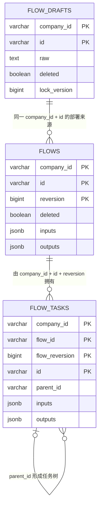

# PostgreSQL Repository 验证

## 目的

验证 Flow、Execution、TaskRun 和 ExternalTask 的真实 PostgreSQL 往返、JSONB
转换、跨版本 Task id 复用，以及乐观锁冲突。

本次 Input JSONB 演进不改变关系模型：



图中的关系由复合身份、应用校验和同事务写入保证，数据库仍不创建外键。Input
没有独立身份、生命周期或查询路径，继续作为不可变 Flow/Task 定义快照保存在
JSONB 中；PAAS JSON 依据 Input 的 `type` 多态元数据完成该载荷的 Java 往返，
不经过项目私有 Mapper。

## 准备数据库

在空的 PostgreSQL 数据库执行：

```bash
psql "$FLOW_POSTGRES_TEST_URL" \
  -f gen/sql/production-release/flow/2026-07-28/001_create_flow_tables.sql
psql "$FLOW_POSTGRES_TEST_URL" \
  -f gen/sql/production-release/flow/2026-07-28/002_align_repository_persistence.sql
psql "$FLOW_POSTGRES_TEST_URL" \
  -f gen/sql/production-release/flow/2026-07-28/003_align_temporal_columns.sql
psql "$FLOW_POSTGRES_TEST_URL" \
  -f gen/sql/production-release/flow/2026-07-29/001_align_flow_source_and_reversion.sql
psql "$FLOW_POSTGRES_TEST_URL" \
  -f gen/sql/production-release/flow/2026-07-29/002_rename_assignment_to_external_task.sql
psql "$FLOW_POSTGRES_TEST_URL" \
  -f gen/sql/production-release/flow/2026-07-30/001_unify_workflow_state_types.sql
psql "$FLOW_POSTGRES_TEST_URL" \
  -f gen/sql/production-release/flow/2026-07-30/002_use_flow_lifecycle_flags.sql
psql "$FLOW_POSTGRES_TEST_URL" \
  -f gen/sql/production-release/flow/2026-07-30/003_backfill_input_definition_fields.sql
psql "$FLOW_POSTGRES_TEST_URL" \
  -f gen/sql/production-release/flow/2026-07-31/001_remove_flow_draft_flags.sql
```

已有 001 表结构的数据库还需按顺序执行：

```bash
psql "$FLOW_POSTGRES_TEST_URL" \
  -f gen/sql/production-release/flow/2026-07-28/002_align_repository_persistence.sql
psql "$FLOW_POSTGRES_TEST_URL" \
  -f gen/sql/production-release/flow/2026-07-28/003_align_temporal_columns.sql
psql "$FLOW_POSTGRES_TEST_URL" \
  -f gen/sql/production-release/flow/2026-07-29/001_align_flow_source_and_reversion.sql
psql "$FLOW_POSTGRES_TEST_URL" \
  -f gen/sql/production-release/flow/2026-07-29/002_rename_assignment_to_external_task.sql
psql "$FLOW_POSTGRES_TEST_URL" \
  -f gen/sql/production-release/flow/2026-07-30/001_unify_workflow_state_types.sql
psql "$FLOW_POSTGRES_TEST_URL" \
  -f gen/sql/production-release/flow/2026-07-30/002_use_flow_lifecycle_flags.sql
psql "$FLOW_POSTGRES_TEST_URL" \
  -f gen/sql/production-release/flow/2026-07-30/003_backfill_input_definition_fields.sql
psql "$FLOW_POSTGRES_TEST_URL" \
  -f gen/sql/production-release/flow/2026-07-31/001_remove_flow_draft_flags.sql
```

`003_align_temporal_columns.sql` 将旧脚本中的毫秒时间戳转换为
`timestamptz`，使数据库 Schema 与 JOOQ 生成模型使用的 `OffsetDateTime`
保持一致。`001_align_flow_source_and_reversion.sql` 分离原始来源与部署快照，
统一 `reversion/flow_reversion` 字段，并增加 Flow/Task 的 Input、Output 和
`dependOn` 存储。`002_rename_assignment_to_external_task.sql` 将 PAUSE 的 Core
等待表改为中性的 `external_task`，并移除已经可以从绑定 PauseTask 稳定读取的
`allowed_outputs` 契约副本。项目自有 Java 类型仍使用 Epoch 毫秒 `long`，只在
Entry 边界与 `OffsetDateTime` 转换。

`001_unify_workflow_state_types.sql` 将 Execution 和 TaskRun 收敛为
`CREATED/RUNNING/WAITING/COMPLETED/TERMINATED` 五个具体状态、四个运行大类，
为两张表新增非空 `jsonb state_history`，并迁移历史 PAUSE 等待记录。迁移缺少
旧状态事件时使用 `created_at/updated_at` 构造最小合法历史基线。

`002_use_flow_lifecycle_flags.sql` 是从旧状态模型迁移到布尔生命周期事实的历史
过渡脚本；它先增加 `draft/deleted` 并回填删除审计。后续
`001_remove_flow_draft_flags.sql` 以独立的 `FlowDraft` 聚合和表表达草稿身份，
删除 `flow_drafts.draft` 与 `flows.draft`，重建只依赖 `deleted` 的约束和活动
草稿索引。两份脚本均可按顺序重复执行；当前 Flow 查询先选择最大
`reversion`，再判断 `deleted`。

`003_backfill_input_definition_fields.sql` 不改变表关系或列结构，只演进
`flows.inputs` 与 `flow_tasks.inputs` 的 JSONB 快照。旧 Input 缺少
displayName 时补为 key，缺少 required 时补为 false；已有值、具体子类字段、
数组顺序和非对象项保持不变。脚本可重复执行。

测试只使用随机 companyId，不会清空或删除数据库中的其他租户数据。
UC 测试默认保留本场景创建的 Flow、Execution、TaskRun 和 ExternalTask 数据，
便于在本地 PostgreSQL 中观察真实入库结果。场景中出现 PAUSE 时，夹具先关闭
启动 server 的 ApplicationContext，再由独立 External Trigger
ApplicationContext 从 PostgreSQL 恢复并推进，因此完成型场景结束后不应存在
WAITING Execution 或 WAITING ExternalTask。如需在 CI 或一次性验证后清理，
显式设置 `FLOW_POSTGRES_TEST_CLEANUP=true`；清理范围只限本次夹具创建的随机
companyId。

## 运行 Repository 集成测试

```bash
JAVA_HOME=$(/usr/libexec/java_home -v 21) \
FLOW_POSTGRES_TEST_URL=jdbc:postgresql://localhost:5432/flow \
FLOW_POSTGRES_TEST_USER=flow \
FLOW_POSTGRES_TEST_PASSWORD=flow \
./gradlew :server:test \
  --tests '*PostgresRepositoryIntegrationTest'
```

未设置 `FLOW_POSTGRES_TEST_URL` 时，Repository 集成测试会跳过。

## 运行 UC 测试

UC-01～UC-07 通过 Micronaut server 的公开 Service/Command 链路装配生产
PostgreSQL Repository，不再使用 Flow 内存 Repository。运行 UC、server 模块或
项目完整测试前必须设置相同的三个 PostgreSQL 环境变量：

```bash
JAVA_HOME=$(/usr/libexec/java_home -v 21) \
FLOW_POSTGRES_TEST_URL=jdbc:postgresql://localhost:5432/flow \
FLOW_POSTGRES_TEST_USER=flow \
FLOW_POSTGRES_TEST_PASSWORD=flow \
./gradlew :server:test --tests '*Uc*Test'
```

上述命令默认保留 UC 数据。需要自动清理时追加：

```bash
FLOW_POSTGRES_TEST_CLEANUP=true
```

未设置 `FLOW_POSTGRES_TEST_URL` 时，UC 夹具会立即给出明确错误，不能把缺少真实
数据库的执行误判为 UC 通过。普通领域单元测试仍可独立运行。

## 重新生成 JOOQ

数据库结构变化后，可使用本地默认连接生成：

```bash
JAVA_HOME=$(/usr/libexec/java_home -v 21) \
./gradlew :gen:generateJooq --rerun-tasks
```

也可通过 `FLOW_JOOQ_JDBC_URL`、`FLOW_JOOQ_JDBC_USER` 和
`FLOW_JOOQ_JDBC_PASSWORD` 指向一次性代码生成数据库。
