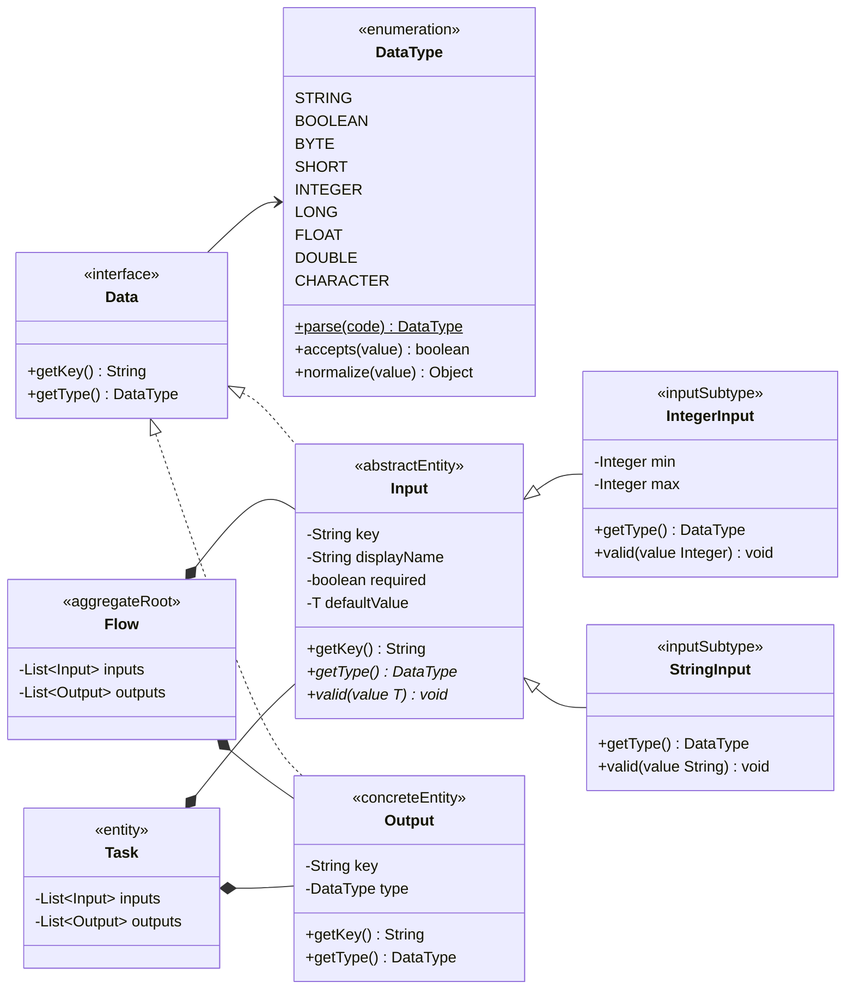
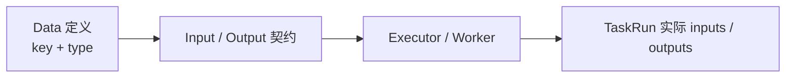

# Data、DataType、Input 与 Output 领域模型规范

## 适用范围与效力

本规范定义 Flow 定义域中的 Data 基础接口、独立 DataType 枚举、抽象
`Input<T>` 及其具体子类，以及 Output 对象。它只描述数据定义，不描述某次
Execution 中产生的实际数据值。

本规范落实
[`CONTEXT.md`](../../CONTEXT.md)、
[`domain-object-modeling.md`](domain-object-modeling.md)、
[`flow-definition-lifecycle.md`](flow-definition-lifecycle.md)
以及
[`task-domain-model.md`](task-domain-model.md)
已经确认的领域语义。

当前已经确认 Data 保持非泛型，`getType()` 返回独立的 `DataType`，不能返回
`Class<?>` 或嵌套的 `Data.Type`。Input 是泛型抽象基类，公共描述字段放在
Input 中，具体 Input 子类固定自身 DataType 并实现类型规则。基础类型决策记录在
[`ADR 0019`](../decisions/0019-establish-basic-data-types.md)。

本文同时描述已落地模型及其仍待确认的运行输入边界。Java 领域对象、YAML
物化、JSONB 持久化、Task 输出校验和 Demo 类型表单已经按本规范实现。

## 定义与对象角色

Data 是 Flow 或 Task 中一个具有唯一业务 key 和数据类型的数据定义。它不是原始
YAML、运行时值、数据库列或任意 Map。

对象角色如下：

- `Data` 是非泛型的数据定义基础接口，本身不直接实例化。
- `DataType` 是与 Data 平级的独立枚举值域，不是 Data 的内部类型、独立实体、
  Task 类型或持久化 Java 类名。
- `Input<T>` 是实现 Data 的泛型抽象输入定义；泛型只约束输入值和默认值，不
  上升到 Data。
- `StringInput`、`IntegerInput` 等是具体输入定义，固定自身 DataType，并实现
  自身的 `valid(...)` 校验逻辑。
- `Output` 是直接实现 Data 的具体输出定义；当前不建立 Output 子类型体系。
- 具体 Input、Output 是所属 Flow 或 Task 聚合内的不可变实体。
- Input、Output 没有独立 Repository、状态、审计字段或 `reversion`。
- Input、Output 只在部署时随完整 Flow 和 Task 一起产生。

Input 与 Output 对 Data 的实现表达共同的数据定义契约：任何具体 Input 或
Output 都必须能够回答 key 和 DataType。Input 本身不能直接实例化；Input 的
具体子类不是调用方手工选择字段拼装出来的对象，而是定义反序列化时根据 type
分派得到的完整对象。

## 领域类图



类图只展开 `IntegerInput`、`StringInput` 两个代表性子类；第一阶段每个已确认
DataType 都有一个对应的具体 Input 子类。`Input<T>` 的泛型没有传递给 Data，
因此 Flow 与 Task 在聚合边界以 `Input<?>` 保存异构输入定义列表。

## Java 基础契约

基础接口为：

```text
public interface Data {

    String getKey();

    DataType getType();
}

public enum DataType {
    STRING,
    BOOLEAN,
    BYTE,
    SHORT,
    INTEGER,
    LONG,
    FLOAT,
    DOUBLE,
    CHARACTER
}

public abstract class Input<T> implements Data {
    private final String key;
    private final String displayName;
    private final boolean required;
    private final T defaultValue;

    public String getKey();

    public abstract DataType getType();

    public abstract void valid(T value);
}

public final class IntegerInput extends Input<Integer> {
    private final Integer min;
    private final Integer max;

    public DataType getType();

    public void valid(Integer value);
}

public final class Output implements Data {
    private final String key;
    private final DataType type;

    public String getKey();

    public DataType getType();
}
```

代码块省略构造和绑定细节，只表达类型、字段及领域方法。具体 Input 不提供
调用方主动使用的公共 `create(...)`；定义反序列化边界必须一次形成完整具体
对象，并在对象进入 Flow 聚合前完成公共字段与子类字段校验。ADR 0013 的通用
Map 物化边界继续生效，但 Input 子类选择由 PAAS JSON 根据 `type` 多态元数据
完成，不再建立 `InputDefinitionMapper` 或手写类型 `switch`。

## 字段

| 对象 | 字段 | 含义 | 规则 |
| --- | --- | --- | --- |
| Data | `key` | 数据定义的业务主键 | `String`，非空；在同一直接 owner 的同方向集合内唯一且不可改变 |
| Input | `displayName` | 页面向使用者展示的输入名称 | `String`，非空；不替代 key |
| Input | `required` | 运行时是否必须提供该输入 | `boolean` |
| Input | `defaultValue` | 未提供输入时可使用的默认值 | 类型为 `T`；可空表示没有默认值；非空时必须通过具体 Input 校验 |
| IntegerInput | `min` | 允许的最小整数 | `Integer`，可空；有值时采用包含边界 |
| IntegerInput | `max` | 允许的最大整数 | `Integer`，可空；有值时采用包含边界，且不得小于 min |
| Output | `type` | 输出的数据类型 | `DataType`，非空且不可改变 |

具体 Input 不保存一个可任意修改的 `type` 字段；其 Java 子类型唯一决定
`getType()` 的结果。例如 `IntegerInput` 始终返回 `DataType.INTEGER`，从模型
上禁止 `IntegerInput + STRING`。

不属于这些定义对象的字段包括：Execution/TaskRun 实际值、运行状态、错误、
审计操作者、业务 `reversion` 和并发 `lockVersion`。

## 方法

### 创建与重建

具体 Input 不向 Service、Handler、TaskExtension 或页面调用链暴露主动
`create(...)`。它只由 Flow 定义反序列化边界根据 type 选择并形成，非法字段在
进入聚合前失败；持久化恢复也必须恢复同一具体子类。

这是对 ADR 0010“所有领域对象公开静态 create”的局部例外。具体 Input 使用
受限构造，并声明 JSON 创建参数；PAAS JSON 根据 Input 基类的多态元数据选择
具体子类后一次调用该构造。Repository 恢复复用同一多态反序列化协议，不增加
公共无参构造、Setter 或项目私有 Mapper。

### `getKey()`

`getKey()` 返回 Data 的唯一业务主键，也是定义和运行值引用该 Data 的稳定名称。

- Data 进入 Flow 聚合时必须已经具有非空 key。
- 同一直接 owner 的 inputs 内 key 唯一，outputs 内 key 唯一。
- Input 与 Output 是不同方向，允许在各自集合中分别声明相同 key。
- key 由 YAML 定义声明，不由系统生成技术 id。
- 相同 key 跨 Flow Reversion 自然表达同一个业务数据引用；修改 key 表达新的
  数据引用，不执行模糊身份迁移。

### `getType()`

`getType()` 返回独立 `DataType`，用于解释该 Input 或 Output 约束的数据。

- DataType 不是 Java 类名、数据库列类型或 Task 类型。
- type 不描述 Input 或 Output 方向；方向由具体对象类型表达。
- 第一阶段代码固定为 `STRING`、`BOOLEAN`、`BYTE`、`SHORT`、`INTEGER`、
  `LONG`、`FLOAT`、`DOUBLE`、`CHARACTER`。
- 同一个 type 在 Input 和 Output 中必须保持相同的数据类型含义。
- 定义入口使用 `trim + Locale.ROOT` 大写规范化；未知代码和 `BOOL`、`INT`、
  `NUMBER` 等非协议别名被拒绝，不能回退为 STRING。

如果未来还需要区分“数据定义类型”和“实际值类型”，必须增加不同名称的明确
概念，例如 value type，不能让一个 `getType()` 同时表达两种含义。

不同 Task 可以声明相同 key，因为运行时数据作用域由 TaskRun 隔离。
RouteExpression 中的 `outputs.<field>` 使用直接父 Task 的 Output key 解析
`<field>`。如果未来需要展示名称，应增加独立 label 概念，不能改变 key 的主键
语义。

这里的 owner 是直接持有该集合的 Flow 或 Task。

### `valid(value)`

`Input<T>.valid(T value)` 是抽象方法，每个具体 Input 子类必须实现自己的校验
逻辑。Input 基类负责公共描述，子类负责类型特有规则；例如
`IntegerInput.valid(...)` 校验最小值、最大值和待校验整数。

校验失败抛出包含 input key 或规则上下文的 `IllegalArgumentException`，上层
领域用例按边界转换为 `WorkflowException`。校验不能修正值、截断值或回退为
默认类型。

## 基础 DataType

第一阶段只支持 Java 包装基础类型以及 String：

| DataType | 具体 Input | Java 值类型 |
| --- | --- | --- |
| `STRING` | `StringInput` | `String` |
| `BOOLEAN` | `BooleanInput` | `Boolean` |
| `BYTE` | `ByteInput` | `Byte` |
| `SHORT` | `ShortInput` | `Short` |
| `INTEGER` | `IntegerInput` | `Integer` |
| `LONG` | `LongInput` | `Long` |
| `FLOAT` | `FloatInput` | `Float` |
| `DOUBLE` | `DoubleInput` | `Double` |
| `CHARACTER` | `CharacterInput` | `Character` |

`DataType.parse(code)` 把稳定代码解析为枚举；`accepts(value)` 判断非空对象
是否已经属于准确包装类型；`normalize(value)` 将传输层 Number 安全转换为
准确包装类型。枚举内部保存对应 `Class<?>` 以复用判断，但 `Data.getType()`
只能暴露 DataType，Data 自身也不能泛型化。

最小值、最大值、长度、候选项等约束不属于 DataType。它们属于具体 Input 子类，
因此给 `IntegerInput` 增加 min/max 不会让枚举承担输入表单或业务规则。

第一阶段不包含 `BigDecimal`、JSON、集合、对象、日期时间、文件或自定义类。
整数包装类型只接受 Number，并执行整数性和范围精确检查；字符串数字不转换。
FLOAT/DOUBLE 只接受 Number 且拒绝 NaN、Infinity；CHARACTER 接受 Character
或长度恰好为一的 String。转换不依赖 Jackson 的隐式强制转换。

## Input 与 Output

### Input

Input 是所属 Flow 或 Task 接受数据的抽象定义基类：

- `Input<T>` 实现 `Data`，但 Data 不携带泛型。
- 保存 key、displayName、required、defaultValue 公共描述。
- 不能直接实例化；只有具体 Input 子类能够进入 Flow 或 Task。
- 具体子类固定 DataType，并通过 `valid(...)` 实现自身规则。
- 不保存某次 Execution 或 TaskRun 实际接收到的值。

### Output

Output 是所属 Flow 或 Task 可以产生并向下游声明数据的具体定义对象：

- 直接实现 `Data`。
- 必须满足 Data 的 key 和 type 契约。
- 不保存某次 TaskRun 实际产生的值。

具体 Input 与 Output 是两个不同方向的数据定义，不是生命周期状态。一个 Output
不通过状态变化“变成” Input；它们只共享 Data 基础契约。Input 的子类型层次只
服务输入描述与校验，不要求 Output 建立镜像子类层次。

## 状态机

不适用：DataType 是枚举值域，具体 Input 与 Output 随所属 Flow Reversion
一次性形成且不可变，没有独立生命周期或状态转换。无效定义不能以半成品状态进入
聚合。

## 版本、审计与并发

DataType、Input 和 Output 不拥有独立 Repository、审计字段、业务 `reversion`
或并发
`lockVersion`。Data 定义内容随 Flow Reversion 形成业务版本；同一个 key 改变
DataType 或具体 Input 子类必须通过新的 Flow Reversion 生效。审计和并发由所属
Flow 聚合及其 Repository 边界负责，已经启动的 Execution 始终按绑定 Reversion
解释数据定义。

## 聚合关系与业务边界

- DataType 是共享枚举值域，不拥有 Repository。
- 具体 Input 与 Output 是 Flow 或 Task 聚合内部对象，只能随所属定义保存、
  恢复和形成新 Reversion。
- Flow 部署负责保证同方向 key 唯一、具体 Input 完整有效以及类型代码可解析。
- 定义反序列化负责根据 type 选择具体 Input 子类，但不拥有 Flow 身份、版本或
  Task 树规则。
- TaskRun 只保存实际值；它通过绑定的 Flow Reversion 读取 Input/Output 契约，
  不能反向改变定义。
- 外部页面使用服务端暴露的定义元数据生成字段，不维护另一份 DataType 或
  Input 子类规则。

## YAML 物化与持久化边界

YAML 通过 `type` 为每个输入选择具体 Input 子类；子类可以声明自己的字段：

```yaml
inputs:
  - key: retryCount
    type: INTEGER
    displayName: 重试次数
    required: true
    defaultValue: 3
    min: 0
    max: 10
outputs:
  - key: decision
    type: STRING
```

- `inputs`、`outputs` 缺省时解释为空列表。
- 每个 Input 项先读取 type，再选择唯一具体子类；未知 type 不得回退到
  `StringInput`。
- Input 公共字段由 Input 基类定义；min/max 等字段只有对应子类可以接收，其他
  子类出现这些字段时拒绝定义。
- key、type 缺失或空白，显式 displayName 为空白，同方向出现重复 key，
  默认值类型错误，或具体子类 `valid(...)` 失败时拒绝物化。
- 为升级只有 key/type 的历史定义，缺失 displayName 时使用 key，缺失 required
  时使用 false；该兼容只处理字段缺失，不修正显式空值、错误类型或未知 type。
- 字符串列表不是 Output 的简写形式；没有 type 时不能构造完整 Data。
- 调用方不主动调用具体 Input 的公共 `create(...)`；定义反序列化边界根据 type
  形成对象，TaskExtension 只接收已经物化并校验的 `Input<?>`。
- Repository 必须保存 type、公共字段和具体子类字段，恢复后仍得到同一具体
  Input 子类；不得只恢复成抽象 Input、任意 Map 或默认 StringInput。

ADR 0013 继续要求 `YamlParser` 只生成通用只读 Map。Flow 只在物化边界把每个
Input 定义片段交给 PAAS JSON，并以 `Input.class` 触发 `type` 多态实例化；
PostgreSQL JSONB 恢复使用 `JsonObjects.asObjects(Input.class)` 的同一协议。
稳定 type 与具体子类的关系只声明在 Input 的 JSON 多态元数据中，不能再由
Mapper、Flow 或 Repository 维护平行 `switch`。JSON 技术对象只在当前转换中
短暂存在，不能成为 Flow、Task 或 Input 的字段和公共方法参数。

## 定义与运行值边界



- Data、Input 和 Output 只属于定义域。
- TaskRun 的 inputs、outputs 保存一次真实运行产生的值。
- 实际值按已确认的 Data key 组织，但不能反向修改 Data 定义。
- Data 不持有 TaskRun，TaskRun 只按绑定的 Flow Reversion 解释数据契约。
- 原始 YAML 在部署前可以缺少系统拥有的字段；部署成功后进入领域的具体 Data
  必须完整有效。
- Worker 完成和 PAUSE Resume 提交的 Output 值，在写入 TaskRun 前按绑定
  Flow Reversion 中对应 Output 的 DataType 校验并归一化为准确 Java 包装类型。
- 提交的 outputs Map 必须非 null；已声明 Output 可以缺失，额外 key 和 null
  值被拒绝。这样 Route 可以区分“未提交”与“提交了匹配值”。
- 当前 TaskRun inputs 使用 `outputs`、`dependOnOutputs` 运行数据域，尚未与
  Task Input key 建立正式映射。Input 运行值校验必须等映射协议确认后启用，
  不能用容器名称冒充 Input key。

## 领域不变量

- `DATA-001`：Data 保持非泛型，只提供 `getKey()` 和返回独立 DataType 的
  `getType()`。
- `DATA-002`：DataType 必须是独立枚举，不能嵌套在 Data 中，也不能由
  `Class<?>`、自由 String 或隐式 STRING 替代。
- `DATA-003`：Input 是泛型抽象基类；只有完整有效的具体 Input 子类或 Output
  可以进入 Flow、Task 聚合，它们都没有独立生命周期和 Repository。
- `DATA-004`：同一 owner 的同方向集合中，Data key 唯一；Input 与 Output
  可以分别声明相同 key。
- `DATA-005`：`Input<?>`、Output 集合永不为 null，对外只读。
- `DATA-006`：Input 和 Output 不保存 Execution 或 TaskRun 的实际值和状态。
- `DATA-007`：type 只表达数据类型，不重复表达 Input/Output 方向。
- `DATA-008`：泛型只能存在于 Input 及其具体子类，不能上升到 Data、Output、
  Flow、TaskRun 或 DataType。
- `DATA-009`：每个 Data 必须返回一个已确认的 DataType；未知代码、空白代码
  和非协议别名不能形成正式 Flow Reversion。
- `DATA-010`：同一个 DataType 在 Input 和 Output 中具有相同基础值语义，
  不能由 TaskExtension 或调用方重新解释。
- `DATA-011`：具体 Input 子类固定自己的 DataType，类型特有约束不得进入
  DataType；例如 min/max 由 IntegerInput 拥有。
- `DATA-012`：每个具体 Input 子类必须实现 `valid(...)`，非空 defaultValue
  必须通过该校验。
- `DATA-013`：实际值类型或 Input 规则校验失败不得改变 Execution、TaskRun、
  Flow Reversion 或
  `lockVersion`。
- `DATA-014`：具体 Input 由定义反序列化边界根据 type 选择，调用方不主动创建，
  未知 type 或子类字段不合法时不能产生抽象 Input 或半成品。

## 场景校验

- 正向：九种 DataType 均能从 YAML type 选择对应 Input 子类，并在部署、
  持久化和恢复后保持同一具体类型。
- 正向：IntegerInput 的 defaultValue 与待校验值位于 min/max 包含区间时通过。
- 反向：未知 type、非协议别名、空白 type、IntegerInput 的 min 大于 max，或
  defaultValue 超出区间时部署失败且不产生 Flow Reversion。
- 反向：IntegerInput 收到 String、StringInput 收到 Integer，或者非整数输入
  带有 min/max 字段时拒绝绑定。
- 变异：把 DataType 重新嵌套进 Data、把 Data 泛型化、允许 IntegerInput 返回
  STRING、删除具体子类 `valid(...)` 或未知 type 回退 STRING 时，测试必须失败。
- 身份：保存与恢复后 Input key、具体子类、DataType 和约束保持稳定。
- 版本：同一 Data key 改变 DataType、具体 Input 子类或约束，只能通过新的
  Flow Reversion 生效；已经启动的 Execution 继续使用绑定 Reversion。
- 恢复：PostgreSQL 重建后仍得到原具体 Input 子类，不退化为抽象 Input、
  Output、Map 或自由 String type。
- 并发：校验失败或旧 lockVersion 冲突都不能留下部分定义或重复 Reversion。

## 尚待业务规则确认

- `required=true` 与非空 defaultValue 是否允许同时存在，以及缺失、显式 null
  和默认值的运行时优先级。
- Flow 启动值与父 Output 到子 Input 的正式映射协议；它阻塞运行时 Input
  `valid(...)` 的调用位置。
- Route 对 BOOLEAN、数字和 CHARACTER 的比较语义；本轮不修订 ADR 0006。

## 现有实现迁移差距

- Data、Flow、Task、TaskExtension 与 Repository 已统一使用独立 DataType、
  `List<Input<?>>` 和 `List<Output>`。
- PAAS JSON 根据 Input 的 `type` 多态元数据完成 YAML Map 与持久化 JSONB 的
  具体子类实例化；IntegerInput 的 defaultValue、min、max 可完整恢复，项目中
  不再保留 `InputDefinitionMapper`。
- Task 的 Worker 完成结果和 PAUSE Resume 结果在进入 TaskRun 前执行 Output
  key 校验、DataType 安全归一化和类型校验。
- Demo 通过 `/api/demo/data-types` 获取权威类型目录和字段元数据；类型使用
  下拉框，Input 公共字段和 Integer 特有字段按元数据生成。
- RouteExpression 仍只执行 STRING 精确比较；部署会拒绝引用非 STRING 的直接
  父 Output。
- `003_backfill_input_definition_fields.sql` 对旧 JSONB 中只有 key/type 的 Input
  执行确定性兼容：displayName 补为 key、required 补为 false，并保留数组顺序
  和所有其他字段。YAML 物化边界使用同一缺省规则保护尚未保存的新旧草稿；显式
  非法值、未知 type 和子类字段错误仍严格失败。

## 相关文档

- [`flow-definition-lifecycle.md`](flow-definition-lifecycle.md)：Flow 对 Input、
  Output 的所有权和部署边界。
- [`task-domain-model.md`](task-domain-model.md)：Task 输入输出契约、路由和
  TaskRun 边界。
- [`execution-domain-model.md`](execution-domain-model.md)：TaskRun 实际值与
  Execution 运行边界。
- [`workflow-core-java-model.md`](workflow-core-java-model.md)：Core 包与
  扩展边界。
- [`ADR 0019`](../decisions/0019-establish-basic-data-types.md)：独立 DataType
  与具体 Input 类型体系。
