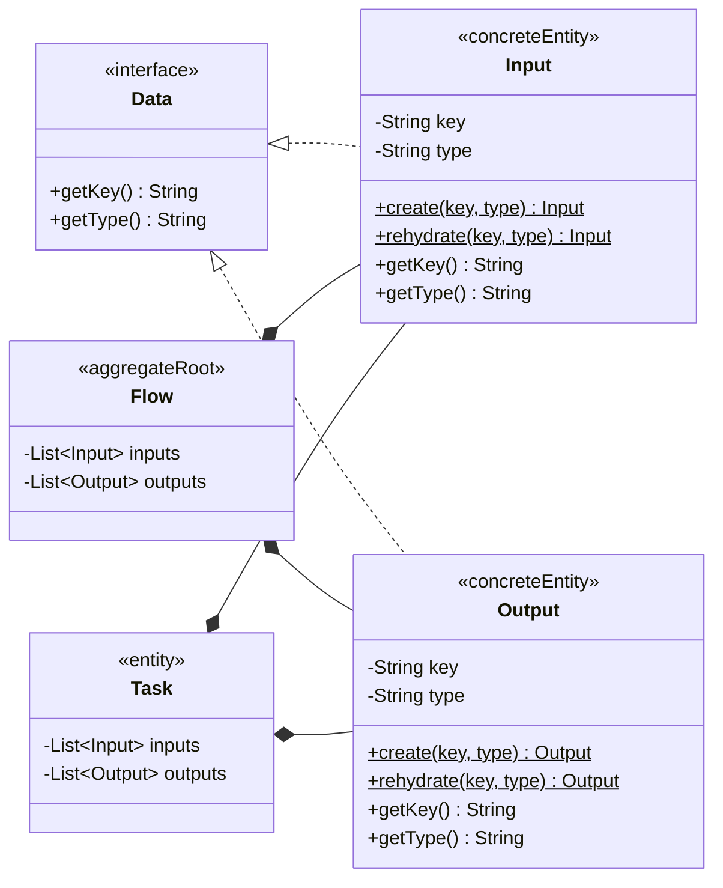
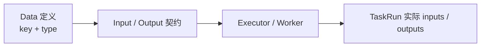

# Data、Input 与 Output 领域模型规范

## 适用范围与效力

本规范定义 Flow 定义域中的 Data 基础接口，以及直接实现它的 Input、Output
具体对象。它只描述数据定义，不描述某次 Execution 中产生的实际数据值。

本规范落实
[`CONTEXT.md`](../../CONTEXT.md)、
[`domain-object-modeling.md`](domain-object-modeling.md)、
[`flow-definition-lifecycle.md`](flow-definition-lifecycle.md)
以及
[`task-domain-model.md`](task-domain-model.md)
已经确认的领域语义。

当前已经确认 Data 是基础接口，Input、Output 是直接实现 Data 的两个具体领域
对象；基础模型中不再增加 Input、Output 的下一层占位接口或对象。

## 定义与对象角色

Data 是 Flow 或 Task 中一个具有唯一业务主键和类型的数据定义。它不是原始 YAML、
运行时值、数据库列或任意 Map。

对象角色如下：

- `Data` 是数据定义的基础领域接口，本身不直接实例化。
- `Input` 是直接实现 Data 的具体输入对象。
- `Output` 是直接实现 Data 的具体输出对象。
- Input、Output 是所属 Flow 或 Task 聚合内的不可变实体。
- Input、Output 没有独立 Repository、状态、审计字段或 `reversion`。
- Input、Output 只在部署时随完整 Flow 和 Task 一起产生。

Input 与 Output 对 Data 的实现表达可替换关系：任何 Input 或 Output 都必须能够
回答这个 Data 的 key 和 type。两者不是接口，也不需要再由
`ConcreteInput`、`ConcreteOutput` 实现。

## 领域类图



Input 和 Output 就是类图中的具体对象。基础模型不再引入
`ConcreteInput`、`ConcreteOutput` 或其他同义包装类型。

## Java 基础契约

目标基础接口为：

```text
public interface Data {

    String getKey();

    String getType();
}

public final class Input implements Data {

    private final String key;
    private final String type;

    public static Input create(String key, String type);

    public static Input rehydrate(String key, String type);

    public String getKey();

    public String getType();
}

public final class Output implements Data {

    private final String key;
    private final String type;

    public static Output create(String key, String type);

    public static Output rehydrate(String key, String type);

    public String getKey();

    public String getType();
}
```

代码块省略构造方法和方法体，只表达目标类型、字段及公开方法。Input、Output 的
构造必须一次接收完整 key、type，并完成非空校验。Data 不使用泛型；实际值的
Java 类型由 `type` 对应的数据类型能力解释，不进入定义基础接口。

## 基础字段与方法

Input 和 Output 都必须保存能够稳定回答以下两个方法的不可变字段：

| 字段 | 方法 | 含义 | 基础规则 |
| --- | --- | --- | --- |
| `key` | `getKey()` | 该数据定义的唯一业务主键 | `String`，非空；在同一直接 owner 的同方向集合内唯一且不可改变 |
| `type` | `getType()` | 该数据的类型代码 | `String`，非空；用于识别具体数据类型 |

Data 基础接口只提供这两个方法，不增加公共 Setter。Input、Output 当前已确认的
公共查询方法是这两个；未来增加业务字段或方法时，必须明确建模且不能改变它们
的含义。

### `getKey()`

`getKey()` 返回 Data 的唯一业务主键，也是定义和运行值引用该 Data 的稳定名称。

- Data 进入 Flow 聚合时必须已经具有非空 key。
- 同一直接 owner 的 inputs 内 key 唯一，outputs 内 key 唯一。
- Input 与 Output 是不同方向，允许在各自集合中分别声明相同 key。
- key 由 YAML 定义声明，不由系统生成技术 id。
- 相同 key 跨 Flow Reversion 自然表达同一个业务数据引用；修改 key 表达新的
  数据引用，不执行模糊身份迁移。

### `getType()`

`getType()` 返回数据类型代码，用于解释和校验该 Input 或 Output 约束的数据。

- type 不是 Java 类名，也不是数据库列类型。
- type 不描述 Input 或 Output 方向；方向由具体对象类型表达。
- 类型代码集合保持可扩展，不预先建立封闭中心枚举。
- 同一个 type 在 Input 和 Output 中必须保持相同的数据类型含义。
- 基础对象只去除首尾空白，不擅自改变 type 大小写；规范化和别名策略等待具体
  数据类型协议确认。

如果未来还需要区分“数据定义类型”和“实际值类型”，必须增加不同名称的明确
概念，例如 value type，不能让一个 `getType()` 同时表达两种含义。

不同 Task 可以声明相同 key，因为运行时数据作用域由 TaskRun 隔离。
RouteExpression 中的 `outputs.<field>` 使用直接父 Task 的 Output key 解析
`<field>`。如果未来需要展示名称，应增加独立 label 概念，不能改变 key 的主键
语义。

这里的 owner 是直接持有该集合的 Flow 或 Task。

## Input 与 Output

### Input

Input 是所属 Flow 或 Task 接受数据的具体定义对象：

- 直接实现 `Data`。
- 必须满足 Data 的 key 和 type 契约。
- 不保存某次 Execution 或 TaskRun 实际接收到的值。

### Output

Output 是所属 Flow 或 Task 可以产生并向下游声明数据的具体定义对象：

- 直接实现 `Data`。
- 必须满足 Data 的 key 和 type 契约。
- 不保存某次 TaskRun 实际产生的值。

Input 与 Output 是两个不同的具体数据对象，不是生命周期状态。一个 Output 不
通过状态变化“变成” Input，也不存在同时充当两者的第三个具体对象；它们只共享
Data 基础契约。

## YAML 物化与持久化边界

YAML 中 Task 的输入输出声明使用相同的严格对象形态：

```yaml
inputs:
  - key: request
    type: JSON
outputs:
  - key: decision
    type: STRING
```

- `inputs`、`outputs` 缺省时解释为空列表。
- 每一项必须是映射，并且只允许 `key`、`type` 两个字段。
- key 或 type 缺失、空白，出现额外字段，或同方向出现重复 key 时拒绝物化。
- 字符串列表不是 Output 的简写形式；没有 type 时不能构造完整 Data。
- Flow 在解释 Task 节点映射时创建 Input、Output；Task Plugin 只接收已经物化
  的领域对象。
- Repository 以显式 `{key, type}` 结构保存定义，并通过 `rehydrate` 恢复，
  不依赖 Java 对象的隐式 JSON 序列化。

## 定义与运行值边界



- Data、Input 和 Output 只属于定义域。
- TaskRun 的 inputs、outputs 保存一次真实运行产生的值。
- 实际值按已确认的 Data key 组织，但不能反向修改 Data 定义。
- Data 不持有 TaskRun，TaskRun 只按绑定的 Flow Reversion 解释数据契约。
- 原始 YAML 在部署前可以缺少系统拥有的字段；部署成功后进入领域的具体 Data
  必须完整有效。

## 领域不变量

- `DATA-001`：Input 和 Output 都直接实现 Data 的两个基础方法。
- `DATA-002`：key、type 均非空，且对象创建后不可改变。
- `DATA-003`：Data 契约只通过 Input 或 Output 具体对象进入 Flow、Task 聚合；
  两个具体对象都没有独立生命周期和 Repository。
- `DATA-004`：同一 owner 的同方向集合中，Data key 唯一；Input 与 Output
  可以分别声明相同 key。
- `DATA-005`：Input、Output 集合永不为 null，对外只读。
- `DATA-006`：Input 和 Output 不保存 Execution 或 TaskRun 的实际值和状态。
- `DATA-007`：type 只表达数据类型，不重复表达 Input/Output 方向。
- `DATA-008`：Input 和 Output 是基础模型中的具体类型，不再引入同义的下一层
  接口或包装对象。

## 尚待业务规则确认

Input 和 Output 的对象形态、主键和 YAML 来源已经确认，以下业务规则仍需继续
确认：

- type 允许的稳定代码及其数据校验规则。
- TaskRun 实际值的合法类型、校验规则以及序列化边界。

在这些规则确认前，不得用一个通用 `Map<String, Object>` 替代 Input 或 Output
领域对象。

## 现有实现迁移差距

- Data、Input、Output 的基础接口、key/type 字段、静态创建与重建、不可变性和
  值相等已经落地。
- Task、Task Plugin、Flow 的 Task 节点物化和 PostgreSQL 定义映射已经统一使用
  `Input`、`Output`，不再用定义 Map 或字符串列表代替。
- Flow 自身的 `List<Input> inputs`、`List<Output> outputs` 已随
  `FlowWithSource` 与 `Flow.deploy` 生命周期迁移完成。
- TaskRun 仍以 `Map<String, Object>` 保存实际运行值；type 代码协议与实际值
  校验规则确认后，需要在执行入口增加契约校验，但不能把实际值放回 Data。
- 如果已有持久化记录仍使用字符串 outputs 或缺少 type 的 inputs，必须由业务
  数据迁移显式补齐 type；Repository 不得猜测默认类型后静默重建。

## 相关文档

- [`flow-definition-lifecycle.md`](flow-definition-lifecycle.md)：Flow 对 Input、
  Output 的所有权和部署边界。
- [`task-domain-model.md`](task-domain-model.md)：Task 输入输出契约、路由和
  TaskRun 边界。
- [`execution-domain-model.md`](execution-domain-model.md)：TaskRun 实际值与
  Execution 运行边界。
- [`workflow-core-java-model.md`](workflow-core-java-model.md)：Core 包与
  扩展边界。
