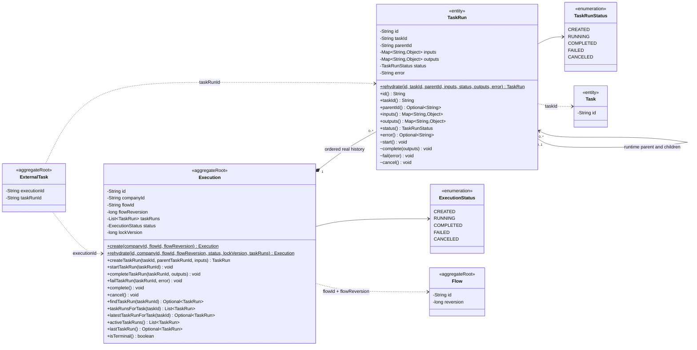
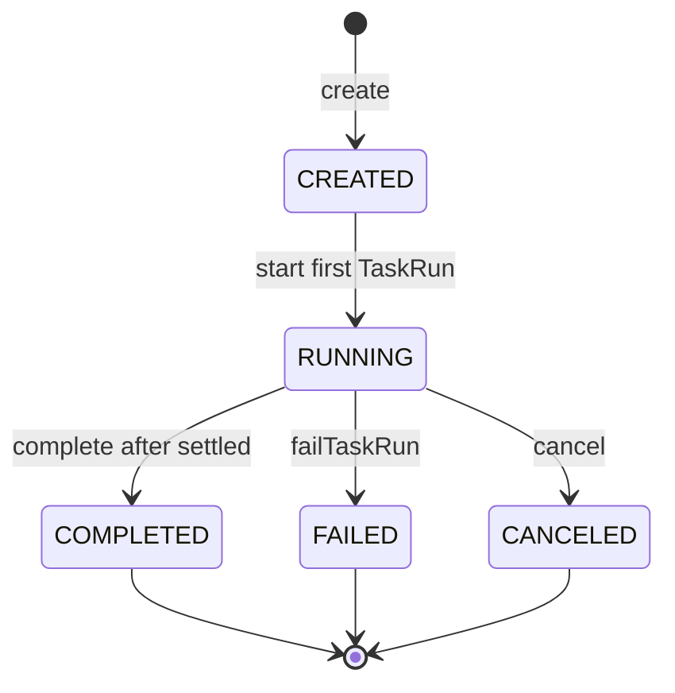
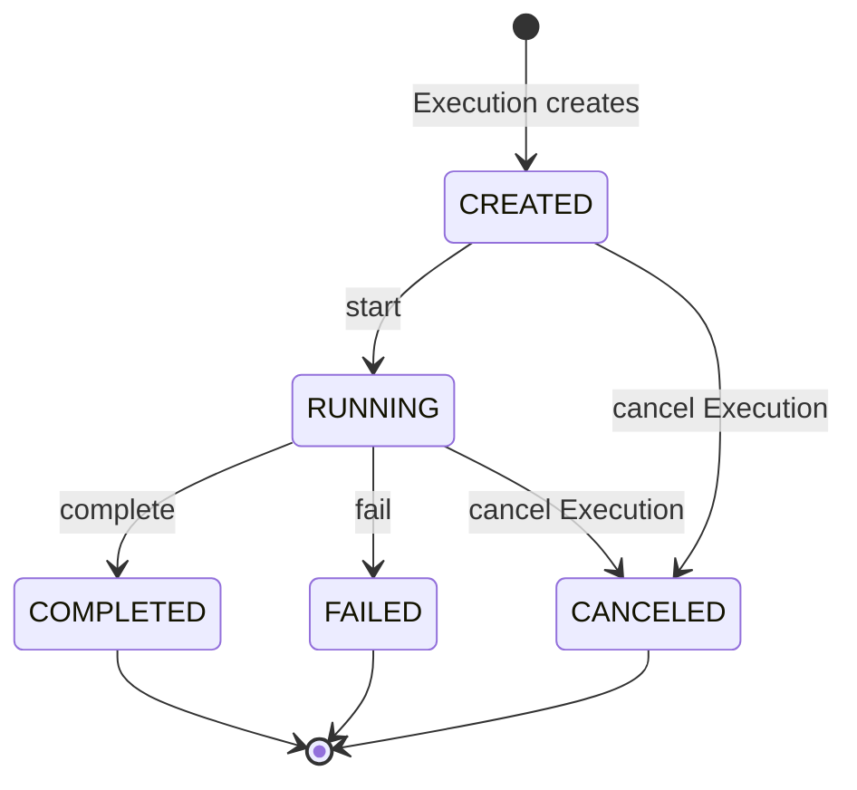

# Execution 与 TaskRun 领域模型规范

## 适用范围与效力

本规范定义工作流运行域的目标模型，包括 Execution 聚合、TaskRun 实体、状态机、
Flow Reversion 绑定、真实运行历史、并行、失败、取消、恢复、并发和持久化边界。

本规范落实
[`CONTEXT.md`](../../CONTEXT.md)、
[`ADR 0002`](../decisions/0002-workflow-core-runtime-class-design.md)、
[`ADR 0006`](../decisions/0006-single-execution-branch-routing-and-join.md)、
[`workflow-core-java-model.md`](workflow-core-java-model.md)、
[`task-domain-model.md`](task-domain-model.md)
以及
[`domain-object-modeling.md`](domain-object-modeling.md)
已经确认的领域语义。

现有 Java 代码已实现大部分第一阶段行为，但仍使用 `flowVersion`、单数
`currentTaskRun()` 和公共 `beginModification()` 等旧接口。冲突时，本规范表示
目标设计；迁移差距不能反向改变领域定义。

## 定义与对象角色

Execution 是某个确定 Flow Reversion 被启动后形成的一次完整运行实例。它保存
这次运行的生命周期和真实 TaskRun 历史，但不是“当前执行到哪里”的游标。

TaskRun 是 Execution 实际执行某个 Task 时产生的一次运行事实。只有 Task 真正
成为可运行任务时才创建 TaskRun；候选、未选择、尚未满足依赖或被跳过的 Task
都没有 TaskRun。

对象角色如下：

- `Execution` 是运行域聚合根，也是 Repository 和事务一致性的入口。
- `TaskRun` 是 Execution 聚合内实体，不能脱离 Execution 独立创建或改变。
- 一个 Flow 启动只创建一个 Execution；并行和嵌套只增加 TaskRun，不增加
  Main/Child Execution。
- Execution 只通过 `flowId + flowReversion` 引用定义聚合，不持有可变 Flow。
- TaskRun 只通过 `taskId` 引用该 Flow Reversion 中的 Task。
- Execution 不保存位置、next task、route 结果、依赖到达或 SKIPPED 记录。

## 领域类图



Execution 与 Flow、ExternalTask 是不同聚合。类图中的虚线引用只表达稳定身份，
不能让任一聚合直接修改另一个聚合的内部字段。

## Execution 字段

| 字段 | 含义 | 规则 |
| --- | --- | --- |
| `id` | 本次运行的稳定技术身份 | 创建时生成，重建和状态变化时保持不变 |
| `companyId` | 本次运行所属租户 | 非空；所有加载和跨聚合协作必须一致 |
| `flowId` | 被启动逻辑 Flow 的稳定身份 | 创建后不可变 |
| `flowReversion` | 启动时绑定的确定 Flow Reversion | 正整数；创建后永不漂移 |
| `taskRuns` | 本次运行已经真实产生的有序 TaskRun | 只增不删，集合顺序表达运行事实顺序 |
| `status` | Execution 生命周期状态 | 只允许五种已确认状态 |
| `lockVersion` | 聚合并发控制版本 | 非负；不是 Flow reversion，也不是业务版本 |

Execution 不包含以下字段：

- `currentTaskId`、`currentTaskRunId`、`nextTaskId` 或列表游标。
- Flow、Task 的可变对象副本。
- route 结果、候选 Task、未选择分支或依赖到达推导状态。
- Main/Child Execution 关系。
- 独立业务 `reversion`。

`currentTaskRun` 不能作为目标字段或核心查询，因为一个 Execution 可以同时拥有
多个 CREATED/RUNNING TaskRun。

## TaskRun 字段

| 字段 | 含义 | 规则 |
| --- | --- | --- |
| `id` | 这一次 Task 运行事实的稳定身份 | 由 Execution 创建，非空且不可变 |
| `taskId` | 所执行 Task 的稳定身份 | 必须存在于 Execution 绑定的 Flow Reversion |
| `parentId` | 本次运行中直接父 TaskRun 的 id | 顶层为空；不是 Task id、前驱或依赖 |
| `inputs` | 本次 TaskRun 实际收到的数据 | 创建时确定，深度不可变 |
| `outputs` | 本次 TaskRun 实际产生的数据 | 初始为空，仅完成时写入 |
| `status` | 本次运行的生命周期状态 | 只允许五种已确认状态 |
| `error` | 明确失败事实 | 仅 FAILED 时非空，其他状态为空 |

TaskRun 不保存：

- Task key、type、route、dependOn、Input 或 Output 定义副本。
- Execution id；聚合内归属由 Execution 包含关系表达，数据库外键不反推领域
  字段。
- sequence；领域顺序由 `Execution.taskRuns` 集合表达，数据库可以使用技术顺序
  列恢复该集合。
- lockVersion；并发控制统一由 Execution 聚合根承担。
- SKIPPED、WAITING、候选或未到达状态。

## Execution 方法

### 创建与重建

| 方法 | 用途 | 核心规则 |
| --- | --- | --- |
| `create(companyId, flowId, flowReversion)` | 创建一次全新的 Flow 运行 | 生成 id，固定 Flow 引用，状态始终为 CREATED，taskRuns 为空 |
| `rehydrate(...)` | 从可信 Repository Adapter 重建聚合 | 不生成新 id、不触发状态转换，校验完整聚合不变量 |

调用方只向公开启动用例提供 `flowId`。Handler 必须在同一事务中加载当前
`DEPLOYED` Flow Reversion，并把系统选择的 `flowReversion` 传给
`Execution.create`；调用方不能指定、覆盖或回退 reversion。

### TaskRun 生命周期

| 方法 | 用途 | 核心规则 |
| --- | --- | --- |
| `createTaskRun(taskId, parentTaskRunId, inputs)` | 记录一个已经满足运行条件的 Task | 只能在 CREATED/RUNNING Execution 中调用；由聚合生成 TaskRun id |
| `startTaskRun(taskRunId)` | 开始派发 Worker | TaskRun 必须为 CREATED；第一个运行记录开始时 Execution 进入 RUNNING |
| `completeTaskRun(taskRunId, outputs)` | 合并 Worker 或恢复触发器的完成事实 | TaskRun 必须为 RUNNING；Execution 保持 RUNNING，等待 Executor 判断是否收敛 |
| `failTaskRun(taskRunId, error)` | 合并 Worker 的明确失败事实 | TaskRun 变为 FAILED，Execution 变为 FAILED，之后不得创建新 TaskRun |
| `cancel()` | 取消整个运行实例 | 只允许 RUNNING；所有 CREATED/RUNNING TaskRun 一并取消 |
| `complete()` | 确认整个 Flow 已收敛 | 只允许 RUNNING 且不存在活动 TaskRun；变为 COMPLETED |

TaskRun 的 `start`、`complete`、`fail` 和 `cancel` 只允许 Execution 调用。外部
Service、Handler、Executor 和 Worker 都不能直接修改 TaskRun。

`resume` 不是 TaskRun 的第二种完成方法。ExternalTask Handler 校验关联关系、
PAUSE Task 类型和合法 outputs 后，在同一事务中调用
`Execution.completeTaskRun(...)` 完成原 RUNNING TaskRun。

### 查询方法

| 方法 | 用途 |
| --- | --- |
| `findTaskRun(taskRunId)` | 按本次运行身份查询一个 TaskRun |
| `taskRunsForTask(taskId)` | 返回某 Task 在本 Execution 中的全部运行事实 |
| `latestTaskRunForTask(taskId)` | 返回该 Task 最新一次运行事实，为未来 Loop 保留正确语义 |
| `activeTaskRuns()` | 返回全部 CREATED/RUNNING TaskRun |
| `lastTaskRun()` | 返回有序历史中的最后一个 TaskRun |
| `isTerminal()` | 判断 Execution 是否为 COMPLETED、FAILED 或 CANCELED |

目标模型不提供单数 `currentTaskRun()`。第一阶段虽然非循环 Task 最多运行一次，
也不能把 `taskId` 当成 TaskRun 身份；未来 Loop 可以为同一 Task 产生多条
TaskRun。

## 状态机

### Execution 状态机



| 当前状态 | 允许动作 | 结果 |
| --- | --- | --- |
| CREATED | 创建 TaskRun、开始首个 TaskRun | 开始后进入 RUNNING |
| RUNNING | 创建/开始/完成 TaskRun、失败、完成 Execution、取消 | 根据动作保持 RUNNING 或进入终态 |
| COMPLETED | 只读 | 不能继续、取消或增加 TaskRun |
| FAILED | 只读 | 不能继续、取消或增加 TaskRun |
| CANCELED | 只读 | 不能继续、恢复、完成或增加 TaskRun |

CREATED 是启动命令中的合法初始状态，但不是对外稳定等待态。创建命令必须继续
推进，直到 RUNNING 等待态、COMPLETED、FAILED，或因未处理异常整体回滚。

### TaskRun 状态机



- TaskRun 不定义 WAITING。PAUSE 等待时 TaskRun 和 Execution 都保持 RUNNING，
  ExternalTask 使用 WAITING。
- COMPLETED、FAILED、CANCELED 是 TaskRun 终态。
- 完成、失败或取消后的 TaskRun 不能再次发生任何状态转换。
- Worker 抛出未处理异常不是 TaskRun FAILED 事实；整个命令必须回滚到调用前。

## TaskRun 创建与真实历史

只有 Executor 的可运行集合计算可以请求 Execution 创建 TaskRun。创建前必须已经
确认：

- Execution 不是终态。
- Task 属于 Execution 绑定的 Flow Reversion。
- 顶层顺序或父子 route 已经允许该 Task 成为候选。
- 所有 dependOn TaskRun 已经 COMPLETED。
- 当前第一阶段中，该非循环 Task 尚未产生 TaskRun。
- `parentId` 与定义层直接父 Task 的本次 TaskRun 一致。
- inputs 已按直接父输出和依赖输出完成组装。

以下情况不创建 TaskRun：

- route 不匹配。
- 依赖尚未完成。
- 前一个顶层 Task 的已选择子树尚未收敛。
- Task 只是候选但尚不可运行。
- Task 未被选择、被跳过或 Execution 已经进入终态。

TaskRun 列表只保存已经发生的真实运行历史。恢复时，Executor 使用不可变 Flow
Reversion、已有 TaskRun、活动 TaskRun 和 outputs 重新计算可运行集合，不恢复
或持久化一个额外游标。

## 顺序、嵌套与并行

- `Execution.taskRuns` 是有序历史，顺序表示 TaskRun 的实际创建和推进顺序。
- 顶层 Task 遵循 Flow 定义顺序。
- 嵌套 TaskRun 的 `parentId` 指向本次运行中的直接父 TaskRun。
- 多个 route 同时匹配时，多个子 TaskRun 可以在同一 Execution 中同时活动。
- 同级并行 TaskRun 的列表顺序不把并行关系改成业务串行；因果关系必须结合
  parentId、Task 定义和状态解释。
- 未选择分支没有 TaskRun，也没有 SKIPPED 事实。
- 汇合 Task 只在全部依赖完成且参与子树收敛后创建，并且第一阶段最多创建一次。

## 运行数据边界

TaskRun.inputs 和 TaskRun.outputs 保存实际运行值，不保存 Data、Input、Output
定义对象。

第一阶段已经确认以下输入域：

- `outputs`：直接父 TaskRun 的真实 outputs，只流动一跳。
- `dependOnOutputs`：按依赖 Task key 隔离的已完成 TaskRun outputs。
- `globalContext`：一次 Execution 共享的只读数据域；其创建入口和正式字段尚未
  确认，因此暂不加入 Execution 字段。

不同 Task 的同名输出由 TaskRun 身份和作用域隔离。RouteExpression 只读取直接
父 TaskRun outputs，不得读取其他 Execution 或任意历史 TaskRun。

`Map<String, Object>` 是当前实际值容器，不得用来替代 Data 定义对象。
Data type 与实际值校验规则确认后，可以引入明确的运行值对象，但
不能建立与 TaskRun 重复的运行实体。

## PAUSE 与 ExternalTask 边界

PAUSE 运行组合固定为：

```text
Execution  = RUNNING
TaskRun    = RUNNING
ExternalTask = WAITING
```

- 一个 PAUSE TaskRun 最多有一个有效 WAITING ExternalTask。
- ExternalTask 通过 `executionId + taskRunId` 引用确定运行事实。
- 外部调用方只提交 ExternalTask id 和 outputs，不能指定 Execution、TaskRun、
  Flow Reversion 或下一 Task。
- ExternalTask 完成、原 TaskRun 完成和后续推进必须在同一命令事务中原子提交。
- Execution 取消时，活动 TaskRun 与 Worker 拥有的 ExternalTask 必须一起取消。
- PAUSE 恢复直接完成原 TaskRun，不能重新执行 PAUSE Worker 或创建重复 TaskRun。

ExternalTask 自己的字段、方法和状态机由独立领域规范继续定义。

## 失败与取消

明确 Worker 失败是可提交的业务结果：

- 当前 TaskRun 进入 FAILED。
- Execution 进入 FAILED。
- 不再创建任何后续、分支或汇合 TaskRun。

并行 Execution 中一个 TaskRun 失败后，其他 CREATED/RUNNING TaskRun 及其外部
等待资源应该“立即取消”还是“保留原事实但禁止继续”，现有 ADR 没有明确规定。
该策略必须在实现并行失败链路前确认；在确认前，不得让 FAILED Execution 继续
推进，也不得静默遗留可被恢复的 ExternalTask。

主动取消遵循：

- 只允许取消 RUNNING Execution。
- Execution 的全部 CREATED/RUNNING TaskRun 进入 CANCELED。
- 已经 COMPLETED、FAILED 或 CANCELED 的 TaskRun 保持原终态。
- Worker 拥有的等待资源与聚合取消在同一事务中完成。
- 任一取消步骤失败时整个命令回滚。

## Flow 绑定、版本与关闭

- 启动时只能绑定当前 `DEPLOYED` Flow Reversion。
- `flowId + flowReversion` 创建后不可修改。
- 后续部署新 reversion 不影响已经存在的 Execution。
- Flow 关闭不取消已有 Execution；已有实例继续使用启动时绑定的定义完成或被
  单独取消。
- 调用方不能指定历史 reversion 启动 Execution，也不能在恢复时改变绑定。
- Execution 和 TaskRun 不产生业务 reversion。

## 并发、审计与持久化

- Execution 使用一个聚合级 `lockVersion`，TaskRun 不单独加锁。
- 新 Execution 的 lockVersion 初始为 0。
- 修改已有 Execution 的一个命令最多使 lockVersion 增加一次；命令内多次
  TaskRun 状态变化不能重复递增。
- Repository 使用 companyId、id 和 expected lockVersion 执行 CAS；冲突命令
  整体回滚。
- `beginModification()` 是当前实现暴露的技术方法，不属于目标公共领域 API。
- ExecutionRepository 以聚合为单位加载和保存 Execution 及有序 TaskRun。
- TaskRun 可以独立存表，但不能建立独立 TaskRunRepository。
- Repository Adapter 使用 `rehydrate` 恢复聚合，不通过公共 Setter 拼装状态。

Execution 和 TaskRun 的 creator、时间戳、耗时、尝试次数与重试策略尚未形成
业务规则，本模型不擅自增加这些字段。确认后应区分业务审计和技术观测数据。

## 领域不变量

### Execution 不变量

- `EXEC-001`：一个启动请求只产生一个 Execution，不产生 Child Execution。
- `EXEC-002`：id、companyId、flowId 非空，flowReversion 为正数且创建后不变。
- `EXEC-003`：Execution 永久绑定启动时选择的 Flow Reversion。
- `EXEC-004`：taskRuns 永不为 null、对外只读，并保持真实运行顺序。
- `EXEC-005`：Execution 不保存当前位置；下一可运行 Task 必须可从定义和
  TaskRun 事实重建。
- `EXEC-006`：一个 Execution 可以同时拥有多个活动 TaskRun。
- `EXEC-007`：COMPLETED、FAILED、CANCELED 是终态，终态不能新增或改变
  TaskRun。
- `EXEC-008`：COMPLETED Execution 不存在 CREATED/RUNNING TaskRun。
- `EXEC-009`：取消必须覆盖全部活动 TaskRun，且不能改变已结束 TaskRun。
- `EXEC-010`：lockVersion 只表达聚合并发控制，一个修改命令最多递增一次。
- `EXEC-011`：不同 companyId 的 Execution、Flow 和 ExternalTask 不得关联或
  相互可见。

### TaskRun 不变量

- `RUN-001`：TaskRun 只能由所属 Execution 创建和改变。
- `RUN-002`：id、taskId 非空且创建后不变。
- `RUN-003`：taskId 必须属于 Execution 绑定的 Flow Reversion。
- `RUN-004`：顶层 TaskRun 的 parentId 为空；子 TaskRun 必须指向同一
  Execution 中的直接父 TaskRun。
- `RUN-005`：parentId 不表达前驱、dependOn、Task id 或调度原因。
- `RUN-006`：inputs 创建后不可变；outputs 只能在完成时写入。
- `RUN-007`：只有 FAILED TaskRun 拥有非空 error。
- `RUN-008`：TaskRun 不拥有 lockVersion、业务 reversion 或独立 Repository。
- `RUN-009`：未选择、尚未到达和 route 不匹配的 Task 不产生 TaskRun。
- `RUN-010`：第一阶段同一非循环 Task 在一个 Execution 中最多产生一次
  TaskRun；模型仍以 TaskRun id 而不是 taskId 作为运行身份。

## 场景校验

至少使用以下场景保护模型：

- 正向：启动当前 Flow Reversion，顺序完成 AUTO Task 后进入 COMPLETED。
- 正向：PAUSE 进入 RUNNING/WAITING 组合，完成 ExternalTask 后恢复原 TaskRun。
- 正向：多个直接子 Task 同时匹配，在一个 Execution 中形成多个活动 TaskRun。
- 反向：启动不存在、CLOSED 或跨租户 Flow，不产生 Execution。
- 反向：终态 Execution 再次取消、恢复或增加 TaskRun，状态和 lockVersion
  不变。
- 反向：Worker 明确失败，保存 FAILED 事实且不创建后续 TaskRun。
- 变异：部署新 Flow Reversion，旧 Execution 仍绑定原 reversion。
- 变异：交换并行分支完成顺序，最终 TaskRun 集合和汇合次数保持等价。
- 变异：替换 ExternalTask id，只有该 id 真实关联的 Execution 可以恢复。
- 恢复：Repository 重建后仍按 taskId 值相等和有序历史计算下一任务。
- 并发：完成与取消竞争最多一个事务提交，不产生重复后续 TaskRun。

现有 UC-02 至 UC-07 已覆盖这些场景的大部分行为；后续迁移字段和方法名称时必须
同步更新 UC，不得只改领域类。

## 现有实现迁移差距

- `Execution.flowVersion`、`flowVersion()` 和相关调用仍需统一改为
  `flowReversion`、`flowReversion()`。
- `Execution.currentTaskRun()` 在并行模型下含义错误，目标模型只保留
  `activeTaskRuns()`。
- 当前 `taskRunForTask(taskId)` 只返回第一条记录；目标 API 使用
  `taskRunsForTask` 和 `latestTaskRunForTask`，避免阻塞未来 Loop。
- 当前 `beginModification()` 是公共方法并由 Handler 手工调用；目标模型把
  lockVersion 留在 Repository CAS/聚合重建边界，不作为业务动作公开。
- 当前 `cancelRunningTaskRuns()` 使用技术实现名称；目标业务方法统一为
  `cancel()`。
- 当前 TaskRun 的 `parentId()`、`error()` 直接返回可空 String；目标查询使用
  Optional 表达业务可空性。
- 并行分支中一个 Worker 失败后的其他活动 TaskRun 和 ExternalTask 清理策略
  尚未确认。
- Execution 创建尚不接收 Flow 实际 inputs，也没有正式 globalContext 字段；
  Flow Input 契约到第一次 TaskRun inputs 的映射规则尚未建模。
- TaskRun 仍使用通用 Map 保存实际值；Data type 和运行值校验规则确认后需要
  同步收紧执行入口。

这些差距应以 Execution 运行链路为最小完整单元，统一修改 Domain、Executor、
Handler、Worker、Repository、UC 和测试，不能建立第二套运行 Snapshot 模型。

## 相关文档

- [`flow-definition-lifecycle.md`](flow-definition-lifecycle.md)：启动绑定的 Flow
  Reversion 和关闭规则。
- [`task-domain-model.md`](task-domain-model.md)：Task 定义身份、parentId、
  route 和 dependOn。
- [`data-domain-model.md`](data-domain-model.md)：Input、Output 定义及运行值
  边界。
- [`UC-02 用户启动、查询与取消 Flow`](../uc/flow/UC-02%20用户启动、查询与取消%20Flow.md)
- [`UC-03 用户运行自动流程`](../uc/flow/UC-03%20用户运行自动流程.md)
- [`UC-04 用户处理外派任务并恢复流程`](../uc/flow/UC-04%20用户处理外派任务并恢复流程.md)
- [`UC-05 用户处理并行外派任务`](../uc/flow/UC-05%20用户处理并行外派任务.md)
- [`UC-06 用户提交外派结果后的条件路径`](../uc/flow/UC-06%20用户提交外派结果后的条件路径.md)
- [`UC-07 用户处理多阶段外派流程`](../uc/flow/UC-07%20用户处理多阶段外派流程.md)
