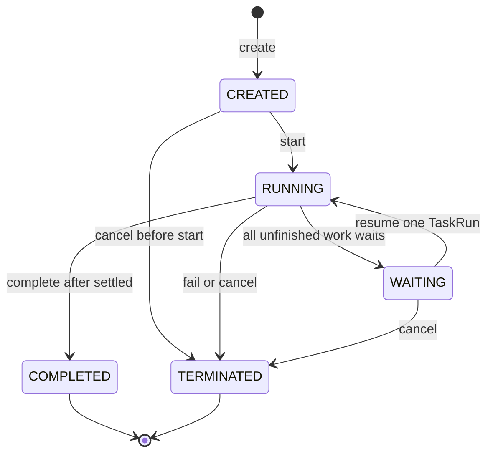
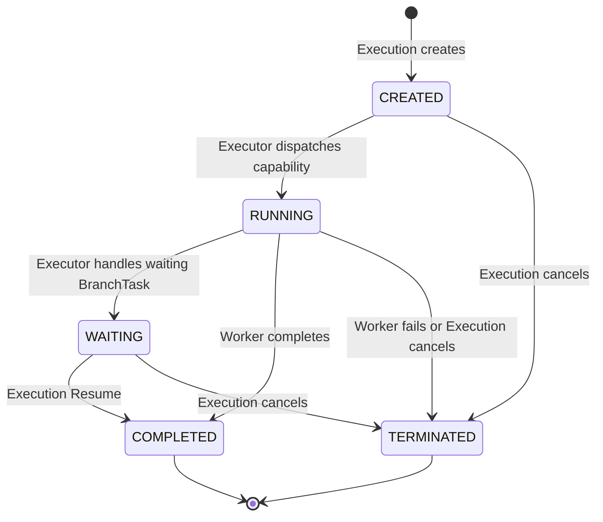

# Execution 与 TaskRun 领域模型规范

## 适用范围与效力

本规范定义工作流运行域的目标模型，包括 Execution 聚合、TaskRun 实体、状态机、
Flow Reversion 绑定、真实运行历史、并行、失败、取消、恢复、并发和持久化边界。

本规范落实
[`CONTEXT.md`](../../CONTEXT.md)、
[`ADR 0002`](../decisions/0002-workflow-core-runtime-class-design.md)、
[`ADR 0006`](../decisions/0006-single-execution-branch-routing-and-join.md)、
[`ADR 0016`](../decisions/0016-separate-pause-from-external-business-capabilities.md)、
[`ADR 0017`](../decisions/0017-centralize-workflow-runtime-state-in-flow-domain.md)、
[`ADR 0020`](../decisions/0020-stage-executor-cycle-effects.md)、
[`ADR 0024`](../decisions/0024-separate-runnable-and-branch-task-capabilities.md)、
[`workflow-core-java-model.md`](workflow-core-java-model.md)、
[`task-domain-model.md`](task-domain-model.md)
以及
[`domain-object-modeling.md`](domain-object-modeling.md)
已经确认的领域语义。

现有 Java、Executor、Handler、Repository 和 UC 已完成本规范第一阶段接口迁移。
仍待确认的 Flow 实际输入与运行值规则单独记录在迁移差距中，不能反向改变已经
确认的 Execution 聚合边界。

## 定义与对象角色

Execution 是某个确定 Flow Reversion 被启动后形成的一次完整运行实例。它保存
这次运行的生命周期和真实 TaskRun 历史，但不是“当前执行到哪里”的游标。

TaskRun 是 Execution 实际执行某个 Task 时产生的一次运行事实。只有 Task 真正
成为可运行任务时才创建 TaskRun；候选、未选择、尚未满足依赖或被跳过的 Task
都没有 TaskRun。

对象角色如下：

- `Execution` 是运行域聚合根，也是 Repository 和事务一致性的入口。
- `TaskRun` 是 Execution 聚合内实体；Executor 可以先创建一个仅存在于本轮
  Context 的临时 CREATED TaskRun，但只有 `Execution.startWithTaskRuns(...)`
  或 `addTaskRuns(...)` 接受后才成为真实运行事实，后续变化仍只能由
  Execution 完成。
- `State` 是 Flow 定义域拥有的统一运行状态值对象；Execution 和 TaskRun 各自
  持有完整 State，通过 `current` 表达当前状态，通过 `history` 保存真实变化
  轨迹。RunnableTask 的 Worker 结果只报告 COMPLETED 或 TERMINATED；BranchTask
  的 WAITING 或结构完成由 Executor 直接应用，二者都不拥有聚合历史。
- 一个 Flow 启动只创建一个 Execution；并行和嵌套只增加 TaskRun，不增加
  Main/Child Execution。
- Execution 只通过 `flowId + flowReversion` 引用定义聚合，不持有可变 Flow。
- TaskRun 只通过 `taskId` 引用该 Flow Reversion 中的 Task。
- Execution 不保存位置、next task、route 结果、依赖到达或 SKIPPED 记录。
- FlowDraft/Flow 类型与 `deleted` 只表达 Flow 定义生命周期事实，不进入
  Execution 聚合。
- `ExecutorContext` 是一次 Executor 调用的可变工作单元，只持有精确 Flow、
  Execution、nexts、Runnable workerTasks、Branch taskRuns 和本轮观察到的
  states，不持久化。
- `ExecutorService.advance` 在模块内部依次完成 `handleNext` 计划和 `onNexts`
  应用；`DefaultExecutor` 统一负责 Repository 保存与 Worker 投递。

## 领域类图

```mermaid
classDiagram
direction LR

class Execution {
    <<aggregateRoot>>
    -String id
    -String companyId
    -String flowId
    -long flowReversion
    -List~TaskRun~ taskRuns
    -State state
    -long lockVersion
    +create(companyId, flowId, flowReversion) Execution$
    +rehydrate(id, companyId, flowId, flowReversion, state, lockVersion, taskRuns) Execution$
    +state() State
    +start() void
    +startWithTaskRuns(nexts) void
    +createTaskRun(taskId, parentTaskRunId, inputs) TaskRun
    +addTaskRuns(nexts) void
    +startTaskRun(taskRunId) void
    +completeTaskRun(taskRunId, outputs) void
    +waitTaskRun(taskRunId) void
    +enterWaiting() void
    +resumeTaskRun(taskRunId, outputs) void
    +failTaskRun(taskRunId, error) void
    +complete() void
    +cancel() void
    +findTaskRun(taskRunId) Optional~TaskRun~
    +taskRunsForTask(taskId) List~TaskRun~
    +latestTaskRunForTask(taskId) Optional~TaskRun~
    +activeTaskRuns() List~TaskRun~
    +waitingTaskRuns() List~TaskRun~
    +unfinishedTaskRuns() List~TaskRun~
    +lastTaskRun() Optional~TaskRun~
    +isTerminal() boolean
}

class TaskRun {
    <<entity>>
    -String id
    -String taskId
    -String parentId
    -Map~String,Object~ inputs
    -Map~String,Object~ outputs
    -State state
    -String error
    +create(taskId, parentId, inputs) TaskRun$
    +rehydrate(id, taskId, parentId, inputs, state, outputs, error) TaskRun$
    +id() String
    +taskId() String
    +parentId() Optional~String~
    +inputs() Map~String,Object~
    +outputs() Map~String,Object~
    +state() State
    +error() Optional~String~
    +isActive() boolean
    +isWaiting() boolean
    +isUnfinished() boolean
    ~start() void
    ~waitForResult() void
    ~complete(outputs) void
    ~resume(outputs) void
    ~fail(error) void
    ~terminate() void
}

class State {
    <<valueObject>>
    -Type current
    -List~History~ history
    +created() State$
    +rehydrate(current, history) State$
    +current() Type
    +history() List~History~
    +is(expected) boolean
    +isActive() boolean
    +isWaiting() boolean
    +isTerminal() boolean
    +withState(target) State
    +running() State
    +waiting() State
    +complete() State
    +fail() State
    +terminate() State
}

class StateHistory {
    <<valueObject: State.History>>
    -Type state
    -long date
    +rehydrate(state, date) History$
    +state() Type
    +date() long
}

class StateType {
    <<enumeration: State.Type>>
    CREATED
    RUNNING
    WAITING
    COMPLETED
    TERMINATED
}

class WorkerTaskResult {
    <<immutableResult>>
    -String executionId
    -String taskRunId
    -State.Type targetState
    -Map~String,Object~ outputs
    -String error
    +targetState() State.Type
}

class ExecutorContext {
    <<cycleWorkUnit>>
    -Execution execution
    -Flow flow
    -List~TaskRun~ nexts
    -List~WorkerTask~ workerTasks
    -List~TaskRun~ branchTaskRuns
    -List~State.Type~ states
}

class ExecutorService {
    <<internalStateMachine>>
    ~advance(context) boolean
    ~dispatch(context, workerTask) void
    ~dispatchBranch(context, taskRun) void
    ~applyResult(context, result) void
}

class DefaultExecutor {
    <<cycleCoordinator>>
    +execute(session, dsl, context) Execution
    +resume(session, dsl, context, taskRunId, outputs) Execution
    +cancel(session, dsl, context) Execution
}

class WorkerTask {
    <<stagedEffect>>
    -String executionId
    -String taskRunId
    -RunnableTask runnableTask
    -Map inputs
}

class Flow {
    <<aggregateRoot>>
    -String id
    -long reversion
}

class Task {
    <<entity>>
    -String id
}

Execution "1" *-- "0..*" TaskRun : ordered real history
Execution --> State
TaskRun --> State
WorkerTaskResult --> StateType
State --> StateType
State "1" *-- "1..*" StateHistory
StateHistory --> StateType
Execution ..> Flow : flowId + flowReversion
TaskRun ..> Task : taskId
TaskRun "0..1" --> "0..*" TaskRun : runtime parent and children
ExecutorContext --> Flow : exact reversion
ExecutorContext --> Execution : mutable aggregate
ExecutorContext "1" o-- "0..*" TaskRun : staged nexts
ExecutorContext "1" o-- "0..*" WorkerTask : staged effects
ExecutorContext "1" o-- "0..*" TaskRun : staged branches
ExecutorService --> ExecutorContext
DefaultExecutor --> ExecutorService
DefaultExecutor ..> WorkerTaskResult
```



Execution 与 Flow 是不同聚合。类图中的虚线引用只表达稳定身份，不能让任一
聚合直接修改另一个聚合的内部字段。

## Execution 字段

| 字段 | 含义 | 规则 |
| --- | --- | --- |
| `id` | 本次运行的稳定技术身份 | 创建时生成，重建和状态变化时保持不变 |
| `companyId` | 本次运行所属租户 | 非空；所有加载和跨聚合协作必须一致 |
| `flowId` | 被启动逻辑 Flow 的稳定身份 | 创建后不可变 |
| `flowReversion` | 启动时绑定的确定 Flow Reversion | 正整数；创建后永不漂移 |
| `taskRuns` | 本次运行已经真实产生的有序 TaskRun | 只增不删，集合顺序表达运行事实顺序 |
| `state` | Execution 生命周期状态及有序历史 | 使用 Flow 定义域统一 State；具体状态属于四个运行大类并遵循 Execution 路线 |
| `lockVersion` | 聚合并发控制版本 | 非负；不是 Flow reversion，也不是业务版本 |

Execution 不包含以下字段：

- `currentTaskId`、`currentTaskRunId`、`nextTaskId` 或列表游标。
- Flow、Task 的可变对象副本。
- route 结果、候选 Task、未选择分支或依赖到达推导状态。
- Main/Child Execution 关系。
- 独立业务 `reversion`。

`currentTaskRun` 不能作为目标字段或核心查询，因为一个 Execution 可以同时拥有
多个 CREATED、RUNNING 或 WAITING TaskRun。

## TaskRun 字段

| 字段 | 含义 | 规则 |
| --- | --- | --- |
| `id` | 这一次 Task 运行事实的稳定身份 | 计划形成时生成，经 Execution 接受后成为运行事实；非空且不可变 |
| `taskId` | 所执行 Task 的稳定身份 | 必须存在于 Execution 绑定的 Flow Reversion |
| `parentId` | 本次运行中直接父 TaskRun 的 id | 顶层为空；不是 Task id、前驱或依赖 |
| `inputs` | 本次 TaskRun 实际收到的数据 | 创建时确定，深度不可变 |
| `outputs` | 本次 TaskRun 实际产生的数据 | 初始为空，仅完成时写入 |
| `state` | 本次运行的生命周期状态及有序历史 | 与 Execution 共用 Flow 定义域统一 State，并遵循 TaskRun 路线 |
| `error` | 明确失败事实 | 仅明确失败导致的 TERMINATED 非空；取消或连带终止可以为空 |

TaskRun 不保存：

- Task key、type、route、dependOn、Input 或 Output 定义副本。
- Execution id；聚合内归属由 Execution 包含关系表达，数据库外键不反推领域
  字段。
- sequence；领域顺序由 `Execution.taskRuns` 集合表达，数据库可以使用技术顺序
  列恢复该集合。
- lockVersion；并发控制统一由 Execution 聚合根承担。
- SKIPPED、候选或未到达状态。

## ExecutorContext 调度工作单元

ExecutorContext 只服务于一次可重建的 Executor Scheduling Cycle。它不属于
Execution 聚合，也不落入 Repository：

| 字段 | 含义 | 规则 |
| --- | --- | --- |
| `flow` | 本轮解释运行事实的完整 Flow | 必须与 Execution 的租户、flowId、flowReversion 精确一致；不能是 FlowDraft |
| `execution` | 本轮推进的聚合 | 领域状态和 TaskRun 历史的唯一权威来源 |
| `nexts` | 当前待应用或待直接处理的下一批 TaskRun | `handleNext` 暂存 CREATED 批次；`onNexts` 应用后只把 Branch TaskRun 留在同一列表等待 DefaultExecutor 直接处理，处理后清空；普通顺序推进最多形成一个新子 TaskRun，显式 PARALLEL 可以形成多个分支 |
| `workerTasks` | 应用 nexts 后待投递的 WorkerTask | DefaultExecutor 取出后清空，不持久化在 Context |
| `states` | 本轮观察到的 Execution Type 序列 | 首项为创建 Context 时的状态，相邻状态去重；不替代 State.history |

Session 与 DSLContext 不属于 Context 核心状态，只在 DefaultExecutor 保存和构造
单次 RunContext 时作为参数传入。延迟、子流程和 Loop 尚无已确认协议，因此当前
Context 不使用无类型占位字段模拟这些副作用。

计划与应用仍保持两阶段语义，但调用顺序由 `ExecutorService.advance(context)`
封装，不作为模块调用方必须维护的协议：

| 方法 | 允许改变 | 禁止改变 |
| --- | --- | --- |
| 内部 `handleNext(context)` | `context.nexts` | Execution、TaskRun 历史、State、Repository、Worker |
| 内部 `onNexts(context)` | 消费 nexts；校验能力互斥性；通过聚合启动 Execution、批量加入 TaskRun；分别暂存 Runnable WorkerTask 与待直接处理的 Branch TaskRun | Repository 与具体 Worker |
| `DefaultExecutor.execute(...)` | 保存已更新聚合、直接处理 BranchTask、投递 Runnable WorkerTask、循环到稳定点 | 绕过 ExecutorService 或直接修改领域字段 |

## State 与 History 字段

State 的通用字段、服务器系统时间、迁移超集和持久化不变量统一见
[`workflow-core-java-model.md`](workflow-core-java-model.md)。本节只说明
Execution 与 TaskRun 对 State 的持有方式。

| 对象 | 字段 | 含义 | 规则 |
| --- | --- | --- | --- |
| State | `current` | 当前真实运行状态 | 类型为内部 `State.Type`；必须等于 history 最后一项的 state |
| State | `history` | 从创建开始的有序状态变化轨迹 | 非空、第一项必须为 CREATED、对外不可修改 |
| State.History | `state` | 当次变化写入的状态 | 必须来自统一 `State.Type` |
| State.History | `date` | 当次状态真实发生时间 | Unix epoch 毫秒，由 State 在变化时捕获 |

State 不保存所属 Execution 或 TaskRun 的身份，也不保存审批结果或失败原因。
`State.Type` 是全局统一词汇，但不能替代运行对象持有的完整 State。Worker 不拥有
状态历史，只能在结果中提交 COMPLETED 或 TERMINATED，由 Execution 聚合完成
真实迁移；WAITING 只能由 Executor 处理 BranchTask 时产生。

State 是不可变值对象。`created()` 创建首条 CREATED 历史；
`withState(target)` 校验迁移并追加当前时间的 History；`running()`、
`waiting()`、`complete()`、`fail()`、`terminate()` 是无时间参数的快捷方法。
`rehydrate(current, history)` 只用于可信持久化边界恢复完整轨迹。

## Execution 方法

### 创建与重建

| 方法 | 用途 | 核心规则 |
| --- | --- | --- |
| `create(companyId, flowId, flowReversion)` | 创建一次全新的 Flow 运行 | 生成 id，固定 Flow 引用，State 为 CREATED 且含首条历史，taskRuns 为空 |
| `rehydrate(...)` | 从可信 Repository Adapter 重建聚合 | 不生成新 id、不触发状态转换，校验完整聚合不变量 |
| `start()` | 正式启动本次运行 | 只允许 CREATED；由首次 `onNexts` 调用，Execution 进入 RUNNING 并追加历史 |
| `startWithTaskRuns(nexts)` | 原子启动并接受第一批 TaskRun | 先完整校验非空批次，再一次完成 CREATED -> RUNNING 和列表并入；失败时两者都不变 |

调用方只向公开启动用例提供 `flowId`。Handler 必须在同一事务中加载当前
`deleted=false` 的 Flow Reversion，并把系统选择的
`flowReversion` 传给
`Execution.create`；调用方不能指定、覆盖或回退 reversion。

### TaskRun 生命周期

| 方法 | 用途 | 核心规则 |
| --- | --- | --- |
| `TaskRun.create(taskId, parentTaskRunId, inputs)` | 形成一个本轮临时 TaskRun 计划 | 生成 id 和 CREATED 首条历史；尚未进入 Execution 时不是持久化运行事实 |
| `addTaskRuns(nexts)` | 原子接受 `onNexts` 的调度批次 | 只能在 RUNNING Execution 中调用；完整校验后按顺序复制并入，任一非法则整批不变 |
| `createTaskRun(taskId, parentTaskRunId, inputs)` | 聚合内单项创建便利方法 | 复用 `TaskRun.create + addTaskRuns` 的相同校验，不是 Executor 的计划入口 |
| `startTaskRun(taskRunId)` | 开始处理 Task 能力 | Execution 必须 RUNNING、TaskRun 必须 CREATED；TaskRun 进入 RUNNING |
| `completeTaskRun(taskRunId, outputs)` | 合并 Runnable 完成事实或完成结构 BranchTask | RUNNING TaskRun 写入 outputs 并进入 COMPLETED |
| `waitTaskRun(taskRunId)` | 应用等待 BranchTask | RUNNING TaskRun 进入 WAITING；Worker 不能调用 |
| `enterWaiting()` | 确认 Execution 到达稳定等待点 | 必须至少有一个 WAITING TaskRun 且没有 CREATED/RUNNING TaskRun；Execution 进入 WAITING |
| `resumeTaskRun(taskRunId, outputs)` | 合并外部恢复结果 | Execution 与目标 TaskRun 必须为 WAITING；TaskRun 进入 COMPLETED，Execution 回到 RUNNING |
| `failTaskRun(taskRunId, error)` | 合并 Worker 的明确失败事实 | 目标和其他未完成 TaskRun 进入 TERMINATED，Execution 进入 TERMINATED；目标保存 error |
| `cancel()` | 取消整个运行实例 | 允许 CREATED、RUNNING 或 WAITING；全部未完成 TaskRun 与 Execution 进入 TERMINATED |
| `complete()` | 确认整个 Flow 已收敛 | 只允许 RUNNING 且不存在未完成 TaskRun；进入 COMPLETED |

TaskRun 的 `start`、`waitForResult`、`complete`、`resume`、`fail` 和
`terminate` 只允许 Execution 调用。外部 Service、Handler、Executor 和 Worker
都不能直接修改 TaskRun。

`ExecutionService` 通过 `ResumeExecutionCommand` 进入事务；Handler 校验关联
关系、WAITING PAUSE Task 类型和合法 outputs 后，调用
`Execution.resumeTaskRun(...)` 完成原等待事实。恢复与普通 Worker 完成使用不同
聚合入口，避免 RUNNING 和 WAITING 的前置条件混淆。

### 查询方法

| 方法 | 用途 |
| --- | --- |
| `findTaskRun(taskRunId)` | 按本次运行身份查询一个 TaskRun |
| `taskRunsForTask(taskId)` | 返回某 Task 在本 Execution 中的全部运行事实 |
| `latestTaskRunForTask(taskId)` | 返回该 Task 最新一次运行事实，为未来 Loop 保留正确语义 |
| `activeTaskRuns()` | 返回全部 CREATED 或 RUNNING TaskRun |
| `waitingTaskRuns()` | 返回全部 WAITING TaskRun |
| `unfinishedTaskRuns()` | 返回全部 CREATED、RUNNING 或 WAITING TaskRun |
| `lastTaskRun()` | 返回有序历史中的最后一个 TaskRun |
| `isTerminal()` | 判断 Execution 是否为 COMPLETED 或 TERMINATED |
| `state()` | 返回完整 State 值对象；通过 `current()` 或 `is(...)` 判断当前值 |

目标模型不提供单数 `currentTaskRun()`。第一阶段虽然非循环 Task 最多运行一次，
也不能把 `taskId` 当成 TaskRun 身份；未来 Loop 可以为同一 Task 产生多条
TaskRun。

## 状态机

Execution 和 TaskRun 不再定义各自的状态枚举。两者持有同一个不可变 `State`
值对象，状态词汇、历史结构、活动态、等待态、终态和通用迁移超集由 Flow 定义域
统一管理：

```text
State.Type = CREATED | RUNNING | WAITING | COMPLETED | TERMINATED
CREATED -> RUNNING | TERMINATED
RUNNING -> WAITING | COMPLETED | TERMINATED
WAITING -> RUNNING | COMPLETED | TERMINATED
terminal -> no transition
```

五个具体状态归入四类语义：

| 大类 | Type | 语义 |
| --- | --- | --- |
| 创建和运行 | `CREATED` | 已创建，尚未正式启动或派发 |
| 创建和运行 | `RUNNING` | 正在由 Core 推进或由 Worker 执行 |
| 等待 | `WAITING` | 必须等待外部结果，暂时不能自行继续 |
| 正常终止 | `COMPLETED` | 正常收敛 |
| 异常终止 | `TERMINATED` | 失败、取消或连带终止 |

State 每次成功迁移都会创建新对象并追加 `History(target, now)`。State 只管理
通用迁移超集；Execution 和 TaskRun 还必须限制自己的路线。Execution 是否已经
收敛、明确失败是否携带 error、终止由失败还是取消触发等规则仍由聚合动作校验。

### Execution 状态机



| 当前状态 | 允许动作 | 结果 |
| --- | --- | --- |
| CREATED | 启动、取消 | 进入 RUNNING 或 TERMINATED |
| RUNNING | 创建/派发/完成/等待 TaskRun、失败、完成 Execution、取消 | 保持 RUNNING，或进入 WAITING/COMPLETED/TERMINATED |
| WAITING | 恢复一个等待 TaskRun、取消 | 恢复后回到 RUNNING；取消后进入 TERMINATED |
| COMPLETED | 只读 | 不能继续、取消或增加 TaskRun |
| TERMINATED | 只读 | 不能继续、取消、恢复、完成或增加 TaskRun |

创建 Handler 只调用 `Execution.create(...)`，把 CREATED 聚合与精确 Flow
交给 DefaultExecutor。首次非空 `onNexts` 通过
`Execution.startWithTaskRuns(...)` 原子启动并接受第一批 TaskRun；正常创建命令
会继续推进，直到
WAITING、COMPLETED、TERMINATED，或因未处理异常整体回滚。RUNNING 是可持久化
的真实运行状态，不与 CREATED 合并。

### TaskRun 状态机



- 普通 TaskRun 只走 `CREATED -> RUNNING -> COMPLETED/TERMINATED`。
- PAUSE TaskRun 可以走
  `CREATED -> RUNNING -> WAITING -> COMPLETED/TERMINATED`。
- Executor 处理 PAUSE BranchTask 后 TaskRun 进入 WAITING；当没有其他 CREATED/RUNNING
  工作时，
  Execution 也进入 WAITING。
- COMPLETED 和 TERMINATED 是 TaskRun 终态。
- 完成、失败或取消后的 TaskRun 不能再次发生任何状态转换。
- Worker 抛出未处理异常不是 TERMINATED 事实；整个命令必须回滚到调用前。

## TaskRun 创建与真实历史

只有 Executor 的可运行集合计算可以把一个 Task 形成临时 TaskRun 计划，只有
`onNexts` 可以请求 Execution 把该批次加入真实历史。`handleNext` 完成后、
`onNexts` 调用前，Execution 的 state、taskRuns 和 lockVersion 必须保持不变。

计划形成前必须已经确认：

- Execution 不是终态。
- Task 属于 Execution 绑定的 Flow Reversion。
- 顶层顺序、普通父 Task 的子树顺序或显式 PARALLEL 分支已经允许该 Task
  成为候选。
- 所有 dependOn TaskRun 已经 COMPLETED。
- 当前第一阶段中，该非循环 Task 尚未产生 TaskRun。
- `parentId` 与定义层直接父 Task 的本次 TaskRun 一致。
- inputs 已按直接父输出和依赖输出完成组装。

以下情况不形成 TaskRun 计划：

- route 不匹配。
- 依赖尚未完成。
- 前一个顶层 Task 的已选择子树尚未收敛。
- Task 只是候选但尚不可运行。
- Task 未被选择、被跳过或 Execution 已经进入终态。

首次非空 `onNexts` 调用 `Execution.startWithTaskRuns(...)`，在完整批次校验
成功后原子完成 CREATED -> RUNNING 与第一批 TaskRun 并入；后续批次调用
`Execution.addTaskRuns(...)`。批次完整通过重复 taskId、TaskRun id、父引用和
CREATED 状态校验后才整体并入；应用完成后按能力暂存 Runnable WorkerTask 或
Branch TaskRun。`advance` 在形成下一份计划前消费当前批次，调用方不能单独编排或
重复调用内部 `onNexts`。

TaskRun 列表只保存已经由 `onNexts` 接受的真实运行历史。恢复时，Executor 使用
不可变 Flow Reversion、已有 TaskRun、活动 TaskRun 和 outputs 重新计算可运行
集合，不恢复或持久化一个额外游标。已保存但尚未投递的 CREATED TaskRun 可以
重新进入对应能力批次，不创建第二个 TaskRun。

## 顺序、嵌套与并行

- `Execution.taskRuns` 是有序历史，顺序表示 TaskRun 的实际创建和推进顺序。
- 顶层 Task 遵循 Flow 定义顺序。
- 普通 Task 的 route 成立直接子 Task 按定义顺序推进；前一个已选择子树尚未
  收敛时，后一个同级 Task 不产生 TaskRun。
- 只有显式 PARALLEL Task 的 route 成立直接子 Task 可以形成同一 nexts 批次。
- 嵌套 TaskRun 的 `parentId` 指向本次运行中的直接父 TaskRun。
- PARALLEL 的多个分支 TaskRun 可以在同一 Execution 中同时活动。
- 同级并行 TaskRun 的列表顺序不把并行关系改成业务串行；因果关系必须结合
  parentId、显式 ParallelTask 定义和状态解释。
- 未选择分支没有 TaskRun，也没有 SKIPPED 事实。
- 汇合 Task 只在全部依赖完成且参与子树收敛后创建，并且第一阶段最多创建一次。

## 运行数据边界

TaskRun.inputs 和 TaskRun.outputs 保存实际运行值，不保存 Data、Input、Output
定义对象。

第一阶段已经确认以下输入域：

- `outputs`：直接父 TaskRun 的真实 outputs，只流动一跳。
- `dependOnOutputs`：按依赖 Task key 隔离的已完成 TaskRun outputs。
- `globalContext`：一次 Execution 共享的只读数据域；其创建入口和正式字段尚未
  确认，因此暂不加入 Execution 字段。

不同 Task 的同名输出由 TaskRun 身份和作用域隔离。RouteExpression 只读取直接
父 TaskRun outputs，不得读取其他 Execution 或任意历史 TaskRun。

`Map<String, Object>` 是当前实际值容器，不得用来替代 Data 定义对象。
Accepted ADR 0019 要求 Worker 完成和 PAUSE Resume 的 outputs 在写入 TaskRun
前，至少按照绑定 Flow Reversion 的 Output 独立 DataType 检查基础值类型；结果
仍保存于 TaskRun，不建立与 TaskRun 重复的运行实体。缺失、显式 null 和额外字段
协议仍待确认。

TaskRun inputs 当前是 `outputs`、`dependOnOutputs` 等运行数据域容器，尚未与
Task Input key 建立正式映射。因此基础 Type 实现不能直接按 Task inputs 校验
这些容器；必须先确认 Flow 启动值和父 Output 到子 Input 的映射协议。

## PAUSE 与 Execution Resume 边界

PAUSE 是 Flow Core 的外部等待编排 Task，不是审批、表单、工单或用户待办。等待
事实由 Execution 聚合中的 WAITING PAUSE TaskRun 表达；具体外部业务能力保存
自己的对象和生命周期，只通过 `ExecutionService.resume(...)` 提交结果。完整
目标模型见 [`pause-domain-model.md`](pause-domain-model.md)。

PAUSE 运行组合固定为：

```text
Execution = WAITING
TaskRun   = WAITING
Task type = PAUSE
```

- 外部能力通过 `executionId + taskRunId` 引用确定暂停点。
- 外部调用方只向 ExecutionService 提交该引用和 outputs，不能指定 Flow
  Reversion、路由、下一 Task 或目标状态。
- 原 TaskRun 完成和后续推进必须在同一 Resume Command 事务中原子提交。
- Execution 取消时，所有未完成 TaskRun 一并进入 TERMINATED，之后不能恢复。
- PAUSE 恢复直接完成原 TaskRun，不能重新处理 PAUSE BranchTask 或创建重复 TaskRun。
- `ExecutionService.resume(...)` 是唯一公开 Core 恢复入口；外部能力不能直接
  调用 Handler、Executor 或领域方法。
- 受派、审批状态、意见、用户待办和权限属于对应外部业务能力。

外部业务对象的取消不属于 Execution 聚合；现有兼容 Adapter 在同一命令事务中
协调 ExternalTask，未来审批等外部能力应通过各自协议处理取消。

## 失败与取消

明确 Worker 失败是可提交的业务结果：

- 当前 TaskRun 进入 TERMINATED 并保存非空 error。
- Execution 和其他全部未完成 TaskRun 进入 TERMINATED。
- 其他 WAITING TaskRun 对应的外部兼容资源在同一事务中取消。
- 不再创建任何后续、分支或汇合 TaskRun。

TERMINATED 只表达异常终止大类。明确失败的目标 TaskRun 通过 error 保留失败
原因；其他因聚合失败被连带终止的 TaskRun 不伪造 error。

主动取消遵循：

- 允许取消 CREATED、RUNNING 或 WAITING Execution。
- Execution 的全部 CREATED/RUNNING/WAITING TaskRun 进入 TERMINATED。
- 已经 COMPLETED 或 TERMINATED 的 TaskRun 保持原终态。
- Executor 协调的等待兼容资源与聚合取消在同一事务中完成。
- 任一取消步骤失败时整个命令回滚。
- Resume 与取消访问同一等待资源时统一先锁 Execution、再锁外部对象，避免反向
  加锁造成死锁。

## Flow 绑定、版本与删除

- 启动时只能绑定当前 `deleted=false` 的 Flow Reversion。
- `flowId + flowReversion` 创建后不可修改。
- 后续部署新 reversion 不影响已经存在的 Execution。
- Flow 删除不取消已有 Execution；已有实例继续使用启动时绑定的定义完成或被
  单独取消。
- 调用方不能指定历史 reversion 启动 Execution，也不能在恢复时改变绑定。
- Execution 和 TaskRun 不产生业务 reversion。

## 并发、审计与持久化

- Execution 使用一个聚合级 `lockVersion`，TaskRun 不单独加锁。
- 新 Execution 的 lockVersion 初始为 0。
- 修改已有 Execution 的一个命令最多使 lockVersion 增加一次；命令内多次
  TaskRun 状态变化不能重复递增。
- Repository 使用 companyId、id 和 expected lockVersion 执行 CAS；冲突命令
  整体回滚。
- `beginModification()` 是当前实现暴露的技术方法，不属于目标公共领域 API。
- ExecutionRepository 以聚合为单位加载和保存 Execution 及有序 TaskRun。
- TaskRun 可以独立存表，但不能建立独立 TaskRunRepository。
- Repository Adapter 同时保存 `status = state.current()` 和
  `state_history = state.history()`，使用 `rehydrate` 恢复完整轨迹，不通过
  公共 Setter 拼装状态。
- 每次领域状态迁移的 History.date 由 State 内部以 epoch 毫秒记录；数据库审计
  时间与状态发生时间含义不同，不能互相替代。

Execution 和 TaskRun 的 creator、耗时、尝试次数与重试策略尚未形成业务规则，
本模型不擅自增加这些字段。确认后应区分状态历史、业务审计和技术观测数据。

## 领域不变量

### Execution 不变量

- `EXEC-001`：一个启动请求只产生一个 Execution，不产生 Child Execution。
- `EXEC-002`：id、companyId、flowId 非空，flowReversion 为正数且创建后不变。
- `EXEC-003`：Execution 永久绑定启动时选择的 Flow Reversion。
- `EXEC-004`：taskRuns 永不为 null、对外只读，并保持真实运行顺序。
- `EXEC-005`：Execution 不保存当前位置；下一可运行 Task 必须可从定义和
  TaskRun 事实重建。
- `EXEC-006`：一个 Execution 可以同时拥有多个活动 TaskRun，但新的同级活动
  分支只能由显式 PARALLEL Task 产生；普通 Task 不隐式分叉。
- `EXEC-007`：COMPLETED、TERMINATED 是终态，终态不能新增或改变 TaskRun。
- `EXEC-008`：WAITING Execution 至少有一个 WAITING TaskRun 且没有
  CREATED/RUNNING TaskRun；终态 Execution 不存在
  CREATED/RUNNING/WAITING TaskRun。
- `EXEC-009`：失败或取消必须覆盖全部未完成 TaskRun，且不能改变已结束 TaskRun。
- `EXEC-010`：lockVersion 只表达聚合并发控制，一个修改命令最多递增一次。
- `EXEC-011`：不同 companyId 的 Execution、Flow 和 TaskRun 不得通过 Resume
  相互关联或可见。
- `EXEC-012`：Execution.state.history 必须以 CREATED 开始、以 current 结束，
  并只包含 Execution 合法路线。
- `EXEC-013`：`handleNext` 不能改变 Execution；调度批次必须由 `onNexts`
  通过 `addTaskRuns` 完整验证后一次并入。
- `EXEC-014`：CREATED Execution 的 taskRuns 必须为空；第一批 TaskRun 只能由
  `startWithTaskRuns` 在完整校验后与 CREATED -> RUNNING 原子应用。

### TaskRun 不变量

- `RUN-001`：TaskRun 可以作为本轮临时计划创建；只有被 Execution 接受后才是
  真实运行实体，且接受后的任何状态变化只能由所属 Execution 完成。
- `RUN-002`：id、taskId 非空且创建后不变。
- `RUN-003`：taskId 必须属于 Execution 绑定的 Flow Reversion。
- `RUN-004`：顶层 TaskRun 的 parentId 为空；子 TaskRun 必须指向同一
  Execution 中的直接父 TaskRun。
- `RUN-005`：parentId 不表达前驱、dependOn、Task id 或调度原因。
- `RUN-006`：inputs 创建后不可变；outputs 只能在完成时写入。
- `RUN-007`：只有 TERMINATED TaskRun 可以拥有 error；明确 Worker 失败必须
  非空，取消或连带终止可以为空。
- `RUN-008`：TaskRun 不拥有 lockVersion、业务 reversion 或独立 Repository。
- `RUN-009`：未选择、尚未到达和 route 不匹配的 Task 不产生 TaskRun。
- `RUN-010`：第一阶段同一非循环 Task 在一个 Execution 中最多产生一次
  TaskRun；模型仍以 TaskRun id 而不是 taskId 作为运行身份。
- `RUN-011`：TaskRun.state.history 必须以 CREATED 开始、以 current 结束，
  并只包含普通或 PAUSE TaskRun 合法路线。
- `RUN-012`：RunnableTask TaskRun 才能形成 WorkerTask；BranchTask TaskRun 只能由
  Executor 直接开始并完成或等待。

## 场景校验

至少使用以下场景保护模型：

- 正向：启动当前 Flow Reversion，顺序完成 AUTO Task 后进入 COMPLETED。
- 正向：PAUSE 进入 WAITING 稳定态，通过 ExecutionService 恢复原 TaskRun。
- 正向：普通父 Task 的两个直接子 Task 都匹配时仍按定义顺序运行，第一棵子树
  收敛前第二个不产生 TaskRun。
- 正向：显式 PARALLEL 的多个直接子 Task 同时匹配，在一个 Execution 中形成
  多个活动 TaskRun。
- 正向：`handleNext` 暂存同一批显式并行 nexts 时，Execution 仍为原状态且
  taskRuns 不变；`onNexts` 后一次出现完整批次。
- 反向：启动不存在、`deleted=true` 或跨租户 Flow，不产生 Execution。
- 反向：计划批次包含重复 TaskRun、重复非循环 Task 或非法父引用时，整批拒绝且
  Execution 不留下部分状态变化；阶段排序由内部 `advance` 保证。
- 反向：终态 Execution 再次取消、恢复或增加 TaskRun，状态和 lockVersion
  不变。
- 反向：Worker 明确失败，保存 TERMINATED 与 error 事实且不创建后续 TaskRun。
- 变异：部署新 Flow Reversion，旧 Execution 仍绑定原 reversion。
- 变异：交换并行分支完成顺序，最终 TaskRun 集合和汇合次数保持等价。
- 变异：替换 executionId 或 taskRunId，不能恢复另一个暂停点。
- 恢复：Repository 重建后仍按 taskId 值相等和有序历史计算下一任务。
- 恢复：Repository 往返后 Execution 和 TaskRun 的 current、History.state 和
  History.date 完整保持。
- 并发：完成与取消竞争最多一个事务提交，不产生重复后续 TaskRun。

现有 UC-02 至 UC-07 已覆盖这些场景的大部分行为；后续迁移字段和方法名称时必须
同步更新 UC，不得只改领域类。

## 现有实现迁移差距

以下接口迁移已经完成：

- Execution 和 TaskRun 已统一持有 Flow 定义域的 `State`；旧
  `ExecutionStatus`、`TaskRunStatus` 和 `WorkerTaskOutcome` 已删除，
  Worker 结果只报告目标 `State.Type`，由 Execution 聚合生成历史。
- Execution、TaskRun 的 current 与完整 history 已共同持久化，Repository
  重建时校验两者一致。
- Execution 使用 `flowReversion`；并行查询使用 `activeTaskRuns()`。
- 按 Task 查询历史使用 `taskRunsForTask` 和 `latestTaskRunForTask`。
- 公共 `beginModification()` 和技术命名 `cancelRunningTaskRuns()` 已删除；
  聚合业务取消统一使用 `cancel()`，Repository 使用 `lockVersion` 做 CAS。
- TaskRun 的 `parentId()`、`error()` 使用 Optional 表达可空性。
- ExecutorContext 已只持有 Execution、精确 Flow、nexts、workerTasks 和
  states；`handleNext/onNexts` 在 Executor 模块内部保持计划与应用分离，
  DefaultExecutor 已统一 Repository 保存和 Worker 投递，Core 不再保留
  ExecutionHandler。
- Continue、Resume 与 Cancel Handler 在构造 ExecutorContext 前通过
  `ExecutionRepository.lockById(...)` 锁定聚合；只读查询继续使用
  `findById(...)`。

剩余差距是尚未确认的业务规则：

- `ExecutionService.resume` 的统一命令链已经建立；现有 UC 测试仍依赖迁移遗留
  ExternalTask，尚待移除。本轮删除 PauseTaskHandler，兼容记录仅由 Executor
  协调。
- Execution 创建尚不接收 Flow 实际 inputs，也没有正式 globalContext 字段；
  Flow Input 契约到第一次 TaskRun inputs 的映射规则尚未建模。
- TaskRun 仍使用通用 Map 保存实际值；独立 DataType 与具体 Input 类型体系已经
  由 Accepted ADR 0019 确认，尚未同步收紧 Worker 完成和 PAUSE Resume 入口。
- ADR 0024 已确认 RunnableTask 与 BranchTask 的互斥能力；本轮完成 WorkerTask
  分类、直接分支处理和 RunContext 收口。
- 延迟任务、子流程、Loop、durable outbox、远程 Worker 和消息投递确认仍未形成
  已确认运行协议，因此尚未进入 ExecutorContext。

确认这些规则后，仍须以 Execution 运行链路为最小完整单元统一修改 Domain、
Executor、Handler、Worker、Repository、UC 和测试，不能建立第二套运行
Snapshot 模型。

## 相关文档

- [`workflow-core-java-model.md`](workflow-core-java-model.md)：统一 State、
  服务器系统时间、通用迁移和持久化规则。
- [`flow-definition-lifecycle.md`](flow-definition-lifecycle.md)：启动绑定的 Flow
  Reversion 和关闭规则。
- [`task-domain-model.md`](task-domain-model.md)：Task 定义身份、parentId、
  route 和 dependOn。
- [`data-domain-model.md`](data-domain-model.md)：Input、Output 定义及运行值
  边界。
- [`pause-domain-model.md`](pause-domain-model.md)：PAUSE、Execution Resume 与
  外部业务能力边界。
- [`ADR 0020`](../decisions/0020-stage-executor-cycle-effects.md)：单轮
  ExecutorContext、两阶段 nexts 与 DefaultExecutor 提交边界。
- [`ADR 0021`](../decisions/0021-require-explicit-parallel-task.md)：普通子任务
  默认串行与显式 PARALLEL 规则。
- [`UC-02 用户启动、查询与取消 Flow`](../uc/flow/UC-02%20用户启动、查询与取消%20Flow.md)
- [`UC-03 用户运行自动流程`](../uc/flow/UC-03%20用户运行自动流程.md)
- [`UC-04 用户处理外派任务并恢复流程`](../uc/flow/UC-04%20用户处理外派任务并恢复流程.md)
- [`UC-05 用户处理并行外派任务`](../uc/flow/UC-05%20用户处理并行外派任务.md)
- [`UC-06 用户提交外派结果后的条件路径`](../uc/flow/UC-06%20用户提交外派结果后的条件路径.md)
- [`UC-07 用户处理多阶段外派流程`](../uc/flow/UC-07%20用户处理多阶段外派流程.md)
