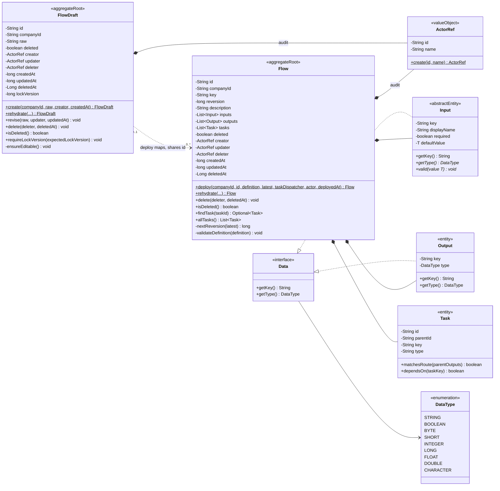
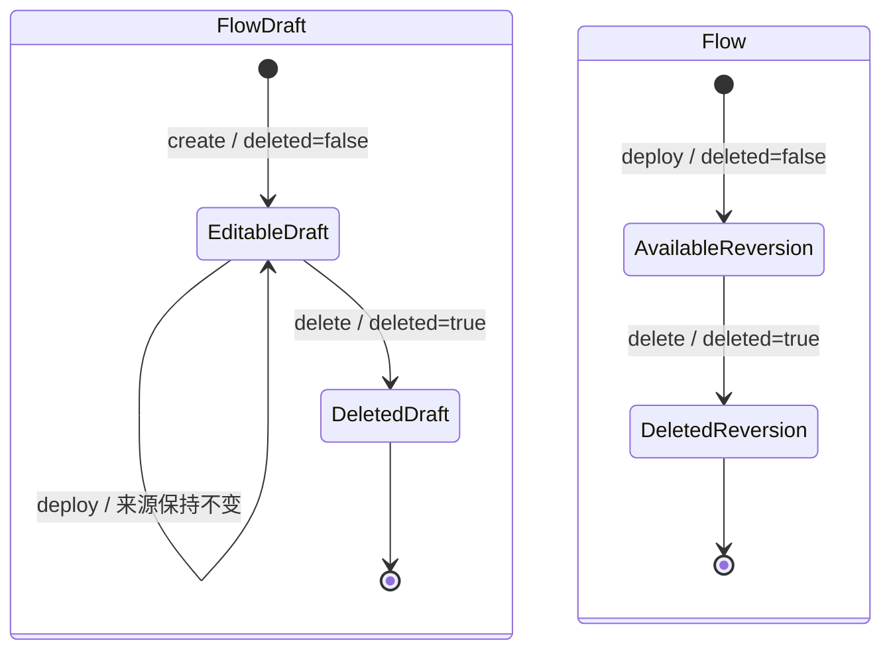

# Flow 定义域模型与生命周期规范

## 适用范围与效力

本规范定义 Flow 定义域的目标领域模型，包括 `FlowDraft`、`Flow`、版本、
`deleted` 生命周期事实、审计、部署、删除、查询和持久化边界。

本规范落实
[`CONTEXT.md`](../../CONTEXT.md)、
[`ADR 0008`](../decisions/0008-separate-flow-source-from-deployed-flow.md)
、[`ADR 0013`](../decisions/0013-centralize-yaml-parsing-and-flow-materialization.md)
、[`ADR 0014`](../decisions/0014-complete-flow-source-and-reversion-migration.md)
、[`ADR 0015`](../decisions/0015-use-long-millisecond-java-time.md)
、[`ADR 0017`](../decisions/0017-centralize-workflow-runtime-state-in-flow-domain.md)
、[`ADR 0022`](../decisions/0022-model-flow-draft-as-separate-aggregate.md)
以及
[`domain-object-modeling.md`](domain-object-modeling.md)
已经确认的领域语义。Java、PostgreSQL 映射和 UC 测试已经完成 FlowDraft 与
Reversion 分离以及 `deleted` 生命周期迁移；当前实现状态在本文单独列出，不能用
基础设施结构反向修改领域定义。

本领域统一使用字段名 `reversion` 表达一次成功部署产生的业务版本。旧文档和
现有代码中的 `version`、`flowVersion` 需要在对应迁移链路中改为
`reversion`、`flowReversion`。

## 领域模型总览



`FlowDraft` 与 `Flow` 没有继承关系。前者允许保存尚未解析、暂时无法部署的
原始 YAML，后者从构造完成开始就必须是完整、已解析、已校验的 Flow。

对象类型、Repository 和持久化表直接表达草稿与正式定义角色，不保存可稳定推导的
`draft` 字段。两类对象都显式保存 `deleted`：创建时为 false，删除后单向变为
true。定义域不使用 `FlowDefinitionStatus`、`DRAFT/DEPLOYED/CLOSED` 枚举或
通用 `status` 字段表达定义生命周期。

`YamlParser` 产生的通用只读映射只作为 Flow 完整创建或部署方法的一次性参数。
它不是领域对象，不进入类图、Repository 或聚合状态。Flow 在方法内部解释自身
字段和递归 Task 节点，不为解析中间结果创建平行类型。

图中的 `ActorRef` 表示操作者身份这一领域概念，具体 Java 类型需要在实现迁移前
结合现有 Session 和用户模型确认。Java 字段使用 `createdAt` 等 camelCase
名称，时间值统一使用 Epoch 毫秒 `long`；只有尚未删除时允许为空的
`deletedAt` 使用 `Long`。数据库列可以映射为 `created_at` 等 snake_case
名称，并由 Repository Entry 完成数据库时间类型与 `long` 的转换。

## 解析映射边界

- `YamlParser` 只把原始 YAML 解析为通用、深度只读的字符串键映射。
- Flow 直接消费该映射，解释 Flow 字段和递归 Task 节点，复用或生成 Task ID、
  计算直接 `parentId`、调用 Task 类型分派并校验完整 Task 树。
- 映射只存在于一次命令和领域方法调用中，不成为 Flow、FlowDraft 或
  FlowDefinition 的字段，也不进入 Repository。
- 不新增 `FlowDefinitionInput`、`TaskDefinitionInput` 或其他解析中间领域类型。
- 具体 Jackson `ObjectMapper`、`YAMLFactory` 类型和 API 不得进入
  `core/domains`。

## FlowDraft

### 定义

`FlowDraft` 是 Flow 定义域的草稿聚合根，也是 Flow 草稿的唯一对象形态。它
只保存原始 YAML 业务内容，不保存解析后的 description、inputs、outputs 或
tasks，也没有正式 `reversion`。

“只保存原始 YAML”描述的是业务内容；`id`、租户隔离信息和审计元数据仍可以
存在。

### 字段

| 字段 | 含义 | 规则 |
| --- | --- | --- |
| `id` | 逻辑 Flow 的稳定技术身份 | 首次创建时生成，后续部署复用 |
| `companyId` | 所属公司身份 | 非空；Repository 查询和写入必须共同参与租户隔离 |
| `raw` | 未解析的原始 YAML | 创建和编辑时不做完整领域解析 |
| `deleted` | 该来源是否已删除 | 创建时为 false；只能由 `delete` 单向改为 true |
| `creator` | 创建来源草稿的操作者 | 创建后不变 |
| `updater` | 最后改变来源的操作者 | 每次 `revise` 或 `delete` 更新 |
| `deleter` | 删除来源草稿的操作者 | `deleted=false` 时为空，`deleted=true` 时非空 |
| `createdAt` | 来源草稿创建时间 | 创建后不变 |
| `updatedAt` | 来源最后变更时间 | 每次 `revise` 或 `delete` 更新 |
| `deletedAt` | 来源草稿删除时间 | `deleted=false` 时为空，`deleted=true` 时非空 |
| `lockVersion` | 来源草稿技术并发版本 | 从 0 开始；每次成功 `revise` 或 `delete` 加一，不等于业务 `reversion` |

`FlowDraft` 不包含以下字段：

- `reversion`
- `draft`
- `status`
- `description`
- `inputs`
- `outputs`
- `tasks`

### 业务方法

| 方法 | 用途 | 核心规则 |
| --- | --- | --- |
| `create` | 创建唯一来源草稿 | 生成稳定 `id`，建立 `deleted=false`，只保存 `raw` 和创建审计 |
| `rehydrate` | 从可信 Repository 重建来源 | 沿用 id、删除事实、审计和 lockVersion，不触发生命周期变化 |
| `revise` | 替换原始 YAML | 只允许 `deleted=false`；不解析 YAML，不产生 `reversion` |
| `delete` | 删除来源草稿 | 将 `deleted` 置为 true 并记录删除审计，之后不能继续编辑或部署 |
| `isDeleted` | 查询删除事实 | 直接返回 `deleted` |

`FlowDraft` 不负责 YAML 解析，也不直接修改任何已经部署的 Flow。

## Flow

### 定义

`Flow` 是部署成功后形成的完整工作流定义聚合根。每个 Flow 对象代表同一逻辑
`id` 下的一次正式部署，使用 `id + reversion` 精确定位。

Flow 的定义字段在构造后保持不可变。生命周期和审计字段可以通过明确领域行为
改变。

### 字段

| 字段 | 含义 | 规则 |
| --- | --- | --- |
| `id` | 逻辑 Flow 的稳定技术身份 | 与来源草稿及其他部署版本共享 |
| `companyId` | 所属公司身份 | 非空；与来源和 Repository 租户条件一致 |
| `key` | YAML 声明的稳定业务标识 | 非空；同一逻辑 `id` 的后续 reversion 不得修改 |
| `reversion` | 成功部署产生的业务版本 | 正整数，只在 `deploy` 时生成 |
| `description` | 完整 Flow 描述 | 部署后不可变 |
| `inputs` | Flow 输入契约 | 部署时完成解析和校验，之后不可变 |
| `outputs` | Flow 输出契约 | 部署时完成解析和校验，之后不可变 |
| `tasks` | 完整 Task 定义集合 | 部署时完成解析和校验，之后不可变 |
| `deleted` | 该 Flow Reversion 是否已删除 | 部署时为 false；只能由 `delete` 单向改为 true |
| `creator` | 创建本次部署版本的操作者 | 部署成功时写入 |
| `updater` | 最后改变生命周期元数据的操作者 | 部署时等于 creator；删除时更新为删除操作者 |
| `deleter` | 删除 Flow 的操作者 | `deleted=false` 时为空，`deleted=true` 时非空 |
| `createdAt` | 本次部署版本创建时间 | 部署成功时写入 |
| `updatedAt` | 生命周期元数据最后更新时间 | 发生允许的变化时更新 |
| `deletedAt` | Flow 删除时间 | `deleted=false` 时为空，`deleted=true` 时非空 |

集合字段必须在构造时防御性复制，对外返回只读集合。任何 Flow 对象都必须拥有
完整且合法的 description、inputs、outputs 和 tasks。

### 业务方法

| 方法 | 用途 | 核心规则 |
| --- | --- | --- |
| `deploy` | 从通用只读定义映射物化并校验完整定义 | 是 Flow 的唯一业务创建入口，同时生成 Task 身份、建立 `deleted=false` 并计算 `reversion` |
| `rehydrate` | 从可信 Repository 重建正式 Reversion | 沿用 id、reversion、删除事实、定义和审计，不解析 YAML、不产生版本 |
| `delete` | 删除整个逻辑 Flow | 将当前 Reversion 的 `deleted` 置为 true，保留现有 `reversion`，不生成新版本 |
| `isDeleted` | 查询删除事实 | 直接返回 `deleted` |
| `findTask` | 按稳定 Task id 查找定义 | 只查询本次部署版本 |
| `allTasks` | 返回当前版本的完整 Task 集合 | 返回只读集合 |

可以提供 Repository 使用的 `rehydrate` 和隔离副本方法，但它们属于持久化支持，
不是业务动作，不能生成 ID、解析 YAML 或触发状态变化。

Flow 不提供以下方法：

- `create`
- `createDraft`
- `saveDraft`
- `createUpgradeDraft`
- `publish`
- `revise`
- 公共字段 Setter

普通创建发生在 `FlowDraft.create`；真实 Flow 只通过 `Flow.deploy` 产生。
升级不是独立草稿动作，而是同一个 `deploy` 规则在已有版本存在时计算下一
`reversion`。

## FlowDraft 角色与 deleted 生命周期事实

Flow 定义域不建立定义状态枚举，也不保存 `draft` 布尔值。草稿角色由
`FlowDraft` 类型表达，正式部署角色由 `Flow` 类型表达；`deleted` 是两类对象
唯一共同且会变化的定义生命周期布尔事实：

| 对象 | `deleted` | 业务含义 |
| --- | --- | --- |
| `FlowDraft` | false | 可编辑、可部署的来源草稿 |
| `FlowDraft` | true | 已删除的来源草稿，只保留审计事实 |
| `Flow` | false | 成功部署且尚未删除的正式 Reversion |
| `Flow` | true | 已删除的正式 Reversion；历史 Execution 仍可按精确引用读取 |

部署不是改变 FlowDraft 的类型或字段，而是从来源映射出新的
`deleted=false` Flow。删除只把当前对象的 `deleted` 从 false 改成 true，也不
允许恢复为 false。

不存在 `FlowDefinitionStatus`、`FlowStatus`、`DRAFT`、`DEPLOYED` 或 `CLOSED`
定义状态。一个 `deleted=false` 的 Flow 即表示未删除的正式 Flow。

新版本部署时，旧版本的 `deleted` 不发生变化。旧版本继续作为历史部署事实保留，
最新版本由同一 `id` 下最大的 `reversion` 决定。删除只用于表达整个逻辑 Flow
不再使用，不能用于表达“版本已被替代”。

## 统一运行 State 的领域归属

State 的字段、服务器系统时间、通用迁移和持久化规则统一见
[`workflow-core-java-model.md`](workflow-core-java-model.md)。本节只定义 State
在 Flow 定义域中的归属及其与定义生命周期的边界。

工作流运行的统一 `State` 值对象定义在 Flow 定义域
`org.cses.flow.core.domains.flows` 中，其内部 `State.Type` 统一包含
`CREATED/RUNNING/WAITING/COMPLETED/TERMINATED`，分别归入创建和运行、等待、
正常终止和异常终止四类。它表达整个工作流运行都必须共享的状态语言，而不是只
属于 Execution 或某一种 Worker。

Flow 定义对象本身不持有某次运行的 State；完整 State 由 Execution 和 TaskRun
保存，当前值由 `State.current()` 表达，变化轨迹由 `State.history()` 表达。
Worker 只报告目标 `State.Type`，不能创建聚合历史。FlowDraft/Flow 类型与
`deleted` 事实不能和运行 State 混用：

| 类型或字段 | 所属事实 | 允许值 |
| --- | --- | --- |
| `FlowDraft` / `Flow` 类型 | Flow 定义角色 | FlowDraft 表示草稿；Flow 表示正式 Reversion |
| `deleted` | Flow 定义可用性 | false 表示未删除；true 表示已删除 |
| `State` / `State.Type` | Execution、TaskRun 与 Worker 运行语言 | `current` 为 CREATED、RUNNING、WAITING、COMPLETED、TERMINATED；完整历史由运行对象持有 |
| PAUSE | Task 类型和等待位置 | TaskRun 进入 WAITING；无其他 CREATED/RUNNING 工作时 Execution 也进入 WAITING |
| 审批等业务状态 | Flow Core 外部业务对象 | 由对应业务域独立定义 |

## Input、Output 与 Task

- `Data` 是非泛型输入输出基础接口，只提供 `getKey()` 和返回独立 DataType 的
  `getType()`。
- `Input<T>` 是抽象输入定义基类，具体 Input 子类固定 DataType 并实现
  `valid(...)`；Output 是直接实现 Data 的具体输出定义。它们属于 Flow 或 Task
  聚合，不是运行值。
- Data、Input、Output 的完整契约由
  [`data-domain-model.md`](data-domain-model.md) 定义。
- `Task` 是 Flow 聚合内部实体，拥有跨 `reversion` 稳定的 `taskId`。
- Task 的完整字段、方法、类型扩展和运行边界由
  [`task-domain-model.md`](task-domain-model.md) 定义。
- `Task` 不建立独立 Repository；其生命周期由 Flow 管理。
- `Flow.deploy` 必须把 type 解析为独立 DataType、选择完整具体 Input 子类，并
  校验 Data key、同方向 key 唯一性，以及 Task key、稳定身份、递归结构、
  输入输出和路由规则。
- 已部署 Flow 中的 Input、Output 和 Task 都不可被外部直接修改。
- Parser 返回的 Task 节点映射不是 Task；Flow 转换完成后持有的 Task 必须已经
  具有完整 `id` 和 `parentId`，不能通过后续 `identify` 补全。

Data 的基础契约、独立 DataType、抽象 Input 与具体子类、Output 对象形态及 key
主键规则已经由 Accepted ADR 0019 确认。实现前不得以数据库 Entry、YAML Map、
DTO 或隐式 STRING 默认值直接替代领域对象。

## 领域不变量

### FlowDraft 不变量

- `DRAFT-001`：同一租户、同一逻辑 `id` 最多只有一个未删除的
  `FlowDraft`。
- `DRAFT-002`：FlowDraft 的类型表达草稿角色，不保存 `draft` 字段，也不拥有
  正式 `reversion`。
- `DRAFT-003`：创建和修改来源草稿不产生 Flow 部署版本。
- `DRAFT-004`：`deleted` 创建时为 false，只能由 `delete` 单向改为 true；
  删除后不能继续 `revise` 或 `deploy`。
- `DRAFT-005`：原始 YAML 是否能够解析不影响来源草稿被保存。
- `DRAFT-006`：`deleted=false` 时 `deleter/deletedAt` 必须同时为空；
  `deleted=true` 时两者必须同时存在。

### Flow 不变量

- `FLOW-001`：任何进入领域的 Flow 都已经完成解析和校验。
- `FLOW-002`：`id + reversion` 唯一定位一次部署事实。
- `FLOW-003`：`reversion` 是正整数，并且只由成功的 `deploy` 产生。
- `FLOW-004`：同一 `id` 的首次部署使用 `reversion = 1`，后续部署使用当前
  最大值加一。
- `FLOW-005`：失败的解析、校验或保存不产生 Flow，也不占用
  `reversion`。
- `FLOW-006`：已部署定义的 description、inputs、outputs 和 tasks 不可变。
- `FLOW-007`：Flow 的类型表达正式部署角色，不保存 `draft` 字段；成功部署创建
  `deleted=false` 的新 Reversion。
- `FLOW-008`：部署新版本不删除、不修改旧版本。
- `FLOW-009`：`delete` 只把 `deleted` 从 false 改为 true，不产生新版本；
  删除后的 Flow 保留原
  `reversion`。
- `FLOW-010`：最新版本为 `deleted=true` 时，该逻辑 Flow 不能启动新 Execution，
  也不能继续部署。
- `FLOW-011`：选择当前 Flow 时必须先取最大 `reversion`，再检查
  `deleted=false`；不得过滤已删除记录后回退到旧版本。
- `FLOW-012`：`deleted=false` 时 `deleter/deletedAt` 必须同时为空；
  `deleted=true` 时两者必须同时存在。
- `FLOW-013`：已有 Execution 继续使用启动时绑定的 `flowId +
  flowReversion`，不受后续部署或删除影响。

### 解析映射不变量

- `MAP-001`：YamlParser 返回的映射深度只读，不允许调用方在转换期间修改。
- `MAP-002`：映射没有技术身份、Repository、生命周期或持久化语义。
- `MAP-003`：只有 Flow 的完整创建或部署入口解释 Flow/Task 字段并生成真实
  Task 身份；Service、Handler 和 Parser 不生成 Task。
- `MAP-004`：YamlParser 不识别 Flow 字段或 Task 类型，Flow 不依赖具体 YAML
  库类型。

## 生命周期



`deploy` 从 `FlowDraft` 创建另一个 Flow 聚合，不把来源对象转换为 Flow。
两种对象的角色由类型确定；只有 `deleted` 存在单向转换。

| 业务动作 | 操作前 | 操作后 | 是否解析 YAML | 是否产生 `reversion` |
| --- | --- | --- | --- | --- |
| `create` | 不存在来源草稿 | `FlowDraft(deleted=false)` | 否 | 否 |
| `revise` | `deleted=false` 的 FlowDraft | 同一 FlowDraft、更新 raw，删除事实不变 | 否 | 否 |
| 首次 `deploy` | 未删除 FlowDraft、无历史 Flow | `Flow r1(deleted=false)` | 是 | 是 |
| 再次 `deploy` | 未删除 FlowDraft、当前 Flow 未删除 | `Flow rN+1(deleted=false)` | 是 | 是 |
| `delete` 正式 Flow | 当前 Flow 为 `deleted=false` | 同一 Reversion 变为 `deleted=true` | 否 | 否 |
| `delete` FlowDraft | FlowDraft 为 `deleted=false` | 同一 FlowDraft 变为 `deleted=true` | 否 | 否 |

删除正式 Flow 是终止整个逻辑 Flow 的操作。删除后：

- 不允许启动新的 Execution。
- 不允许再次部署。
- 已经存在的历史版本继续保留。
- 已经启动的 Execution 继续按原绑定版本运行。
- 同 `id` 的来源草稿必须在同一事务中设置 `deleted=true`，变为不可编辑、
  不可部署。
- 删除只记录逻辑删除事实；Repository 不物理删除定义和历史 Reversion。

## 部署流程

部署是一个完整业务动作，不拆分 `createUpgradeDraft`：

```text
FlowService.deploy
  -> CommandExecutor
  -> DeployFlowHandler
  -> FlowDraftRepository.load
  -> FlowRepository.loadLatest
  -> YamlParser.parse(raw)
  -> Flow.deploy
  -> FlowRepository.save
```

部署必须在同一个命令事务中完成：

1. 使用 `companyId + id` 加载唯一 `FlowDraft`。
2. 加载相同逻辑 `id` 的最新 Flow。
3. 如果来源或最新 Flow 的 `deleted=true`，拒绝部署。
4. `YamlParser` 将原始 YAML 解析为通用只读映射。
5. `Flow.deploy` 直接解释映射、生成 Task 身份和父子关系，并校验 description、inputs、
   outputs、tasks 和关联规则。
6. 首次部署计算 `reversion = 1`；升级部署计算 `max + 1`。
7. `Flow.deploy` 创建 `deleted=false` 的完整 Flow。
8. 原子保存新 Flow；任何异常都不能留下部分版本。

`YamlParser` 是格式边界，不理解 Flow 或 Task。通用只读映射只服务于本次部署，
由现有 Flow 直接消费，不独立持久化，也不作为另一套 Flow 模型公开。

部署成功后保留 `FlowDraft` 作为下一轮编辑基线。部署只读取来源并新增
Flow Reversion，不修改来源的 `raw`、审计或 `lockVersion`；后续编辑继续调用
`revise`。删除逻辑 Flow 时，在同一事务中把最新 Flow 与仍存在的来源都设置为
`deleted=true`。
该规则由 ADR 0014 确认，来源始终不能获得 `reversion`，也不能就地变成 Flow。

## 创建、编辑与删除调用链

创建或编辑来源草稿：

```text
FlowService
  -> CommandExecutor
  -> SaveFlowDraftHandler
  -> FlowDraft.create/revise
  -> FlowDraftRepository.save
```

删除逻辑 Flow：

```text
FlowService.delete
  -> CommandExecutor
  -> DeleteFlowHandler
  -> FlowRepository.loadLatest
  -> Flow.delete
  -> FlowDraft.delete（存在时）
  -> 两个 Repository 原子保存
```

Handler 负责加载、事务和跨聚合协调；领域生命周期校验、版本计算和字段变化必须由
领域方法完成。Service、Handler、Repository 和解析器都不能直接写领域字段。

## YAML 边界

- `FlowDraft.raw` 原样保存调用方提交的 YAML。
- 创建和编辑来源草稿时不构造 Flow、Input、Output 或 Task。
- 完整语法、Schema 和领域校验只在 `deploy` 时执行。
- YAML 语法统一由扁平的 `core/serializers/YamlParser` 处理；不得新增
  Flow 专用 YAML Reader。
- YAML 不得声明系统拥有的 `id`、`reversion`、`draft`、`deleted` 或审计字段。
- YAML 中的业务 key 只作为定义内容，不替代技术 `id`。
- Flow 或 Task 的每个 `inputs` 条目必须包含 Input 公共字段，并可以包含所选
  DataType 对应的具体子类字段；`outputs` 至少包含 `key`、`type`。字符串列表、
  空白字段、未知 DataType、错用子类字段和其他未知字段都不能物化为完整 Data。
- 解析失败时保留原始 YAML，返回明确错误，不产生 Flow。
- 第三方 YAML 类型不得进入 `core/domains`；Parser 返回的通用只读映射只作为
  Flow 完整创建或部署方法的瞬时参数，不得成为领域类型或聚合字段。

## 查询规则

来源草稿与已部署 Flow 使用不同查询契约：

- `FlowDraft`：使用 `companyId + id` 查询唯一来源草稿。
- 指定部署版本：使用 `companyId + id + reversion` 精确查询 Flow；已有
  Execution 恢复时允许读取后来已删除的精确 Reversion。
- 当前 Flow：先查找相同 `id` 下最大 `reversion`，再要求其
  `deleted=false`，才能用于启动新 Execution。
- 当前版本已删除时不得先过滤 `deleted=true` 再回退到更旧的未删除版本。
- 错误 `reversion` 不得自动回退到当前版本。
- 查询 `FlowDraft` 不得隐式返回已部署 Flow，反之亦然。

Execution 启动时由系统选择当前 Flow，调用方不能指定或篡改
`flowReversion`。Execution 创建成功后永久绑定该版本。

## 审计、业务版本与并发版本

以下三个概念必须分开：

- `reversion`：成功部署产生的业务版本。
- `creator/updater/deleter` 与时间字段：业务审计信息。
- `lockVersion` 或 expected revision：Repository 的并发控制信息。

`deleted` 是定义生命周期事实，不是业务版本、审计字段或并发版本。
`deleted` 必须与 `deleter/deletedAt` 一致，但不能通过审计字段为空与否临时推导
并替代显式布尔值。

并发控制字段不能替代 `reversion`，也不能因为来源草稿保存一次就产生新的
Flow 业务版本。

同一 `id` 的并发部署必须通过数据库唯一约束或 Repository CAS 保证最多只有
一个相同 `reversion` 的 Flow。冲突事务必须回滚，失败调用方重新读取最新版本
后再决定是否部署。

## Session 与租户

- Service 必须把 PAAS Session 原样传给 CommandExecutor。
- Handler 使用 `Session.getCompanyId()` 获取公司身份。
- 两类 Repository 都使用 `companyId + id` 隔离不同公司的对象。
- Session 中 company id 为空时立即拒绝命令或查询。
- 任何跨租户读取、编辑、部署或删除都必须无可观察副作用。

## 持久化边界

- `FlowDraftRepository` 只负责来源草稿。
- `FlowRepository` 只负责已部署 Flow 及其历史 `reversion`。
- 两个 Repository 都由 Core 定义端口，生产实现位于 Infrastructure。
- `DSLContext` 沿命令调用链传入，跨两个聚合的部署和删除共享同一事务。
- Repository Adapter 使用可信重建入口恢复领域对象，不通过公共 Setter
  拼装 `deleted`。
- JOOQ Object、Entry、数据库列和 YAML DTO 不得作为领域对象返回。
- 测试内存 Repository 只存在于 `src/test`，并保存和返回聚合隔离副本。

数据库表、唯一索引、外键和 Entry 映射以本领域模型为输入另行设计，不能用现有
表结构反向改变对象边界。

## 当前实现迁移差距

本决策链路已无待迁移项，以下边界已经落地：

- `FlowDraft` 独立保存未解析 YAML，并使用 `lockVersion` 保护并发编辑。
- `Flow.deploy` 是唯一物化入口；`Flow` 每个对象只表示一个完整
  `id + reversion`。
- `FlowDraft` 与 `Flow` 不保存可由类型推导的 `draft`；两者显式保存
  `deleted`，重建时校验删除事实和删除审计的一致性。
- `Flow.delete`、`FlowDraft.delete`、`FlowService.delete/deleteDraft`
  以及对应 Command 和 Handler 已统一使用删除语言；定义状态枚举和
  `close/discard` 契约已删除。
- Execution 创建先读取最大 Reversion，再要求
  `deleted=false`；精确版本查询仍可读取后来删除的 Reversion。
- PostgreSQL 已通过
  `2026-07-30/002_use_flow_lifecycle_flags.sql` 回填并新增非空布尔列，删除
  `flows.status`；随后通过
  `2026-07-31/001_remove_flow_draft_flags.sql` 删除两个固定 `draft` 列，保留
  删除审计约束和活动草稿索引，并重新生成 JOOQ。
- PostgreSQL 与内存 Repository 都先选择最大 Reversion，再由当前查询判断
  `deleted`，不会过滤后回退到旧版本。
- Flow 定义域已提供统一运行 `State`；该运行状态模型不受本次定义生命周期
  布尔化影响。
- Upgrade Draft、`FlowDefinition`、publish 和 `id + version + status`
  旧契约已删除；Execution 已改为 `flowReversion`。
- Flow 与 Task 的 inputs、outputs 已使用 `Input`、`Output` 对象；Task 通过注册
  插件物化和重建。

Flow Input 的实际启动值和 Task Input 映射仍待业务规则确认。独立 DataType 与
具体 Input 类型体系已由 Accepted ADR 0019 确认，但尚未进入 Java 实现；详见
Data 与 Execution 规范。

## 场景校验

- 正向：创建 FlowDraft 和部署 Flow 都得到 `deleted=false`；删除后分别得到
  `deleted=true`，且删除审计完整。
- 正向：Flow 直接消费通用 YAML 映射，一次性生成顶层和递归 Task 的稳定身份、
  直接 parentId 与具体子类型。
- 反向：`deleted=true` 的来源不能修改或部署；当前 Flow 为
  `deleted=true` 时不能启动 Execution 或部署新 Reversion。
- 反向：未知 Flow 字段、错误定义形状或不支持的 Task 类型被拒绝，现有 Flow
  的 reversion、布尔事实和 Task 身份映射保持不变。
- 变异：删除当前 Reversion 后，即使旧 Reversion 的 `deleted=false`，当前查询
  也不能回退并启动旧版本。
- 变异：若重新引入持久化 `draft`、允许 `deleted` 恢复为 false、Parser 开始
  依赖 Flow/Task，或 Handler 重新生成 Task 身份，相应测试必须失败。
- 身份：创建、保存、部署、删除和重建后逻辑 `id` 保持稳定；相同 Task key
  跨 Reversion 复用 id，新增 key 生成新 id。
- 版本：成功部署递增 `reversion`；删除和失败转换不递增，也不得改变来源
  `lockVersion`。
- 恢复：Repository 重建后 `deleted`、删除审计、定义集合和顺序完全一致；
  不保存或重建解析映射。
- 并发：并发删除与部署最多一个事务提交；旧 expected revision 不能覆盖已经
  提交的生命周期事实或生成重复 Reversion。

## 尚待业务规则确认

本领域生命周期暂无未确认规则。部署后保留 FlowDraft、删除逻辑 Flow 时同时删除
FlowDraft、使用类型边界与 `deleted` 取代定义状态枚举已经确认；Data type 和实际运行值规则属于
相邻领域。

## 相关文档

- [`CONTEXT.md`](../../CONTEXT.md)
- [`领域对象统一建模方法`](domain-object-modeling.md)
- [`Data、Input 与 Output 领域模型规范`](data-domain-model.md)
- [`Task 领域模型规范`](task-domain-model.md)
- [`Execution 与 TaskRun 领域模型规范`](execution-domain-model.md)
- [`工作流核心 Java 模型规范`](workflow-core-java-model.md)
- [`ADR 0008：分离 FlowDraft 与已部署 Flow`](../decisions/0008-separate-flow-source-from-deployed-flow.md)
- [`ADR 0013：集中 YAML 解析与 Flow 领域转换`](../decisions/0013-centralize-yaml-parsing-and-flow-materialization.md)
- [`ADR 0014：完成 Flow 来源与 Reversion 迁移`](../decisions/0014-complete-flow-source-and-reversion-migration.md)
- [`ADR 0015：Java 时间统一使用 Unix timestamp 毫秒值`](../decisions/0015-use-long-millisecond-java-time.md)
- [`ADR 0022：将 FlowDraft 建模为独立聚合并移除 draft 字段`](../decisions/0022-model-flow-draft-as-separate-aggregate.md)
- [`工作流核心 Java 模型规范`](workflow-core-java-model.md)
- [`UC-01 Flow 草稿生命周期与多租户管理`](../uc/flow/UC-01%20Flow%20草稿生命周期与多租户管理.md)
