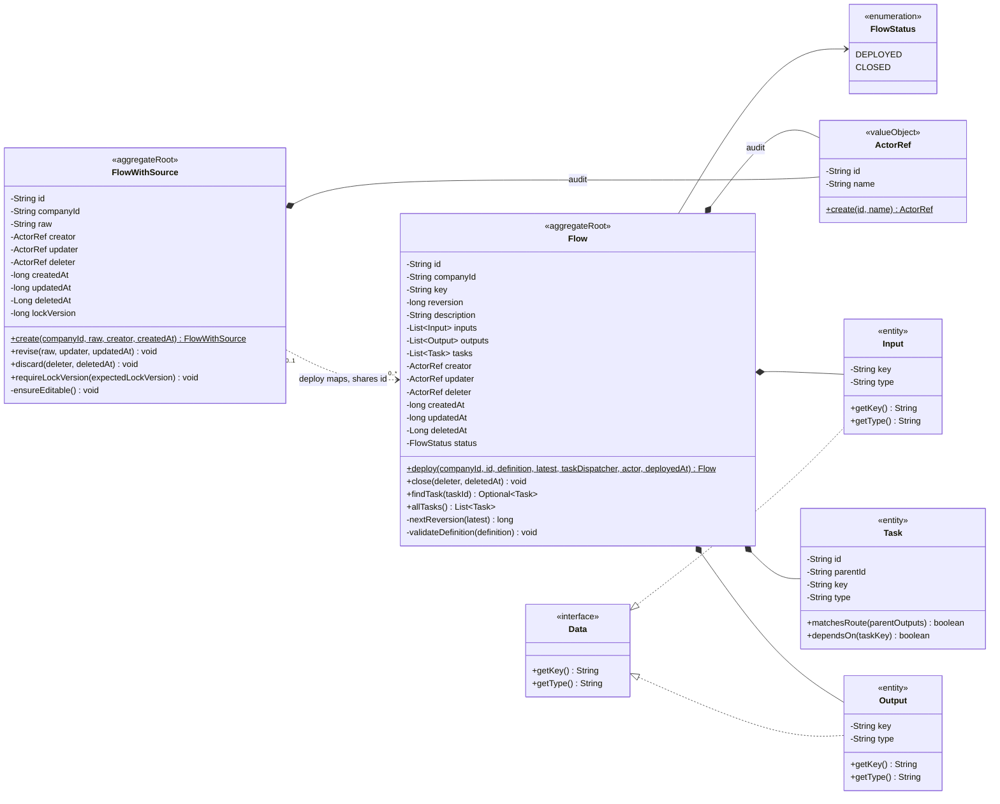

# Flow 定义域模型与生命周期规范

## 适用范围与效力

本规范定义 Flow 定义域的目标领域模型，包括 `FlowWithSource`、`Flow`、版本、
状态、审计、部署、关闭、查询和持久化边界。

本规范落实
[`CONTEXT.md`](../../CONTEXT.md)、
[`ADR 0008`](../decisions/0008-separate-flow-source-from-deployed-flow.md)
、[`ADR 0013`](../decisions/0013-centralize-yaml-parsing-and-flow-materialization.md)
、[`ADR 0014`](../decisions/0014-complete-flow-source-and-reversion-migration.md)
、[`ADR 0015`](../decisions/0015-use-long-millisecond-java-time.md)
以及
[`domain-object-modeling.md`](domain-object-modeling.md)
已经确认的领域语义。Java、PostgreSQL 映射和 UC 测试已经完成本模型的主链路
迁移；本规范同时记录仍待确认的运行值规则，不能用基础设施结构反向修改领域
定义。

本领域统一使用字段名 `reversion` 表达一次成功部署产生的业务版本。旧文档和
现有代码中的 `version`、`flowVersion` 需要在对应迁移链路中改为
`reversion`、`flowReversion`。

## 领域模型总览



`FlowWithSource` 与 `Flow` 没有继承关系。前者允许保存尚未解析、暂时无法部署的
原始 YAML，后者从构造完成开始就必须是完整、已解析、已校验的 Flow。

`YamlParser` 产生的通用只读映射只作为 Flow 完整创建或部署方法的一次性参数。
它不是领域对象，不进入类图、Repository 或聚合状态。Flow 在方法内部解释自身
字段和递归 Task 节点，不为解析中间结果创建平行类型。

图中的 `ActorRef` 表示操作者身份这一领域概念，具体 Java 类型需要在实现迁移前
结合现有 Session 和用户模型确认。Java 字段使用 `createdAt` 等 camelCase
名称，时间值统一使用 Epoch 毫秒 `long`；只有尚未删除时允许为空的
`deletedAt` 使用 `Long`。数据库列可以映射为 `created_at` 等 snake_case
名称，并由 Repository Entry 完成数据库时间类型与 `long` 的转换。

## 解析映射边界

- `YamlParser` 只把原始 YAML 解析为通用、深度只读的字符串键映射。
- Flow 直接消费该映射，解释 Flow 字段和递归 Task 节点，复用或生成 Task ID、
  计算直接 `parentId`、调用 Task 类型分派并校验完整 Task 树。
- 映射只存在于一次命令和领域方法调用中，不成为 Flow、FlowWithSource 或
  FlowDefinition 的字段，也不进入 Repository。
- 不新增 `FlowDefinitionInput`、`TaskDefinitionInput` 或其他解析中间领域类型。
- 具体 Jackson `ObjectMapper`、`YAMLFactory` 类型和 API 不得进入
  `core/domains`。

## FlowWithSource

### 定义

`FlowWithSource` 是 Flow 定义域的来源聚合根，也是 Draft 的唯一对象形态。它
只保存原始 YAML 业务内容，不保存解析后的 description、inputs、outputs 或
tasks，也没有正式 `reversion`。

“只保存原始 YAML”描述的是业务内容；`id`、租户隔离信息和审计元数据仍可以
存在。

### 字段

| 字段 | 含义 | 规则 |
| --- | --- | --- |
| `id` | 逻辑 Flow 的稳定技术身份 | 首次创建时生成，后续部署复用 |
| `companyId` | 所属公司身份 | 非空；Repository 查询和写入必须共同参与租户隔离 |
| `raw` | 未解析的原始 YAML | 创建和编辑时不做完整领域解析 |
| `creator` | 创建来源草稿的操作者 | 创建后不变 |
| `updater` | 最后修改原始 YAML 的操作者 | 每次 `revise` 更新 |
| `deleter` | 丢弃来源草稿的操作者 | 未丢弃时为空 |
| `createdAt` | 来源草稿创建时间 | 创建后不变 |
| `updatedAt` | 原始 YAML 最后修改时间 | 每次 `revise` 更新 |
| `deletedAt` | 来源草稿丢弃时间 | 未丢弃时为空 |
| `lockVersion` | 来源草稿技术并发版本 | 从 0 开始；每次成功 `revise` 或 `discard` 加一，不等于业务 `reversion` |

`FlowWithSource` 不包含以下字段：

- `reversion`
- `status`
- `description`
- `inputs`
- `outputs`
- `tasks`

### 业务方法

| 方法 | 用途 | 核心规则 |
| --- | --- | --- |
| `create` | 创建唯一来源草稿 | 生成稳定 `id`，只保存 `raw` 和创建审计 |
| `revise` | 替换原始 YAML | 不解析 YAML，不产生 `reversion` |
| `discard` | 丢弃来源草稿 | 记录删除审计，之后不能继续编辑或部署 |

`FlowWithSource` 不负责 YAML 解析，也不直接修改任何已经部署的 Flow。

## Flow

### 定义

`Flow` 是部署成功后形成的完整工作流定义聚合根。每个 Flow 对象代表同一逻辑
`id` 下的一次正式部署，使用 `id + reversion` 精确定位。

Flow 的定义字段在构造后保持不可变。生命周期和审计字段可以通过明确领域行为
改变。

### 字段

| 字段 | 含义 | 规则 |
| --- | --- | --- |
| `id` | 逻辑 Flow 的稳定技术身份 | 与来源草稿及其他部署版本共享 |
| `companyId` | 所属公司身份 | 非空；与来源和 Repository 租户条件一致 |
| `key` | YAML 声明的稳定业务标识 | 非空；同一逻辑 `id` 的后续 reversion 不得修改 |
| `reversion` | 成功部署产生的业务版本 | 正整数，只在 `deploy` 时生成 |
| `description` | 完整 Flow 描述 | 部署后不可变 |
| `inputs` | Flow 输入契约 | 部署时完成解析和校验，之后不可变 |
| `outputs` | Flow 输出契约 | 部署时完成解析和校验，之后不可变 |
| `tasks` | 完整 Task 定义集合 | 部署时完成解析和校验，之后不可变 |
| `creator` | 创建本次部署版本的操作者 | 部署成功时写入 |
| `updater` | 最后改变生命周期元数据的操作者 | 部署时等于 creator；关闭时更新为关闭操作者 |
| `deleter` | 关闭 Flow 的操作者 | `DEPLOYED` 时为空 |
| `createdAt` | 本次部署版本创建时间 | 部署成功时写入 |
| `updatedAt` | 生命周期元数据最后更新时间 | 发生允许的变化时更新 |
| `deletedAt` | Flow 关闭时间 | `DEPLOYED` 时为空 |
| `status` | 已部署 Flow 的生命周期状态 | 只允许 `DEPLOYED`、`CLOSED` |

集合字段必须在构造时防御性复制，对外返回只读集合。任何 Flow 对象都必须拥有
完整且合法的 description、inputs、outputs 和 tasks。

### 业务方法

| 方法 | 用途 | 核心规则 |
| --- | --- | --- |
| `deploy` | 从通用只读定义映射物化并校验完整定义 | 是 Flow 的唯一业务创建入口，同时生成 Task 身份并计算 `reversion` |
| `close` | 关闭整个逻辑 Flow | 改为 `CLOSED`，保留现有 `reversion`，不生成新版本 |
| `findTask` | 按稳定 Task id 查找定义 | 只查询本次部署版本 |
| `allTasks` | 返回当前版本的完整 Task 集合 | 返回只读集合 |

可以提供 Repository 使用的 `rehydrate` 和隔离副本方法，但它们属于持久化支持，
不是业务动作，不能生成 ID、解析 YAML 或触发状态变化。

Flow 不提供以下方法：

- `create`
- `createDraft`
- `saveDraft`
- `createUpgradeDraft`
- `publish`
- `revise`
- 公共字段 Setter

普通创建发生在 `FlowWithSource.create`；真实 Flow 只通过 `Flow.deploy` 产生。
升级不是独立草稿动作，而是同一个 `deploy` 规则在已有版本存在时计算下一
`reversion`。

## FlowStatus

`FlowStatus` 只包含：

```text
DEPLOYED
CLOSED
```

- `DEPLOYED`：该 Flow 是一次成功部署产生的完整定义。
- `CLOSED`：整个逻辑 Flow 已停止使用，不能再启动新的 Execution。

`DRAFT` 不属于 `FlowStatus`。Draft 是 `FlowWithSource` 的领域角色，不是 Flow
的一种状态。

新版本部署时，旧版本不会被改成 `CLOSED`。旧版本继续作为历史部署事实保留，
最新版本由同一 `id` 下最大的 `reversion` 决定。`close` 只用于表达整个逻辑
Flow 不再使用，不能用于表达“版本已被替代”。

## Input、Output 与 Task

- `Data` 是输入输出定义的基础接口，只提供 `getKey()` 和 `getType()`。
- `Input`、`Output` 是直接实现 Data 的两个具体不可变对象，分别表达
  输入和输出方向；它们属于 Flow 或 Task 聚合，不是接口或运行值。
- Data、Input、Output 的完整契约由
  [`data-domain-model.md`](data-domain-model.md) 定义。
- `Task` 是 Flow 聚合内部实体，拥有跨 `reversion` 稳定的 `taskId`。
- Task 的完整字段、方法、类型扩展和运行边界由
  [`task-domain-model.md`](task-domain-model.md) 定义。
- `Task` 不建立独立 Repository；其生命周期由 Flow 管理。
- `Flow.deploy` 必须校验 Data key、type、同方向 key 唯一性，以及 Task key、
  稳定身份、递归结构、输入输出和路由规则。
- 已部署 Flow 中的 Input、Output 和 Task 都不可被外部直接修改。
- Parser 返回的 Task 节点映射不是 Task；Flow 转换完成后持有的 Task 必须已经
  具有完整 `id` 和 `parentId`，不能通过后续 `identify` 补全。

Data 的基础契约、Input/Output 对象形态及 key 主键规则已经确认；type 与运行值
校验规则仍需继续确认。在完成前不得以数据库 Entry、YAML Map 或 DTO
直接替代领域对象。

## 领域不变量

### FlowWithSource 不变量

- `FWS-001`：同一租户、同一逻辑 `id` 最多只有一个未丢弃的
  `FlowWithSource`。
- `FWS-002`：`FlowWithSource` 不拥有正式 `reversion`。
- `FWS-003`：创建和修改来源草稿不产生 Flow 部署版本。
- `FWS-004`：来源草稿丢弃后不能继续 `revise` 或 `deploy`。
- `FWS-005`：原始 YAML 是否能够解析不影响来源草稿被保存。

### Flow 不变量

- `FLOW-001`：任何进入领域的 Flow 都已经完成解析和校验。
- `FLOW-002`：`id + reversion` 唯一定位一次部署事实。
- `FLOW-003`：`reversion` 是正整数，并且只由成功的 `deploy` 产生。
- `FLOW-004`：同一 `id` 的首次部署使用 `reversion = 1`，后续部署使用当前
  最大值加一。
- `FLOW-005`：失败的解析、校验或保存不产生 Flow，也不占用
  `reversion`。
- `FLOW-006`：已部署定义的 description、inputs、outputs 和 tasks 不可变。
- `FLOW-007`：部署新版本不关闭、不修改旧版本。
- `FLOW-008`：`close` 不产生新版本，关闭后的 Flow 保留原
  `reversion`。
- `FLOW-009`：最新版本为 `CLOSED` 时，该逻辑 Flow 不能启动新 Execution，
  也不能继续部署。
- `FLOW-010`：已有 Execution 继续使用启动时绑定的 `flowId +
  flowReversion`，不受后续部署或关闭影响。

### 解析映射不变量

- `MAP-001`：YamlParser 返回的映射深度只读，不允许调用方在转换期间修改。
- `MAP-002`：映射没有技术身份、Repository、生命周期或持久化语义。
- `MAP-003`：只有 Flow 的完整创建或部署入口解释 Flow/Task 字段并生成真实
  Task 身份；Service、Handler 和 Parser 不生成 Task。
- `MAP-004`：YamlParser 不识别 Flow 字段或 Task 类型，Flow 不依赖具体 YAML
  库类型。

## 生命周期

| 业务动作 | 操作前 | 操作后 | 是否解析 YAML | 是否产生 `reversion` |
| --- | --- | --- | --- | --- |
| `create` | 不存在来源草稿 | 一个 `FlowWithSource` | 否 | 否 |
| `revise` | 可编辑 `FlowWithSource` | 同一来源草稿、更新 raw | 否 | 否 |
| 首次 `deploy` | 来源草稿存在、无历史 Flow | `DEPLOYED Flow r1` | 是 | 是 |
| 再次 `deploy` | 来源草稿存在、最新 Flow 为 `DEPLOYED` | 新的 `DEPLOYED Flow rN+1` | 是 | 是 |
| `close` | 最新 Flow 为 `DEPLOYED` | 同一版本变为 `CLOSED` | 否 | 否 |
| `discard` | 来源草稿可编辑 | 来源草稿被丢弃 | 否 | 否 |

关闭是终止整个逻辑 Flow 的操作，语义类似删除。关闭后：

- 不允许启动新的 Execution。
- 不允许再次部署。
- 已经存在的历史版本继续保留。
- 已经启动的 Execution 继续按原绑定版本运行。
- 同 `id` 的来源草稿必须同时变为不可编辑、不可部署；具体使用软删除还是物理
  删除由 Repository 设计决定。

## 部署流程

部署是一个完整业务动作，不拆分 `createUpgradeDraft`：

```text
FlowService.deploy
  -> CommandExecutor
  -> DeployFlowHandler
  -> FlowWithSourceRepository.load
  -> FlowRepository.loadLatest
  -> YamlParser.parse(raw)
  -> Flow.deploy
  -> FlowRepository.save
```

部署必须在同一个命令事务中完成：

1. 使用 `companyId + id` 加载唯一 `FlowWithSource`。
2. 加载相同逻辑 `id` 的最新 Flow。
3. 如果最新 Flow 已 `CLOSED`，拒绝部署。
4. `YamlParser` 将原始 YAML 解析为通用只读映射。
5. `Flow.deploy` 直接解释映射、生成 Task 身份和父子关系，并校验 description、inputs、
   outputs、tasks 和关联规则。
6. 首次部署计算 `reversion = 1`；升级部署计算 `max + 1`。
7. `Flow.deploy` 创建状态为 `DEPLOYED` 的完整 Flow。
8. 原子保存新 Flow；任何异常都不能留下部分版本。

`YamlParser` 是格式边界，不理解 Flow 或 Task。通用只读映射只服务于本次部署，
由现有 Flow 直接消费，不独立持久化，也不作为另一套 Flow 模型公开。

部署成功后保留 `FlowWithSource` 作为下一轮编辑基线。部署只读取来源并新增
Flow Reversion，不修改来源的 `raw`、审计或 `lockVersion`；后续编辑继续调用
`revise`。关闭逻辑 Flow 时，在同一事务中关闭最新 Flow 并丢弃仍存在的来源。
该规则由 ADR 0014 确认，来源始终不能获得 `reversion`，也不能就地变成 Flow。

## 创建、编辑与关闭调用链

创建或编辑来源草稿：

```text
FlowService
  -> CommandExecutor
  -> CreateOrReviseFlowSourceHandler
  -> FlowWithSource.create/revise
  -> FlowWithSourceRepository.save
```

关闭逻辑 Flow：

```text
FlowService.close
  -> CommandExecutor
  -> CloseFlowHandler
  -> FlowRepository.loadLatest
  -> Flow.close
  -> FlowWithSource.discard（存在时）
  -> 两个 Repository 原子保存
```

Handler 负责加载、事务和跨聚合协调；领域状态校验、版本计算和字段变化必须由
领域方法完成。Service、Handler、Repository 和解析器都不能直接写领域字段。

## YAML 边界

- `FlowWithSource.raw` 原样保存调用方提交的 YAML。
- 创建和编辑来源草稿时不构造 Flow、Input、Output 或 Task。
- 完整语法、Schema 和领域校验只在 `deploy` 时执行。
- YAML 语法统一由扁平的 `core/serializers/YamlParser` 处理；不得新增
  Flow 专用 YAML Reader。
- YAML 不得声明系统拥有的 `id`、`reversion`、`status` 或审计字段。
- YAML 中的业务 key 只作为定义内容，不替代技术 `id`。
- Flow 或 Task 的每个 `inputs`、`outputs` 条目必须是只含 `key`、`type` 的
  映射；字符串列表、空白字段和额外字段都不能物化为完整 Data。
- 解析失败时保留原始 YAML，返回明确错误，不产生 Flow。
- 第三方 YAML 类型不得进入 `core/domains`；Parser 返回的通用只读映射只作为
  Flow 完整创建或部署方法的瞬时参数，不得成为领域类型或聚合字段。

## 查询规则

来源草稿与已部署 Flow 使用不同查询契约：

- `FlowWithSource`：使用 `companyId + id` 查询唯一来源草稿。
- 指定部署版本：使用 `companyId + id + reversion` 精确查询 Flow。
- 当前 Flow：查找相同 `id` 下最大 `reversion`；只有其状态为 `DEPLOYED`
  时才能用于启动新 Execution。
- 错误 `reversion` 不得自动回退到当前版本。
- 查询 `FlowWithSource` 不得隐式返回已部署 Flow，反之亦然。

Execution 启动时由系统选择当前 Flow，调用方不能指定或篡改
`flowReversion`。Execution 创建成功后永久绑定该版本。

## 审计、业务版本与并发版本

以下三个概念必须分开：

- `reversion`：成功部署产生的业务版本。
- `creator/updater/deleter` 与时间字段：业务审计信息。
- `lockVersion` 或 expected revision：Repository 的并发控制信息。

并发控制字段不能替代 `reversion`，也不能因为来源草稿保存一次就产生新的
Flow 业务版本。

同一 `id` 的并发部署必须通过数据库唯一约束或 Repository CAS 保证最多只有
一个相同 `reversion` 的 Flow。冲突事务必须回滚，失败调用方重新读取最新版本
后再决定是否部署。

## Session 与租户

- Service 必须把 PAAS Session 原样传给 CommandExecutor。
- Handler 使用 `Session.getCompanyId()` 获取公司身份。
- 两类 Repository 都使用 `companyId + id` 隔离不同公司的对象。
- Session 中 company id 为空时立即拒绝命令或查询。
- 任何跨租户读取、编辑、部署或关闭都必须无可观察副作用。

## 持久化边界

- `FlowWithSourceRepository` 只负责来源草稿。
- `FlowRepository` 只负责已部署 Flow 及其历史 `reversion`。
- 两个 Repository 都由 Core 定义端口，生产实现位于 Infrastructure。
- `DSLContext` 沿命令调用链传入，跨两个聚合的部署和关闭共享同一事务。
- Repository Adapter 使用可信重建入口恢复领域对象，不通过公共 Setter
  拼装状态。
- JOOQ Object、Entry、数据库列和 YAML DTO 不得作为领域对象返回。
- 测试内存 Repository 只存在于 `src/test`，并保存和返回聚合隔离副本。

数据库表、唯一索引、外键和 Entry 映射以本领域模型为输入另行设计，不能用现有
表结构反向改变对象边界。

## 当前实现迁移差距

以下主链路已经落地：

- `FlowWithSource` 独立保存未解析 YAML，并使用 `lockVersion` 保护并发编辑。
- `Flow.deploy` 是唯一物化入口；`Flow` 每个对象只表示一个完整
  `id + reversion`，`FlowStatus` 只包含 `DEPLOYED/CLOSED`。
- Upgrade Draft、`FlowDefinition`、publish 和 `id + version + status` 旧契约
  已删除；Execution 已改为 `flowReversion`。
- Flow 与 Task 的 inputs、outputs 已使用 `Input`、`Output` 对象；Task 通过注册
  插件物化和重建。
- PostgreSQL 已分离来源与部署快照，Entry 在 `timestamptz` 与 Epoch 毫秒
  `long` 之间转换；UC-01 至 UC-07 已迁移到新契约。

剩余差距不在定义生命周期本身：Flow Input 的实际启动值、Data type 校验和
TaskRun 运行值映射仍待业务规则确认，详见 Data 与 Execution 规范。

## 场景校验

- 正向：Flow 直接消费通用 YAML 映射，一次性生成顶层和递归 Task 的稳定身份、
  直接 parentId 与具体子类型。
- 反向：未知 Flow 字段、错误定义形状或不支持的 Task 类型被拒绝，现有 Flow
  的 revision、草稿和 Task 身份映射保持不变。
- 变异：若 Parser 开始依赖 Flow/Task，或 Handler/Assembler 重新生成 Task
  身份，架构测试和 Flow 物化测试必须失败。
- 身份：相同逻辑 Flow 的相同 Task key 在多次定义转换中复用 id；新增 key
  生成新 id。
- 版本：映射转换失败不产生业务 `reversion`，也不得改变来源
  `lockVersion`。
- 恢复：Repository 只重建完整 Flow/Task，不保存或重建解析映射。
- 并发：旧 expected revision 的定义保存被拒绝，不能覆盖已经提交的定义。

## 尚待业务规则确认

本领域生命周期暂无未确认规则。部署后保留来源、关闭时丢弃来源已经由
ADR 0014 确认；Data type 和实际运行值规则属于相邻领域。

## 相关文档

- [`CONTEXT.md`](../../CONTEXT.md)
- [`领域对象统一建模方法`](domain-object-modeling.md)
- [`Data、Input 与 Output 领域模型规范`](data-domain-model.md)
- [`Task 领域模型规范`](task-domain-model.md)
- [`Execution 与 TaskRun 领域模型规范`](execution-domain-model.md)
- [`ADR 0008：分离 FlowWithSource 与已部署 Flow`](../decisions/0008-separate-flow-source-from-deployed-flow.md)
- [`ADR 0013：集中 YAML 解析与 Flow 领域转换`](../decisions/0013-centralize-yaml-parsing-and-flow-materialization.md)
- [`ADR 0014：完成 Flow 来源与 Reversion 迁移`](../decisions/0014-complete-flow-source-and-reversion-migration.md)
- [`ADR 0015：Java 时间统一使用 Epoch 毫秒 long`](../decisions/0015-use-long-millisecond-java-time.md)
- [`工作流核心 Java 模型规范`](workflow-core-java-model.md)
- [`UC-01 Flow 草稿生命周期与多租户管理`](../uc/flow/UC-01%20Flow%20草稿生命周期与多租户管理.md)
