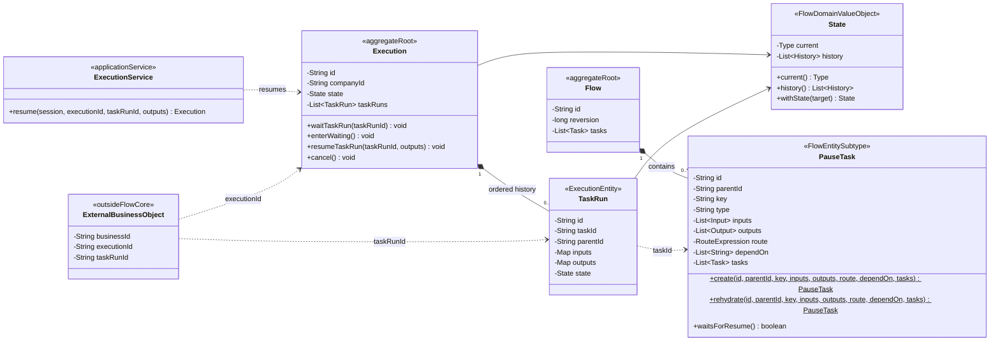
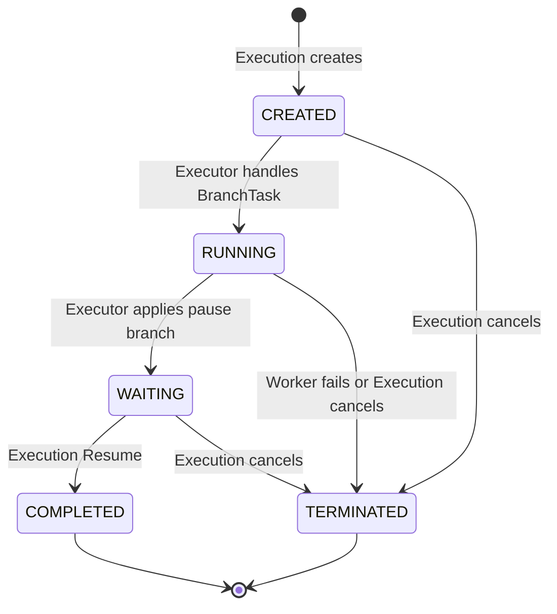

# PAUSE 与 Execution Resume 领域模型规范

## 适用范围与效力

本规范定义 Flow Core 中 PAUSE 外部等待的目标模型，包括 `PauseTask`、PAUSE
对应的 `TaskRun`、`ExecutionService.resume(...)` 用例，以及它们与审批、表单、
工单等外部业务能力的边界。

本规范落实
[`CONTEXT.md`](../../CONTEXT.md)、
[`ADR 0002`](../decisions/0002-workflow-core-runtime-class-design.md)、
[`ADR 0011`](../decisions/0011-require-durable-external-trigger-resume.md)、
[`ADR 0016`](../decisions/0016-separate-pause-from-external-business-capabilities.md)、
[`ADR 0017`](../decisions/0017-centralize-workflow-runtime-state-in-flow-domain.md)、
[`task-domain-model.md`](task-domain-model.md)、
[`execution-domain-model.md`](execution-domain-model.md)
以及
[`domain-object-modeling.md`](domain-object-modeling.md)
已经确认的语义。

本文描述目标领域边界。Execution、TaskRun 和 Executor 的既有续跑机制
可以复用；PAUSE 作为 BranchTask 由 Executor 直接处理，不进入 Worker。公开
Resume Command/Handler 已完成小范围迁移。现存 ExternalTask
模块仍是待移除的兼容实现，不属于本规范的目标模型。

## 定义与对象角色

`PauseTask` 是 Flow Reversion 中的外部等待步骤定义。它说明流程运行到此处后必须
等待外部结果，以及结果必须满足的 outputs 契约；它不是审批、表单、工单或用户
待办。

PAUSE `TaskRun` 是 Execution 实际运行该 PauseTask 时产生的运行事实。等待期间它
处于 `WAITING`，自身就是“该 Execution 正在等待这个暂停点结果”的持久化事实；
当已无其他 CREATED/RUNNING 工作时，Execution 也进入稳定 `WAITING`。

`Execution Resume` 是 Flow Core 接受外部结果、完成确定 PAUSE TaskRun 并继续
同一 Execution 的生命周期用例。它不是第二套 TaskRun 状态机，也不允许调用方
选择下一 Task。

`executionId + taskRunId` 是外部能力引用一个暂停点所需的稳定身份组合。它不是
独立聚合，不拥有 Repository、状态或生命周期。

审批、表单、工单等 External Business Capability 位于 Flow Core 之外。每种能力
拥有自己的聚合、Repository、权限和审计规则，保存暂停点引用，并通过
`ExecutionService.resume(...)` 提交最终结果。

Repository 边界如下：

- PauseTask 随 Flow 聚合由 `FlowRepository` 保存和重建，没有独立 Repository。
- PAUSE TaskRun 随 Execution 聚合由 `ExecutionRepository` 保存和重建。
- 暂停点引用可以从 Execution 与 TaskRun 的稳定身份获得，不建立等待 Repository。
- 外部业务对象由对应能力自己的 Repository 保存，不能进入 Flow Core Repository。

## 领域类图



`ExternalBusinessObject` 只表示 Flow Core 之外的聚合角色，不要求所有外部能力继承
同一个类型。外部对象只保存稳定身份，不能持有或修改 Execution、TaskRun 或
PauseTask。

## 字段

### PauseTask 字段

PauseTask 使用 Task 的完整定义字段：

| 字段 | 含义 | 规则 |
| --- | --- | --- |
| `id` | 跨 Flow Reversion 稳定的 Task 身份 | 由 Flow 部署时决定 |
| `parentId` | 定义层直接父 Task id | 顶层为空 |
| `key` | Flow 内唯一业务标识 | 非空且在递归 Task 树中唯一 |
| `type` | PAUSE 类型代码 | 固定为 `PAUSE` |
| `inputs` | 进入等待前的输入契约 | 定义事实，不保存实际值 |
| `outputs` | 外部结果契约 | Resume 结果必须按该契约校验 |
| `route` | 当前 PauseTask 的候选条件 | 只读取直接父 TaskRun outputs |
| `dependOn` | 开始 PAUSE 前必须完成的依赖 | 由 Executor 使用运行事实判断 |
| `tasks` | PAUSE 完成后的直接子 Task 候选 | 恢复前不能成为可运行 Task |

PauseTask 不包含审批策略、受派人、候选组、表单定义、工单状态、回调地址或外部
业务对象快照。具体外部能力如何获知暂停点属于对接协议。

### PAUSE TaskRun 字段

PAUSE TaskRun 不增加专用字段或状态，继续使用 Execution 聚合内 TaskRun 的：

| 字段 | 在暂停场景中的含义 |
| --- | --- |
| `id` | 本次暂停运行的稳定身份，也是外部引用的一部分 |
| `taskId` | 关联绑定 Flow Reversion 中的 PauseTask |
| `inputs` | 进入暂停点时已经确定的实际输入 |
| `outputs` | Resume 成功后写入的外部结果 |
| `state` | 持有统一 State 和历史；路线为 CREATED -> RUNNING -> WAITING -> COMPLETED/TERMINATED |

不增加审批状态、外部业务 id、下一 Task 或 route 结果。

## 方法

### PauseTask 创建与重建

| 方法 | 用途 | 核心规则 |
| --- | --- | --- |
| `create(...)` | 随 Flow 部署创建完整 PAUSE 定义 | id、通用 Task 字段和 outputs 契约一次完整 |
| `rehydrate(...)` | Repository 恢复确定 Flow Reversion | 沿用 id，不产生 TaskRun |

PauseTask 没有 `pause()`、`approve()`、`resume()` 或 `complete()` 领域方法。

### Execution Resume 用例

| 入口 | 用途 | 核心规则 |
| --- | --- | --- |
| `ExecutionService.resume(session, executionId, taskRunId, outputs)` | 接受外部结果并继续 Execution | 唯一公开恢复入口，通过 CommandExecutor 开启事务 |
| `ResumeExecutionHandler.handle(...)` | 加载并校验恢复所需事实 | 校验租户、Execution、TaskRun、PAUSE 类型和 outputs |
| `Execution.resumeTaskRun(taskRunId, outputs)` | 完成原等待事实 | 仅允许 WAITING Execution 中的 WAITING TaskRun；TaskRun 进入 COMPLETED，Execution 回到 RUNNING |
| `DefaultExecutor.resume(...)` | 合并恢复事实并继续当前命令内的运行生命周期 | 通过 ExecutorContext 推进到下一稳定态或终态，并统一保存与 Worker 投递 |

`resume` 不是 `continueExecution` 的别名。`resume` 接收并合并新的外部结果；
`continueExecution` 只根据已经持久化的运行事实重新驱动非终态 Execution。

## 状态机

PauseTask 是不可变定义实体，没有独立生命周期状态。PAUSE TaskRun 使用 Flow
定义域统一的五个具体状态和四个运行大类；其等待路径为：



| 当前状态 | 允许动作 | 结果 |
| --- | --- | --- |
| `WAITING` | `ExecutionService.resume` | 写入合法 outputs，TaskRun 进入 COMPLETED，Execution 回到 RUNNING 并继续推进 |
| `WAITING` | `ExecutionService.cancel` | Execution 和未完成 TaskRun 进入 TERMINATED，不再允许恢复 |
| `COMPLETED` | 只读 | 不能重复恢复 |
| `TERMINATED` | 只读 | 不能恢复 |

未处理异常必须使整个 Resume Command 回滚；Execution 和全部 TaskRun 保持命令
开始前的稳定状态。

## 聚合关系与业务边界

一次 PAUSE 等待的 Core 内协作固定为：

```text
Flow/PauseTask definition
  -> Execution creates and starts PAUSE TaskRun
  -> Executor directly moves TaskRun to WAITING
  -> Executor finds no other CREATED/RUNNING work
  -> Core commits Execution WAITING + PAUSE TaskRun WAITING
  -> External capability submits executionId + taskRunId + outputs
  -> ExecutionService.resume enters a Core command transaction
  -> Core completes the original TaskRun and returns Execution to RUNNING
  -> Executor continues the same Execution
```

外部业务能力与 Core 的关系固定为：

- 外部能力创建自己的审批单、表单实例或工单，并保存暂停点引用。
- 外部能力自行保护受派、权限、决定、意见、审计和业务状态。
- 外部能力完成后只调用 ExecutionService resume，不提交下一 Task。
- Core 不查询或修改外部业务对象，也不从其状态推导流程位置。
- 普通最终用户不直接调用 Flow resume；由外部业务后端在完成自身权限校验后调用。

## 版本、审计与并发

- PauseTask 没有独立业务 reversion；它随所属 Flow Reversion 形成不可变定义。
- Resume 不生成 Flow 或 Execution 业务 reversion。
- Execution 的 `lockVersion` 保护 Resume 与取消、重复 Resume 的并发竞争。
- TaskRun 不拥有独立 lockVersion。
- PAUSE TaskRun 和 Execution 的每次状态变化都由各自 State 追加带 epoch
  毫秒时间的 History；Resume 不接受调用方提供状态时间。
- 外部业务对象的版本、审计和并发由对应能力独立设计，Flow Core 不复制。
- 回调请求幂等键及重复同结果的返回语义尚未确认；当前聚合状态与 CAS 至少保证
  不会重复推进 Execution。

## 领域不变量

### PauseTask 不变量

- `PAUSE-001`：PauseTask 只表达外部等待及输入输出契约，不表达审批、表单、工单
  或用户待办规则。
- `PAUSE-002`：PauseTask 是 Flow 聚合内不可变实体，没有独立 Repository、状态或
  业务 reversion。
- `PAUSE-003`：PAUSE TaskRun 等待期间为 WAITING；不存在其他
  CREATED/RUNNING 工作时，Execution 也为 WAITING。该状态不等同于审批待审等
  外部业务状态。
- `PAUSE-004`：PAUSE TaskRun 完成前，其直接子 Task 不能成为可运行 Task。
- `PAUSE-005`：恢复只能完成原 PAUSE TaskRun，不能重新执行 PauseTask Worker 或
  创建第二个 TaskRun。

### Execution Resume 不变量

- `RESUME-001`：只有 `ExecutionService` 是外部恢复的公开 Core 入口。
- `RESUME-002`：executionId 和 taskRunId 必须指向同租户、同 Execution 中的
  WAITING PAUSE TaskRun。
- `RESUME-003`：恢复结果必须先满足绑定 Flow Reversion 中 PauseTask 的 outputs
  契约。
- `RESUME-004`：外部调用方不能指定 Flow Reversion、route、下一 Task 或目标
  Execution 状态。
- `RESUME-005`：原 TaskRun 完成和后续 Core 推进在同一个命令事务中原子提交。
- `RESUME-006`：恢复后由 Executor 根据 Flow 定义和 TaskRun 事实计算后续工作。
- `RESUME-007`：恢复与取消竞争最多一个命令提交，失败方不能留下部分状态或重复
  推进。
- `RESUME-008`：成功恢复为 PAUSE TaskRun 追加 COMPLETED History，并为
  Execution 追加 RUNNING History；失败恢复不得改变任一历史。

## 场景校验

- 正向：Executor 处理 PAUSE BranchTask 后，Execution 和原 TaskRun 进入 WAITING，
  且不会产生 WorkerTask。
- 正向：外部审批对象保存 executionId 和 taskRunId；审批完成后调用
  ExecutionService resume，Core 完成原 TaskRun 并继续 Execution。
- 反向：不存在、跨租户、非 WAITING 或非 PAUSE 的 TaskRun 不能恢复。
- 反向：outputs 为 null 或包含未声明字段时被拒绝，暂停状态保持不变。
- 反向：COMPLETED 或 TERMINATED TaskRun 不能重复恢复。
- 变异：外部调用方提交下一 Task 后，公开接口和测试必须拒绝这种参数。
- 身份：保存、重建和恢复后 Execution id、TaskRun id、flowId 与 flowReversion
  保持不变。
- 版本：PAUSE 等待和恢复不生成 Flow reversion；一个 Resume Command 最多使
  Execution lockVersion 递增一次。
- 恢复：原 Server 结束后，新 Server 根据 executionId 和 taskRunId 从 PostgreSQL
  重建 Flow、Execution、TaskRun 及完整状态历史，并继续同一 Execution。
- 并发：Resume 与取消、两个 Resume 竞争时最多一个事务提交。
- 并行：两个 PAUSE TaskRun 分别使用自己的 taskRunId，恢复任一个不会完成另一
  暂停点。

## 尚待业务规则确认

- 外部业务能力如何可靠获知暂停点、使用消息还是 HTTP、如何认证和重试，需要
  独立对接协议。
- 是否增加独立 `requestId` 以及重复相同请求返回成功还是业务冲突，尚待确认。
- Execution 取消后，具体审批、表单或工单是取消、关闭还是保留历史，由对应外部
  业务能力确认。
- Output type 与实际值的完整校验规则仍由 `data-domain-model.md` 的待确认项
  约束。

## 现有实现迁移差距

- `ExecutionService.resume`、`ResumeExecutionCommand` 和
  `ResumeExecutionHandler` 已建立统一公开恢复链路。
- 兼容 `CompleteExternalTaskHandler` 已复用统一 Resume Handler，不再复制
  PAUSE 校验与续跑逻辑。
- `externaltasks` Domain、Service、Repository、数据库表和相关测试仍待删除或
  迁移；本轮只把其兼容记录协调从 PauseTaskHandler 移到 Executor，不能把兼容
  入口误认为 PAUSE 目标领域对象。
- 现有 UC-04 至 UC-07 的测试仍通过 ExternalTask 查询等待点。它们需要在审批
  Adapter 或通用暂停点查询协议确认后迁移，不能把当前测试入口写回目标领域。
- 回调 requestId、可靠 PauseReached 通知和外部取消通知尚未实现。

## 相关文档

- [`CONTEXT.md`](../../CONTEXT.md)：统一语言。
- [`domain-object-modeling.md`](domain-object-modeling.md)：统一建模方法。
- [`task-domain-model.md`](task-domain-model.md)：PauseTask 所属 Task 定义聚合。
- [`execution-domain-model.md`](execution-domain-model.md)：Execution 与 TaskRun
  运行模型。
- [`data-domain-model.md`](data-domain-model.md)：PauseTask outputs 与运行值边界。
- [`ADR 0016`](../decisions/0016-separate-pause-from-external-business-capabilities.md)：
  PAUSE 统一恢复入口与职责决策。
- [`UC-04 用户处理外派任务并恢复流程`](../uc/flow/UC-04%20用户处理外派任务并恢复流程.md)
- [`UC-05 用户处理并行外派任务`](../uc/flow/UC-05%20用户处理并行外派任务.md)
