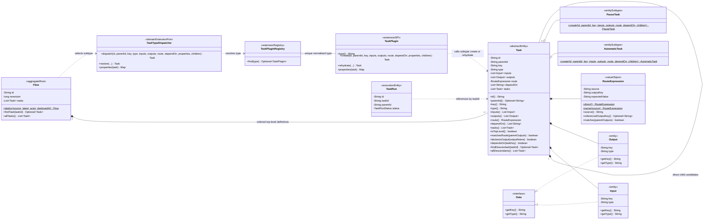

# Task 领域模型规范

## 适用范围与效力

本规范定义 Task 定义域的目标模型，包括 Task 的聚合角色、身份、字段、方法、
类型扩展、递归结构、路由、依赖以及与 TaskRun 的边界。

本规范落实
[`CONTEXT.md`](../../CONTEXT.md)、
[`ADR 0002`](../decisions/0002-workflow-core-runtime-class-design.md)、
[`ADR 0006`](../decisions/0006-single-execution-branch-routing-and-join.md)、
[`ADR 0008`](../decisions/0008-separate-flow-source-from-deployed-flow.md)、
[`ADR 0013`](../decisions/0013-centralize-yaml-parsing-and-flow-materialization.md)
、[`ADR 0014`](../decisions/0014-complete-flow-source-and-reversion-migration.md)
以及
[`domain-object-modeling.md`](domain-object-modeling.md)
已经确认的领域语义。Java、插件注册、YAML 物化和 PostgreSQL 重建链路已经完成
本模型迁移；不能以插件属性快照或数据库结构反向修改 Task 领域字段。

本领域统一使用 `Flow Reversion` 和字段名 `reversion`。旧文档或代码中的
`FlowVersion`、`FlowDefinition`、`version` 和“发布”，应分别迁移为
`Flow Reversion`、`Flow`、`reversion` 和“部署”。

## 定义与对象角色

Task 是一次 Flow Reversion 中不可分割的流程步骤定义。它描述“这个步骤是什么、
需要什么、产生什么、何时成为候选”，但不描述“某次运行执行到了哪里、产生了
什么结果”。

Task 的对象角色是 **Flow 聚合内实体**：

- Task 有跨 Flow Reversion 稳定的技术身份。
- Task 不能脱离 Flow 独立创建、保存、删除或变更。
- Task 没有独立 Repository、Service、审计字段、业务版本和生命周期状态。
- Task 只在 `Flow.deploy` 成功时随完整 Flow Reversion 一起产生。
- 已部署 Task 不可变；调整 Task 必须修改 `FlowWithSource.raw` 并重新部署
  一个新的 Flow Reversion。
- Task 不执行自身。Executor 和 Worker 根据 Task 定义执行工作，TaskRun 记录
  每一次真实运行事实。

原始 YAML 中的 Task 节点以及 Parser 返回的 Task 节点映射都不是 Task。
映射只由 Flow 在一次完整创建或部署中消费，不形成新的领域类型。任何被 Flow
聚合持有的 Task 都必须已经获得稳定 `id`、正确 `parentId`，并通过类型、
输入输出、路由、依赖和递归结构校验。

## 领域类图



`AutomaticTask` 和 `PauseTask` 是当前已有的类型示例，不表示 Task 类型集合被
封闭。新的 Task 类型通过新的 Task 子类型、该子类型自身的静态
`create(...)`、一个声明稳定 `type` 的 `TaskPlugin` 以及对应
`WorkerTaskHandler` 扩展；注册表自动收集插件，不修改中心枚举、中心 `switch`，
不引入领域 Factory，也不向 `Task` 增加无类型约束的字段扩展。

图中的 `Input`、`Output` 是直接实现 Data 的具体对象，拥有 key、type，
并作为所属 Task 聚合内的身份对象存在，不是接口或运行值。完整规则见
[`data-domain-model.md`](data-domain-model.md)；剩余 type 和运行值规则确认前，
不得用 YAML Map 或数据库 Record 替代目标领域对象。

## 字段

| 字段 | 含义 | 规则 |
| --- | --- | --- |
| `id` | Task 的稳定技术身份 | 非空；首次成功部署该业务 Task 时生成，相同逻辑 Task 的后续 reversion 复用 |
| `parentId` | 定义层直接父 Task 的稳定 `id` | 顶层 Task 为空；子 Task 必须等于其直接父 Task 的 `id` |
| `key` | 原始定义中声明的业务标识 | 非空；在整个 Flow Reversion 的递归 Task 树中唯一 |
| `type` | Task 类型代码 | 非空；必须唯一映射到具体 Task 子类型及其 WorkerTaskHandler |
| `inputs` | Task 的输入契约 | `List<Input>`；没有输入时为空只读集合 |
| `outputs` | Task 的输出契约 | `List<Output>`；没有输出时为空只读集合 |
| `route` | 当前 Task 成为候选时的路由条件 | 非空值对象；未声明时规范化为 `DIRECT` |
| `dependOn` | 运行前必须完成的 Task key | 结构化只读字符串列表；未声明时为空 |
| `tasks` | 当前 Task 完成后的直接子 Task 候选 | 只读集合；不是由父 Task Worker 内部执行的步骤列表 |

`id` 是领域字段名。TaskRun、API 引用和持久化外键使用 `taskId` 表达“所引用
Task 的 id”，两者是同一身份，不再为 Task 增加另一个 `taskId` 字段。

以下内容不属于 Task：

- `reversion`：由所属 Flow Reversion 统一拥有。
- `status`、实际 inputs、实际 outputs、错误、开始时间和完成时间：属于
  TaskRun。
- creator、updater、deleter 和审计时间：由所属 Flow 统一拥有。
- 原始 YAML：只属于 FlowWithSource。
- 通用 `Map<String, Object> properties`：无法保护具体 Task 类型的不变量。
  类型扩展字段必须由具体 Task 子类型使用明确字段或值对象表达。

`dependOn` 是所有 Task 都能被统一读取和校验的编排字段，不再隐藏在
`properties` 中。某种 Task 类型是否允许声明依赖，由该具体 Task 子类型的
`create(...)` 和部署校验共同限制。

## 方法

### 唯一创建入口

抽象 `Task` 不提供可实例化的公共 `Task.create(...)`；每个具体 Task 子类型
必须提供自身的 `public static create(...)`。Task 只能在 Flow 聚合编排的以下
链路中创建：

1. `YamlParser` 将 `FlowWithSource.raw` 转换为通用只读映射。
2. Flow 直接递归解释映射中的 Task 节点，检查 key、类型、输入输出、路由、
   依赖和递归结构。
3. Flow 按上一 Flow Reversion 的 Task key 复用或生成稳定 `id`，并计算每个
   子 Task 的 `parentId`。
4. Flow 调用 `TaskTypeDispatcher`；分派器按规范化后的 `type` 从
   `TaskPluginRegistry` 解析唯一插件。
5. 插件直接调用对应具体 Task 子类型的静态 `create(...)`，例如
   `AutomaticTask.create(...)` 或 `PauseTask.create(...)`。
6. 全部 Task 构造和校验成功后，`Flow.deploy` 原子生成新的 Flow Reversion。

```mermaid
flowchart LR
    source["FlowWithSource.raw"] --> parser["YamlParser"]
    parser --> mapping["通用只读映射"]
    mapping --> identity["Flow 解释字段并生成身份<br/>id + parentId"]
    identity --> dispatch["TaskTypeDispatcher"]
    dispatch --> registry["TaskPluginRegistry<br/>type -> plugin"]
    registry --> plugin["TaskPlugin"]
    plugin --> create["具体 Task.create(...)"]
    create --> task["完整且不可变的 Task"]
    task --> deploy["Flow.deploy"]
```



`TaskTypeDispatcher` 是 Flow 面向 Task 类型扩展的稳定协议；它自身不包含具体
类型分支，只通过 `TaskPluginRegistry` 解析插件。每个 `TaskPlugin` 只声明一个
稳定类型并调用该具体 Task 子类型的创建或重建入口，不生成身份、不解析 YAML，
也不拥有 Flow 聚合规则。具体 Task 构造方法必须为 `private` 或 `protected`，
领域类型外部不得直接 `new`，也不得新增 `TaskDefinitionFactory` 等工厂接口
包装创建。

解析、校验、身份协调或 Task 构造任一步失败，都不得产生 Flow Reversion、不得
占用 `reversion`，也不得改变 FlowWithSource。

### 业务查询方法

| 方法 | 用途 | 规则 |
| --- | --- | --- |
| `id()` | 读取稳定 Task 身份 | 永不返回空值 |
| `parentId()` | 读取定义层直接父 Task 身份 | 顶层返回空 Optional |
| `key()` | 读取业务标识 | 不能代替 `id` 作为持久化身份 |
| `type()` | 读取扩展类型代码 | 与实际 Task 子类型一致 |
| `inputs()` | 读取输入契约 | 返回只读集合 |
| `outputs()` | 读取输出契约 | 返回只读集合 |
| `route()` | 读取已解析路由值对象 | 不返回原始未校验字符串 |
| `dependOn()` | 读取依赖 Task key | 返回只读集合 |
| `tasks()` | 读取直接子 Task 候选 | 不递归，不表达串行执行 |
| `isTopLevel()` | 判断是否位于 `Flow.tasks` | 只由 `parentId` 是否为空推导 |
| `matchesRoute(parentOutputs)` | 判断直接父 TaskRun 的 outputs 是否满足路由 | `DIRECT` 恒为 true；不读取其他 Execution |
| `declaresOutput(outputKey)` | 按 `Output.getKey()` 判断本 Task 是否声明某输出 | 供部署期路由引用校验 |
| `dependsOn(taskKey)` | 判断是否声明某依赖 | 只查询定义，不读取 TaskRun |
| `findDescendant(taskId)` | 在当前 Task 子树中按稳定 id 查询后代 | 不包含当前 Task 本身 |
| `allDescendants()` | 展平当前 Task 的全部后代 | 保持定义遍历顺序，返回只读集合 |

跨 Task 的规则不放进单个 Task：

- 全局 key 唯一、父子一致、依赖存在性和依赖无环由 `Flow.deploy` 校验。
- 下一批可运行 Task 的计算由 Executor 根据完整 Flow 和 TaskRun 事实完成。
- Worker 执行、重试、等待、完成、失败和取消不属于 Task 方法。
- 加载、保存和事务不属于 Task 方法。

目标模型不提供 `identify`、`setParentId`、`setRoute`、`setStatus`、
`execute`、`complete` 或 `copy` 等公共方法。Task 在被创建时就必须具有完整
身份；不可先创建 `id = null` 的领域 Task，再通过 `identify` 补全。

## 身份与跨 Reversion 规则

Task 的稳定身份规则如下：

- YAML 只声明 `key`，不允许调用方声明或覆盖 `id`。
- 某个 `key` 第一次成功部署时生成新的 Task `id`。
- 同一逻辑 Flow 后续成功部署时，相同 `key` 复用已有 Task `id`。
- 新增 `key` 生成新 `id`；删除 Task 不会删除旧 Flow Reversion 中的历史定义。
- Task 在树中移动时，只要 `key` 未变，`id` 保持不变，新的 `parentId` 反映新的
  直接父子关系。
- 一个 Task 快照由 `flowId + flowReversion + taskId` 精确定位。

系统当前无法仅凭两份 YAML 区分“Task 重命名”和“删除旧 Task 后新增新 Task”。
因此不同 `key` 按新身份处理；若未来需要重命名后保持 `id`，必须新增显式身份
迁移协议和 ADR，不能用模糊匹配猜测。

### 持久化重建与快照相等

Repository 重建同一个 Flow Reversion 时，Task 必须恢复为与保存前相同的不可变
定义快照。用于快照比较的相等语义递归包含 `id`、`parentId`、`key`、`type`、
inputs、outputs、route、类型属性和直接子 Task；不能依赖 Java 对象引用相同。

该相等语义用于判断“两个实例是否表达同一份 Task 定义快照”，不能替代
`flowId + flowReversion + taskId` 的持久化定位规则，也不能用于判断两个不同
Reversion 中的 Task 是否具有同一稳定身份。

## 递归结构、顺序与路由

`Flow.tasks` 与 `Task.tasks` 的集合语义不同：

- `Flow.tasks` 是顶层 Task 的有序定义，第一阶段按顺序推进；前一个顶层 Task 的
  已选择子树收敛后，才能进入下一个顶层 Task。
- `Task.tasks` 是父 Task 完成后的直接子 Task 候选集合。所有 route 成立的直接
  子 Task 都进入可运行集合。
- 多个直接子 Task 同时匹配时表示同一 Execution 内的并行候选，不按列表顺序
  串行执行。
- 没有子 Task 匹配时，不创建虚构 TaskRun，也不使用 `SKIPPED`；该子树正常
  收敛。
- 每层 Task 都是独立原子 Task，父 Task 的 Worker 不在内部代替子 Task 执行。

第一阶段 RouteExpression 只允许：

```text
DIRECT
outputs.<field> == "<value>"
```

- `DIRECT` 恒为 true。
- 条件表达式只读取直接父 TaskRun 的实际 outputs。
- 字符串比较区分大小写并精确匹配。
- 路由语法及引用输出必须在部署前校验。
- 多个 route 同时成立时全部执行；若未来需要单选，必须新增显式网关语义，不能
  改变现有 Flow Reversion 的解释。

## dependOn 规则

- `dependOn` 中每个值引用同一 Flow Reversion 内唯一的 `Task.key`。
- 部署时必须校验依赖存在、不得依赖自身，并且整个依赖图无环。
- Task 只有在同一 Execution 内全部依赖 TaskRun 都为 `COMPLETED` 时才可运行。
- `dependOn` 描述依赖完成条件，不改变 Task 的定义父子关系。
- `Task.parentId` 不是前驱、依赖或调度原因。
- 依赖是否满足由 Executor 根据 TaskRun 事实判断；Task 只保存和查询依赖定义。
- 同一非循环 Task 在一次 Execution 中最多产生一个 TaskRun。

## Task 与 TaskRun 的边界

| 维度 | Task | TaskRun |
| --- | --- | --- |
| 业务含义 | 一次 Flow Reversion 中的步骤定义 | 某次 Execution 对该步骤的真实运行实例 |
| 所属聚合 | Flow | Execution |
| 精确身份 | `flowId + flowReversion + taskId` | `executionId + taskRunId` |
| `parentId` | 直接父 Task 的稳定 `id` | 本次运行中直接父 TaskRun 的 `id` |
| 状态 | 无 | CREATED、RUNNING、COMPLETED、FAILED、CANCELED |
| inputs/outputs | 输入输出契约 | 本次运行的实际输入输出 |
| route/dependOn | 保存定义 | 不复制定义，只用于调度计算 |
| 可变性 | 部署后不可变 | 通过 Execution 聚合发生合法状态转换 |
| 多次出现 | 每个 Flow Reversion 一个定义快照 | 同一 Task 未来可因 Loop 等产生多次运行事实 |
| Repository | 无独立 Repository | 由 ExecutionRepository 随聚合保存 |

TaskRun 通过 `taskId` 引用 Task，但 Task 不反向持有 TaskRun。定义域不能读取某个
Execution 的运行事实来改变已部署 Task。

## 领域不变量

- `TASK-001`：Task 只能存在于一个确定的 Flow Reversion 中，并随该 Flow
  Reversion 保持不可变。
- `TASK-002`：进入领域的 Task 必须拥有非空稳定 `id`，不存在可持久化的
  “未识别 Task”。
- `TASK-003`：`key` 在整个 Flow Reversion 的递归 Task 树中唯一。
- `TASK-004`：顶层 Task 的 `parentId` 为空；任一子 Task 的 `parentId` 必须
  等于其直接父 Task 的 `id`。
- `TASK-005`：Task 递归父子结构无环，同一个 Task 不能同时出现在多个父节点下。
- `TASK-006`：规范化后的 `type` 必须唯一映射到一个 Task Plugin、一个具体
  Task 子类型及其静态 `create(...)`，并存在匹配的执行 Handler。
- `TASK-007`：inputs、outputs、dependOn 和 tasks 永不为 null，并且对外只读；
  每个 Input、Output 都满足 Data 的 key、type 契约，同方向集合内 key 唯一。
- `TASK-008`：route 永不为 null；缺省值是 `DIRECT`，条件路由只引用直接父
  Task 声明的 `Output.getKey()`。
- `TASK-009`：dependOn 引用存在、非自身且无环。
- `TASK-010`：`Task.tasks` 只表达直接子候选；父 Task 不执行子 Task。
- `TASK-011`：Task 不保存任何一次运行的状态、实际值、错误或时间。
- `TASK-012`：通用编排字段不能隐藏在类型扩展 Map 中；类型专有规则由具体
  Task 子类型保护。
- `TASK-013`：相同 `key` 跨 Flow Reversion 复用 `id`；不同 `key` 默认产生
  不同身份。

### Task Plugin 注册不变量

- `TPLUGIN-001`：每个 Task Plugin 只声明一个非空稳定 `type`；注册键使用
  `trim + Locale.ROOT` 大写规范化。
- `TPLUGIN-002`：规范化后相同的两个 `type` 属于重复注册，应用装配必须失败，
  不能依赖 Bean 顺序覆盖。
- `TPLUGIN-003`：新增 Task Plugin 不要求修改 Flow、YamlParser、
  TaskTypeDispatcher 的类型分支、中心枚举或注册清单。
- `TPLUGIN-004`：定义中的未知类型必须使本次物化原子失败；持久化快照引用未
  安装的类型时必须使重建失败，不能回退成通用 Task 或其他类型。
- `TPLUGIN-005`：插件必须原样保留 Flow 已决定的 `id`、`parentId`、`key` 和
  通用字段，并返回与注册 `type` 一致的具体 Task。

### Task 节点映射不变量

- `TMAP-001`：Task 节点映射没有 `id`、`parentId`、状态、审计、Repository
  或持久化语义。
- `TMAP-002`：只有 Flow 可以解释 Task 节点映射，并在创建 Task 前决定稳定
  `id` 与直接 `parentId`。
- `TMAP-003`：TaskTypeDispatcher 不解析 YAML、不生成身份，只通过注册表选择
  Task Plugin；插件只调用具体 Task 子类型的静态创建或重建入口。
- `TMAP-004`：Task 节点映射不会形成、保存或恢复为独立领域类型。

## 场景校验

- 正向：递归 Task 节点映射被 Flow 转换为正确的具体 Task 子类型，顶层
  parentId 为空，子 Task parentId 等于直接父 Task id。
- 反向：空 key/type、不支持的类型、错误路由、重复 key 或非法依赖被拒绝，且
  不留下部分 Task 树。
- 注册：两个大小写或空白形式不同但规范化结果相同的插件 type 被视为重复并使
  装配失败；缺失插件的持久化 Task 无法重建。
- 扩展：测试插件只需注册新的 type，即可从 YAML 物化为新 Task 子类型，无需
  修改 Flow、Parser 或分派器。
- 变异：若分派器生成 Task id、Parser 直接创建 Task 或 Task 允许空 id，领域和
  架构测试必须失败。
- 身份：相同 key 跨定义转换复用 id；新增 key 生成 id，树中移动只改变
  parentId。
- 版本：Task 不拥有 reversion；转换失败不占用所属 Flow 的 reversion。
- 恢复：Repository 使用相同 id、parentId 和具体类型重建完整 Task，不恢复
  Parser 映射。
- 并发：同一 Flow 的并发部署由 Flow/Repository 版本约束保护，不能产生两个
  相同 reversion 的不同 Task 身份映射。

## 尚待业务规则确认

- Input/Output 的类型代码、身份复用和重命名规则仍以
  `data-domain-model.md` 的待确认项为准，不由解析映射自行决定。

## 现有实现迁移差距

本轮确认的 Task 定义链路差距已经关闭：

- `FlowWithSource` 只保存原始 YAML，Task 只在 `Flow.deploy` 中递归物化。
- Task、Task Plugin、YAML 节点物化与持久化重建统一使用
  `List<Input>`、`List<Output>`。
- `dependOn` 已是 Task 的明确只读字段；`route()` 返回
  `RouteExpression`，运行判断统一使用 `matchesRoute(...)`。
- Task 基类不保存通用 properties。`Map<String, ?> properties` 只存在于插件
  创建/重建协议和 PostgreSQL 快照边界，具体插件必须把它转成具体 Task 子类型的
  明确字段，并在回写时显式编码。
- `TaskPluginRegistry` 按规范化 type 自动收集插件，拒绝重复注册；分派器不包含
  中心枚举或 `switch`。
- `FlowDefinition`、旧 version 和 publish 生产契约已经移除。

仍待确认的是 Data type 的稳定代码及 TaskRun 实际值校验，不改变 Task 定义
对象和插件注册机制。

## 相关文档

- [`flow-definition-lifecycle.md`](flow-definition-lifecycle.md)：Task 所属 Flow
  聚合、部署和 reversion 规则。
- [`data-domain-model.md`](data-domain-model.md)：Data 基础接口以及
  Input、Output 的身份和方向角色。
- [`execution-domain-model.md`](execution-domain-model.md)：TaskRun 如何引用
  Task，以及 Execution 中的真实运行历史。
- [`workflow-core-java-model.md`](workflow-core-java-model.md)：Core 分包、
  Executor 和 Worker 边界。
- [`UC-05 用户处理并行外派任务.md`](../uc/flow/UC-05%20用户处理并行外派任务.md)：
  dependOn 和并行运行场景。
- [`UC-06 用户提交外派结果后的条件路径.md`](../uc/flow/UC-06%20用户提交外派结果后的条件路径.md)：
  RouteExpression 场景。
- [`UC-07 用户处理多阶段外派流程.md`](../uc/flow/UC-07%20用户处理多阶段外派流程.md)：
  递归 Task 与 parentId 场景。
