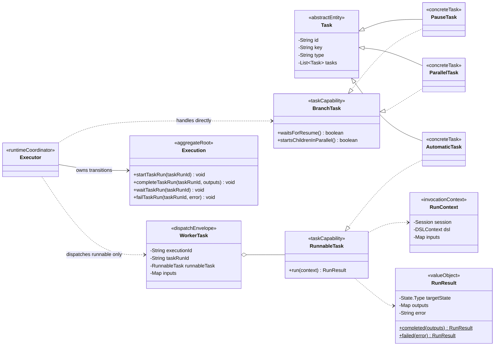
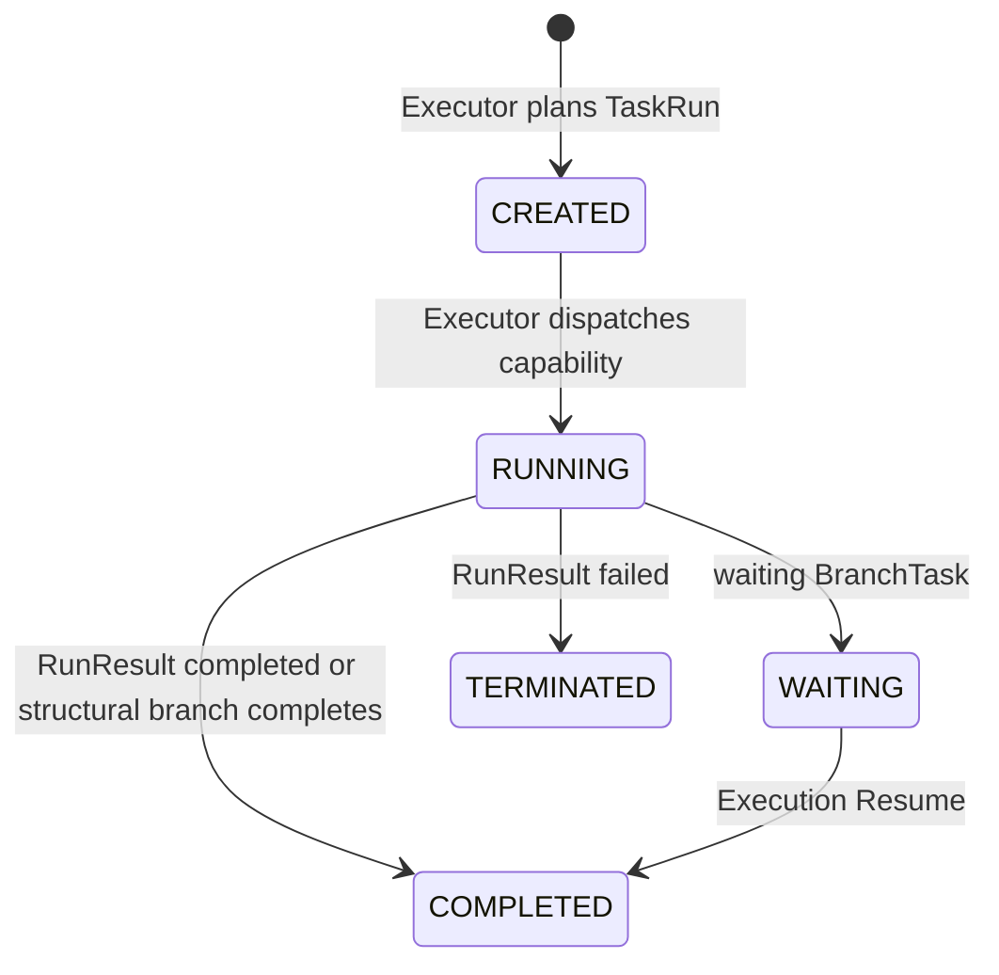

# Task 运行能力领域模型规范

## 适用范围与效力

本规范定义具体 Task 在运行阶段可以拥有的 `RunnableTask` 与 `BranchTask` 两种
能力，以及 `RunContext`、`RunResult`、Worker 和 Executor 的边界。它落实
[`CONTEXT.md`](../../CONTEXT.md)、
[`domain-object-modeling.md`](domain-object-modeling.md)、
[`task-domain-model.md`](task-domain-model.md)、
[`execution-domain-model.md`](execution-domain-model.md) 与
[`ADR 0024`](../decisions/0024-separate-runnable-and-branch-task-capabilities.md)。

本文描述本轮要与实现同步完成的目标模型。Task 定义字段、TaskExtension 物化和
Execution 聚合状态机继续分别由相邻规范约束。

## 定义与对象角色

- `Task`：Flow 聚合内的抽象定义实体，是所有具体 Task 的共同基类；它本身不
  决定由 Worker 执行还是由 Executor 编排。
- `RunnableTask`：具体 Task 可选择实现的执行能力接口。它的 `run(RunContext)`
  保存该类型的实际执行逻辑，并返回不可变 RunResult。
- `BranchTask`：具体 Task 可选择实现的流程控制能力接口。它只声明等待或并行
  展开等编排特征，不包含实际工作，也没有 `run` 方法。
- `RunContext`：一次 RunnableTask 调用的临时不可变上下文，只服务一个 Task
  调用；它不是聚合、TaskRun 快照、WorkerTask 包装或持久化对象。
- `RunResult`：一次 RunnableTask 调用产生的完成或明确失败事实；实际 TaskRun
  状态仍由 Execution 聚合改变。
- `WorkerTask`：Executor 投递 RunnableTask 所需的内部信封，携带关联身份、
  RunnableTask 能力和实际 inputs；它不能包装 BranchTask，也不向 Worker 暴露
  通用 Task 接口。
- `Executor`：Execution 与 TaskRun 生命周期、能力分类、分支处理、Worker 投递
  和结果合并的唯一运行协调者。

TaskExtension 仍由插件注册表管理，但只负责 Task 定义物化。RunnableTask 的执行
逻辑属于具体 Task 类，BranchTask 的状态推进属于 Executor，不建立新的能力
Repository。

RunnableTask 与 BranchTask 的所有者都是 Task 领域，而不是调用它们的 Worker
或 Executor。两种能力及其直接调用契约 RunContext、RunResult 统一位于
`core/domains/tasks`；Worker 与 Executor 只保留运行时协调、投递和关联结果
信封。能力的归属不随运行时调用方变化。

## 领域类图

图中的 AutomaticTask、PauseTask 与 ParallelTask 用来展示“具体 Task 子类先继承
Task，再实现一个能力接口”。RunContext 和 WorkerTask 都不进入 Execution 聚合，
也不随 Repository 保存。

## 字段

### RunContext 字段

| 字段 | 含义 | 规则 |
| --- | --- | --- |
| `session` | 当前命令调用身份 | 非空、只读；只服务本次 run |
| `dsl` | 当前命令事务连接 | 非空；RunnableTask 不创建嵌套事务 |
| `inputs` | 当前 TaskRun 已确定的实际输入 | 非空只读 Map；构造时防御性复制 |

RunContext 不包含 Task、WorkerTask、Execution、TaskRun、taskRunId、nexts、状态或
Repository。具体 Task 可以通过自身字段读取定义，通过 RunContext 读取本次输入和
受控运行环境。

### RunResult 字段

| 字段 | 含义 | 规则 |
| --- | --- | --- |
| `targetState` | 本次实际工作的结果类型 | 仅 COMPLETED 或 TERMINATED |
| `outputs` | 成功时产生的实际输出 | 不可变；由 Executor 按 Task outputs 契约校验 |
| `error` | 明确失败原因 | TERMINATED 时必须非空；COMPLETED 时为空 |

BranchTask 不新增持久化字段。`waitsForResume` 和 `startsChildrenInParallel` 是具体
类型的固定编排特征，不是某次运行的可变状态。

## 方法

### 创建与重建

| 方法 | 用途 | 核心规则 |
| --- | --- | --- |
| `RunContext.create(...)` | 创建单次调用上下文 | 每次 Worker 调用新建；复制 inputs；不保存 TaskRun |
| `RunResult.completed(outputs)` | 返回成功事实 | outputs 非 null，目标固定为 COMPLETED |
| `RunResult.failed(error)` | 返回明确失败事实 | error 非空，目标固定为 TERMINATED |

RunnableTask 和 BranchTask 是能力接口，不单独创建或重建；具体 Task 仍通过自身
`create(...)`、`rehydrate(...)` 随 Flow 构建。

### 业务行为

| 方法 | 用途 | 核心规则 |
| --- | --- | --- |
| `RunnableTask.run(context)` | 执行一个具体 Task 的实际逻辑 | 只读取自身定义和 RunContext；不能改变 Execution/TaskRun |
| `BranchTask.waitsForResume()` | 声明分支节点是否停在当前 TaskRun | Executor 据此进入 WAITING；Task 本身不执行暂停动作 |
| `BranchTask.startsChildrenInParallel()` | 声明直接子 Task 是否形成并行批次 | 只由 Executor 的 nexts 搜索读取 |
| `ExecutorService.dispatchBranch(...)` | 应用一个 BranchTask | Executor 启动 TaskRun，并完成或等待；不创建 WorkerTask |
| `WorkerDispatcher.dispatch(...)` | 调用一个 RunnableTask | 为本次调用创建 RunContext，调用 run 并包装关联身份 |

### 查询方法

- `RunContext.inputs()` 返回本次调用的不可变输入。
- RunResult 查询只用于 Worker 与 Executor 合并边界。
- BranchTask 的两个布尔方法查询固定编排能力，不查询运行状态。

## 状态机

RunnableTask、BranchTask 和 RunContext 没有独立持久化生命周期。运行状态属于
Execution 内的 TaskRun：

RunnableTask 不能产生 WAITING；BranchTask 不能产生 Worker 结果。未处理异常不是
RunResult，必须越过 Worker 边界使当前命令事务回滚。

## 聚合关系与业务边界

- Flow 创建并持有具体 Task 定义，TaskExtension 只选择和物化具体子类型。
- Executor 从精确 Flow Reversion 找到 Task，并在并入 nexts 前校验它恰好实现
  RunnableTask 或 BranchTask。
- Executor 创建和改变 TaskRun；RunnableTask 与 RunContext 都不能持有可变
  TaskRun 引用。
- RunnableTask 进入通用 WorkerDispatcher；Worker 不按类型查找第二个 Handler。
- BranchTask 由 Executor 直接解释；等待、完成、并行展开和恢复后的续跑都通过 Execution
  领域方法完成。
- WorkerTaskResult 只是带 executionId 与 taskRunId 的内部返回信封，关联身份不
  进入 RunContext。
- Session 与 DSLContext 只为具体 RunnableTask 的当前调用提供外部能力，不进入
  ExecutorContext 或持久化模型。

## 版本、审计与并发

- 两种能力随具体 Task 和 Flow Reversion 固定，不产生独立 reversion。
- RunContext、RunResult 与 WorkerTask 不持久化，因此不拥有审计字段或
  lockVersion。
- TaskRun 状态历史、Execution lockVersion 和并发保护继续由 Execution 聚合及
  Repository 管理。
- RunnableTask 使用命令提供的 DSLContext 参与同一事务；未处理异常回滚本次命令
  的 Execution、TaskRun 和 Task 自有业务写入。

## 领域不变量

### Task 能力不变量

- `TCAP-001`：每个被调度的具体 Task 必须继承 Task，并恰好实现 RunnableTask 或
  BranchTask 中的一个接口。
- `TCAP-002`：RunnableTask 才能形成 WorkerTask；BranchTask 永远不能交给 Worker。
- `TCAP-003`：BranchTask 不声明 run 方法，也不直接改变 Execution 或 TaskRun。
- `TCAP-004`：TaskExtension 只负责定义物化，不能作为第二个运行 Handler。
- `TCAP-005`：RunnableTask 与 BranchTask 必须归属于 Task 领域；Worker 和
  Executor 只能消费能力，不能定义或复制同名运行能力接口。

### RunContext 不变量

- `RCTX-001`：一个 RunContext 只服务一次 RunnableTask 调用，不能跨 Task 复用或
  持久化。
- `RCTX-002`：RunContext 不暴露 Task、WorkerTask、Execution、TaskRun 或任何状态
  推进入口。
- `RCTX-003`：RunnableTask 只通过自身定义与 RunContext 执行具体逻辑。
- `RCTX-004`：RunResult 只表达 COMPLETED 或 TERMINATED，不能表达 WAITING。

## 场景校验

- 正向：AUTO 实现 RunnableTask，Executor 只为它创建 WorkerTask，Worker 直接
  调用 AUTO 的 run 并合并输出。
- 正向：PAUSE 实现 BranchTask，Executor 直接把其 TaskRun 推进到 WAITING，
  Worker 没有收到该 Task。
- 正向：PARALLEL 实现 BranchTask，Executor 完成结构 TaskRun 后同时计划匹配的
  直接子 Task。
- 反向：同时实现两种能力或没有实现任何能力的 Task 在并入 Execution 前失败。
- 反向：RunnableTask 返回 WAITING 不可表示；明确失败使用 RunResult.failed。
- 变异：移除 WorkerTaskHandler 注册后，外部 Runnable Task 仍能通过自身 run 执行。
- 身份：Worker 返回事实只由 WorkerTask 信封补充 executionId 与 taskRunId；
  RunnableTask 不能选择或修改二者。
- 版本：能力分类和一次 run 不产生 Flow Reversion。
- 恢复：重启后 Executor 从已持久化 TaskRun 与精确 Flow Reversion 重新计算后续，
  不恢复 RunContext。
- 并发：同一 Execution 的恢复、取消和续跑继续由 Repository 锁与 lockVersion
  保证至多一个命令提交。

## 尚待业务规则确认

- Loop 的具体游标、迭代数据和退出条件尚未确认；确认后扩展 BranchTask 的明确
  编排协议，不能先把 Loop 送入 Worker。
- 异步 RunnableTask、超时、重试、远程 Worker 与 durable outbox 尚未确认；它们
  不改变 RunnableTask 只能面对单次 RunContext 的边界。

## 现有实现迁移差距

- 本轮删除 WorkerContext、WorkerTaskHandler、DefaultTaskHandler 和
  PauseTaskHandler，并把具体执行逻辑迁移到 RunnableTask.run。
- 本轮把 PAUSE/PARALLEL 从 Worker 投递迁移到 Executor 直接分支处理。
- ExternalTask 兼容模块仍待按 PAUSE 目标模型删除；迁移期间只允许 Executor
  协调兼容记录，不能恢复 Worker Handler。
- 远程 Worker、Loop 和异步结果协议仍未实现。

## 相关文档

- [`CONTEXT.md`](../../CONTEXT.md)：统一语言。
- [`domain-object-modeling.md`](domain-object-modeling.md)：统一建模方法。
- [`task-domain-model.md`](task-domain-model.md)：Task 定义实体与扩展规则。
- [`execution-domain-model.md`](execution-domain-model.md)：Execution 与 TaskRun 状态机。
- [`pause-domain-model.md`](pause-domain-model.md)：PAUSE 与 Resume 边界。
- [`ADR 0024`](../decisions/0024-separate-runnable-and-branch-task-capabilities.md)：能力拆分决策。
